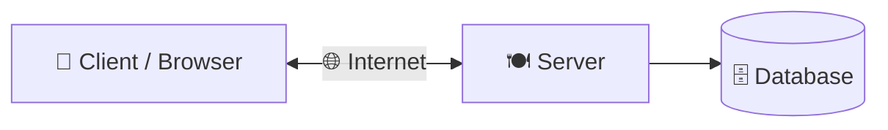
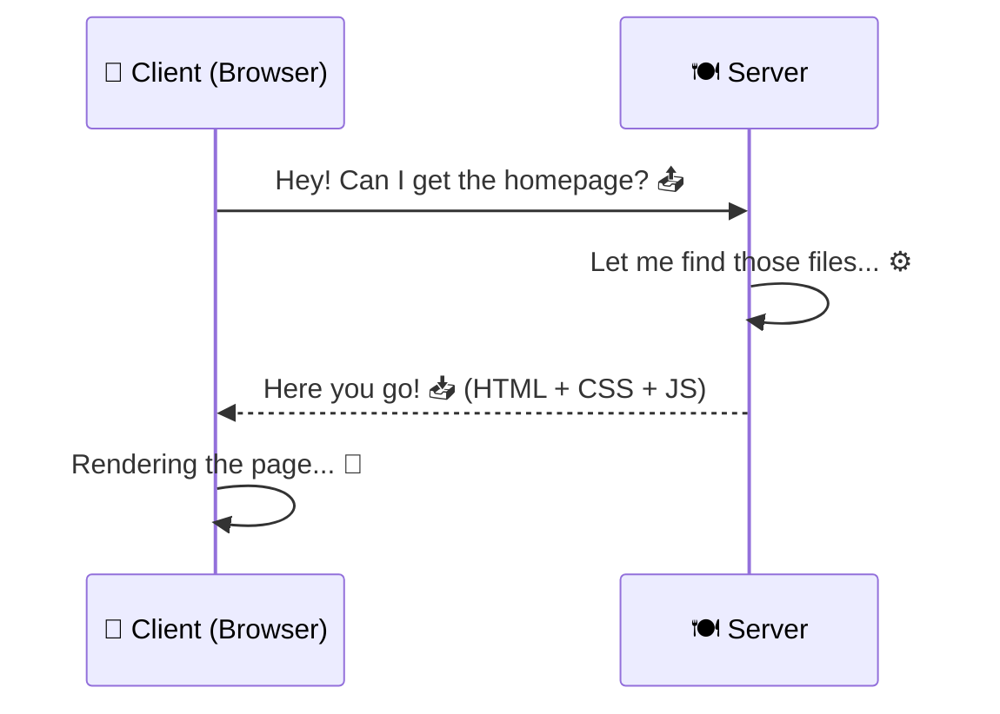
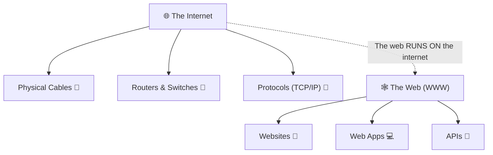
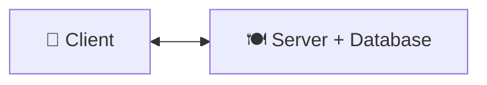
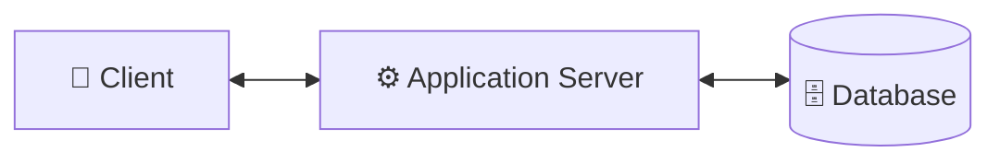
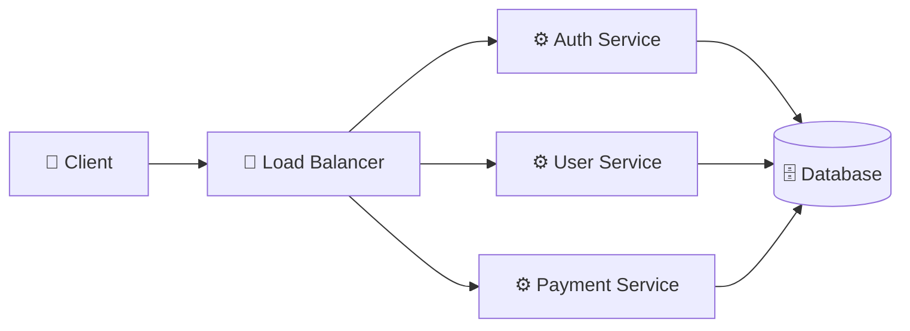
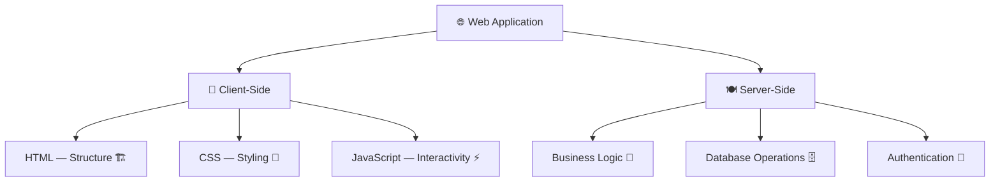

# 🖥️ The Client-Server Model

> **Hey there, future web wizard!** 🧙‍♂️ Before you start building cool websites and apps, you gotta understand *how the internet actually works* at its most basic level. Think of it like learning the rules of the road before you drive a car 🚗. Let's break it down!

---

## 🤔 What Is the Client-Server Model?

> [!NOTE]
> This is **THE** most basic idea of how the web works. Everything starts here!

Imagine you're at a restaurant 🍔:

- **Clients** 👤 — That's **YOU** (the customer). Your web browser, your phone app — anything that *asks* for stuff. You look at the menu and say, "I want a webpage, please!"
- **Servers** 🍽️ — That's **the kitchen**. The computers sitting somewhere in the world that store all the web files (`HTML`, `CSS`, databases) and *cook up* a response to send back to you.

> ☝️ **Simple version:** You (the client) ask. The server answers. That's literally it!

---

## 🧩 How the Conversation Works

Here's what happens every single time you visit a website:

1. 📤 **The client sends a request** — Your browser says *"Hey server, give me the homepage of google.com!"*
2. ⚙️ **The server processes the request** — It finds the right files, maybe queries a database...
3. 📥 **The server sends a response** — *"Here's the HTML, CSS, and images you need!"*
4. 🎨 **The client renders the page** — Your browser takes those files and paints the webpage on your screen

> 🧃 **Kid-friendly version:** It's like ordering food 🍕. You (client) tell the waiter (internet) what you want, the kitchen (server) cooks it, and the waiter brings it back to your table (screen)!

---

## 🌍 The Internet vs. The Web

> [!IMPORTANT]
> People mix these up ALL the time, but they're totally different things!

Here's a fun one:

| Concept | What It Is 🎯 | Analogy 🧠 |
| :--- | :--- | :--- |
| **The Internet** 🌐 | The actual physical stuff — cables under the ocean 🌊, routers blinking in server rooms, wires connecting everything together | The *road system* 🛣️ |
| **The Web (WWW)** 🕸️ | The collection of websites and apps that *ride on top of* that physical infrastructure | The *cars and trucks* 🚗 driving on those roads |

> 💡 **Other things that use the internet but aren't "the web":**
> - 📧 Email (SMTP protocol)
> - 🎮 Online gaming
> - 📁 File transfers (FTP)
> - 📱 Messaging apps (WhatsApp, Telegram)

---

## 🏛️ Types of Client-Server Architectures

Not all client-server setups are the same! Here are the common ones:

### 1️⃣ Two-Tier Architecture
The simplest setup — the client talks **directly** to the server.

> Think of it like a small food stall — one person takes your order AND cooks the food 🌮.

### 2️⃣ Three-Tier Architecture
The most common setup on the modern web — there's a **middle layer** (application server) between the client and database.

> This is like a proper restaurant 🍽️ — you tell the **waiter** (app server), the waiter tells the **kitchen** (database), and brings back your food.

### 3️⃣ N-Tier / Microservices
Big companies like Netflix and Amazon use this — multiple specialized servers handle different tasks.

> This is like a **food court** 🏬 — different counters handle different cuisines, but you get everything at one place!

---

## 🆚 Client-Side vs. Server-Side

> [!TIP]
> Understanding where code runs is **crucial** for web development!

| Aspect | Client-Side 👤 | Server-Side 🍽️ |
| :--- | :--- | :--- |
| **Runs on** | Your browser (your device) | A remote server |
| **Languages** | HTML, CSS, JavaScript | Node.js, Python, PHP, Java, Go |
| **Examples** | Animations, form validation, UI interactions | Database queries, authentication, file processing |
| **Visible to user?** | ✅ Yes (anyone can see your source code!) | ❌ No (code is hidden on the server) |
| **Speed** | Instant (no network needed) | Depends on network & server load |

> 🧠 **Think of it this way:** Client-side is what happens **on your screen**. Server-side is what happens **behind the scenes** in some data center far away.

---

## 🎯 Quick Recap

| Concept | One-Liner Summary |
| :--- | :--- |
| **Client** | The thing that *asks* (your browser, app) 👤 |
| **Server** | The thing that *answers* (a computer in the cloud) 🍽️ |
| **Request** | Client says *"Give me this!"* 📤 |
| **Response** | Server says *"Here you go!"* 📥 |
| **Internet** | The physical roads (cables, routers) 🛣️ |
| **Web** | The cars driving on those roads (websites, apps) 🚗 |

> [!TIP]
> **You now understand the backbone of the entire web!** 🎉 Every single website, app, and online service follows this client-server dance. Next up: let's learn how computers *find* each other on the internet with IP Addresses & DNS! 🚀

---

*Made with ❤️ for future web developers who like things explained the fun way!*
