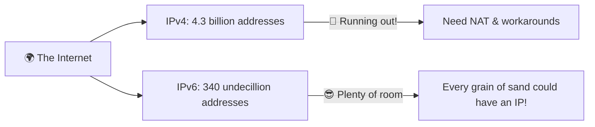
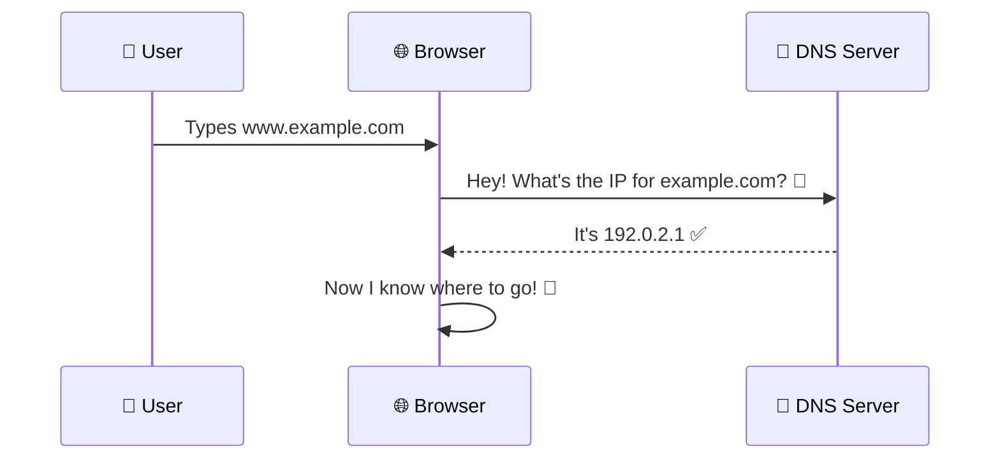
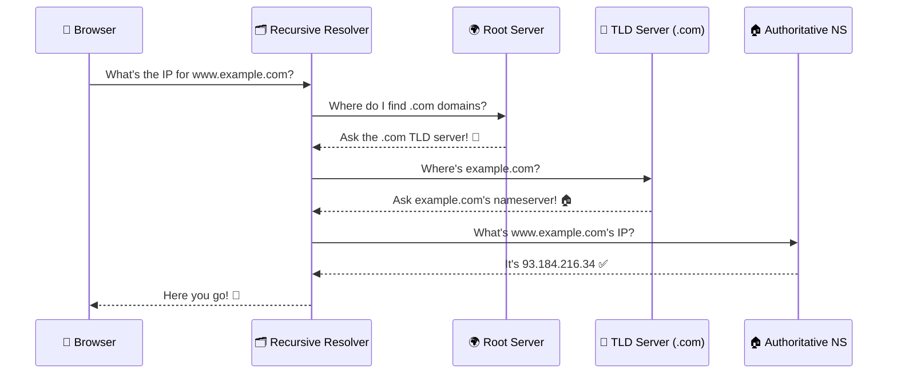
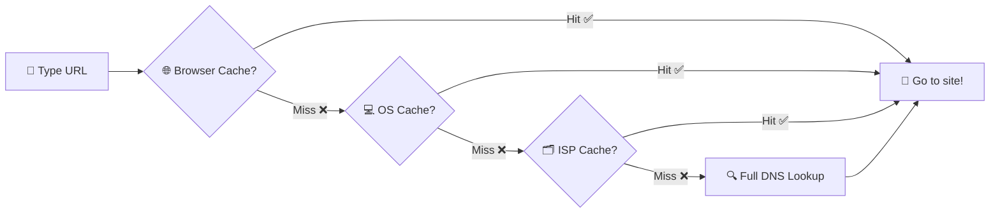
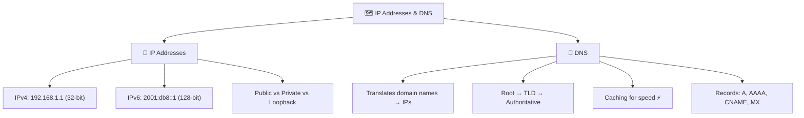

# 🗺️ IP Addresses & DNS

> **Time to learn how computers find each other on the internet!** 🔍 Every house has a street address, and every device on the internet has an IP address. But since humans are terrible at remembering numbers, we invented DNS to save us! 🧠

---

## 🔢 What Is an IP Address?

> [!NOTE]
> **IP** stands for **Internet Protocol**. An IP address is a unique number assigned to every device connected to the internet — like a **home address** for your computer, phone, or server.

Without IP addresses, devices wouldn't know where to send data. It'd be like mailing a letter without an address ✉️.

---

## 📦 IPv4 — The Original Address System

**IPv4** looks like this:

```
192.168.1.1
```

- **4 groups of numbers**, each between `0` and `255`, separated by dots
- Total possible addresses: ~**4.3 billion** (sounds like a lot, but we ran out! 😅)

### 🏠 Types of IPv4 Addresses

| Type | Range Example | What It's For 🎯 |
| :--- | :--- | :--- |
| **Public** | `142.250.190.14` | Your address on the *actual internet* |
| **Private** | `192.168.x.x`, `10.x.x.x` | Your *local network* only (home WiFi) |
| **Loopback** | `127.0.0.1` | Talking to yourself 🪞 (a.k.a. `localhost`) |

> 🧃 **Kid version:** Public IP = your home address. Private IP = your room number *inside* the house. Loopback = talking to yourself in the mirror 🪞!

---

## 🆕 IPv6 — The New Address System

> [!IMPORTANT]
> We **ran out** of IPv4 addresses! 😱 With billions of smartphones and IoT devices, 4.3 billion wasn't enough. Enter **IPv6**!

IPv6 looks like this:

```
2001:0db8:85a3:0000:0000:8a2e:0370:7334
```

- **8 groups** of **hexadecimal** characters, separated by colons
- Total possible addresses: **340 undecillion** (340 followed by 36 zeros! 🤯)

### IPv4 vs IPv6

| Feature | IPv4 📟 | IPv6 🚀 |
| :--- | :--- | :--- |
| **Format** | `192.168.1.1` | `2001:db8::8a2e:370:7334` |
| **Bits** | 32-bit | 128-bit |
| **Total Addresses** | ~4.3 billion | ~340 undecillion |
| **Running out?** | YES 😬 | Not anytime soon 😎 |



---

## 📖 What Is DNS?

> [!NOTE]
> **DNS** = **Domain Name System**. It's the **phone contacts app** of the internet! 📱

You don't memorize your friend's phone number — you tap their name. Same thing here:

- You type `www.google.com` (easy to remember!)
- DNS translates it to `142.250.190.14` (what computers need)
- Your browser goes to that IP address. **Boom!** 💥



> 🧠 **Think of it this way:** IP addresses are like GPS coordinates. DNS is like Google Maps turning "Pizza Hut" into actual coordinates.

---

## 🔍 How DNS Resolution Actually Works

DNS has a **chain of servers** working together:



### The DNS Server Hierarchy

| Server Level | What It Does 🎯 | Analogy 🧠 |
| :--- | :--- | :--- |
| **Recursive Resolver** 🗂️ | Your ISP's DNS — the "detective" that does the legwork | A librarian who finds the book 📚 |
| **Root Server** 🌍 | Knows where to find ALL top-level domains | The library's main directory 🏛️ |
| **TLD Server** 📁 | Handles a specific extension (`.com`, `.org`) | A specific shelf in the library |
| **Authoritative NS** 🏠 | Has the *actual* IP address | The exact book with the answer 📖 |

---

## ⚡ DNS Caching

> [!TIP]
> DNS results get **cached** (saved temporarily) at multiple levels for speed!

1. 🌐 **Browser cache** — Chrome, Firefox remember recent lookups
2. 💻 **OS cache** — Your operating system caches DNS too
3. 📡 **Router cache** — Your home router saves lookups
4. 🗂️ **ISP cache** — Your ISP remembers frequently-asked domains



---

## 📝 Common DNS Record Types

| Record | What It Stores 🎯 | Example |
| :--- | :--- | :--- |
| **A** | IPv4 address | `example.com → 93.184.216.34` |
| **AAAA** | IPv6 address | `example.com → 2606:2800:220:1::` |
| **CNAME** | Alias for another domain | `www.example.com → example.com` |
| **MX** | Mail server | `example.com → mail.example.com` |
| **TXT** | Text info (verification) | Domain ownership verification |
| **NS** | Nameserver | `example.com → ns1.example.com` |

> 💡 **Why does this matter?** When you buy a domain and set up hosting, you'll edit these DNS records!

---

## 🎯 Quick Recap



> [!TIP]
> **You just learned how every device finds every other device on the internet!** 🎉 Next up: the *language* that clients and servers speak — HTTP and HTTPS! 🚀

---

*Made with ❤️ for future web developers who like things explained the fun way!*
