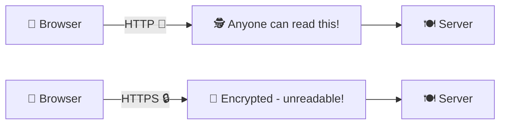
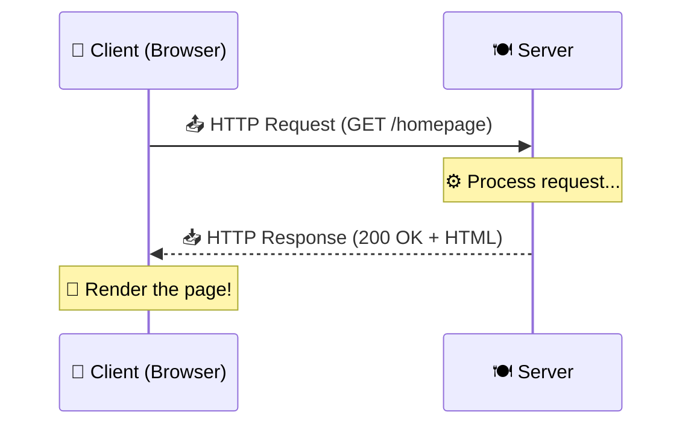
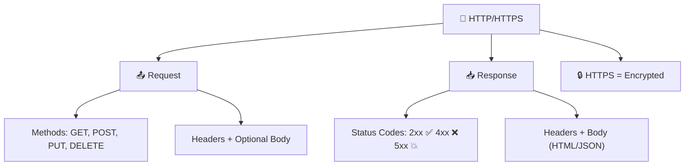

# 🚦 HTTP and HTTPS Protocols

> **Let's learn the language of the web!** 💬 HTTP is how your browser and servers talk to each other. It's the conversation that happens behind the scenes every time you click a link, submit a form, or load a page. Let's break it all down!

---

## 🤔 What Is HTTP?

> [!NOTE]
> **HTTP** = **HyperText Transfer Protocol**. It's the set of rules that clients (browsers) and servers use to communicate. Think of it as the *grammar* of the web!

- **HyperText** 🔗 — Text that links to other text (clickable links!)
- **Transfer** 📦 — Moving data from one place to another
- **Protocol** 📜 — A set of rules both sides agree on

> 🧃 **Kid version:** HTTP is like the language two people speak when ordering food. The customer (browser) says *"I want a burger"* in a specific format, and the waiter (server) replies in the same format: *"Here's your burger!"* 🍔

---

## 🔒 HTTP vs HTTPS

> [!IMPORTANT]
> **HTTPS** = HTTP + **S**ecurity (SSL/TLS encryption). It's the same language, but whispered through a secret code so nobody can eavesdrop! 🔐

| Feature | HTTP 📨 | HTTPS 🔒 |
| :--- | :--- | :--- |
| **Security** | ❌ No encryption (anyone can read it!) | ✅ Encrypted with SSL/TLS |
| **URL starts with** | `http://` | `https://` |
| **Port** | 80 | 443 |
| **Browser indicator** | ⚠️ "Not Secure" warning | 🔒 Padlock icon |
| **Use for** | Nothing (seriously, don't 😅) | Everything! Especially logins & payments |



> 🛡️ **How SSL/TLS works (simplified):**
> 1. Your browser says *"Hey server, let's talk securely"* 🤝
> 2. The server sends its **SSL certificate** (proof of identity)
> 3. They agree on a secret encryption key 🔑
> 4. All data is now encrypted — even if someone intercepts it, it's unreadable gibberish! 🔐

---

## 📬 The Request/Response Cycle

This is the **heartbeat** of the web. It goes like this:

1. 📤 **You (the client)** send an **HTTP Request** — *"Hey server, I want this thing!"*
2. ⚙️ **The server** processes it, does some work...
3. 📥 **The server** sends back an **HTTP Response** — *"Here's what you asked for!"* (or *"Nope, can't find it!"* 😬)



---

## 📤 Anatomy of an HTTP Request

Every HTTP request has these parts:

```
GET /products/shoes HTTP/1.1        ← Request Line (method + path + version)
Host: www.example.com               ← Headers (extra info)
User-Agent: Chrome/120
Accept: text/html
Accept-Language: en-US
Cookie: session=abc123
```

| Part | What It Contains 🎯 |
| :--- | :--- |
| **Request Line** | The method (`GET`), the path (`/products/shoes`), and HTTP version |
| **Headers** | Metadata — who you are, what you accept, cookies, etc. |
| **Body** *(optional)* | Data you're sending (for `POST`, `PUT` requests) |

---

## 🛠️ Core HTTP Methods

Think of these as **different types of actions** you can ask a server to do:

| Method | What It Does | Real-Life Example 🌍 |
| :--- | :--- | :--- |
| **`GET`** | 📖 Retrieve data | Loading a webpage or fetching blog posts |
| **`POST`** | ✏️ Submit new data | Sending a registration form |
| **`PUT`** | 🔄 Replace entire resource | Replacing your entire user profile |
| **`PATCH`** | 🩹 Update part of a resource | Changing just your email address |
| **`DELETE`** | 🗑️ Remove data | Trashing a comment |
| **`HEAD`** | 🔍 GET without the body | Checking if a page exists |
| **`OPTIONS`** | 📋 What methods are allowed? | Preflight check for CORS |

> 💡 **Easy memory trick:**
> - `GET` = *"Give me something"*
> - `POST` = *"Here, take this new thing"*
> - `PUT` = *"Replace the whole thing"*
> - `PATCH` = *"Fix just this part"*
> - `DELETE` = *"Yeet this thing"* 🫡

### Safe vs Unsafe Methods

| Property | Methods | Meaning |
| :--- | :--- | :--- |
| **Safe** | `GET`, `HEAD`, `OPTIONS` | Doesn't change anything on the server |
| **Idempotent** | `GET`, `PUT`, `DELETE` | Same result no matter how many times you call it |
| **Not Idempotent** | `POST` | Each call creates a *new* thing |

---

## 📥 Anatomy of an HTTP Response

```
HTTP/1.1 200 OK                     ← Status Line (version + code + message)
Content-Type: text/html              ← Headers
Content-Length: 3456
Set-Cookie: session=xyz789

<html>...</html>                     ← Body (the actual content)
```

---

## 📊 HTTP Status Codes

When the server replies, it sends a **3-digit number** to tell you how things went:

### The Five Families

| Range | Meaning 🎯 | Common Examples |
| :--- | :--- | :--- |
| **`1xx`** | ℹ️ Informational | `100 Continue` — Keep going, I'm listening |
| **`2xx`** | ✅ Success! | `200 OK` — Here's your stuff! |
| **`3xx`** | ↪️ Redirection | `301 Moved Permanently` — Follow me! |
| **`4xx`** | ❌ Client Error | `404 Not Found` — That doesn't exist! |
| **`5xx`** | 💥 Server Error | `500 Internal Server Error` — We crashed! |

### Most Common Status Codes

| Code | Name | What It Means 🎯 |
| :--- | :--- | :--- |
| `200` | OK | ✅ Everything worked perfectly! |
| `201` | Created | ✅ New resource was created (after POST) |
| `204` | No Content | ✅ Success, but nothing to show |
| `301` | Moved Permanently | ↪️ Page moved to new URL forever |
| `302` | Found (Temporary Redirect) | ↪️ Page temporarily at different URL |
| `304` | Not Modified | ↪️ Use your cached version, nothing changed |
| `400` | Bad Request | ❌ Your request was malformed |
| `401` | Unauthorized | ❌ You need to log in first! 🔑 |
| `403` | Forbidden | ❌ You're logged in but not allowed 🚫 |
| `404` | Not Found | ❌ That page doesn't exist! |
| `405` | Method Not Allowed | ❌ Can't use that HTTP method here |
| `429` | Too Many Requests | ❌ Slow down! Rate limited ⏰ |
| `500` | Internal Server Error | 💥 Server code crashed |
| `502` | Bad Gateway | 💥 Server got a bad response from upstream |
| `503` | Service Unavailable | 💥 Server is overloaded or down for maintenance |

> 🎮 **Fun fact:** You've *definitely* seen a `404` page before. That's a **client error** — it means *you* (or a broken link) asked for something that doesn't exist!

---

## 📦 HTTP Headers Deep Dive

Headers carry important metadata with every request and response:

### Common Request Headers

| Header | What It Does 🎯 |
| :--- | :--- |
| `Host` | Which website you're asking for |
| `User-Agent` | Your browser info (Chrome, Firefox, etc.) |
| `Accept` | What content types you can handle |
| `Authorization` | Login credentials / API keys 🔑 |
| `Cookie` | Previously saved data from the server 🍪 |
| `Content-Type` | Format of data you're sending |

### Common Response Headers

| Header | What It Does 🎯 |
| :--- | :--- |
| `Content-Type` | Format of the data (HTML, JSON, etc.) |
| `Content-Length` | Size of the response body |
| `Set-Cookie` | Tells browser to save a cookie 🍪 |
| `Cache-Control` | How long to cache the response |
| `Location` | Where to redirect (with 3xx codes) |

---

## 🎯 Quick Recap



> [!TIP]
> **You now understand how browsers and servers communicate!** 🎉 Every webpage, API call, and form submission follows this protocol. Next: let's see what the browser does *after* it gets the response — the Rendering Engine! 🚀

---

*Made with ❤️ for future web developers who like things explained the fun way!*
