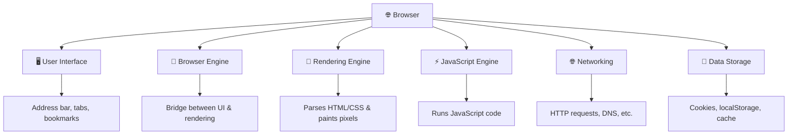
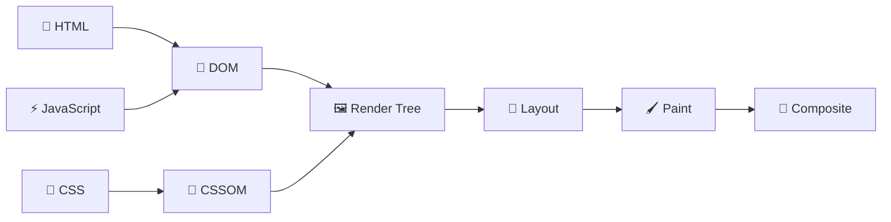
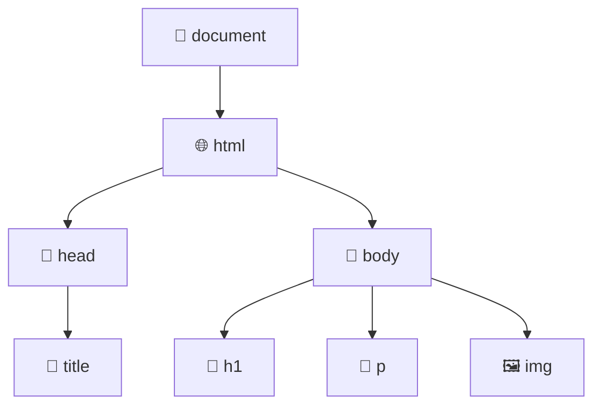
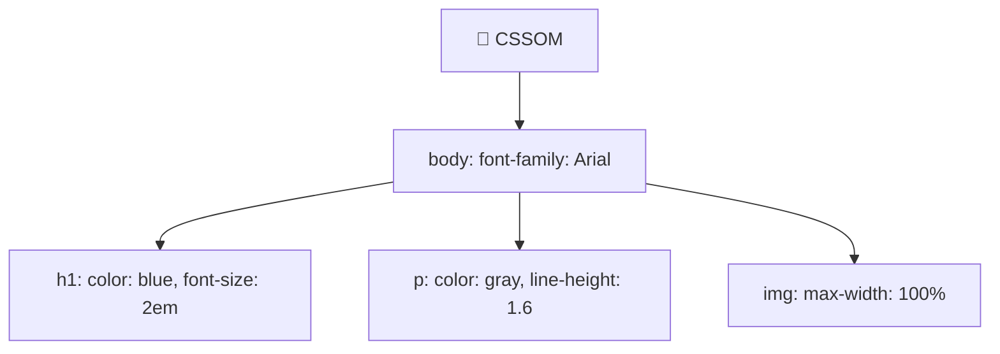
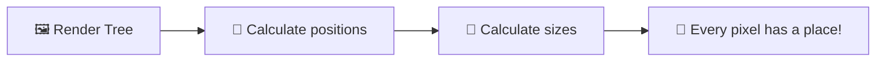
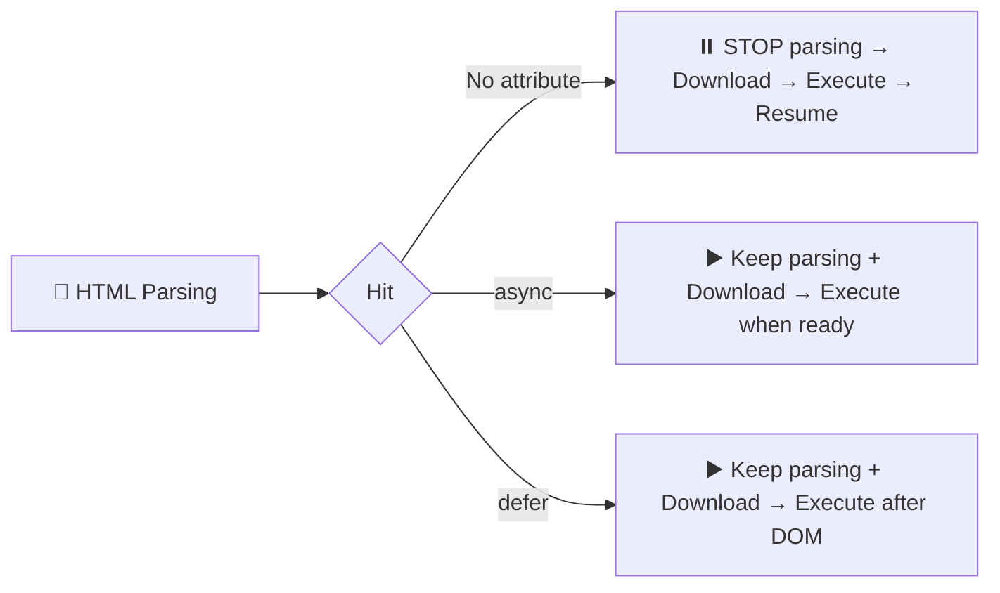
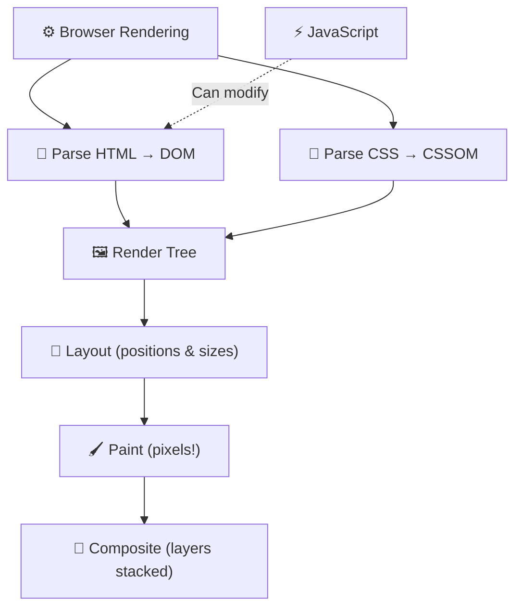

# ⚙️ Browsers and the Rendering Engine

> **Ever wonder what happens in those split seconds between hitting Enter and seeing a webpage?** 🤔 Your browser is doing an INSANE amount of work behind the scenes. Let's peek under the hood and see the magic! ✨

---

## 🌐 What Is a Web Browser?

> [!NOTE]
> A **web browser** is a software application that fetches, interprets, and displays web content. It's your window into the internet! 🪟

Popular browsers and their engines:

| Browser | Rendering Engine 🎨 | JS Engine ⚡ |
| :--- | :--- | :--- |
| 🟢 **Chrome** | Blink | V8 |
| 🔵 **Edge** | Blink | V8 |
| 🟠 **Firefox** | Gecko | SpiderMonkey |
| ⚪ **Safari** | WebKit | JavaScriptCore |
| 🔴 **Opera** | Blink | V8 |

> 🧃 **Kid version:** A browser is like a super-smart translator 🗣️. You give it a URL, and it turns a bunch of code files into the beautiful, interactive page you see on screen!

---

## 🗺️ The Browser's Main Components



| Component | What It Does 🎯 |
| :--- | :--- |
| **User Interface** 🖥️ | Everything you see (address bar, tabs, back button) *except* the webpage itself |
| **Browser Engine** 🧠 | The boss — coordinates between UI and rendering engine |
| **Rendering Engine** 🎨 | The star of the show — turns HTML/CSS into pixels on screen |
| **JavaScript Engine** ⚡ | Runs all the JS code that makes pages interactive |
| **Networking** 🌐 | Handles all HTTP requests, DNS lookups, etc. |
| **Data Storage** 💾 | Cookies, localStorage, sessionStorage, IndexedDB, cache |

---

## 🎨 The Critical Rendering Path

> [!IMPORTANT]
> This is the step-by-step process the browser follows to turn raw code into a visible webpage. Understanding this makes you a **better developer**! 🦸

Here's the full journey:



Let's break down each step:

---

### Step 1: 📝 Parsing HTML → Building the DOM

When the browser receives the HTML file, it **parses** (reads through) it character by character and builds the **DOM** — the **Document Object Model**.

The DOM is a **tree-shaped structure** where every HTML element becomes a "node":



```html
<!-- This HTML... -->
<html>
  <head><title>My Page</title></head>
  <body>
    <h1>Hello!</h1>
    <p>Welcome to my site</p>
    
  </body>
</html>
```

> 🧃 **Kid version:** The DOM is like a family tree 🌳 for your webpage. The `<html>` tag is the grandparent, `<head>` and `<body>` are the parents, and all the elements inside are the children!

---

### Step 2: 🎨 Parsing CSS → Building the CSSOM

At the same time, the browser reads all the CSS (from `<style>` tags, external stylesheets, and inline styles) and builds the **CSSOM** — the **CSS Object Model**.

The CSSOM is also a tree that maps which styles apply to which elements:



> 💡 **Key point:** The browser can NOT render anything until BOTH the DOM and CSSOM are fully built. CSS is **render-blocking**!

---

### Step 3: 🖼️ Combining into the Render Tree

The browser **merges** the DOM and CSSOM into a **Render Tree** — this contains ONLY the elements that are actually visible on screen.

| Included ✅ | Excluded ❌ |
| :--- | :--- |
| Visible elements with styles | `<head>`, `<meta>`, `<script>` |
| Text nodes with computed styles | Elements with `display: none` |
| Pseudo-elements (`::before`, `::after`) | Hidden elements |

> ☝️ Notice: `display: none` elements are NOT in the render tree, but `visibility: hidden` elements ARE (they still take up space!).

---

### Step 4: 📐 Layout (Reflow)

Now the browser calculates the **exact position and size** of every element on the page. This is called **layout** (or **reflow**).

- Where does each box go? 📍
- How big is it? 📏
- Does it wrap to the next line?
- How does it interact with sibling elements?



> ⚠️ **Performance tip:** Layout is **expensive**! Changing widths, heights, or positions of elements triggers a re-layout. Batch your DOM changes to avoid repeated reflows!

---

### Step 5: 🖌️ Paint

The browser converts each node in the render tree into actual **pixels on the screen**:

- Filling backgrounds with colors 🎨
- Drawing text with the right font ✍️
- Rendering borders, shadows, images 🖼️
- Applying rounded corners, gradients

> The paint step creates **layers** — like transparent sheets stacked on top of each other.

---

### Step 6: 🧩 Compositing

Finally, the browser takes all the painted layers and **composites** (stacks) them together in the correct order to produce the final image you see.

Elements with `transform`, `opacity`, or `will-change` get their own **compositor layer** — this is why CSS animations using `transform` are so smooth! 🏎️

---

## ⚡ JavaScript Execution

> [!TIP]
> JavaScript is what makes pages **interactive** — clickable buttons, animated menus, real-time updates, form validation, and more!

### The JavaScript Engine

Each browser has its own JS engine:

| Engine | Browser | Fun Fact 🎮 |
| :--- | :--- | :--- |
| **V8** 🏎️ | Chrome, Edge, Node.js | Named after a car engine — it's FAST! |
| **SpiderMonkey** 🕷️ | Firefox | The very FIRST JS engine ever made! |
| **JavaScriptCore** 🍎 | Safari | Also called "Nitro" |

### How JavaScript Affects Rendering

> [!WARNING]
> JavaScript is **parser-blocking** by default! When the browser hits a `<script>` tag, it **stops** building the DOM until the script is downloaded and executed.

```html
<!-- ❌ Parser-blocking (bad for performance) -->
<script src="app.js"></script>

<!-- ✅ Async: downloads in parallel, executes when ready -->
<script src="app.js" async></script>

<!-- ✅ Defer: downloads in parallel, executes AFTER DOM is ready -->
<script src="app.js" defer></script>
```

| Attribute | Downloads | Executes | Best For |
| :--- | :--- | :--- | :--- |
| *(none)* | Blocks parsing ❌ | Immediately | Almost never use this |
| `async` | In parallel ✅ | As soon as downloaded | Analytics, ads, independent scripts |
| `defer` | In parallel ✅ | After DOM is built | Most scripts! 🏆 |



---

## 🔄 Reflow vs Repaint

Understanding the difference helps you write **faster** websites:

| Concept | What Triggers It 🎯 | Cost 💰 |
| :--- | :--- | :--- |
| **Reflow** (Layout) | Changing size, position, adding/removing elements | 🔴 Expensive! |
| **Repaint** | Changing colors, visibility, shadows | 🟡 Medium |
| **Composite only** | `transform`, `opacity` changes | 🟢 Cheap & smooth! |

> 💡 **Pro tip:** For animations, always prefer `transform` and `opacity` over changing `width`, `height`, `top`, or `left`. The browser can handle transforms on the GPU without triggering reflow! 🏎️

---

## 🎯 Quick Recap



> [!TIP]
> **You now know what happens under the hood of your browser!** 🎉 Understanding the rendering pipeline makes you a smarter, faster developer. Next up: let's learn how your website goes live — Hosting and CDNs! 🚀

---

*Made with ❤️ for future web developers who like things explained the fun way!*
