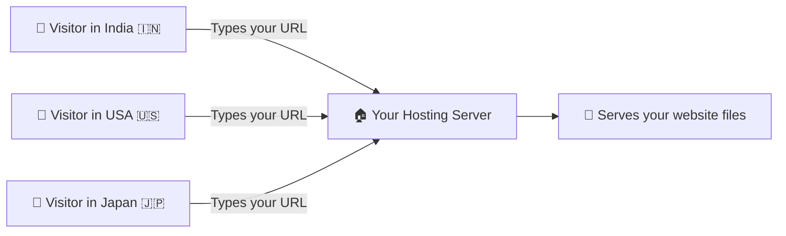
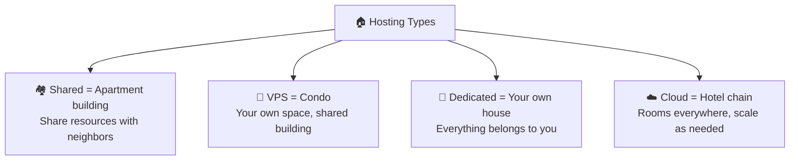
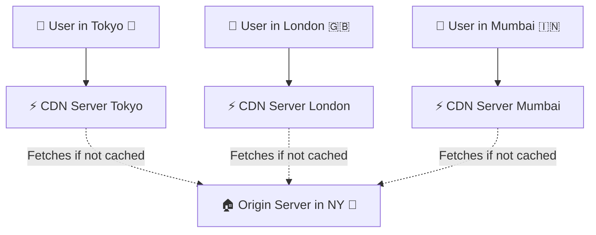
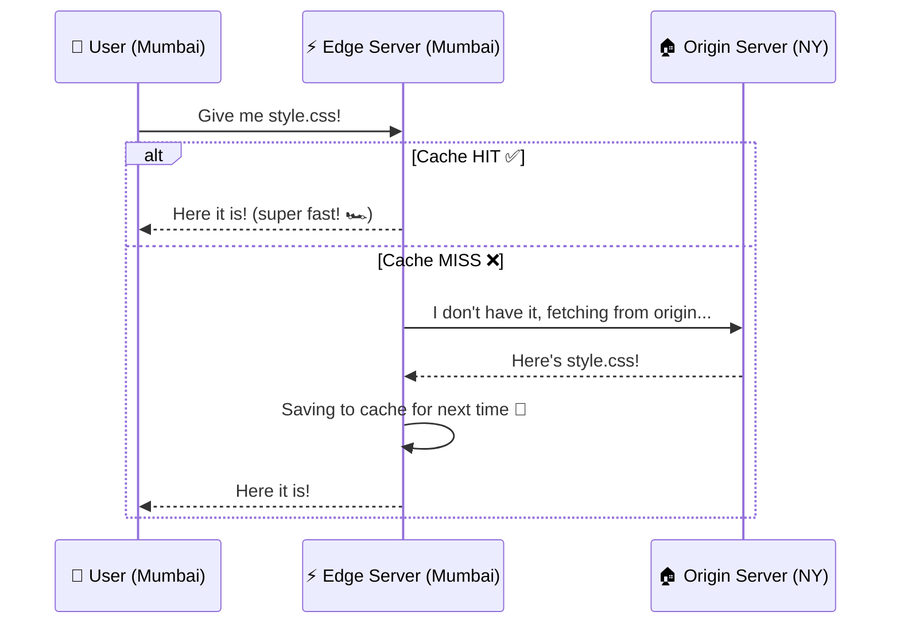
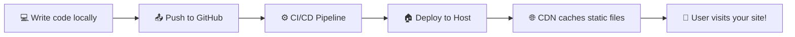
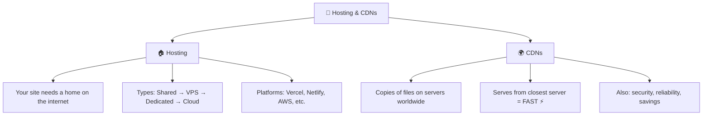

# 🚀 Hosting and CDNs

> **Your awesome website lives on your laptop while you build it. But how does the rest of the world see it?** 🌍 That's where hosting and CDNs come in! Let's learn how to put your site on the internet for everyone to enjoy!

---

## 🏠 What Is Web Hosting?

> [!NOTE]
> **Web hosting** means storing your website files on a computer (server) that's connected to the internet **24/7**, so anyone in the world can visit your site anytime — even at 3 AM! ⏰

Think of it as *renting an apartment for your website* on the internet. Your files need a place to live where people can come visit them.

> 🧃 **Kid version:** Hosting is like renting a locker at school 🏫. You put your stuff (website files) in the locker, and anyone with the combination (URL) can open it and see what's inside!

---

## 🏗️ Types of Web Hosting

| Type | What It Is 🎯 | Best For | Cost 💰 |
| :--- | :--- | :--- | :--- |
| **Shared Hosting** 🏘️ | Multiple websites share ONE server | Beginners, small blogs | $ (cheapest) |
| **VPS (Virtual Private Server)** 🏢 | One server split into virtual machines — you get your own slice | Growing sites, small businesses | $$ |
| **Dedicated Server** 🏰 | An ENTIRE physical server just for you | Large enterprises, high-traffic sites | $$$$ |
| **Cloud Hosting** ☁️ | Your site runs on a network of servers (scales up/down) | Apps that need flexibility | $$ - $$$ |
| **Static Hosting** 📄 | Only serves static files (HTML, CSS, JS) — no server-side code | Portfolios, landing pages | Free - $ |
| **Serverless** ⚡ | No server to manage — code runs on-demand | APIs, backend functions | Pay per use |

### Hosting Analogy 🏠

---

## 🔥 Popular Hosting Platforms

### For Static Sites (Free! 🎉)

| Platform | Best For 🎯 | Key Feature |
| :--- | :--- | :--- |
| **GitHub Pages** 🐙 | Portfolio sites, docs | Free hosting from your GitHub repo |
| **Netlify** ⚡ | JAMstack sites, SPAs | Auto-deploy from Git + free SSL |
| **Vercel** ▲ | Next.js apps, frontends | Edge network + serverless functions |
| **Cloudflare Pages** 🌐 | Static sites, SPAs | Global CDN + unlimited bandwidth |

### For Full-Stack Apps

| Platform | Best For 🎯 | Key Feature |
| :--- | :--- | :--- |
| **AWS** ☁️ | Enterprise, any scale | The biggest cloud — has EVERYTHING |
| **Google Cloud** 🟦 | AI/ML + web apps | Strong Kubernetes & data tools |
| **DigitalOcean** 🌊 | Developers who want simplicity | Simple VPS (they call them "Droplets") |
| **Railway** 🚂 | Quick full-stack deploys | Deploy from GitHub in minutes |
| **Render** 🎨 | Heroku alternative | Free tier + easy deployment |

> 💡 **Starting out?** Use **GitHub Pages** or **Netlify** for static sites. Use **Vercel** or **Railway** for full-stack apps. Don't overthink it! 😄

---

## 🌍 What Is a CDN?

> [!IMPORTANT]
> **CDN** = **Content Delivery Network**. It's a network of servers spread across the globe that caches copies of your website's static files to serve them **faster** to users everywhere! ⚡

### The Pizza Shop Analogy 🍕

Imagine you have a pizza shop in New York. If someone in Tokyo orders, it takes forever to deliver, right? So instead, you set up **mini pizza shops all around the world** that have copies of your most popular pizzas ready to go!

That's exactly what a CDN does:
- It stores copies of your static files (images, CSS, JS) on servers **all around the globe** 🌐
- When a user visits your site, the CDN serves files from the server **closest to them** 📍
- Everything loads **way faster**!

---

## ⚙️ How a CDN Works

Here's the step-by-step flow:

### Key CDN Concepts

| Concept | What It Means 🎯 |
| :--- | :--- |
| **Edge Server** ⚡ | A CDN server near the user (the "mini pizza shop") |
| **Origin Server** 🏠 | Your main server where the original files live |
| **Cache Hit** ✅ | The edge server already has the file — instant delivery! |
| **Cache Miss** ❌ | Edge server doesn't have it — fetches from origin first |
| **PoP (Point of Presence)** 📍 | A physical location where CDN edge servers live |
| **TTL (Time to Live)** ⏰ | How long cached files stay valid before refreshing |

---

## 🏎️ Why CDNs Matter — Speed Comparison

> [!TIP]
> **Speed matters — A LOT!** Studies show that 53% of users abandon a site that takes more than 3 seconds to load 😱

| Scenario | Without CDN 🐢 | With CDN 🏎️ |
| :--- | :--- | :--- |
| User in NY loading NY-hosted site | ~50ms | ~20ms |
| User in India loading NY-hosted site | ~300ms | ~40ms |
| User in Australia loading NY-hosted site | ~400ms | ~50ms |

> 🏎️ That's a **HUGE** difference for user experience! Faster sites = happier users = better SEO rankings = more 💰

---

## 🛡️ CDN Benefits Beyond Speed

CDNs do more than just make things faster:

| Benefit | How It Helps 🎯 |
| :--- | :--- |
| **Performance** 🏎️ | Files served from nearby servers = faster load times |
| **Reliability** 🛡️ | If one server goes down, others take over |
| **DDoS Protection** 🔒 | Absorbs malicious traffic across the network |
| **Bandwidth Savings** 💰 | Origin server handles less traffic = lower hosting costs |
| **SSL/TLS** 🔐 | Many CDNs provide free HTTPS certificates |
| **Analytics** 📊 | See where your traffic comes from worldwide |

---

## 🔥 Popular CDN Providers

| Provider | Key Strength 🎯 |
| :--- | :--- |
| **Cloudflare** 🌐 | Free tier! DDoS protection + DNS + CDN |
| **AWS CloudFront** ☁️ | Integrates with all AWS services |
| **Fastly** ⚡ | Real-time caching, used by GitHub & Reddit |
| **Akamai** 🌍 | The OG CDN — largest network worldwide |
| **Bunny CDN** 🐰 | Super affordable, simple to set up |

> 💡 **Starting out?** **Cloudflare** is the go-to. It has a generous free tier with CDN, DNS, DDoS protection, and free SSL. Can't beat that! 🏆

---

## 🔄 Deployment Flow — From Code to Live Site

Here's the typical journey of your code going from your laptop to the world:

### A Typical Deployment Setup

| Step | What Happens 🎯 | Tools |
| :--- | :--- | :--- |
| **1. Code** | Write your app locally | VS Code, your brain 🧠 |
| **2. Push** | Push code to a Git repository | GitHub, GitLab |
| **3. Build** | Automated build process runs | GitHub Actions, Netlify Build |
| **4. Deploy** | Built files sent to hosting server | Vercel, Netlify, AWS |
| **5. CDN** | Static assets cached globally | Cloudflare, CloudFront |
| **6. Live!** | Users can visit your site 🎉 | The whole internet! 🌍 |

---

## 🎯 Quick Recap

> [!TIP]
> **You now understand the full picture!** 🎉 From writing code on your laptop to deploying it on a server with a CDN making it blazing fast worldwide. That's the full journey of a website! 🚀

---

*Made with ❤️ for future web developers who like things explained the fun way!*
