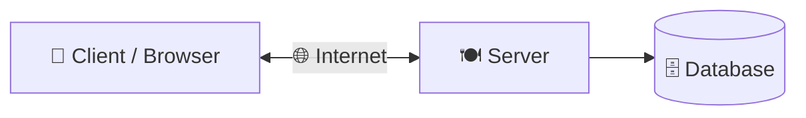
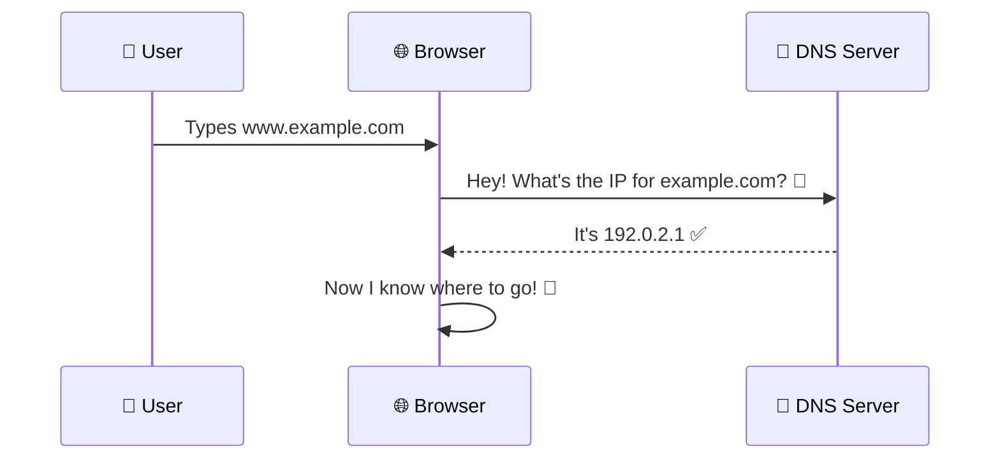
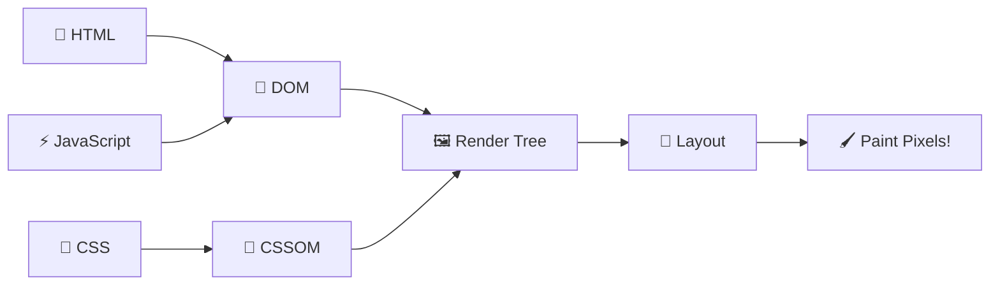
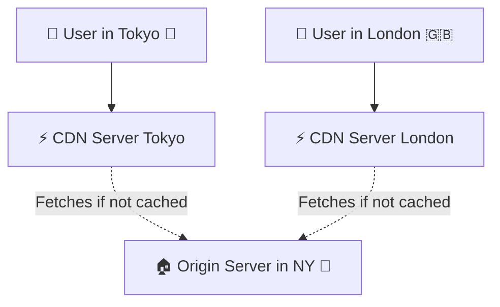
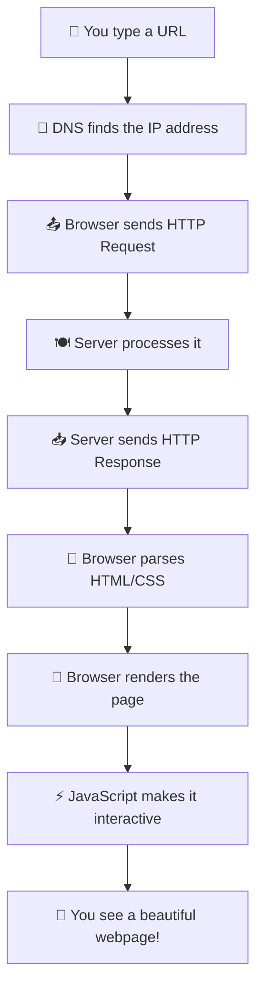

# 🌐 Fundamentals of the Internet for Web Developers

> **Hey there, future web wizard!** 🧙‍♂️ Before you start building cool websites and apps, you gotta understand *how the internet actually works*. Think of it like learning the rules of the road before you drive a car 🚗. Let's break it all down in a super chill way!

---

## 1. 🖥️ The Client-Server Model

> [!NOTE]
> This is **THE** most basic idea of how the web works. Everything starts here!

Imagine you're at a restaurant 🍔:

- **Clients** 👤 — That's **YOU** (the customer). Your web browser, your phone app — anything that *asks* for stuff. You look at the menu and say, "I want a webpage, please!"
- **Servers** 🍽️ — That's **the kitchen**. The computers sitting somewhere in the world that store all the web files (`HTML`, `CSS`, databases) and *cook up* a response to send back to you.
- **The Internet vs. The Web** 🌍 — Here's a fun one people mix up ALL the time:
  - The **Internet** = the actual physical stuff — cables under the ocean 🌊, routers blinking in server rooms, wires connecting everything together. It's the *road system*.
  - The **Web** = the collection of websites and apps that *ride on top of* that road system. It's the *cars and trucks* driving on the roads.

> ☝️ **Simple version:** You (the client) ask. The server answers. That's literally it!

---

## 2. 🗺️ IP Addresses & DNS

> [!IMPORTANT]
> Computers speak in **numbers**. Humans speak in **words**. DNS is the magical translator between both! 🪄

- **IP Addresses** 🔢 — Every single device on the internet has a unique number, kind of like a **home address** for your house.
  - **IPv4** looks like this: `192.168.1.1` (4 groups of numbers)
  - **IPv6** is much longer (because we ran out of short addresses! 😅) — it's an alphanumeric string like `2001:0db8:85a3::8a2e:0370:7334`
- **DNS (Domain Name System)** 📖 — Think of DNS as the **contacts app** on your phone. You don't memorize your friend's phone number, right? You just tap their name. Same thing here!
  - You type `www.google.com` → DNS looks it up → finds the IP address `142.250.190.14` → sends your browser to the right place. **Boom!** 💥

> 🧠 **Think of it this way:** IP addresses are like GPS coordinates. DNS is like Google Maps turning "Pizza Hut" into actual coordinates so you can get there.

---

## 3. 🚦 HTTP and HTTPS Protocols

> [!NOTE]
> **HTTP** = the *language* that clients and servers use to chat with each other. **HTTPS** = the same language, but with a 🔒 **secret code** so nobody can eavesdrop!

### 📬 The Request/Response Cycle

This is the heartbeat of the web. It goes like this:

1. 📤 **You (the client)** send an **HTTP Request** — basically saying *"Hey server, I want this thing!"*
2. ⚙️ **The server** thinks about it, does some work...
3. 📥 **The server** sends back an **HTTP Response** — *"Here's what you asked for!"* (or *"Nope, can't find it!"* 😬)

### 🛠️ Core HTTP Methods

Think of these as **different types of actions** you can ask a server to do:

| Method         | What It Does        | Real-Life Example 🌍                                  |
| :------------- | :------------------ | :----------------------------------------------------- |
| **`GET`**      | 📖 Retrieve data    | Loading a webpage or fetching a list of blog posts     |
| **`POST`**     | ✏️ Submit new data  | Sending a filled-out registration form                 |
| **`PUT/PATCH`**| 🔄 Update data      | Editing your user profile                              |
| **`DELETE`**   | 🗑️ Remove data     | Trashing a comment                                     |

> 💡 **Easy memory trick:**
> - `GET` = *"Give me something"*
> - `POST` = *"Here, take this new thing"*
> - `PUT/PATCH` = *"Fix this old thing"*
> - `DELETE` = *"Yeet this thing"* 🫡

### 📊 Common HTTP Status Codes

When the server replies, it also sends a **3-digit number** to tell you how things went. Think of it like a **report card grade** for the request:

| Range      | Meaning 🎯       | Common Example                                                      |
| :--------- | :---------------- | :------------------------------------------------------------------- |
| **`200s`** | ✅ Success!       | `200 OK` — Everything worked perfectly, here's your stuff!           |
| **`300s`** | ↪️ Redirection   | `301 Moved Permanently` — The page moved to a new URL, follow me!   |
| **`400s`** | ❌ Client Error   | `404 Not Found` — You typed the URL wrong, buddy! Or `401 Unauthorized` — You're not allowed here! 🚫 |
| **`500s`** | 💥 Server Error   | `500 Internal Server Error` — The server's code crashed. Not your fault! |

> 🎮 **Fun fact:** You've *definitely* seen a `404` page before. That's a **client error** — it means *you* (or a broken link) asked for something that doesn't exist!

---

## 4. ⚙️ Browsers and the Rendering Engine

> [!TIP]
> Ever wonder what happens in those **split seconds** between hitting Enter and seeing a webpage? Here's the magic! ✨

The browser does **three big jobs** after it gets the files from the server:

- **Parsing** 📝 — The browser reads through your `HTML` file and builds something called the **DOM** (Document Object Model) — basically a tree-shaped map of every element on the page. At the same time, it reads the `CSS` and builds the **CSSOM** (CSS Object Model) — a map of all the styles.
- **Rendering** 🎨 — The browser *smashes together* the DOM + CSSOM like mixing paint colors 🖌️. It figures out where everything goes on screen (layout) and then actually **paints the pixels** you see.
- **Execution** ⚡ — The browser's JavaScript engine (like **V8** in Google Chrome 🏎️) runs all the `JavaScript` code. This is what makes buttons clickable, forms interactive, and animations smooth — all *without* reloading the whole page!

> 🧃 **Kid-friendly version:** The browser is like a super-fast artist. It reads the instructions (HTML), picks the colors and fonts (CSS), draws everything on screen, and then adds the fun interactive bits (JavaScript)!

---

## 5. 🚀 Hosting and CDNs

> [!IMPORTANT]
> Your awesome website lives on your laptop while you build it. But **how does the rest of the world see it?** That's where hosting and CDNs come in!

- **Servers / Hosting** 🏠 — These are the computers (physical or virtual) where your application lives and runs **24/7**, so people can visit your site anytime — even at 3 AM! Think of it as *renting an apartment for your website* on the internet.
- **CDNs (Content Delivery Networks)** 🌍⚡ — Imagine you have a pizza shop in New York 🍕. If someone in Tokyo orders, it takes forever to deliver, right? So instead, you set up **mini pizza shops all around the world** that have copies of your most popular pizzas ready to go!
  - That's exactly what a CDN does — it stores copies of your static files (images, `CSS`, `JavaScript`) on servers **all around the globe**.
  - When a user visits your site, the CDN serves files from the server **closest to them** 📍, making everything load **way faster**!

> 🏎️ **Speed matters!** Without a CDN, someone in India loading your US-hosted site might wait 3+ seconds. With a CDN? Under 1 second. That's a **HUGE** difference for user experience!

---

## 🎯 Quick Recap — The Big Picture

> [!TIP]
> **You just learned the entire journey of a webpage** — from typing a URL to seeing pixels on your screen! 🎉 Now go build something awesome! 🚀

---

*Made with ❤️ for future web developers who like things explained the fun way!*
