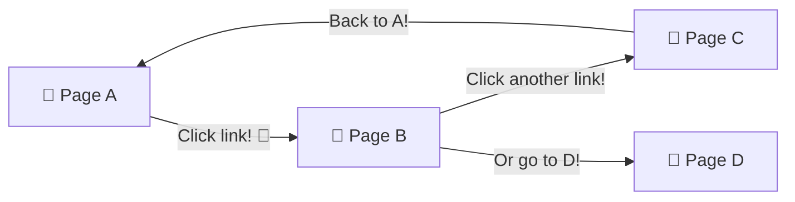
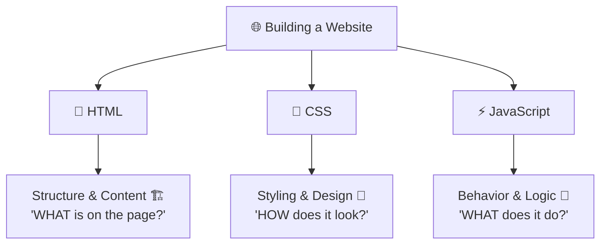
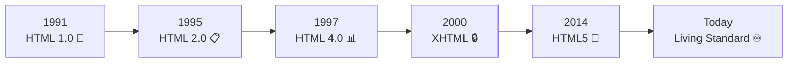
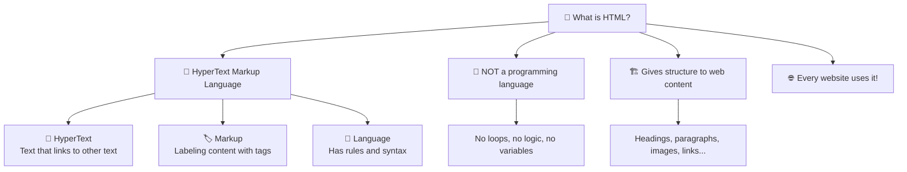

# 🤔 What Even IS HTML?

> **Hey there, future web builder!** 🧙‍♂️ Welcome to your very first step into the world of web development! Before you build anything cool — before the fancy animations, the beautiful layouts, the interactive buttons — you need to understand the ONE thing that makes it all possible: **HTML**. Let's break it down! ☕

---

## 📖 The Definition

> [!NOTE]
> **HTML** stands for **HyperText Markup Language**. It is the **standard language** for creating web pages and web applications. Every single website you've ever visited — Google, YouTube, Instagram, Wikipedia — is built on HTML at its core.

But here's the thing that confuses beginners:

> [!IMPORTANT]
> **HTML is NOT a programming language!** 🚫 It's a *markup* language. It doesn't do calculations, it doesn't have loops, and it doesn't make decisions. It simply **describes** what content is on a page and gives it **structure**.

> 🧃 **Kid version:** HTML is like putting **name tags** on everything at a party 🎉. You slap a tag on some text that says "I'm a heading!" and the browser goes *"Got it, I'll make you big and bold!"* You put another tag that says "I'm a paragraph!" and the browser says *"Cool, I'll display you as regular text with some space around you!"*

---

## 🔍 Breaking Down the Name

Let's dissect what each word in **H-T-M-L** actually means:

### 🔗 HyperText

**"HyperText"** means text that links to other text. That's it!

When you click a link on a webpage and it takes you to another page — that's hypertext in action. Before the web, documents were **linear** — you read page 1, then page 2, then page 3. HyperText changed everything by letting you **jump** between documents instantly!

> 🧠 **Think of it this way:** A regular book 📖 is like a highway with no exits — you go straight from start to end. HyperText is like a city with roads going in every direction — you can go anywhere, anytime! 🏙️



### 🏷️ Markup

**"Markup"** means you're **annotating** or **labeling** content to tell the browser what each piece is.

Think about an editor reviewing a manuscript ✍️. They'll circle a word and write "make this bold" or "this is a heading" — they're *marking up* the document with instructions. That's exactly what HTML does!

```html
<!-- You're "marking up" content with labels! -->
<h1>This is a heading</h1>        <!-- 🏷️ "I'm a big title!" -->
<p>This is a paragraph</p>        <!-- 🏷️ "I'm regular text!" -->
   <!-- 🏷️ "I'm an image!" -->
```

> 💡 The browser reads these "markup instructions" and displays the content accordingly. You write the labels, the browser does the rendering!

### 💬 Language

**"Language"** means it has **rules** and **syntax** — just like English, Hindi, or Spanish.

- It has vocabulary (the tags: `<h1>`, `<p>`, ``, etc.)
- It has grammar (tags must be opened and closed properly)
- It has structure (there's a correct order to write things)

If you break the rules, the browser *tries* to figure out what you meant (browsers are very forgiving! 😄), but it might not display things the way you intended.

---

## 🎭 HTML vs Programming Languages

This confuses a LOT of beginners, so let's clear it up:

| Feature | HTML 📝 | Programming Languages (JS, Python) 💻 |
| :--- | :--- | :--- |
| **Type** | Markup language | Programming language |
| **Purpose** | Describes *structure* & *content* | Describes *logic* & *behavior* |
| **Can do math?** | ❌ Nope | ✅ Yes |
| **Has loops?** | ❌ No | ✅ Yes (`for`, `while`) |
| **Makes decisions?** | ❌ No | ✅ Yes (`if`, `else`) |
| **Creates variables?** | ❌ No | ✅ Yes |
| **Displays content?** | ✅ Yes! That's its whole job! | ❌ Not on its own |
| **File extension** | `.html` | `.js`, `.py`, `.java` |



> 🧠 **Think of it this way:** If a website were a **person** 🧑:
> - **HTML** = the **skeleton** and organs 🦴 (the structure)
> - **CSS** = the **clothes** and hairstyle 👗 (the appearance)
> - **JavaScript** = the **brain** and muscles 🧠💪 (the behavior)
>
> Without HTML (the skeleton), there's literally nothing to dress up or make move!

---

## 🏗️ What Does HTML Actually Do?

HTML gives your content **meaning** and **structure**. Here's what that looks like in practice:

```html
<!-- Without HTML, the browser would see this as just random text: -->
My Blog Welcome to my website This is my first post I love coding

<!-- With HTML, every piece of content has a PURPOSE: -->
<h1>My Blog</h1>
<h2>Welcome to my website</h2>
<p>This is my first post</p>
<em>I love coding</em>
```

> [!TIP]
> Without HTML tags, the browser would just show one big blob of text with no formatting, no structure, no nothing. HTML tells the browser: *"This part is a title, this part is a paragraph, this part is important..."*

### What HTML Can Create

| Element | What You Can Build 🎯 | Tag(s) Used |
| :--- | :--- | :--- |
| 📰 Headings & text | Titles, paragraphs, quotes | `<h1>` - `<h6>`, `<p>`, `<blockquote>` |
| 🔗 Links | Clickable navigation | `<a>` |
| 🖼️ Images & media | Photos, videos, audio | ``, `<video>`, `<audio>` |
| 📋 Lists | Menus, to-do items, rankings | `<ul>`, `<ol>`, `<li>` |
| 📊 Tables | Data grids, comparisons | `<table>`, `<tr>`, `<td>` |
| 📝 Forms | Login pages, search bars, surveys | `<form>`, `<input>`, `<button>` |
| 🧱 Layout sections | Headers, footers, sidebars | `<header>`, `<main>`, `<footer>` |

---

## 📜 A Brief History of HTML

> [!NOTE]
> Knowing a bit of history helps you understand *why* HTML is the way it is today!

| Year | What Happened 🎯 | Version |
| :--- | :--- | :--- |
| **1991** | Tim Berners-Lee invented HTML at CERN 🇨🇭 | HTML 1.0 |
| **1995** | HTML 2.0 — the first official standard | HTML 2.0 |
| **1997** | HTML 3.2 & 4.0 — tables, forms, more features! | HTML 3.2 / 4.0 |
| **1999** | HTML 4.01 — cleaned up and refined | HTML 4.01 |
| **2000–2006** | XHTML era — stricter rules (like XML) | XHTML 1.0 |
| **2014** | **HTML5 drops!** 🎉 The modern era begins | HTML5 |
| **Today** | HTML is a **living standard** — always evolving! | HTML (Living) |



> 🧃 **Kid version:** HTML is like a language that keeps learning new words! It started small in 1991 with just a few tags, and now in HTML5 it can handle video, audio, animations, and even location tracking! 🤯

---

## 🛠️ Your First HTML File

Let's create your very first webpage! It's easier than you think:

1. Open any text editor (VS Code, Notepad, whatever you have!)
2. Type this code:

```html
<!DOCTYPE html>
<html lang="en">
<head>
    <meta charset="UTF-8">
    <title>My First Page!</title>
</head>
<body>
    <h1>Hello, World! 🌍</h1>
    <p>I just wrote my first HTML page. I'm basically a web developer now! 😎</p>
</body>
</html>
```

3. Save it as `index.html`
4. Double-click the file — it opens in your browser! 🎉

> [!TIP]
> The file MUST end with `.html` (not `.txt`). That's how your browser knows it's a webpage!

---

## 🎯 Quick Recap



> [!TIP]
> **You just learned what HTML is and why it exists!** 🎉 You know it's the skeleton of the web, not a programming language, and you've even created your first HTML file! Next up: let's dive into the **structure of an HTML document** — the blueprint every webpage follows! 🏗️

---

*Made with ❤️ for future web developers who like things explained the fun way!*
