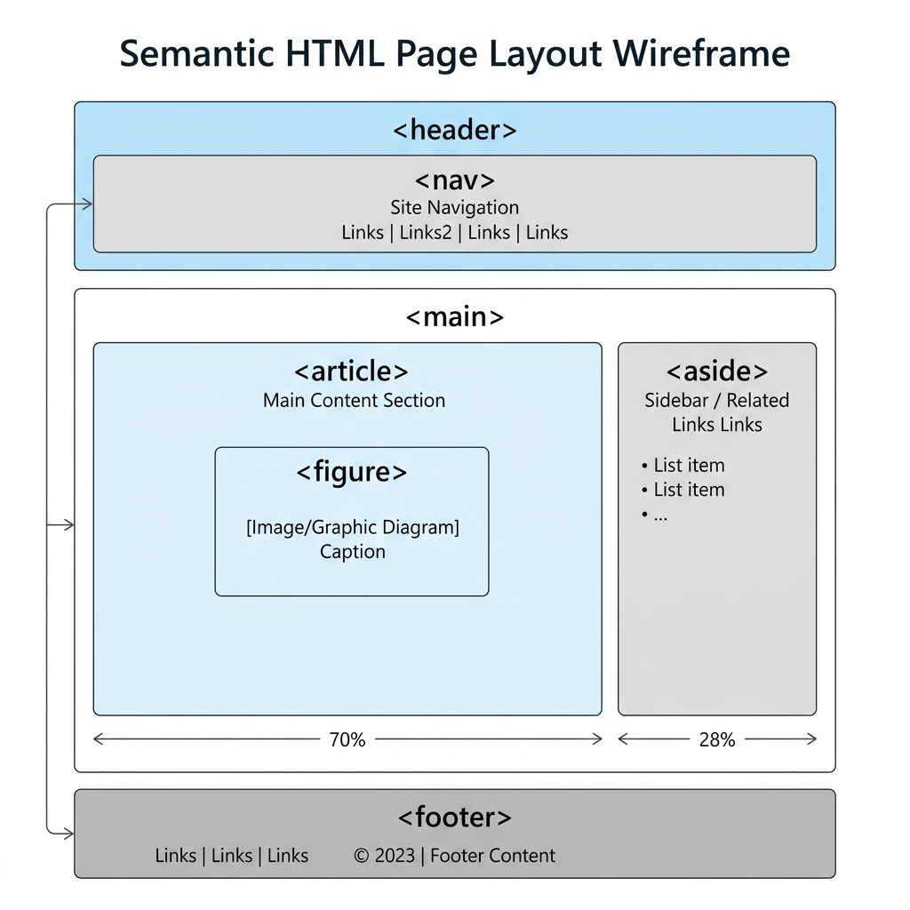

# Semantic HTML

Semantic HTML refers to using HTML tags that clearly describe their meaning (semantics) to both the browser and the developer, rather than relying on generic containers.

## Why Semantic HTML Matters

1. **Accessibility**: Screen readers can interpret the page structure and navigate it properly.
2. **SEO**: Search engines prioritize semantic structure to understand page content.
3. **Maintainability**: Code is cleaner and more readable.

## Structural Elements

| Tag | Purpose |
| :--- | :--- |
| `<header>` | Introductory content, logos, or primary navigation. |
| `<nav>` | A major block of navigation links. |
| `<main>` | The dominant, unique content of the page (only one per page). |
| `<article>` | A self-contained, independent piece of content (e.g., a blog post). |
| `<section>` | A thematic grouping of content, typically with a heading. |
| `<aside>` | Content tangentially related to the main content (e.g., a sidebar). |
| `<footer>` | Closing information, copyrights, or secondary links. |

## Content Elements

| Tag | Purpose |
| :--- | :--- |
| `<figure>` | Self-contained content like images, diagrams, or code blocks. |
| `<figcaption>` | A caption for a `<figure>`. |
| `<time>` | Represents a specific period in time or date. |
| `<address>` | Contact information for the author or owner of the document. |

## `<article>` vs `<section>`

- Use `<article>` when the content makes sense entirely on its own (like a newspaper article).
- Use `<section>` to group related content together into chapters or categories.

