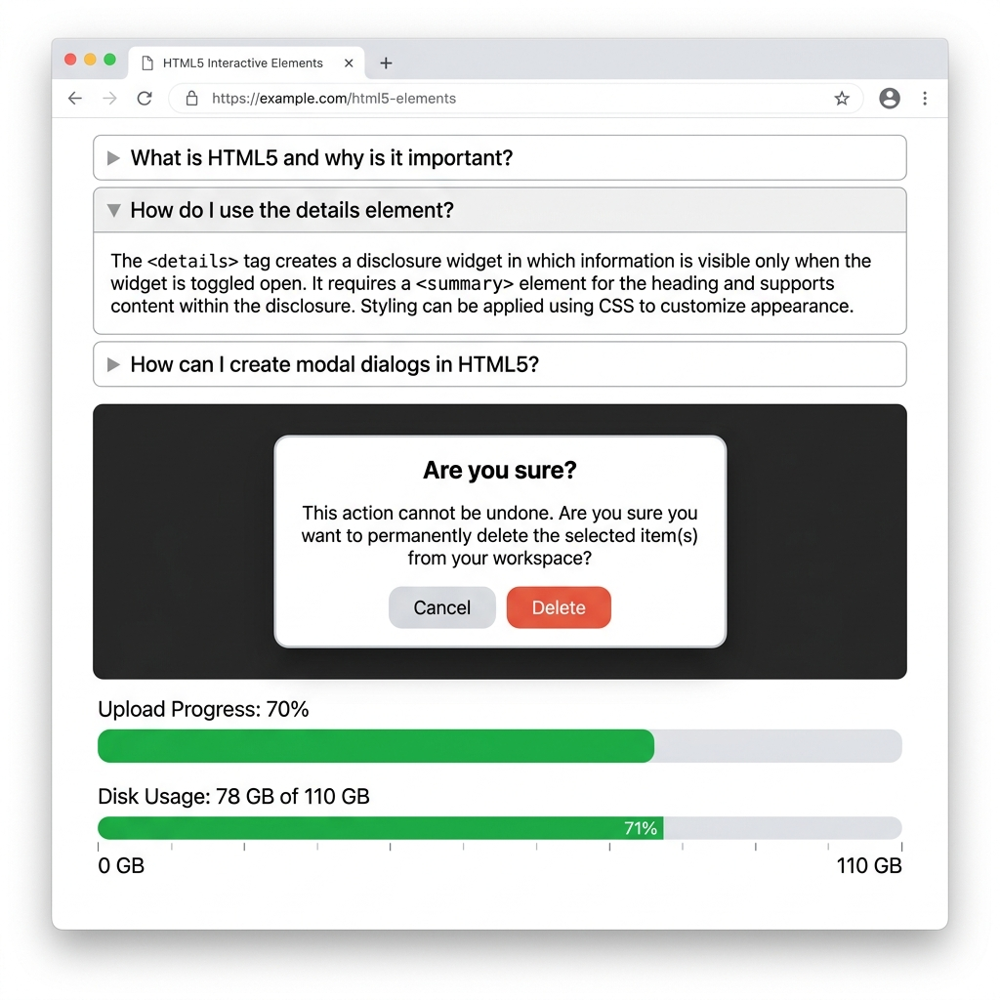

# HTML5 APIs & Advanced Elements

HTML5 introduced powerful native elements that previously required JavaScript or third-party libraries.

## Details & Summary (Accordion)

Creates an expandable/collapsible widget without JavaScript.

```html
<details>
    <summary>Click to expand</summary>
    <p>This content is hidden until the user clicks the summary.</p>
</details>

<!-- Add the 'open' attribute to expand by default -->
<details open>...</details>
```



## Dialog (`<dialog>`)

Creates native modal dialogs and popups. It includes built-in focus trapping and backdrop support.

```html
<dialog id="myModal">
    <h2>Native Modal</h2>
    <p>This traps focus and requires dismissal.</p>
    <form method="dialog">
        <button>Close</button>
    </form>
</dialog>

<!-- JavaScript to trigger the modal -->
<script>
    document.getElementById('myModal').showModal();
</script>
```
- `showModal()`: Opens as a modal (blocks background interaction).
- `<form method="dialog">`: A submit button inside this form automatically closes the dialog.

## Progress & Meter

| Element | Purpose | Example |
| :--- | :--- | :--- |
| `<progress>` | Indicates task completion (e.g., file upload). | `<progress value="50" max="100"></progress>` |
| `<meter>` | Indicates a scalar measurement within a known range (e.g., disk space). | `<meter value="0.6" min="0" max="1"></meter>` |

## Graphics (Canvas vs SVG)

| Tech | Definition | Best For |
| :--- | :--- | :--- |
| `<canvas>` | Bitmap rendering via JavaScript API. | High-performance drawing, games, dynamic charts. |
| `<svg>` | Vector graphics defined via XML markup. | Icons, logos, scalable diagrams. |

```html
<svg width="100" height="100">
    <circle cx="50" cy="50" r="40" fill="blue" />
</svg>
```

## Data Storage (Web Storage API)

Allows storing key-value pairs locally in the user's browser (replacing cookies for data storage). Data must be strings (use `JSON.stringify` for objects).

| Storage Type | Lifespan | Scope |
| :--- | :--- | :--- |
| `localStorage` | Persistent. Data remains until manually deleted. | All tabs of the same origin. |
| `sessionStorage` | Session. Data clears when the tab/window is closed. | Specific to the current tab. |

```javascript
// Save data
localStorage.setItem('username', 'Alice');

// Retrieve data
const name = localStorage.getItem('username');
```
