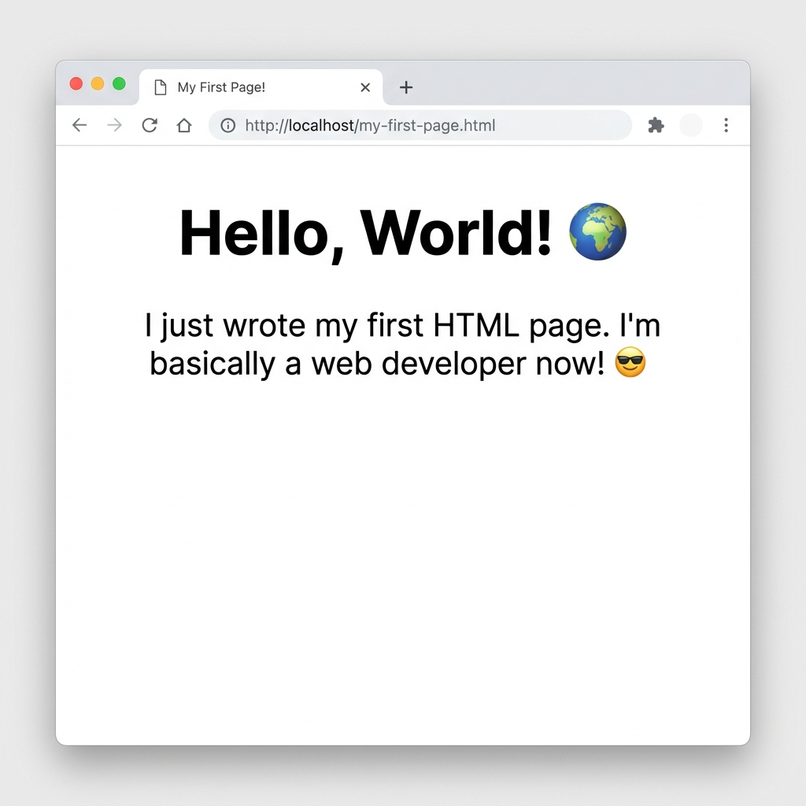

# HTML Document Structure

Every HTML document follows a standard structure that defines the metadata and visible content.

## The Blueprint

```html
<!DOCTYPE html>
<html lang="en">
<head>
    <meta charset="UTF-8">
    <meta name="viewport" content="width=device-width, initial-scale=1.0">
    <title>My Page</title>
</head>
<body>

    <h1>Hello, World! 🌍</h1>
    <p>I just wrote my first HTML page. I'm basically a web developer now! 😎</p>
</body>
</html>
```



## Document Elements

| Element | Description | Required |
| :--- | :--- | :--- |
| `<!DOCTYPE html>` | Tells the browser to use HTML5 standards. Must be the first line. | Yes |
| `<html>` | The root element wrapping all content. Use `lang` for language context. | Yes |
| `<head>` | Contains invisible metadata (character set, title, styles, scripts). | Yes |
| `<body>` | Contains all visible content (headings, text, images, forms). | Yes |

> [!WARNING]
> Omitting `<!DOCTYPE html>` causes browsers to render in "quirks mode", breaking modern layouts.

## Essential Meta Tags

Inside the `<head>` section, include these essential tags:

### Character Encoding
```html
<meta charset="UTF-8">
```
Ensures support for all global characters and emojis. Omitting this causes rendering issues for special characters.

### Viewport Configuration
```html
<meta name="viewport" content="width=device-width, initial-scale=1.0">
```
Forces the page to scale correctly on mobile devices.

### Page Title
```html
<title>My Page</title>
```
Sets the text shown in the browser tab, search engine results, and bookmarks.
