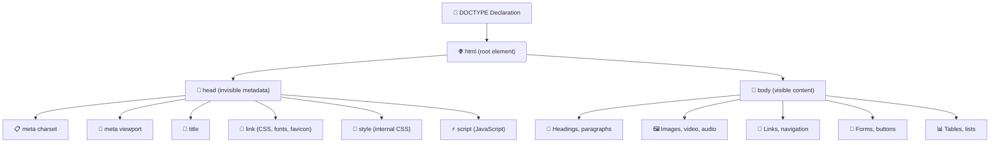
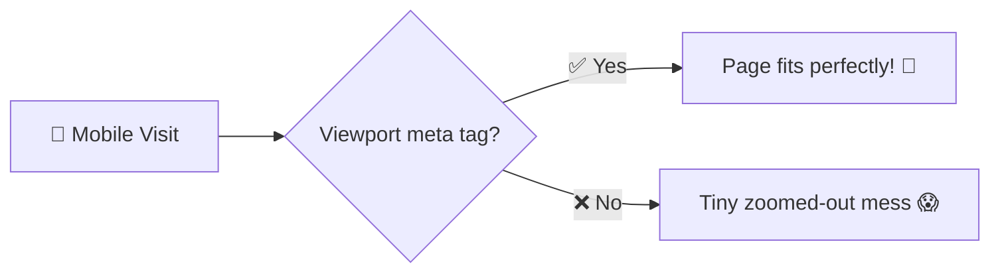
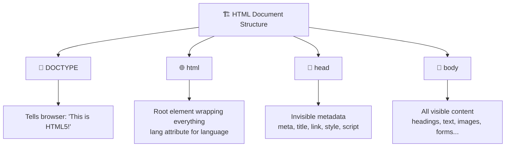

# 🏗️ HTML Document Structure

> **Alright, web architect!** 🏛️ Every building needs a blueprint, and every HTML page has one too! Before you start throwing tags around like confetti 🎊, you need to understand the **foundation** — the exact structure that every single webpage on the internet follows. Let's build from the ground up!

---

## 📋 The Blueprint

> [!NOTE]
> Every HTML page in existence follows the same basic structure. Whether it's Google's homepage or your personal blog — the skeleton is identical. Learn this once, and you'll know it forever!

Here's the complete blueprint of an HTML document:

```html
<!DOCTYPE html>
<html lang="en">
<head>
    <meta charset="UTF-8">
    <meta name="viewport" content="width=device-width, initial-scale=1.0">
    <title>My Awesome Page</title>
</head>
<body>
    <!-- Your visible content goes here! -->
    <h1>Hello, World! 🌍</h1>
    <p>This is my first webpage.</p>
</body>
</html>
```

> 🧃 **Kid version:** Think of an HTML page like a **letter** ✉️. Every letter has a format: an envelope (DOCTYPE), the paper inside (html), some hidden info like the address (head), and the actual message you read (body). You can't just scribble on a napkin and call it a letter! 😄

---

## 🔬 Breaking It Down Piece by Piece

Let's take apart every single line of that blueprint:

### 📄 `<!DOCTYPE html>` — The Declaration

```html
<!DOCTYPE html>
```

This is the very **first line** of every HTML page. It tells the browser:

> *"Hey browser! This document is written in HTML5. Please render it using modern standards!"*

| Fact | Detail 🎯 |
| :--- | :--- |
| **Required?** | ✅ Yes — always include it |
| **Is it a tag?** | ❌ Technically no — it's a *declaration* |
| **Case sensitive?** | ❌ `<!DOCTYPE html>`, `<!doctype html>` — both work |
| **Closing tag?** | ❌ No closing tag needed |
| **Where does it go?** | The **very first line** of your HTML file |

> [!WARNING]
> If you forget `<!DOCTYPE html>`, the browser enters **"quirks mode"** 😱 — it tries to render your page like it's 1999. Colors might look wrong, layouts might break, and you'll be very confused. Always include it!

> 🧠 **Think of it this way:** `<!DOCTYPE html>` is like the **cover page** of a book 📖. It doesn't have any content itself, but it tells the reader *"This is a novel, not a cookbook!"*

---

### 🌐 `<html>` — The Root Element

```html
<html lang="en">
    <!-- Everything else goes INSIDE here -->
</html>
```

The `<html>` tag is the **root** — the outermost container that wraps **everything** on the page. Think of it as the **outer walls** of a building 🏠.

| Attribute | What It Does 🎯 |
| :--- | :--- |
| `lang="en"` | Tells browsers and screen readers the page language is English 🇬🇧 |
| `lang="hi"` | Hindi 🇮🇳 |
| `lang="es"` | Spanish 🇪🇸 |
| `lang="fr"` | French 🇫🇷 |

> [!IMPORTANT]
> Always set the `lang` attribute! It helps:
> - 🔍 **Search engines** understand your content
> - ♿ **Screen readers** pronounce text correctly
> - 🌐 **Translation tools** know what language to translate from

---

### 🧠 `<head>` — The Invisible Brain

```html
<head>
    <meta charset="UTF-8">
    <meta name="viewport" content="width=device-width, initial-scale=1.0">
    <title>My Awesome Page</title>
</head>
```

The `<head>` section contains **metadata** — information *about* the page that the user **never sees** directly on screen. It's like the **backstage crew** 🎭 at a theater — invisible to the audience but essential for the show!

| Element | What It Does 🎯 | Analogy 🧠 |
| :--- | :--- | :--- |
| `<meta charset="UTF-8">` | Supports all languages & emojis 🌍 | Making sure the book can have 🇯🇵 Japanese AND 🇫🇷 French |
| `<meta name="viewport">` | Makes the page responsive on mobile 📱 | Adjusting font size so it reads well on any screen |
| `<title>` | Text shown on the browser tab | The name on the book's spine |
| `<link>` | Links to external CSS, fonts, favicon | Bringing in the costume designer 🎨 |
| `<style>` | Internal CSS styles | Quick outfit changes 👔 |
| `<script>` | Links to JavaScript | Hiring the stage crew for special effects ⚡ |

> 🧃 **Kid version:** The `<head>` is like the **table of contents** in a book 📚. You don't *read* it as part of the story, but it has super important info like the title, chapter list, and who wrote it!

---

### 👀 `<body>` — The Visible Content

```html
<body>
    <h1>Hello, World! 🌍</h1>
    <p>This is my first webpage.</p>
</body>
```

The `<body>` is where **all the action happens**! Everything the user can see and interact with goes here:

- 📰 Text (headings, paragraphs)
- 🖼️ Images and videos
- 🔗 Links
- 📝 Forms
- 📋 Lists and tables
- ...literally EVERYTHING visible!

> 🧠 **Think of it this way:** If the `<head>` is the backstage crew, then the `<body>` is the **stage itself** 🎭 — everything the audience sees, touches, and interacts with!

---

## 🗺️ The Complete Hierarchy

Here's how all the pieces fit together:



---

## 📏 The Meta Tags Explained

Let's zoom into the two most important `<meta>` tags:

### 🌍 Character Encoding — `charset`

```html
<meta charset="UTF-8">
```

**UTF-8** is a character encoding that supports virtually **every character in every language**, plus emojis! 🎉

| Encoding | What It Supports 🎯 |
| :--- | :--- |
| **ASCII** | Only English letters & basic symbols (old school 👴) |
| **UTF-8** ✅ | ALL languages + emojis + special symbols |
| **ISO-8859-1** | Western European languages only |

> [!CAUTION]
> If you skip `charset="UTF-8"`, characters like é, ñ, ü, 中文, العربية, and emojis 😊 might display as weird garbled text like `é` or `’`. Always include it!

### 📱 Viewport — Making It Mobile-Friendly

```html
<meta name="viewport" content="width=device-width, initial-scale=1.0">
```

This tag tells mobile browsers: *"Don't try to squeeze a desktop-sized page onto a tiny phone screen! Scale the content to fit the device's actual width."*

| Property | What It Does 🎯 |
| :--- | :--- |
| `width=device-width` | Page width = the device's screen width |
| `initial-scale=1.0` | Start at 100% zoom (no zooming in/out) |

> [!WARNING]
> Without this meta tag, your website will look **tiny and zoomed out** on mobile phones 📱. It's like trying to read a billboard through binoculars held backwards! 🔭



---

## 📌 The `<title>` Tag

```html
<title>My Awesome Page</title>
```

The `<title>` tag sets the text that appears in:

- 🏷️ The **browser tab**
- 🔍 **Search engine results** (the clickable blue link!)
- 📌 **Bookmarks** when someone saves your page
- 📱 **Social media** previews (if no Open Graph title is set)

> [!TIP]
> Write descriptive, unique titles for every page! Instead of "Home", try "WebDevNotes — Learn Web Development the Fun Way! 🚀". SEO loves good titles!

---

## 🏗️ Putting It All Together — A Real Example

Here's a more complete HTML document with all the essential pieces:

```html
<!DOCTYPE html>
<html lang="en">
<head>
    <!-- Character encoding -->
    <meta charset="UTF-8">
    
    <!-- Mobile responsive -->
    <meta name="viewport" content="width=device-width, initial-scale=1.0">
    
    <!-- SEO meta tags -->
    <meta name="description" content="Learn HTML the fun and easy way!">
    <meta name="author" content="Your Name">
    
    <!-- Page title -->
    <title>Learn HTML — The Fun Way! 🎉</title>
    
    <!-- Favicon (tiny tab icon) -->
    <link rel="icon" href="favicon.ico">
    
    <!-- External CSS -->
    <link rel="stylesheet" href="styles.css">
</head>
<body>
    <h1>Welcome to My Website! 🌍</h1>
    <p>This is a properly structured HTML page.</p>
    <p>Everything in the head is invisible.</p>
    <p>Everything in the body is what you see right now!</p>
</body>
</html>
```

> 💡 **Notice how the HTML comments** (`<!-- -->`) explain each section? That's good practice! Comments help future-you (and other developers) understand what's going on.

---

## 🎯 Quick Recap



> [!TIP]
> **You now know the blueprint every webpage follows!** 🎉 DOCTYPE → html → head + body. That's the skeleton. Every fancy website you've ever seen starts exactly like this. Next up: let's learn about **HTML tags and elements** — the building blocks you'll use to fill in this blueprint! 🏷️

---

*Made with ❤️ for future web developers who like things explained the fun way!*
