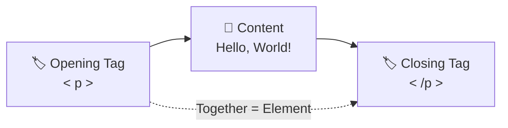
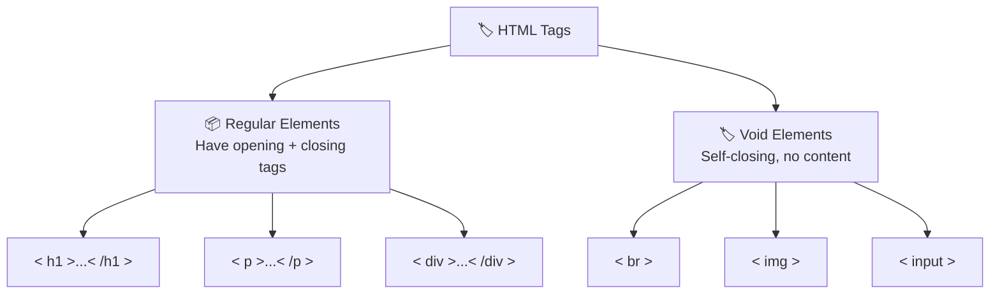
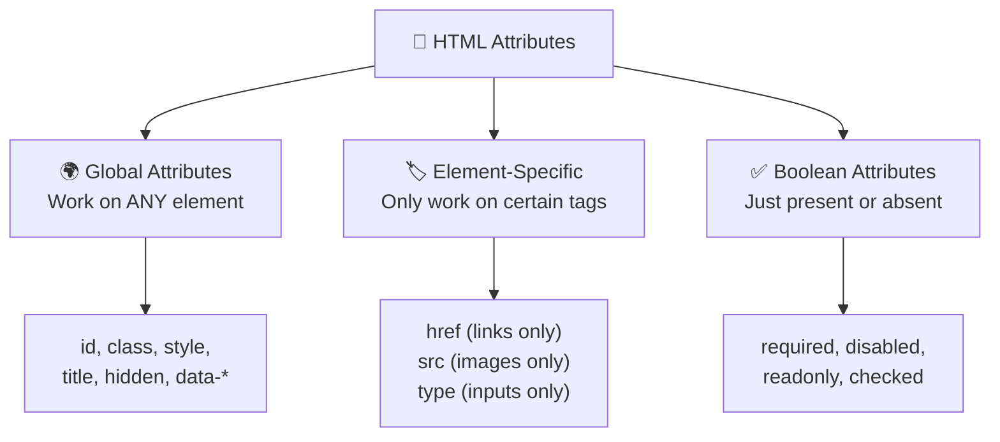
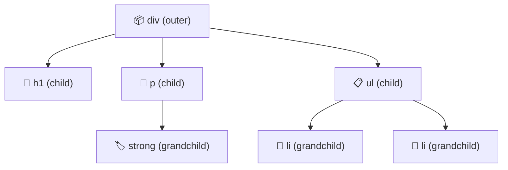
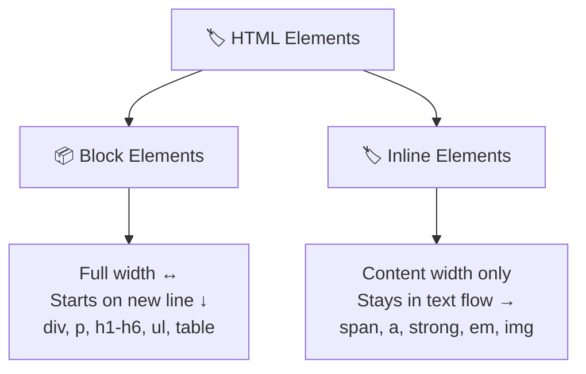
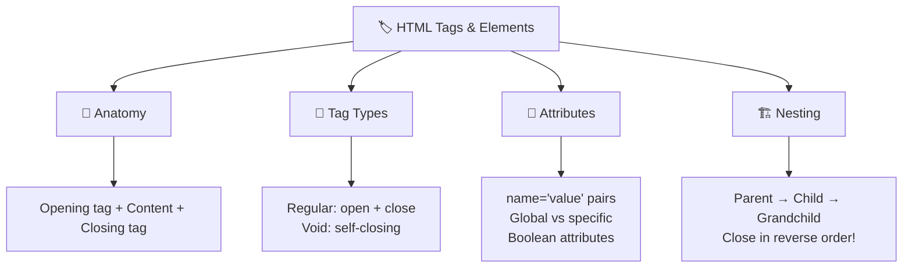

# 🏷️ HTML Tags & Elements

> **Welcome back, tag master!** 🎯 Tags are the **bread and butter** of HTML — they're literally how you "talk" to the browser. Every heading, every paragraph, every image, every link — it all starts with a tag. Let's master them once and for all! 💪

---

## 🔬 Anatomy of an HTML Element

> [!NOTE]
> An **HTML element** is the complete package: the opening tag + content + closing tag. A **tag** is just the label part (`<p>` or `</p>`). People often use "tag" and "element" interchangeably, but technically they're different!

Here's the full anatomy:

```html
<p class="intro">Hello, World!</p>
 ↑       ↑            ↑         ↑
 |   attribute     content   closing tag
 opening tag
```

Let's break this down:

| Part | What It Is 🎯 | Example |
| :--- | :--- | :--- |
| **Opening Tag** | Starts the element | `<p>` |
| **Closing Tag** | Ends the element (has a `/`) | `</p>` |
| **Content** | The stuff between the tags | `Hello, World!` |
| **Attribute** | Extra info about the element | `class="intro"` |
| **Element** | The whole thing together | `<p class="intro">Hello, World!</p>` |



> 🧃 **Kid version:** An HTML element is like a **sandwich** 🥪. The opening tag is the top bread, the closing tag is the bottom bread, and the content is the yummy stuff in the middle! The attribute? That's the label that says what kind of sandwich it is! 😋

---

## 📂 Opening & Closing Tags

Most HTML elements have **two** tags — an opening and a closing:

```html
<!-- The opening tag starts it -->
<h1>I am a heading</h1>
<!-- The closing tag ends it (notice the /) -->

<p>I am a paragraph</p>
<strong>I am bold text</strong>
<em>I am italic text</em>
<a href="https://google.com">I am a link</a>
```

> [!IMPORTANT]
> **The closing tag always has a forward slash** `/` before the tag name: `</h1>`, `</p>`, `</strong>`. If you forget the closing tag, the browser might get confused about where the element ends!

### What Happens Without Closing Tags?

```html
<!-- ❌ Forgot to close the bold tag -->
<p><strong>This is bold but when does it end?
<p>Is this paragraph also bold? Maybe! The browser has to guess! 😱</p>

<!-- ✅ Properly closed -->
<p><strong>This is bold</strong> and this is not.</p>
<p>This paragraph is perfectly normal! ✅</p>
```

> [!WARNING]
> Modern browsers are very forgiving and will *try* to fix your mistakes. But don't rely on that! Always close your tags. What works in Chrome might break in another browser. Write clean HTML! 🧹

---

## 🚪 Self-Closing Tags (Void Elements)

Some HTML elements **don't have** any content between tags, so they don't need a closing tag. These are called **void elements** or **self-closing tags**:

```html
<br>        <!-- Line break — forces text to the next line -->
<hr>        <!-- Horizontal rule — draws a line across the page -->
       <!-- Image — displays a picture -->
<input>     <!-- Form input — text box, checkbox, etc. -->
<meta>      <!-- Metadata — info about the page -->
<link>      <!-- External resource — CSS files, fonts -->
<source>    <!-- Media source — for audio/video -->
<area>      <!-- Clickable area in an image map -->
<col>       <!-- Column properties in a table -->
<embed>     <!-- External content plugin -->
<wbr>       <!-- Word break opportunity -->
```

### Complete Self-Closing Tags Reference

| Tag | Purpose 🎯 | Common Attributes |
| :--- | :--- | :--- |
| `<br>` | Line break | None |
| `<hr>` | Horizontal divider line | None |
| `` | Display an image | `src`, `alt`, `width`, `height` |
| `<input>` | Form input field | `type`, `name`, `value`, `placeholder` |
| `<meta>` | Page metadata | `charset`, `name`, `content` |
| `<link>` | External resources | `rel`, `href`, `type` |
| `<source>` | Media sources | `src`, `type`, `media` |
| `<embed>` | Embedded content | `src`, `type`, `width`, `height` |
| `<wbr>` | Word break hint | None |

> 🧠 **Think of it this way:** Regular elements are like **boxes** 📦 — they hold stuff inside. Self-closing tags are like **stickers** 🏷️ — they just *exist* at a spot, they don't contain anything!



> [!TIP]
> You might see self-closing tags written as `<br />` or `` with a trailing slash. Both `<br>` and `<br />` are valid in HTML5. The slash is optional but some developers prefer it for clarity!

---

## 🎨 Attributes — Adding Extra Info

Attributes give **additional information** to an element. They always go inside the **opening tag** and follow the format `name="value"`:

```html
<a href="https://google.com" target="_blank" title="Go to Google">
    Click me!
</a>
```

### Attribute Rules

| Rule | Example ✅ | Wrong ❌ |
| :--- | :--- | :--- |
| Always in the opening tag | `<p class="intro">` | `<p>class="intro"` |
| Name-value pairs | `href="url"` | `href:url` |
| Values in quotes | `class="main"` | `class=main` (works but risky) |
| Multiple attributes = space-separated | `` | `` |
| Attribute names are lowercase | `class="hero"` | `CLASS="hero"` (works but bad practice) |

### Types of Attributes



### Boolean Attributes — A Special Case

Some attributes don't need a value — just being *present* is enough:

```html
<!-- These are boolean attributes — just being there means "true" -->
<input type="text" required>          <!-- Field must be filled -->
<input type="text" disabled>          <!-- Field is grayed out -->
<input type="checkbox" checked>       <!-- Checkbox is pre-selected -->
<video controls autoplay muted>       <!-- Video has controls, autoplays, is muted -->
<details open>                        <!-- Details section is expanded -->
```

> 💡 Writing `required="required"` or `required=""` or just `required` — they all mean the same thing! Most developers just write `required` because it's shorter.

---

## 🏗️ Nesting Elements — Tags Inside Tags

HTML elements can go **inside** other elements. This is called **nesting**:

```html
<!-- ✅ Properly nested -->
<div>
    <h1>Welcome!</h1>
    <p>This is a <strong>very important</strong> paragraph.</p>
    <ul>
        <li>Item 1</li>
        <li>Item 2</li>
    </ul>
</div>
```

### Nesting Rules

> [!CAUTION]
> Tags must be closed in the **reverse order** they were opened — like Russian nesting dolls 🪆!

```html
<!-- ✅ Correct — closed in reverse order -->
<p><strong><em>Bold and italic</em></strong></p>

<!-- ❌ Wrong — tags overlap! -->
<p><strong><em>Bold and italic</strong></em></p>
```



### Parent, Child, and Sibling Relationships

| Relationship | What It Means 🎯 | Example |
| :--- | :--- | :--- |
| **Parent** | The outer element | `<div>` is parent of `<p>` |
| **Child** | The inner element | `<p>` is child of `<div>` |
| **Sibling** | Elements at the same level | `<h1>` and `<p>` inside the same `<div>` |
| **Descendant** | Any element nested inside (at any depth) | `<strong>` inside `<p>` inside `<div>` |

> 🧠 **Think of it this way:** It's a **family tree** 🌳! The `<html>` element is the great-grandparent, `<body>` is the grandparent, `<div>` is the parent, and `<p>` is the child. Everyone has their place in the hierarchy!

---

## 💬 HTML Comments

Comments let you leave **notes in your code** that the browser completely ignores. They won't show up on the webpage:

```html
<!-- This is a comment — the browser ignores it! -->

<!-- 
    Multi-line comments work too!
    Great for explaining complex sections.
    Or temporarily hiding code while debugging.
-->

<h1>This is visible</h1>
<!-- <p>This paragraph is hidden because it's inside a comment!</p> -->
<p>This is also visible</p>
```

> [!TIP]
> Use comments to:
> - 📝 Explain what a section of code does
> - 🐛 Temporarily hide code while debugging
> - 👥 Leave notes for other developers (or future you!)
> - 📋 Mark sections: `<!-- HEADER SECTION -->` ... `<!-- END HEADER -->`

---

## 📐 Block vs Inline Elements

Every HTML element is either **block-level** or **inline**:

| Type | Behavior 🎯 | Examples |
| :--- | :--- | :--- |
| **Block** 📦 | Takes **full width**, starts on a **new line** | `<div>`, `<p>`, `<h1>`-`<h6>`, `<ul>`, `<table>`, `<form>` |
| **Inline** 🏷️ | Only takes **as much width as needed**, stays **in the flow** | `<span>`, `<a>`, `<strong>`, `<em>`, ``, `<code>` |

```html
<!-- Block elements — each starts on a new line -->
<h1>I'm a block element</h1>
<p>I'm also block — I take the full width!</p>

<!-- Inline elements — they flow with text -->
<p>This has <strong>bold</strong> and <em>italic</em> and a <a href="#">link</a> — all inline!</p>
```



> 🧃 **Kid version:** Block elements are like **bricks** 🧱 — they stack on top of each other. Inline elements are like **words** in a sentence — they sit side by side! 📝

---

## 🎯 Quick Recap



> [!TIP]
> **You now understand the fundamental building blocks of HTML!** 🎉 Tags, elements, attributes, nesting, block vs inline — these concepts apply to EVERY tag you'll ever learn. Next up: let's explore **text content tags** — headings, paragraphs, and all the ways to format text! 📰

---

*Made with ❤️ for future web developers who like things explained the fun way!*
