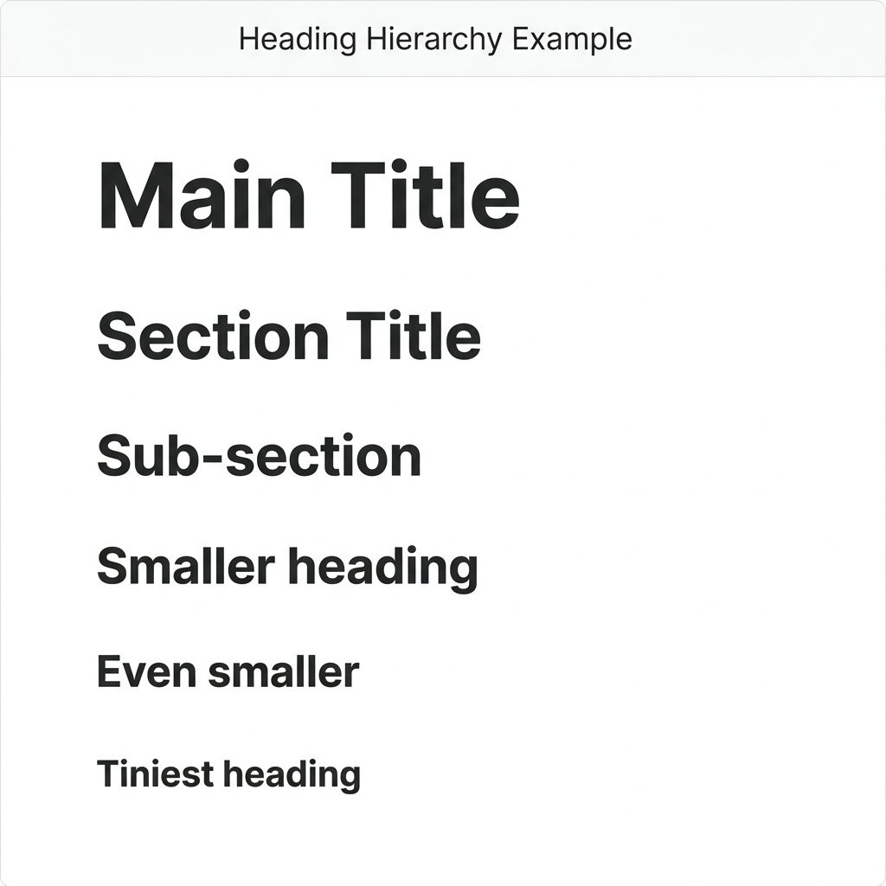
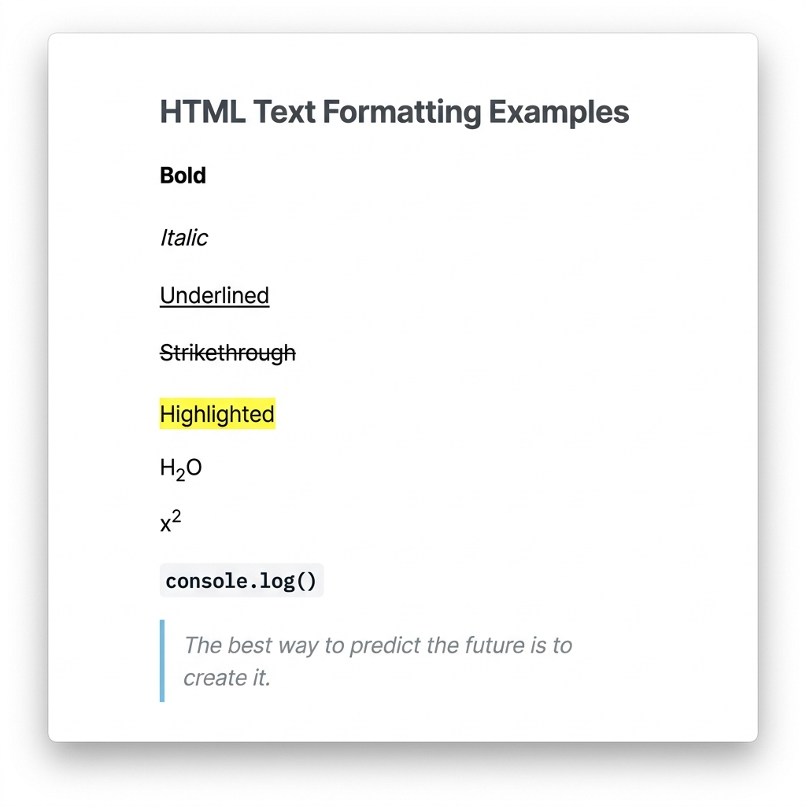

# Text Content Tags

## Headings

Headings establish a document's semantic hierarchy.

```html
<h1>Main Title</h1>
<h2>Section Title</h2>
<h3>Sub-section</h3>
<h4>Smaller heading</h4>
<h5>Even smaller</h5>
<h6>Tiniest heading</h6>
```



| Tag | Usage |
| :--- | :--- |
| `<h1>` | Main page title. **Use exactly one per page.** |
| `<h2>` | Major section headers. |
| `<h3>` - `<h6>` | Sub-sections. |

> [!WARNING]
> Never skip heading levels (e.g., jumping from `<h1>` to `<h3>`). Screen readers rely on logical heading order.

## Paragraphs & Line Breaks

### Paragraphs (`<p>`)
Creates a block of text with automatic top/bottom spacing.
```html
<p>This is a paragraph.</p>
```

### Line Breaks (`<br>`)
Forces a line break within text without starting a new block.
```html
<p>Line one<br>Line two</p>
```

### Horizontal Rule (`<hr>`)
Draws a thematic break (horizontal line).
```html
<hr>
```

## Text Formatting

HTML provides tags for inline text formatting.

```html
<p><b>Bold</b> text</p>
<p><i>Italic</i> text</p>
<p><u>Underlined</u> text</p>
<p><s>Strikethrough</s> text</p>
<p><mark>Highlighted</mark> text</p>
```



### Semantic vs Visual Tags

Prefer semantic tags over purely visual tags, as screen readers recognize them.

| Semantic Tag | Visual Equivalent | Meaning |
| :--- | :--- | :--- |
| `<strong>` | `<b>` | Indicates strong importance |
| `<em>` | `<i>` | Indicates emphasized text |

## Quotes & Code

### Blockquotes (`<blockquote>`)
For quoting external sources.
```html
<blockquote cite="https://example.com">
    "Quoted text goes here."
</blockquote>
```

### Inline Code (`<code>`)
For code snippets.
```html
<p>Run <code>npm install</code></p>
```

### Preformatted Text (`<pre>`)
Preserves exact spacing and line breaks.
```html
<pre>
  Line 1
    Line 2 (indented)
</pre>
```

## Abbreviations & Definitions

### Abbreviations (`<abbr>`)
Displays a tooltip on hover.
```html
<abbr title="HyperText Markup Language">HTML</abbr>
```
