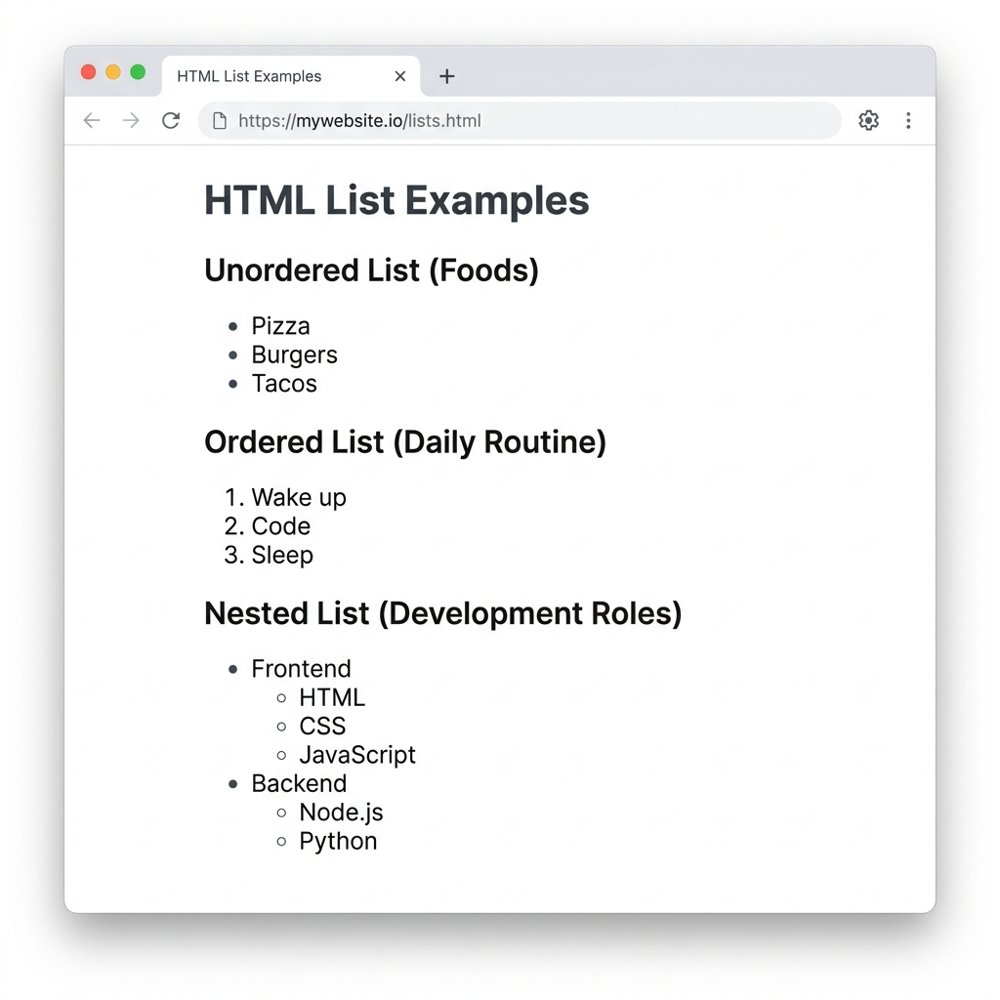

# Lists

HTML supports three primary types of lists: Unordered, Ordered, and Description lists.

## Unordered Lists (`<ul>`)

Used when the order of items does not matter. Displayed with bullet points.

```html
<ul>
    <li>Item 1</li>
    <li>Item 2</li>
    <li>Item 3</li>
</ul>
```

## Ordered Lists (`<ol>`)

Used when the sequence of items matters. Displayed with numbers or letters.

```html
<ol>
    <li>First step</li>
    <li>Second step</li>
    <li>Third step</li>
</ol>
```

### Ordered List Attributes

| Attribute | Effect | Example |
| :--- | :--- | :--- |
| `type` | Changes numbering style (`1`, `A`, `a`, `I`, `i`) | `<ol type="A">` |
| `start` | Starts counting from a specific number | `<ol start="5">` |
| `reversed` | Counts backwards | `<ol reversed>` |

## Description Lists (`<dl>`)

Used for term-definition pairs, such as glossaries or FAQs.

```html
<dl>
    <dt>HTML</dt>
    <dd>HyperText Markup Language</dd>
    
    <dt>CSS</dt>
    <dd>Cascading Style Sheets</dd>
</dl>
```

- `<dl>`: Description List (container)
- `<dt>`: Description Term
- `<dd>`: Description Definition

## Nested Lists

Lists can be placed inside other lists to create hierarchical structures. Bullet styles typically change automatically at deeper levels.

```html
<ul>
    <li>Frontend
        <ul>
            <li>HTML</li>
            <li>CSS</li>
        </ul>
    </li>
    <li>Backend</li>
</ul>
```


