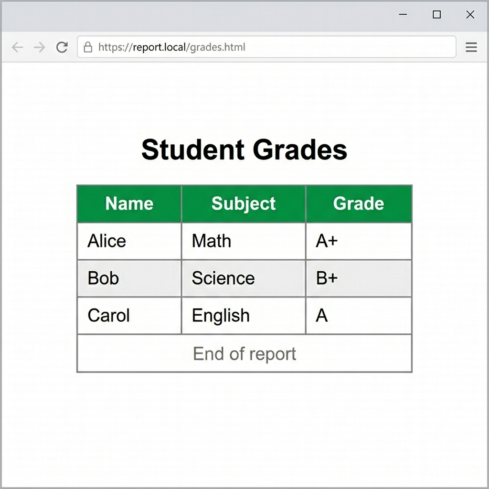

# Tables

> [!CAUTION]
> Tables must only be used to display tabular data (rows and columns). Do not use tables for page layout structure.

## Basic Structure

A basic table consists of a `<table>` container, `<tr>` (rows), `<th>` (header cells), and `<td>` (data cells).

```html
<table>
    <tr>
        <th>Name</th>
        <th>Age</th>
    </tr>
    <tr>
        <td>Alice</td>
        <td>25</td>
    </tr>
</table>
```

## Advanced Table Sections

For complex tables, use structural section tags: `<thead>`, `<tbody>`, and `<tfoot>`.

```html
<table>
    <caption>Student Grades</caption>
    <thead>
        <tr>
            <th>Name</th>
            <th>Subject</th>
            <th>Grade</th>
        </tr>
    </thead>
    <tbody>
        <tr>
            <td>Alice</td>
            <td>Math</td>
            <td>A</td>
        </tr>
        <tr>
            <td>Bob</td>
            <td>Science</td>
            <td>B</td>
        </tr>
    </tbody>
    <tfoot>
        <tr>
            <td colspan="3">Class Average: B+</td>
        </tr>
    </tfoot>
</table>
```



## Merging Cells (Colspan & Rowspan)

### Colspan (Horizontal Merge)
Spans a cell across multiple columns.
```html
<td colspan="2">Spans two columns</td>
```

### Rowspan (Vertical Merge)
Spans a cell across multiple rows.
```html
<td rowspan="2">Spans two rows</td>
```

## Accessibility

Screen readers need context to understand table layouts. Use the `scope` attribute on headers to clarify relationships.

```html
<th scope="col">Header for column</th>
<th scope="row">Header for row</th>
```
