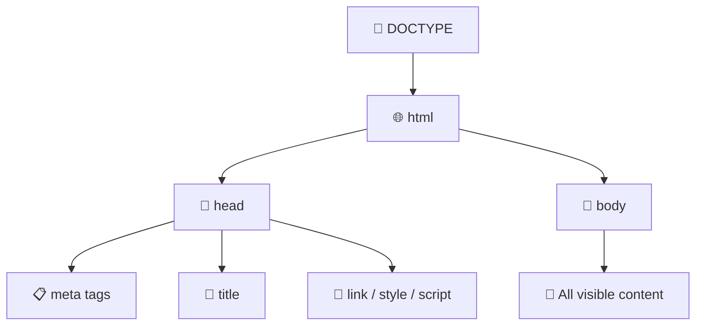
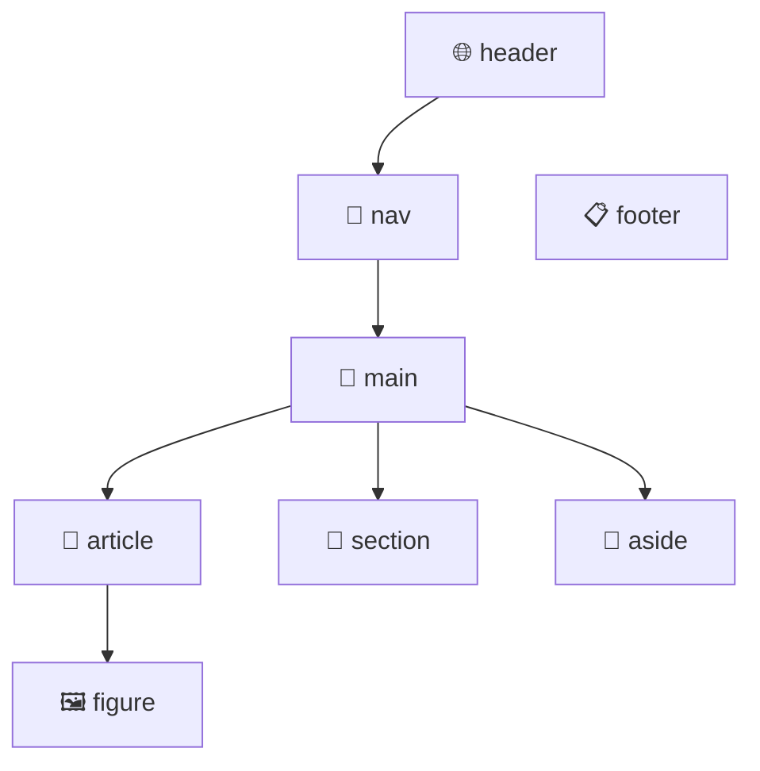
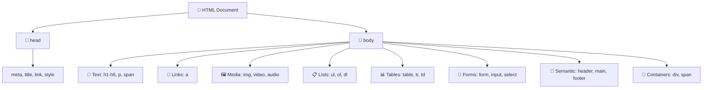

# 📝 Complete HTML Guide for Web Developers

> **Welcome back, web wizard!** 🧙‍♂️ HTML is the **skeleton** of every webpage. Without it, there's literally *nothing* on the screen. Think of HTML as the **building blocks** 🧱 — like LEGO for websites! Let's learn it ALL.

---

## 1. 🤔 What Even IS HTML?

> [!NOTE]
> **HTML** stands for **HyperText Markup Language**. It's NOT a programming language — it's a *markup* language. It tells the browser **what** things are, not *how* they behave.

- **HyperText** 🔗 — Text that links to other text (hello, clickable links!)
- **Markup** 🏷️ — You're "marking up" content with labels like *"this is a heading"*, *"this is a paragraph"*, *"this is an image"*
- **Language** 💬 — It has rules and syntax, just like English or Spanish

> 🧃 **Kid version:** HTML is like putting **name tags** on everything. You slap a tag on some text that says "I'm a heading!" and the browser goes *"Got it, I'll make you big and bold!"*

---

## 2. 🏗️ HTML Document Structure

Every single HTML page follows this **blueprint**:

```html
<!DOCTYPE html>
<html lang="en">
<head>
    <meta charset="UTF-8">
    <meta name="viewport" content="width=device-width, initial-scale=1.0">
    <title>My Awesome Page</title>
</head>
<body>
    <!-- Your visible content goes here! -->
    <h1>Hello, World! 🌍</h1>
    <p>This is my first webpage.</p>
</body>
</html>
```

Let's break it down piece by piece:

| Part | What It Does 🎯 | Analogy 🧠 |
| :--- | :--- | :--- |
| `<!DOCTYPE html>` | Tells the browser *"Hey, this is an HTML5 document!"* | The cover page of a book 📖 |
| `<html>` | The root — wraps EVERYTHING | The book itself |
| `<head>` | Invisible info — metadata, title, links to CSS | The table of contents (you don't *see* it on the page) |
| `<body>` | All the VISIBLE stuff on the page | The actual pages of the book |
| `<meta charset="UTF-8">` | Supports all languages & emojis | Making sure the book can have 🇯🇵 Japanese AND 🇫🇷 French |
| `<meta name="viewport">` | Makes the page responsive on mobile | Adjusting font size so it reads well on any device 📱 |
| `<title>` | Text shown on the browser tab | The name on the book's spine |



---

## 3. 🏷️ HTML Tags & Elements — The Basics

> [!IMPORTANT]
> Tags are the **bread and butter** of HTML. Almost every tag has an **opening** and **closing** tag.

### Anatomy of an Element

```html
<p class="intro">Hello, World!</p>
 ↑       ↑            ↑         ↑
 |   attribute     content   closing tag
 opening tag
```

- **Opening Tag** → `<p>` — starts the element
- **Closing Tag** → `</p>` — ends it (notice the `/`)
- **Content** → the stuff between the tags
- **Attributes** → extra info like `class`, `id`, `src`, `href`

### Self-Closing Tags 🚪

Some tags don't need a closing partner — they're loners 😎:

```html
<br>      <!-- Line break -->
<hr>      <!-- Horizontal rule (a line across the page) -->
     <!-- Image -->
<input>   <!-- Form input -->
<meta>    <!-- Metadata -->
<link>    <!-- External resource link -->
```

---

## 4. 📰 Text Content Tags

### Headings — `<h1>` to `<h6>`

Think of headings like a **book outline** 📚. `<h1>` is the biggest (main title), `<h6>` is the smallest.

```html
<h1>🏆 Main Title (Use only ONE per page!)</h1>
<h2>📌 Section Title</h2>
<h3>📎 Sub-section</h3>
<h4>Smaller heading</h4>
<h5>Even smaller</h5>
<h6>Tiniest heading</h6>
```

> [!WARNING]
> **Never skip heading levels!** Don't jump from `<h1>` to `<h4>`. Go in order: `h1 → h2 → h3`. Screen readers and SEO depend on this!

### Paragraphs & Line Breaks

```html
<p>This is a paragraph. The browser adds space above and below it.</p>
<p>This is another paragraph. See the gap? 👆</p>

<p>Want a break<br>inside a paragraph? Use br!</p>
```

### Text Formatting Tags

| Tag | What It Does | Example Output |
| :--- | :--- | :--- |
| `<strong>` | **Bold** (important text) | **This is important** |
| `<em>` | *Italic* (emphasized text) | *This is emphasized* |
| `<u>` | Underlined text | <u>Underlined</u> |
| `<s>` | ~~Strikethrough~~ | ~~Wrong answer~~ |
| `<mark>` | Highlighted text 🟡 | Like a highlighter pen |
| `<small>` | Smaller text | Fine print |
| `<sub>` | Subscript | H₂O |
| `<sup>` | Superscript | x² |
| `<code>` | Inline code | `console.log()` |
| `<pre>` | Preformatted text | Preserves spaces & line breaks |
| `<blockquote>` | Quoted text block | Indented quote |
| `<abbr>` | Abbreviation with tooltip | `<abbr title="HyperText Markup Language">HTML</abbr>` |

```html
<p><strong>Bold</strong> and <em>italic</em> and <mark>highlighted</mark>!</p>
<p>Water is H<sub>2</sub>O and area is r<sup>2</sup></p>
<p><code>console.log("hello")</code> is JavaScript</p>

<blockquote>
    "The best way to predict the future is to create it." — Abraham Lincoln
</blockquote>
```

---

## 5. 🔗 Links (Anchor Tags)

> Links are the **superpower** of the web — they connect everything together! 🕸️

```html
<!-- Basic link -->
<a href="https://google.com">Go to Google</a>

<!-- Open in new tab -->
<a href="https://google.com" target="_blank" rel="noopener noreferrer">
    Google (new tab) 🆕
</a>

<!-- Link to a section on the same page -->
<a href="#section2">Jump to Section 2 ⬇️</a>

<!-- Email link -->
<a href="mailto:hello@example.com">Send me an email 📧</a>

<!-- Phone link -->
<a href="tel:+1234567890">Call me! 📞</a>

<!-- Download link -->
<a href="/files/resume.pdf" download>Download my resume 📄</a>
```

### Link Attributes Cheat Sheet

| Attribute | What It Does 🎯 |
| :--- | :--- |
| `href` | The URL to go to (required!) |
| `target="_blank"` | Opens link in a new tab |
| `rel="noopener noreferrer"` | Security fix for `target="_blank"` |
| `download` | Downloads the file instead of opening it |
| `title` | Tooltip text on hover |

---

## 6. 🖼️ Images & Media

### Images

```html
<!-- Basic image -->


<!-- Image from the internet -->

```

> [!CAUTION]
> **ALWAYS include the `alt` attribute!** It describes the image for screen readers (accessibility ♿) and shows text if the image fails to load. Never leave it empty unless the image is purely decorative.

### Picture Element (Responsive Images)

```html
<picture>
    <source media="(min-width: 800px)" srcset="large.jpg">
    <source media="(min-width: 400px)" srcset="medium.jpg">
    
</picture>
```

### Figure & Figcaption

```html
<figure>
    
    <figcaption>📊 Fig 1: Sales growth over the year</figcaption>
</figure>
```

### Audio 🎵

```html
<audio controls>
    <source src="song.mp3" type="audio/mpeg">
    <source src="song.ogg" type="audio/ogg">
    Your browser doesn't support audio 😢
</audio>
```

### Video 🎬

```html
<video controls width="600" poster="thumbnail.jpg">
    <source src="video.mp4" type="video/mp4">
    <source src="video.webm" type="video/webm">
    Your browser doesn't support video 😢
</video>
```

### Embedding (YouTube, Maps, etc.) 🗺️

```html
<iframe 
    src="https://www.youtube.com/embed/VIDEO_ID" 
    width="560" height="315" 
    title="YouTube video"
    allowfullscreen>
</iframe>
```

---

## 7. 📋 Lists

### Unordered List (bullets) •

```html
<ul>
    <li>🍕 Pizza</li>
    <li>🍔 Burger</li>
    <li>🌮 Taco</li>
</ul>
```

### Ordered List (numbers) 1️⃣

```html
<ol>
    <li>Wake up ☀️</li>
    <li>Code 💻</li>
    <li>Sleep 😴</li>
</ol>

<!-- Start from a different number -->
<ol start="5" type="A">
    <li>This is E</li>
    <li>This is F</li>
</ol>
```

### Nested Lists 📂

```html
<ul>
    <li>Frontend
        <ul>
            <li>HTML</li>
            <li>CSS</li>
            <li>JavaScript</li>
        </ul>
    </li>
    <li>Backend
        <ul>
            <li>Node.js</li>
            <li>Python</li>
        </ul>
    </li>
</ul>
```

### Description List

```html
<dl>
    <dt><strong>HTML</strong></dt>
    <dd>The structure of a webpage 🏗️</dd>

    <dt><strong>CSS</strong></dt>
    <dd>The styling and design 🎨</dd>

    <dt><strong>JavaScript</strong></dt>
    <dd>The interactivity and logic ⚡</dd>
</dl>
```

---

## 8. 📊 Tables

> Tables are for **data**, NOT for page layout! (That's CSS's job 😤)

```html
<table>
    <caption>🏆 Student Grades</caption>
    <thead>
        <tr>
            <th>Name</th>
            <th>Subject</th>
            <th>Grade</th>
        </tr>
    </thead>
    <tbody>
        <tr>
            <td>Alice</td>
            <td>Math</td>
            <td>A+ ⭐</td>
        </tr>
        <tr>
            <td>Bob</td>
            <td>Science</td>
            <td>B+</td>
        </tr>
    </tbody>
    <tfoot>
        <tr>
            <td colspan="3">End of report 📋</td>
        </tr>
    </tfoot>
</table>
```

### Table Tags Breakdown

| Tag | Purpose 🎯 |
| :--- | :--- |
| `<table>` | The table container |
| `<caption>` | Title of the table |
| `<thead>` | Header section |
| `<tbody>` | Body/data section |
| `<tfoot>` | Footer section |
| `<tr>` | Table **row** |
| `<th>` | Table **header cell** (bold, centered) |
| `<td>` | Table **data cell** |
| `colspan="2"` | Cell spans 2 columns →→ |
| `rowspan="2"` | Cell spans 2 rows ↓↓ |

---

## 9. 📝 Forms — Getting User Input

> [!NOTE]
> Forms are how you **collect data** from users — login pages, search bars, surveys, you name it!

### Basic Form Structure

```html
<form action="/submit" method="POST">
    <label for="username">👤 Username:</label>
    <input type="text" id="username" name="username" placeholder="Enter your name" required>

    <label for="email">📧 Email:</label>
    <input type="email" id="email" name="email" required>

    <label for="password">🔒 Password:</label>
    <input type="password" id="password" name="password" minlength="8" required>

    <button type="submit">Submit 🚀</button>
</form>
```

### All Input Types — The Complete List! 📦

| Input Type | What It Creates 🎯 | Code |
| :--- | :--- | :--- |
| `text` | Single-line text box | `<input type="text">` |
| `email` | Email field (validates @) | `<input type="email">` |
| `password` | Hidden-character field | `<input type="password">` |
| `number` | Number spinner | `<input type="number" min="0" max="100">` |
| `tel` | Phone number | `<input type="tel">` |
| `url` | URL field | `<input type="url">` |
| `date` | Date picker 📅 | `<input type="date">` |
| `time` | Time picker ⏰ | `<input type="time">` |
| `datetime-local` | Date + time | `<input type="datetime-local">` |
| `color` | Color picker 🎨 | `<input type="color">` |
| `range` | Slider bar | `<input type="range" min="0" max="100">` |
| `file` | File upload 📁 | `<input type="file" accept=".pdf,.jpg">` |
| `checkbox` | Tick box ☑️ | `<input type="checkbox">` |
| `radio` | Select one from group ⭕ | `<input type="radio" name="group">` |
| `hidden` | Invisible field | `<input type="hidden" value="secret">` |
| `search` | Search box 🔍 | `<input type="search">` |
| `submit` | Submit button | `<input type="submit" value="Send">` |
| `reset` | Reset form | `<input type="reset">` |

### Other Form Elements

```html
<!-- Dropdown select -->
<label for="country">🌍 Country:</label>
<select id="country" name="country">
    <option value="">-- Choose --</option>
    <option value="in">🇮🇳 India</option>
    <option value="us">🇺🇸 USA</option>
    <option value="uk">🇬🇧 UK</option>
</select>

<!-- Multi-line text -->
<label for="message">💬 Message:</label>
<textarea id="message" name="message" rows="5" cols="40" placeholder="Type here..."></textarea>

<!-- Grouping related fields -->
<fieldset>
    <legend>📋 Personal Info</legend>
    <label>Name: <input type="text" name="name"></label>
    <label>Age: <input type="number" name="age"></label>
</fieldset>

<!-- Datalist — autocomplete suggestions -->
<label for="browser">🌐 Browser:</label>
<input list="browsers" id="browser" name="browser">
<datalist id="browsers">
    <option value="Chrome">
    <option value="Firefox">
    <option value="Safari">
    <option value="Edge">
</datalist>
```

### Form Validation Attributes

| Attribute | What It Does 🎯 |
| :--- | :--- |
| `required` | Field must be filled |
| `minlength` / `maxlength` | Min/max characters |
| `min` / `max` | Min/max number value |
| `pattern` | Regex pattern to match |
| `placeholder` | Ghost text hint |
| `autofocus` | Cursor starts here |
| `disabled` | Can't interact |
| `readonly` | Can see but can't edit |

---

## 10. 🧱 Semantic HTML

> [!IMPORTANT]
> **Semantic HTML** means using tags that **describe their meaning**, not just how they look. This is HUGE for accessibility ♿ and SEO 🔍!

### Non-Semantic vs Semantic

```html
<!-- ❌ Non-Semantic (bad) -->
<div id="header">...</div>
<div id="navigation">...</div>
<div id="main-content">...</div>
<div id="footer">...</div>

<!-- ✅ Semantic (good!) -->
<header>...</header>
<nav>...</nav>
<main>...</main>
<footer>...</footer>
```

### All Semantic Tags

| Tag | Purpose 🎯 | Think of it as... |
| :--- | :--- | :--- |
| `<header>` | Top section / intro | The header of a letter ✉️ |
| `<nav>` | Navigation links | A menu / GPS 🧭 |
| `<main>` | Primary content | The main dish 🍽️ |
| `<article>` | Self-contained content | A newspaper article 📰 |
| `<section>` | Thematic grouping | A chapter in a book 📖 |
| `<aside>` | Side content | Sidebar / sticky note 📝 |
| `<footer>` | Bottom section | The footer of a letter |
| `<figure>` | Image + caption group | A framed picture 🖼️ |
| `<figcaption>` | Caption for figure | Label under the picture |
| `<details>` | Expandable content | Accordion / FAQ |
| `<summary>` | Clickable summary for details | The question in FAQ |
| `<time>` | Date/time content | A calendar date 📅 |
| `<address>` | Contact info | A business card |

### Semantic Page Layout



```html
<!DOCTYPE html>
<html lang="en">
<head>
    <meta charset="UTF-8">
    <title>Semantic Layout</title>
</head>
<body>
    <header>
        <h1>My Blog 📝</h1>
        <nav>
            <a href="/">Home</a>
            <a href="/about">About</a>
            <a href="/contact">Contact</a>
        </nav>
    </header>

    <main>
        <article>
            <h2>My First Post</h2>
            <time datetime="2024-01-15">January 15, 2024</time>
            <p>This is my article content...</p>
        </article>

        <aside>
            <h3>Related Posts</h3>
            <ul>
                <li><a href="#">Post 2</a></li>
                <li><a href="#">Post 3</a></li>
            </ul>
        </aside>
    </main>

    <footer>
        <p>&copy; 2024 My Blog. All rights reserved.</p>
    </footer>
</body>
</html>
```

---

## 11. 🎯 Global Attributes

These attributes can be used on **ANY** HTML element:

| Attribute | What It Does 🎯 | Example |
| :--- | :--- | :--- |
| `id` | Unique identifier (one per page!) | `<div id="hero">` |
| `class` | Reusable CSS class name | `<p class="intro bold">` |
| `style` | Inline CSS (use sparingly!) | `<p style="color: red;">` |
| `title` | Tooltip on hover | `<abbr title="HTML">` |
| `hidden` | Hides the element | `<div hidden>` |
| `data-*` | Custom data attributes | `<div data-user-id="42">` |
| `tabindex` | Tab order for keyboard nav | `<div tabindex="0">` |
| `contenteditable` | Makes text editable! | `<p contenteditable="true">` |
| `draggable` | Makes element draggable | `` |
| `lang` | Language of content | `<p lang="fr">Bonjour</p>` |
| `dir` | Text direction | `<p dir="rtl">` (right-to-left) |

---

## 12. 🧩 Div & Span — The Generic Containers

> When no semantic tag fits, use these **generic boxes**:

- `<div>` 📦 — A **block-level** container (takes full width, starts on a new line)
- `<span>` 🏷️ — An **inline** container (stays in the flow of text)

```html
<!-- Div: grouping blocks -->
<div class="card">
    <h2>Product Name</h2>
    <p>Price: $29.99</p>
</div>

<!-- Span: styling part of text -->
<p>My favorite color is <span style="color: blue;">blue</span>!</p>
```

> 💡 **Rule of thumb:** If a semantic tag exists (like `<header>`, `<nav>`, `<article>`), use it instead of `<div>`!

---

## 13. 🔧 HTML Entities & Special Characters

Some characters are **reserved** in HTML. To display them, use entities:

| Character | Entity Code | Name |
| :--- | :--- | :--- |
| `<` | `&lt;` | Less than |
| `>` | `&gt;` | Greater than |
| `&` | `&amp;` | Ampersand |
| `"` | `&quot;` | Double quote |
| `'` | `&apos;` | Single quote |
| (space) | `&nbsp;` | Non-breaking space |
| © | `&copy;` | Copyright |
| ® | `&reg;` | Registered |
| ™ | `&trade;` | Trademark |
| → | `&rarr;` | Right arrow |
| ♥ | `&hearts;` | Heart |

```html
<p>5 &lt; 10 and 10 &gt; 5</p>
<p>&copy; 2024 My Company&trade;</p>
<p>Price: &dollar;29.99</p>
```

---

## 14. 📦 Head Section Deep Dive

The `<head>` is like the **brain** 🧠 of your HTML page — invisible but crucial!

```html
<head>
    <!-- Character encoding -->
    <meta charset="UTF-8">

    <!-- Responsive design -->
    <meta name="viewport" content="width=device-width, initial-scale=1.0">

    <!-- SEO meta tags -->
    <meta name="description" content="Learn HTML the fun way!">
    <meta name="keywords" content="HTML, tutorial, beginner">
    <meta name="author" content="Your Name">

    <!-- Social media preview (Open Graph) -->
    <meta property="og:title" content="Complete HTML Guide">
    <meta property="og:description" content="Learn HTML the fun way!">
    <meta property="og:image" content="https://example.com/preview.jpg">

    <!-- Page title (shows on browser tab) -->
    <title>Complete HTML Guide 📝</title>

    <!-- Favicon (tiny icon on browser tab) -->
    <link rel="icon" href="favicon.ico" type="image/x-icon">

    <!-- Link to CSS -->
    <link rel="stylesheet" href="styles.css">

    <!-- Link to fonts -->
    <link rel="preconnect" href="https://fonts.googleapis.com">
    <link href="https://fonts.googleapis.com/css2?family=Inter&display=swap" rel="stylesheet">
</head>
```

---

## 15. ♿ Accessibility (a11y) Essentials

> [!CAUTION]
> **Accessibility is NOT optional.** About 15% of the world's population has some form of disability. Your HTML should work for EVERYONE.

### Key Practices

- ✅ Always use `alt` text on images
- ✅ Use semantic HTML (`<nav>`, `<main>`, `<header>`)
- ✅ Use `<label>` with every form input
- ✅ Ensure good color contrast
- ✅ Make the site keyboard-navigable (`tabindex`)
- ✅ Use ARIA attributes when needed

### ARIA Attributes

```html
<!-- When HTML semantics aren't enough -->
<button aria-label="Close menu" aria-expanded="false">✕</button>

<div role="alert">⚠️ Form submitted successfully!</div>

<nav aria-label="Main navigation">...</nav>

<input type="search" aria-describedby="search-help">
<span id="search-help">Search by name or email</span>
```

---

## 16. 🗂️ HTML5 APIs (Bonus!)

HTML5 brought some cool built-in features:

| Feature | What It Does 🎯 |
| :--- | :--- |
| `<details>` / `<summary>` | Collapsible sections (no JS needed!) |
| `<dialog>` | Native modal/popup |
| `<progress>` | Progress bar |
| `<meter>` | Measurement gauge |
| `<template>` | Hidden reusable markup |
| `<canvas>` | Draw graphics with JS |
| `<svg>` | Scalable vector graphics |
| Drag & Drop API | Drag elements around |
| Geolocation API | Get user's location 📍 |
| Web Storage | `localStorage` & `sessionStorage` |

```html
<!-- Collapsible FAQ — no JavaScript needed! -->
<details>
    <summary>🤔 What is HTML?</summary>
    <p>HTML is the standard markup language for creating web pages!</p>
</details>

<!-- Progress bar -->
<label>Loading: <progress value="70" max="100">70%</progress></label>

<!-- Meter -->
<label>Disk usage: <meter value="0.7" min="0" max="1">70%</meter></label>

<!-- Dialog (modal popup) -->
<dialog id="myDialog">
    <h2>Hello! 👋</h2>
    <p>This is a native HTML dialog!</p>
    <button onclick="this.closest('dialog').close()">Close</button>
</dialog>
```

---

## 🎯 Quick Recap — HTML at a Glance



> [!TIP]
> **You now know HTML inside and out!** 🎉 The next step? Learn **CSS** to make it beautiful 🎨 and **JavaScript** to make it interactive ⚡!

---

*Made with ❤️ for future web developers who like things explained the fun way!*
