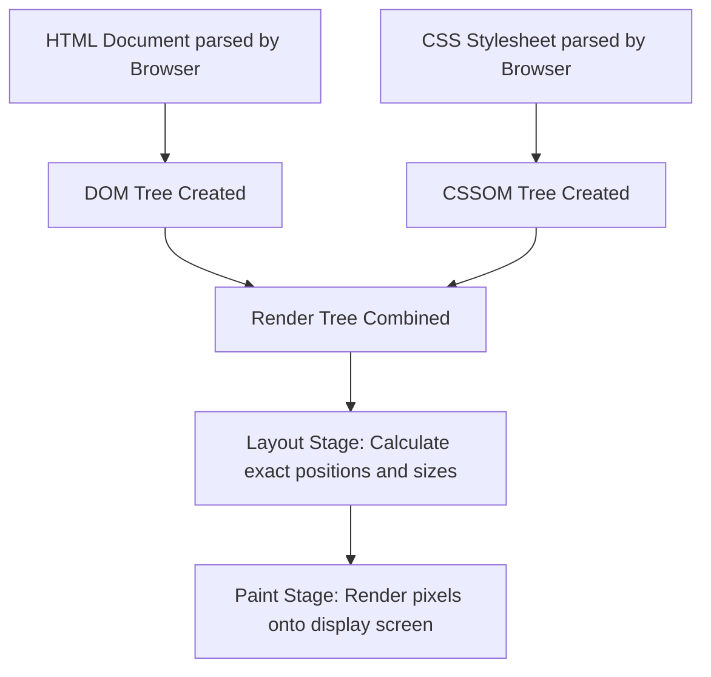

# Introduction to CSS

Estimated Reading Time: 20 minutes

Prerequisites: Basic understanding of HTML tags and document structure.

Learning Objectives:
- Understand what CSS stands for and its core role in web development.
- Learn why CSS was created and the specific problems it solves.
- Comprehend how CSS interacts with HTML and the browser rendering process.
- Identify common applications of CSS across modern websites.

---

## Introduction

CSS stands for Cascading Style Sheets. It is a style sheet language used to specify the visual presentation, layout, and formatting of documents written in a markup language such as HTML.

While HTML is responsible for defining the structure and raw content of a web page—such as text, headings, images, and links—CSS determines how those elements are presented visually on the screen. CSS controls visual attributes such as layout spacing, colors, font families, text alignments, borders, background patterns, and responsive behavior across different device viewports.

CSS was created to separate document content from document presentation. In the early days of the web, styling attributes were mixed directly inside HTML markup using tags such as `<font>` and attributes such as `bgcolor`. This created massive maintenance problems, bloated document sizes, and made universal visual updates across multi-page websites nearly impossible. 

CSS solves these issues by enabling developers to define centralized styling rules that can be applied consistently across an entire application. Today, every modern website relies on CSS to provide clean visual design, interactive user interfaces, accessible contrasts, and responsive user experiences.

---

## Real-World Analogy

Consider the architectural construction of a physical house. 

When a building crew constructs a house, they begin with the framing, studs, concrete foundation, and drywall. This raw skeletal structure defines where the rooms are located, where doorways are cut, and where window openings exist. This structural blueprint represents HTML.

Once the frame is standing, interior designers and painters step in. They select the paint colors for the walls, choose the floor texture (hardwood, tile, carpet), pick the curtain fabric, position decorative lighting fixtures, and arrange the furniture. They do not alter the fundamental wooden structure of the house; instead, they dictate its visual aesthetic, surface texture, and spatial organization. This visual design system represents CSS.

Without interior design, a house is just an unpainted wooden frame. Without CSS, a webpage is just plain black text aligned along the left margin of a white screen.

---

## Core Concepts

### 1. Document Separation
CSS enforces the Separation of Concerns software design principle. HTML maintains semantic structure, while CSS maintains visual presentation. This separation allows designers to rewrite the visual aesthetic of a site without modifying the underlying HTML structure.

### 2. The Cascade
The word "Cascading" in CSS refers to the explicit algorithm browsers use to resolve conflicting styling rules. When multiple CSS rules target the exact same HTML element, the cascade evaluates three primary criteria to determine which rule takes priority:
1. **Origin and Importance**: Styles defined by the site author override browser default styles. Rules marked with `!important` take precedence over normal rules.
2. **Specificity**: A measure of how precise a CSS selector is. An ID selector is more specific than a class selector, which is more specific than an element selector.
3. **Source Order**: If origin, importance, and specificity are completely equal, the rule declared latest in the stylesheet wins.

### 3. Rule Sets and Declarations
A CSS rule set consists of a selector and a declaration block enclosed in curly braces. A declaration block contains one or more declarations, where each declaration pairs a CSS property with a valid property value, terminated by a semicolon.

### 4. Browser Default Styles
Every modern web browser includes a built-in user agent stylesheet. This default stylesheet applies basic formatting to unstyled HTML (such as making `<h1>` text large and bold, or giving `<body>` default margin space). Author-written CSS overrides these default browser styles.

---

## Syntax

```css
selector {
    property: value;
    another-property: another-value;
}
```

- **selector**: Targets one or more HTML elements on the page.
- **{ ... }**: The declaration block containing styling instructions.
- **property**: The specific visual characteristic being styled (for example, `color` or `font-size`).
- **:** Separates the property name from its assigned value.
- **value**: The setting applied to the property (for example, `blue` or `16px`).
- **;**: Terminates a single CSS declaration line.

```css
/* Example of a basic CSS rule set */
p {
    color: #333333;
    font-size: 16px;
    line-height: 1.5;
}
```

- `p`: Target selector targeting all HTML `<p>` paragraph elements.
- `color: #333333;`: Sets paragraph text color to dark gray.
- `font-size: 16px;`: Sets paragraph text size to 16 pixels.
- `line-height: 1.5;`: Sets line height spacing to 1.5 times the font size.

---

## Property Reference

| Property | Description | Common Values | Default Value |
| :--- | :--- | :--- | :--- |
| `color` | Sets the foreground color of text content | Red, `#000000`, `rgb(0, 0, 0)`, `hsl(0, 0%, 0%)` | Dependent on browser user agent (usually black) |
| `background-color` | Sets the solid background color of an element | Transparent, `white`, `#ffffff`, `rgba(0,0,0,0.1)` | `transparent` |
| `font-family` | Specifies the prioritized list of font family names | `Arial, sans-serif`, `Georgia, serif` | Dependent on browser user agent |
| `font-size` | Sets the size of the text font | `16px`, `1rem`, `100%`, `1.2em` | `medium` (typically resolves to 16px) |
| `line-height` | Controls vertical line height spacing within text blocks | `normal`, `1.5`, `24px`, `150%` | `normal` |

---

## Visual Explanation



---

## Example 1

### HTML
```html
<!DOCTYPE html>
<html lang="en">
<head>
    <meta charset="UTF-8">
    <title>Introduction to CSS Example</title>
    <style>
        h1 {
            color: #1a365d;
            font-family: Arial, sans-serif;
            font-size: 28px;
        }
        p {
            color: #4a5568;
            font-family: Georgia, serif;
            font-size: 16px;
            line-height: 1.6;
        }
    </style>
</head>
<body>
    <h1>Understanding Document Styling</h1>
    <p>CSS enables web developers to transform simple raw text into visually engaging digital user interfaces.</p>
</body>
</html>
```

### CSS
```css
h1 {
    color: #1a365d;
    font-family: Arial, sans-serif;
    font-size: 28px;
}

p {
    color: #4a5568;
    font-family: Georgia, serif;
    font-size: 16px;
    line-height: 1.6;
}
```

### Explanation
The style rules inside the `<style>` block target two separate elements. The `h1` selector modifies the top-level heading by applying a deep dark-blue shade (`#1a365d`), setting the font family to Arial (with a generic sans-serif fallback), and establishing a font size of 28 pixels. The `p` selector target applies a slate-gray color (`#4a5568`), a serif Georgia typeface, a 16-pixel font size, and a comfortable vertical line spacing factor of 1.6.

---

## Output Image Prompt

A clean desktop browser screen displaying a white canvas webpage. At the top left of the page content area, a prominent main heading reads "Understanding Document Styling" rendered in a solid deep dark-blue color with crisp Arial sans-serif typography at 28-pixel font height. Positioned immediately below the heading is a single paragraph reading "CSS enables web developers to transform simple raw text into visually engaging digital user interfaces." rendered in a medium slate-gray tone with elegant Georgia serif typography, set at a 16-pixel text size with generous line spacing. The page exhibits crisp margins, neutral white background contrast, and clear typographic hierarchy.

---

## Code Explanation

- `h1 { ... }`: Selects every main `<h1>` heading on the page for styling.
- `color: #1a365d;`: Applies a hexadecimal color code representing dark blue to the heading text foreground.
- `font-family: Arial, sans-serif;`: Instructs the browser to render text using the Arial font. If Arial is missing on the user device, it defaults to the system's standard sans-serif font.
- `font-size: 28px;`: Overrides default browser heading sizing and fixes the text height to 28 pixels.
- `p { ... }`: Selects every `<p>` paragraph element.
- `line-height: 1.6;`: Multiplies font size by 1.6 to insert vertical space between wrapping text lines, enhancing reading comfort.

---

## Example 2

### HTML
```html
<!DOCTYPE html>
<html lang="en">
<head>
    <meta charset="UTF-8">
    <title>Card Content UI Component</title>
    <style>
        body {
            background-color: #f7fafc;
            font-family: Arial, sans-serif;
        }
        .card {
            background-color: #ffffff;
            color: #2d3748;
            padding: 20px;
            border-width: 1px;
            border-style: solid;
            border-color: #e2e8f0;
        }
        .card-title {
            color: #2b6cb0;
            font-size: 20px;
        }
    </style>
</head>
<body>
    <div class="card">
        <h2 class="card-title">CSS Overview</h2>
        <p>CSS handles layout organization, color palettes, and typographic styling across modern web pages.</p>
    </div>
</body>
</html>
```

### CSS
```css
body {
    background-color: #f7fafc;
    font-family: Arial, sans-serif;
}

.card {
    background-color: #ffffff;
    color: #2d3748;
    padding: 20px;
    border-width: 1px;
    border-style: solid;
    border-color: #e2e8f0;
}

.card-title {
    color: #2b6cb0;
    font-size: 20px;
}
```

### Explanation
This example demonstrates styling a simple UI card component. The `body` rule sets a light off-white background color (`#f7fafc`) for the browser canvas. The `.card` class styles a container `<div>` with a crisp pure-white background, internal spacing of 20 pixels (`padding`), and a subtle gray border (`#e2e8f0`). The `.card-title` class styles the internal `<h2>` heading with a blue accent color (`#2b6cb0`).

---

## Output Image Prompt

A clean browser viewport displaying a light off-white canvas background (`#f7fafc`). Centered near the top of the canvas is a clean rectangular white card container featuring a subtle 1-pixel gray outline (`#e2e8f0`) and 20 pixels of internal padding around all edges. Inside the white card, an `<h2>` heading "CSS Overview" is rendered in a vibrant blue color (`#2b6cb0`) at 20 pixels font size. Directly below the heading, a paragraph reads "CSS handles layout organization, color palettes, and typographic styling across modern web pages." rendered in dark charcoal text (`#2d3748`) using clean Arial sans-serif typography.

---

## Code Explanation

- `body { background-color: #f7fafc; }`: Sets the overall page background color to an off-white tint.
- `.card`: Uses a class selector to target elements assigned `class="card"`.
- `background-color: #ffffff;`: Assigns a pure white background inside the card bounds.
- `padding: 20px;`: Creates 20 pixels of clearance space between the card border and inner elements.
- `border-width: 1px; border-style: solid; border-color: #e2e8f0;`: Configures a thin, continuous light-gray outer border around the container.
- `.card-title`: Uses a class selector targeting the card heading specifically to give it a distinctive blue font tone.

---

## Best Practices

- **Separation of Concerns**: Never embed styling attributes directly into HTML elements. Keep CSS separated into dedicated stylesheets or `<style>` blocks.
- **Maintainable Naming**: Use clear, descriptive class names based on semantic purpose (such as `.card-title`) rather than visual appearance (such as `.blue-text-20px`).
- **Style Reusability**: Group repeated styling patterns into reusable classes to minimize code repetition across stylesheets.
- **Readable Structure**: Maintain consistent indentation, grouping, and line breaks within CSS declaration blocks for developer clarity.
- **Performance Awareness**: Keep stylesheets organized and trimmed of unused CSS rules to reduce parsing overhead in the browser.

---

## Common Mistakes

### Mistake 1: Omitting Semicolons Between Declarations

```css
/* INCORRECT */
p {
    color: red
    font-size: 16px
}
```

#### Explanation
In CSS, each property declaration must end with a semicolon. Omitting semicolons causes the browser parsing engine to invalidly blend consecutive property lines together, ignoring all subsequent styles in that block.

```css
/* CORRECT */
p {
    color: red;
    font-size: 16px;
}
```

---

### Mistake 2: Confusing Property Names with Values

```css
/* INCORRECT */
h1 {
    font: 20px;
    background: blue-color;
}
```

#### Explanation
Using invalid property names or unsupported value keywords breaks the parser. `font` requires explicit syntax when shorthand is used, and `blue-color` is not a recognized CSS keyword value.

```css
/* CORRECT */
h1 {
    font-size: 20px;
    background-color: blue;
}
```

---

### Mistake 3: Misspelling CSS Property Keys

```css
/* INCORRECT */
body {
    backgound-color: white;
    font-colour: black;
}
```

#### Explanation
CSS properties require standard spelling (American English spelling convention, such as `color` instead of `colour`). Misspelled property names are completely ignored by the browser parser without raising explicit errors.

```css
/* CORRECT */
body {
    background-color: white;
    color: black;
}
```

---

## Browser Compatibility

CSS1 and basic CSS2/CSS3 specifications (including `color`, `font-family`, `font-size`, `background-color`, and basic selector rules) enjoy universal 100% cross-browser support across all modern and legacy web browsers, including Chrome, Firefox, Safari, Edge, Opera, and historical Internet Explorer releases.

Modern browser layout engines automatically skip unparsed or unknown CSS properties without breaking the surrounding layout tree, providing built-in backward resilience.

---

## Real-World Applications

- **Corporate Websites**: Establishing brand-consistent typography, primary brand color systems, and document layouts.
- **Blogs & Publishing Platforms**: Optimizing text column widths, line-height proportions, heading contrasts, and body typography legibility.
- **E-Commerce Marketplaces**: Formatting product information blocks, price tags, background cards, and banner areas.
- **User Dashboards**: Structuring clean content containers, summary cards, and readable text blocks.

---

## Mini Project

### Project Objective: Personal Profile Card Page
Build an unstyled HTML document containing a user profile (name, title, short bio summary, and skill labels) and write a CSS block that transforms the document into a professional, styled Profile Card component.

#### Requirements:
1. Apply a soft gray background color to the main page canvas.
2. Structure the profile content within a white card container with distinct internal padding and a border outline.
3. Style the profile name with a large dark sans-serif heading.
4. Style the job title with a smaller secondary color font.
5. Set comfortable line height spacing for the bio text block.

---


## Quick Quiz

**1. What does CSS stand for?**
A) Creative Style Sheets  
B) Cascading Style Sheets  
C) Computer Style System  
D) Colorful Style Sheets  

**2. What is the primary purpose of CSS in web development?**
A) Defining database structures  
B) Managing server request logic  
C) Separating visual presentation from document structure  
D) Executing client-side script loops  

**3. Which component of a CSS rule specifies which HTML elements are affected?**
A) Property  
B) Value  
C) Selector  
D) Declaration  

**4. In a CSS rule `p { color: blue; }`, what is `color`?**
A) Selector  
B) Property  
C) Value  
D) Class  

**5. What character is used to separate a property name from its value in CSS?**
A) Equal sign (`=`)  
B) Semicolon (`;`)  
C) Colon (`:`)  
D) Dash (`-`)  

**6. What character must terminate a single CSS declaration line?**
A) Period (`.`)  
B) Semicolon (`;`)  
C) Comma (`,`)  
D) Slash (`/`)  

**7. Which criteria does the Cascade use when resolving styling conflicts?**
A) Origin/Importance, Specificity, and Source Order  
B) File Size, HTML Tag Count, and Script Speed  
C) Network Bandwidth, RAM usage, and CPU Cores  
D) Image Dimensions, URL length, and Encoding  

**8. What is the default user agent stylesheet?**
A) A stylesheet provided by web hosting servers  
B) The built-in default styling applied by browsers  
C) A third-party library downloaded via CDN  
D) A styling file created by site users  

**9. What happens when a browser encounters an unrecognized CSS property name?**
A) The browser crashes completely  
B) An alert popup displays to the end user  
C) The browser silently ignores that declaration line and continues  
D) The entire HTML page is hidden  

**10. Which CSS property changes the text background canvas color of an element?**
A) `text-color`  
B) `font-background`  
C) `background-color`  
D) `canvas-style`  

---

### Answers
1: B | 2: C | 3: C | 4: B | 5: C | 6: B | 7: A | 8: B | 9: C | 10: C

---

## Interview Questions

**1. What is CSS and why is it essential for modern web applications?**  
*Answer:* CSS (Cascading Style Sheets) is the standard presentation language used to style HTML documents. It is essential because it decouples visual styling from semantic structure, enabling centralized design management, improved site maintainability, reduced bandwidth bloat, and responsive layout adaptivity across devices.

**2. Explain the concept of "The Cascade" in CSS.**  
*Answer:* The Cascade is the engine algorithm browsers use to resolve conflicting CSS rules targeting the same element. It calculates priority based on three layers: (1) Origin & Importance (author rules vs user agent defaults vs `!important`), (2) Selector Specificity (IDs vs classes vs element tags), and (3) Source Order (later rules override earlier rules if specificity is equal).

**3. What is the difference between HTML and CSS?**  
*Answer:* HTML provides the structure, semantics, and raw content of a webpage (e.g., text, links, headings, inputs). CSS dictates the visual styling, positioning, typography, color palette, and layout formatting of those structural elements.

**4. What is a browser User Agent Stylesheet?**  
*Answer:* A User Agent Stylesheet is a set of default CSS rules built directly into every web browser. It ensures that unstyled HTML elements render with basic legible formatting (e.g., bullets on unordered lists, larger font size on headings, default blue text on hyperlinks).

**5. How does CSS handle invalid property names or syntax errors?**  
*Answer:* CSS uses a resilient parsing policy. When a browser parser encounters an invalid syntax line or unknown property key, it ignores that specific declaration line and continues parsing the remaining valid CSS rules without halting page rendering.

**6. What is the syntax structure of a standard CSS rule set?**  
*Answer:* A rule set consists of a selector followed by a declaration block inside curly braces `{}`. Inside the block are one or more declarations consisting of a property key, a colon `:`, a value, and a terminating semicolon `;`.

**7. Why is separation of concerns important when writing HTML and CSS?**  
*Answer:* Separating structural markup from styling logic keeps code clean, manageable, and scalable. It allows developers to modify or redesign an entire website's appearance by updating stylesheets without altering underlying HTML content files.

**8. What is the purpose of the `font-family` property fallback list?**  
*Answer:* The fallback list provides alternative font family names separated by commas. If the primary custom font is unavailable on the user system, the browser attempts to render the next listed font, ending with a generic system family keyword (such as `sans-serif` or `serif`).

**9. How does `line-height` affect readability in CSS?**  
*Answer:* `line-height` specifies the vertical height allocated to each line of text within an element block. Setting an appropriate line height (such as `1.5`) prevents text lines from crowding together vertically, significantly enhancing legibility.

**10. What is the difference between an element selector and a class selector?**  
*Answer:* An element selector targets all instances of a specific HTML tag name (e.g., `p` or `h1`). A class selector targets elements that explicitly include a matching `class` attribute (e.g., `.card` targets `<div class="card">`), allowing selective styling of specific components regardless of tag type.

---

## Summary

- CSS (Cascading Style Sheets) controls the visual presentation, color palette, typography, and layout of HTML web documents.
- CSS enforces the Separation of Concerns software design principle by decoupling presentation from content structure.
- A standard CSS rule set consists of a **selector** and a **declaration block** containing property-value pairs.
- The **Cascade** resolves styling conflicts based on Origin/Importance, Specificity, and Source Order.
- Browsers apply default User Agent styles to unstyled HTML, which can be overridden by custom CSS.
- CSS syntax requires colon separators after property keys and terminating semicolons after property values.

---

## Cheat Sheet

```css
/* CSS RULE STRUCTURE */
selector {
    property: value;
    another-property: value;
}

/* BASIC TYPOGRAPHY & COLOR PROPERTIES */
color: #333333;             /* Sets font text foreground color */
background-color: #ffffff;  /* Sets background canvas color */
font-family: Arial, sans-serif; /* Defines font choices */
font-size: 16px;            /* Sets text dimensions */
line-height: 1.5;           /* Sets line clearance spacing */

/* CORE SYNTAX SYMBOLS */
/* ... */   Comment block (ignored by browser)
{ }        Encloses property declarations
:          Separates property key from assigned value
;          Terminates declaration line
```

---

## Related Topics

- **Previous Topic**: HTML Document Structure & Semantics
- **Next Topic**: [Ways to Add CSS](02-ways-to-add-css.md)
- **Recommended Learning Order**: Introduction to CSS -> Ways to Add CSS -> CSS Selectors -> CSS Colors -> CSS Box Model
