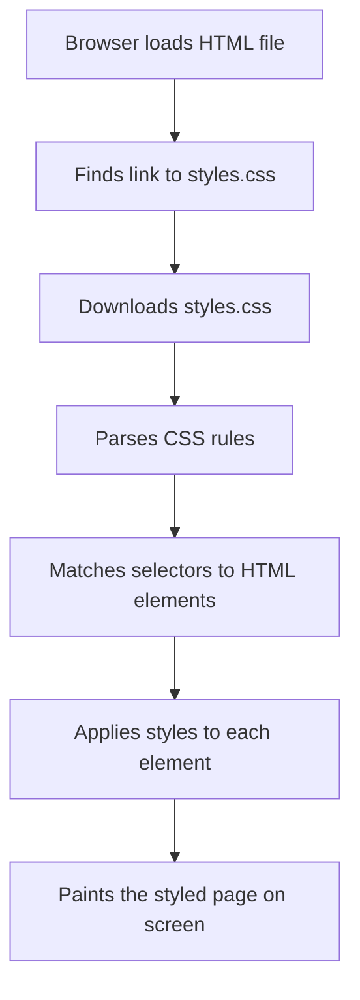
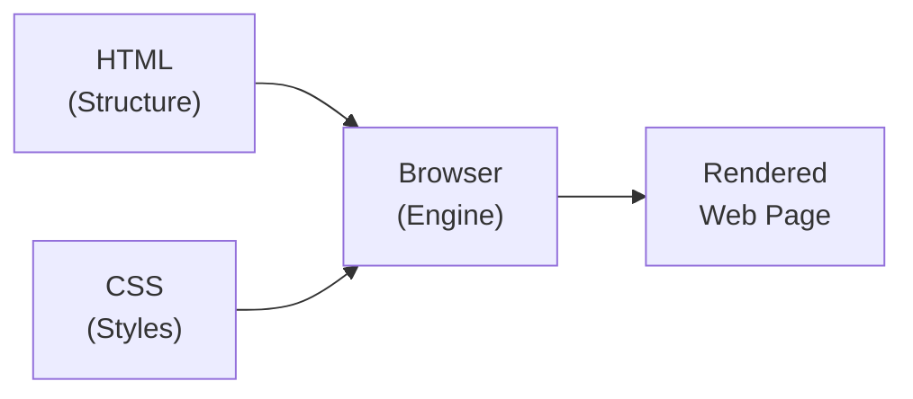

# What is CSS?

**Estimated Reading Time:** 20 minutes

**Prerequisites:** Basic understanding of HTML (what tags are, how an HTML document is structured)

**Learning Objectives:**
- Understand what CSS stands for and what each word means
- Explain why CSS was created and what problem it solves
- Describe the relationship between HTML and CSS
- Understand the concept of "cascading"
- Know where CSS is used in real-world web development

---

## Introduction

Every website you visit today has two fundamental layers working together. The first layer is HTML, which defines the structure and content of the page. The second layer is CSS, which controls how all of that content looks — the colors, fonts, spacing, layout, and animations.

CSS stands for **Cascading Style Sheets**. It is a styling language (not a programming language) that tells the browser how to display HTML elements on the screen. Without CSS, every website would look like a plain text document from the 1990s — black text on a white background with default fonts and no layout control.

Every single website on the internet uses CSS. Whether you are looking at Google, YouTube, Amazon, or a small personal blog, CSS is what makes it visually appealing. Learning CSS is not optional for web developers — it is essential.

CSS was first proposed by Hakon Wium Lie in 1994 and officially released as CSS1 by the W3C (World Wide Web Consortium) in 1996. The current version, CSS3, introduced modular specifications, allowing new features to be developed independently.

---

## Build the Intuition

Think about building a house. When a construction crew builds a house, they first put up the frame — the walls, the floors, the roof, the doors, and the windows. This frame is the structure. In web development, HTML is this frame.

But a frame alone does not make a house livable or attractive. You need to paint the walls, choose the flooring material, pick the color of the curtains, decide where the furniture goes, and make sure everything looks good together. This decoration and styling work is exactly what CSS does for a website.

Here is another way to think about it. Imagine you receive a plain printed document — just words on white paper. Now imagine receiving the same content as a beautifully designed magazine spread — with colors, columns, headlines in bold typefaces, and plenty of white space. The content is identical. The presentation is completely different. HTML is the plain document. CSS transforms it into the magazine.

Or think of it like a person. HTML is the skeleton — it provides structure and holds everything together. CSS is the skin, the clothes, the hairstyle, and the accessories. It is everything that affects how the person appears to the outside world.

---

## Core Concept

### What Does "Cascading Style Sheets" Actually Mean?

**Style** refers to the visual appearance of elements on a web page. This includes colors, fonts, sizes, spacing, borders, shadows, animations, and layout.

**Sheets** refers to the files where you write your style rules. CSS files use the `.css` extension.

**Cascading** describes how the browser decides which style rule to apply when multiple rules target the same element. The word "cascade" means to fall, like a waterfall. Style rules flow downward through multiple sources, and the browser follows specific rules to determine which one wins.

The cascade considers three factors in order:
1. **Origin and importance** — Where the style comes from and whether it is marked `!important`
2. **Specificity** — How specifically a rule targets an element
3. **Source order** — When two rules have the same specificity, the one that appears later wins

### How CSS Works with HTML

- HTML defines **what** content exists on the page (a heading, a paragraph, an image)
- CSS defines **how** that content appears (the heading is blue, the paragraph has a large font)

The browser reads the HTML first to build the DOM (Document Object Model). Then it reads the CSS, matches each rule to the appropriate elements, and paints the result on the screen.

### What CSS Controls

| Category | Examples |
|----------|----------|
| Colors | Text color, background color, border color |
| Typography | Font family, font size, font weight, line height |
| Spacing | Margin (outside), padding (inside) |
| Borders | Width, style (solid, dashed), color, rounded corners |
| Layout | How elements are arranged on the page |
| Sizing | Width, height, min/max dimensions |
| Effects | Shadows, transparency, blur, filters |
| Motion | Transitions, animations |
| Responsiveness | Adapting for different screen sizes |

---

## Syntax

A CSS rule has three parts:

```css
selector {
    property: value;
}
```

**Selector** — Points to the HTML element(s) you want to style.

**Property** — The visual characteristic you want to change.

**Value** — The specific setting for that property.

Example:

```css
h1 {
    color: navy;
    font-size: 32px;
}
```

This says: "Find every `<h1>` element. Make its text navy and its font size 32 pixels."

The curly braces `{ }` enclose the declarations. Each declaration is a `property: value` pair ending with a semicolon `;`.

CSS supports comments:

```css
/* This is a CSS comment */
h1 {
    color: navy; /* Makes headings navy blue */
}
```

---

## Example 1 — Your First CSS Rule

**HTML (index.html):**

```html
<!DOCTYPE html>
<html lang="en">
<head>
    <meta charset="UTF-8">
    <meta name="viewport" content="width=device-width, initial-scale=1.0">
    <title>My First CSS</title>
    <link rel="stylesheet" href="styles.css">
</head>
<body>
    <h1>Welcome to CSS</h1>
    <p>CSS makes the web beautiful. Without it, every website would look the same.</p>
    <p>With CSS, you can control colors, fonts, spacing, layout, and so much more.</p>
</body>
</html>
```

**CSS (styles.css):**

```css
h1 {
    color: darkslateblue;
    font-size: 36px;
    font-family: Georgia, serif;
}

p {
    color: #444444;
    font-size: 18px;
    line-height: 1.8;
    font-family: 'Segoe UI', sans-serif;
}
```

---

## Output Preview


---

## Code Walkthrough

1. The browser reads the HTML and encounters `<link rel="stylesheet" href="styles.css">`. This tells the browser to fetch the CSS file.

2. The browser builds the DOM: one `<h1>` element and two `<p>` elements inside `<body>`.

3. The first CSS rule targets `h1` and applies:
   - `color: darkslateblue` — changes text from default black to deep purple-blue
   - `font-size: 36px` — sets text size to 36 pixels
   - `font-family: Georgia, serif` — uses Georgia font, falling back to any serif font

4. The second rule targets `p` and applies to both paragraphs:
   - `color: #444444` — dark gray text (hex color code)
   - `font-size: 18px` — sets text size
   - `line-height: 1.8` — generous spacing between lines
   - `font-family: 'Segoe UI', sans-serif` — uses Segoe UI font

---

## Visual Explanation



The relationship between HTML, CSS, and the browser:



---

## Important Notes

> [!NOTE]
> **Browser Default Styles:** Every browser comes with a built-in stylesheet that provides default styling for HTML elements. Your CSS overrides these defaults.

> [!NOTE]
> **CSS is Not a Programming Language:** It is a declarative language — you declare what you want, and the browser figures out how to render it.

> [!IMPORTANT]
> **Browser Compatibility:** Most modern CSS features work across all major browsers. Websites like caniuse.com let you check support for specific CSS features.

---

## Best Practices

1. **Always use external stylesheets.** Keep your CSS in separate `.css` files for organization and reusability.
2. **Use meaningful names.** Name classes by purpose, not appearance (`.error-message` not `.red-text`).
3. **Start simple.** Begin with colors and fonts, then move to spacing, layout, and advanced features.
4. **Use browser DevTools.** Press F12 to inspect and modify CSS in real time.
5. **Organize your CSS logically.** Group related rules together: resets, typography, layout, components, utilities.

---

## Common Mistakes

### Mistake 1: Forgetting the Semicolon

```css
/* Incorrect */
h1 {
    color: navy
    font-size: 32px;
}

/* Correct */
h1 {
    color: navy;
    font-size: 32px;
}
```

The missing semicolon causes `font-size` to be ignored entirely.

### Mistake 2: Misspelling Property Names

```css
/* Incorrect */
p { colour: blue; }    /* CSS uses American English */
p { text-size: 18px; } /* Not a real property */

/* Correct */
p { color: blue; }
p { font-size: 18px; }
```

### Mistake 3: Missing rel="stylesheet"

```html
<!-- Incorrect — missing rel attribute -->
<link href="styles.css">

<!-- Correct -->
<link rel="stylesheet" href="styles.css">
```

---

## Real-World Applications

- **Navigation bars** — CSS positions logo left, links right, adds hover effects, and creates sticky behavior.
- **Login forms** — CSS centers the form, styles inputs and buttons, adds shadows.
- **Product cards** — CSS creates grid layouts, hover lift effects, and responsive columns.
- **Blog layouts** — CSS creates main content with sidebar, controls typography for readability.
- **Landing pages** — CSS creates hero sections, feature grids, and call-to-action buttons.

---

## Mini Challenges

### Challenge 1 — Beginner
Create an HTML page with a heading, two paragraphs, and a link. Write CSS that changes the heading color to dark green, makes paragraphs gray at 20px, and the link orange.

### Challenge 2 — Intermediate
Create a page with h1, h2, h3 headings, each followed by a paragraph. Style each heading with a different color and font family. Give all paragraphs the same styling. Add comments explaining each rule.

### Challenge 3 — Advanced
Research the browser's default stylesheet. Create a page with common HTML elements and write CSS that overrides at least 10 default browser styles. Document which defaults you changed and why.

---

## Quick Quiz

**1. What does CSS stand for?**
a) Computer Style Sheets  b) Creative Style Sheets  c) Cascading Style Sheets  d) Colorful Style Sheets

**2. Which part of a CSS rule identifies the HTML element to style?**
a) Property  b) Value  c) Declaration  d) Selector

**3. What does "cascading" refer to?**
a) A waterfall animation  b) The process of resolving style conflicts  c) Top-to-bottom file loading  d) Color blending

**4. Which is NOT something CSS can control?**
a) Font size  b) Background color  c) Database queries  d) Element spacing

**5. What character ends a CSS declaration?**
a) Colon `:`  b) Comma `,`  c) Semicolon `;`  d) Period `.`

### Answers
1. c  |  2. d  |  3. b  |  4. c  |  5. c

---

## Interview Questions

**1. What is CSS and why is it important in web development?**
CSS is a styling language that controls visual presentation of HTML documents. It separates content from presentation, making code more maintainable and reusable.

**2. Explain what "cascading" means in CSS.**
It refers to the algorithm browsers use to resolve conflicts when multiple rules target the same element, considering origin/importance, specificity, and source order.

**3. What is the difference between CSS and JavaScript?**
CSS is declarative — you describe desired appearance. JavaScript is imperative — it can manipulate the DOM, handle events, perform calculations, and communicate with servers.

**4. Explain the basic structure of a CSS rule.**
A selector targets elements, followed by a declaration block in curly braces containing property-value pairs separated by semicolons.

**5. What happens when the browser encounters a CSS property it does not recognize?**
It ignores that declaration and moves on. This allows newer CSS features to be used without breaking pages in older browsers.

---

## Summary

- **CSS** (Cascading Style Sheets) controls the visual presentation of HTML content
- HTML defines **structure**, CSS defines **appearance**
- A CSS rule has: **selector** (target), **property** (what to change), **value** (how to change it)
- The **cascade** resolves conflicts between competing style rules
- CSS controls colors, fonts, spacing, layout, borders, shadows, animations, and responsive behavior
- Always use **external stylesheets** for real projects
- Every modern website uses CSS — it is essential for web developers

---

## Cheat Sheet

```
CSS Rule Structure:     selector { property: value; }
Link CSS to HTML:       <link rel="stylesheet" href="styles.css">
Comments:               /* comment text */
Common Properties:      color, background-color, font-size, font-family,
                        font-weight, line-height, text-align, margin,
                        padding, border
File Extension:         .css
Key Rules:              - End declarations with semicolons
                        - Use American English (color, not colour)
                        - Use external stylesheets
                        - Use DevTools (F12) to experiment
```

---

## Related Topics

**Previous:** HTML Basics

**Next:**
- [How to Add CSS](02-how-to-add-css.md) — Three methods of adding CSS to HTML
- [CSS Syntax and Structure](03-css-syntax-and-structure.md) — Deep dive into rulesets and declarations
- [Element Selectors](04-element-selector.md) — Target HTML elements by tag name
