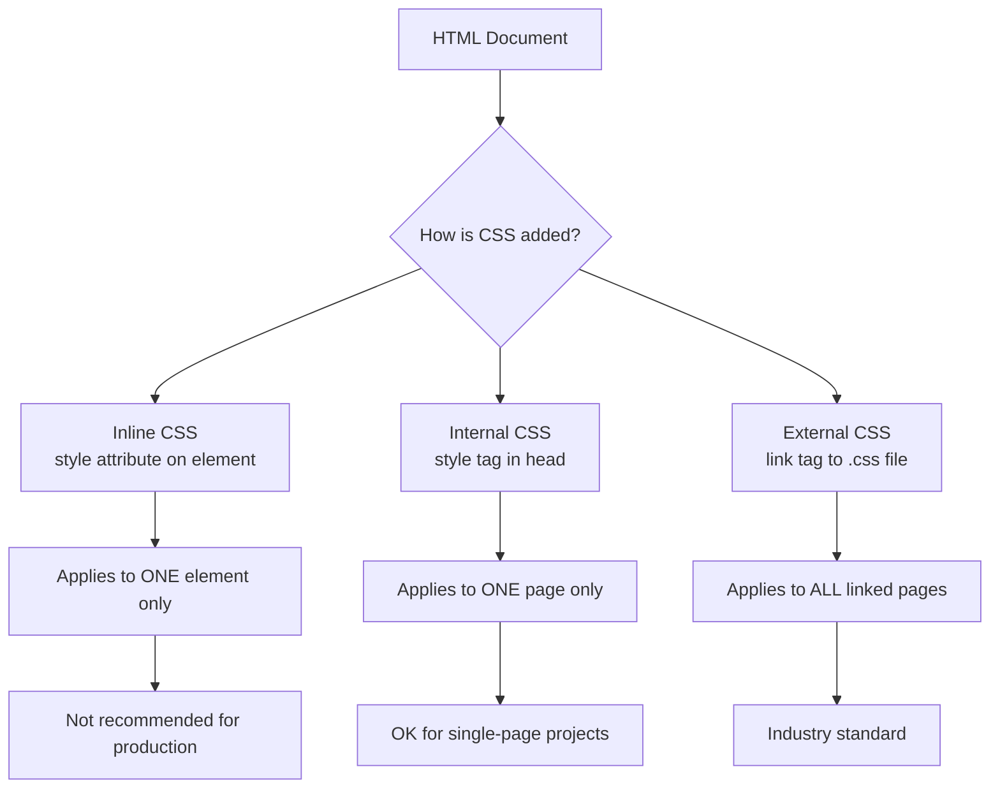
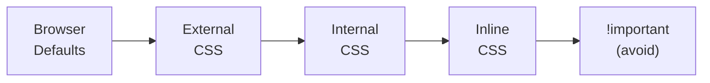

# How to Add CSS

**Estimated Reading Time:** 18 minutes

**Prerequisites:** [What is CSS](01-what-is-css.md)

**Learning Objectives:**
- Learn the three methods of adding CSS to an HTML document
- Understand when to use each method
- Know why external stylesheets are the industry standard
- Be able to link a CSS file to an HTML page

---

## Introduction

Now that you understand what CSS is and why it matters, the next question is: how do you actually connect CSS to your HTML? There are three ways to add CSS to an HTML document, and understanding when and why to use each one is fundamental knowledge for every web developer.

The three methods are inline CSS, internal CSS, and external CSS. Each has its own use case, but one of them is far superior for real-world projects. By the end of this document, you will understand all three and know exactly which one to use in different situations.

---

## Build the Intuition

Imagine you are the manager of a chain of restaurants and you want all your restaurants to have the same decor — the same wall color, the same type of chairs, the same table arrangement.

**Method 1 (Inline):** You walk up to each individual chair and paint it yourself. Every single chair, in every single restaurant, one at a time. If you want to change the color later, you must repaint every chair individually. This is exhausting and impractical.

**Method 2 (Internal):** You write the decor instructions on a note and tape it to the wall inside each restaurant. Each restaurant has its own copy of the instructions. If you want to change something, you update the note in every restaurant individually.

**Method 3 (External):** You create a single design manual and give every restaurant manager a reference to it. When you update the manual, every restaurant automatically follows the new design. One change, everywhere.

External CSS is the design manual approach — and it is clearly the best choice for anything beyond a quick experiment.

---

## Core Concept

### Method 1: Inline CSS

Inline CSS is written directly on an HTML element using the `style` attribute. The styles apply only to that one specific element.

```html
<p style="color: red; font-size: 20px;">This text is red and 20 pixels.</p>
```

**How it works:** The browser reads the `style` attribute and applies those styles directly to the element. No selector is needed because the styles are already attached to the element.

**When to use it:**
- Quick testing or debugging
- Email HTML templates (where external CSS support is limited)
- Dynamically applied styles via JavaScript

**Why to avoid it in real projects:**
- Mixes content (HTML) with presentation (CSS) — violates separation of concerns
- Cannot reuse styles across multiple elements
- Extremely difficult to maintain on large projects
- Has the highest specificity, making it hard to override later
- Cannot use media queries, pseudo-classes, or animations

### Method 2: Internal CSS

Internal CSS is written inside a `<style>` element within the `<head>` section of the HTML document.

```html
<!DOCTYPE html>
<html lang="en">
<head>
    <meta charset="UTF-8">
    <title>Internal CSS Example</title>
    <style>
        h1 {
            color: darkblue;
            font-family: Georgia, serif;
        }
        p {
            color: #555;
            font-size: 18px;
            line-height: 1.7;
        }
    </style>
</head>
<body>
    <h1>Hello World</h1>
    <p>This page uses internal CSS.</p>
</body>
</html>
```

**How it works:** The browser reads the `<style>` block in the `<head>` and applies the rules to matching elements on the page. Full CSS selectors and features can be used.

**When to use it:**
- Single-page projects or prototypes
- When you need page-specific styles that should not affect other pages
- Performance optimization for critical above-the-fold CSS (advanced technique)

**Limitations:**
- Styles apply only to that one HTML page
- Cannot be shared across multiple pages
- Makes the HTML file larger and harder to read
- Does not leverage browser caching

### Method 3: External CSS (The Standard)

External CSS is written in a separate `.css` file and linked to the HTML document using the `<link>` element.

**HTML (index.html):**
```html
<!DOCTYPE html>
<html lang="en">
<head>
    <meta charset="UTF-8">
    <title>External CSS Example</title>
    <link rel="stylesheet" href="styles.css">
</head>
<body>
    <h1>Hello World</h1>
    <p>This page uses external CSS.</p>
</body>
</html>
```

**CSS (styles.css):**
```css
h1 {
    color: darkblue;
    font-family: Georgia, serif;
}

p {
    color: #555;
    font-size: 18px;
    line-height: 1.7;
}
```

**How it works:** The `<link>` element tells the browser to download the CSS file and apply its rules to the current page. The `rel="stylesheet"` attribute specifies the relationship, and `href` provides the file path.

**Why this is the best approach:**
- **Separation of concerns** — HTML handles structure, CSS handles presentation
- **Reusability** — One CSS file can be linked to hundreds of HTML pages
- **Caching** — Browsers cache CSS files, so they do not need to be downloaded again on subsequent page visits
- **Maintainability** — Change one file to update the look of your entire website
- **Team collaboration** — Developers can work on HTML and CSS independently

---

## Syntax

### The `<link>` Element

```html
<link rel="stylesheet" href="styles.css">
```

| Attribute | Required | Description |
|-----------|----------|-------------|
| `rel` | Yes | Must be `"stylesheet"` — tells the browser this is a CSS file |
| `href` | Yes | Path to the CSS file (relative or absolute) |
| `type` | No | Defaults to `"text/css"` — not needed in HTML5 |
| `media` | No | Specifies which media the styles apply to (e.g., `"screen"`, `"print"`) |

### File Path Examples

```html
<!-- Same folder -->
<link rel="stylesheet" href="styles.css">

<!-- In a subfolder -->
<link rel="stylesheet" href="css/styles.css">

<!-- Up one folder -->
<link rel="stylesheet" href="../styles.css">

<!-- Absolute URL (from CDN) -->
<link rel="stylesheet" href="https://cdn.example.com/styles.css">
```

### Linking Multiple Stylesheets

```html
<head>
    <link rel="stylesheet" href="css/reset.css">
    <link rel="stylesheet" href="css/typography.css">
    <link rel="stylesheet" href="css/layout.css">
    <link rel="stylesheet" href="css/components.css">
</head>
```

The order matters. Stylesheets loaded later can override rules from earlier ones.

---

## Example 1 — Comparing All Three Methods

```html
<!DOCTYPE html>
<html lang="en">
<head>
    <meta charset="UTF-8">
    <title>Three CSS Methods</title>
    <!-- Method 3: External CSS -->
    <link rel="stylesheet" href="styles.css">
    <!-- Method 2: Internal CSS -->
    <style>
        .internal {
            color: darkgreen;
            font-style: italic;
        }
    </style>
</head>
<body>
    <h1>Three Ways to Add CSS</h1>
    <!-- Method 1: Inline CSS -->
    <p style="color: red; font-weight: bold;">This uses inline CSS.</p>
    <!-- Method 2: Internal CSS -->
    <p class="internal">This uses internal CSS.</p>
    <!-- Method 3: External CSS -->
    <p class="external">This uses external CSS.</p>
</body>
</html>
```

**styles.css:**
```css
h1 {
    color: #2c3e50;
    font-family: 'Segoe UI', sans-serif;
}

.external {
    color: steelblue;
    font-size: 20px;
    text-decoration: underline;
}
```

---

## Output Preview


---

## Code Walkthrough

1. The browser loads `index.html` and processes the `<head>` section.
2. It finds `<link rel="stylesheet" href="styles.css">` and downloads the external CSS file.
3. It finds the `<style>` block with internal CSS rules.
4. For the `<h1>`, external CSS applies: dark color and Segoe UI font.
5. For the first `<p>`, inline CSS applies directly: red color and bold weight.
6. For the second `<p>`, internal CSS applies via the `.internal` class: dark green and italic.
7. For the third `<p>`, external CSS applies via the `.external` class: steel blue, 20px, underlined.

---

## Visual Explanation



### Priority Order (Specificity)



When the same property conflicts, styles on the right override styles on the left.

---

## Important Notes

> [!NOTE]
> The `<link>` element is a **void element** — it has no closing tag. Writing `</link>` is unnecessary.

> [!WARNING]
> If you forget `rel="stylesheet"`, the browser will download the file but will NOT apply it as CSS. This is one of the most common beginner mistakes.

> [!TIP]
> You can link to stylesheets from CDNs (Content Delivery Networks) for popular CSS libraries like Google Fonts or Normalize.css.

---

## Best Practices

1. **Use external CSS for all real projects.** No exceptions.
2. **Use one primary stylesheet** or organize with a few logically separated files (reset, layout, components).
3. **Place `<link>` tags in the `<head>`** before any `<script>` tags for faster rendering.
4. **Use relative paths** for local files and absolute URLs for external resources.
5. **Avoid inline styles** unless absolutely necessary (e.g., dynamic styles from JavaScript).

---

## Common Mistakes

### Mistake 1: Forgetting rel="stylesheet"

```html
<!-- Incorrect -->
<link href="styles.css">

<!-- Correct -->
<link rel="stylesheet" href="styles.css">
```

### Mistake 2: Wrong File Path

```html
<!-- File is in css/ subfolder but path doesn't include it -->
<link rel="stylesheet" href="styles.css">

<!-- Correct -->
<link rel="stylesheet" href="css/styles.css">
```

### Mistake 3: Using style Instead of link for External CSS

```html
<!-- Incorrect -->
<style src="styles.css"></style>

<!-- Correct -->
<link rel="stylesheet" href="styles.css">
```

The `<style>` element is for internal CSS only. It does not have a `src` attribute.

---

## Real-World Applications

- **Corporate websites** use external CSS shared across hundreds of pages for consistent branding
- **Email templates** often require inline CSS because many email clients do not support external stylesheets
- **Critical CSS** technique uses internal CSS for above-the-fold content and loads the rest externally for performance

---

## Mini Challenges

### Challenge 1 — Beginner
Create two HTML files (`page1.html` and `page2.html`) that both link to the same external CSS file. Verify that changing the CSS file updates both pages.

### Challenge 2 — Intermediate
Create a page that uses all three CSS methods simultaneously. Use inline CSS to make one paragraph red, internal CSS to make another green, and external CSS to make a third blue. Observe which method takes priority when they conflict.

### Challenge 3 — Advanced
Create a multi-page website (3 pages) with a shared external stylesheet for common styles and separate internal styles unique to each page. Organize the CSS with comments explaining each section.

---

## Quick Quiz

**1. Which method is best for real-world projects?**
a) Inline  b) Internal  c) External  d) All are equal

**2. Which HTML element links an external CSS file?**
a) `<style>`  b) `<css>`  c) `<link>`  d) `<script>`

**3. What attribute value must rel have when linking CSS?**
a) css  b) style  c) stylesheet  d) text/css

**4. Where should the `<link>` element be placed?**
a) In `<body>`  b) In `<head>`  c) After `</html>`  d) Anywhere

**5. Which CSS method has the highest specificity by default?**
a) External  b) Internal  c) Inline  d) They are all equal

### Answers
1. c  |  2. c  |  3. c  |  4. b  |  5. c

---

## Interview Questions

**1. What are the three ways to add CSS to HTML, and which do you prefer?**
Inline (style attribute), internal (style element in head), and external (link to .css file). External is preferred for separation of concerns, reusability, caching, and maintainability.

**2. Why is inline CSS considered bad practice?**
It mixes content with presentation, cannot be reused, is hard to maintain, has high specificity that is difficult to override, and does not support pseudo-classes or media queries.

**3. What happens if both internal and external CSS target the same element?**
The cascade rules apply. If specificity is equal, the one that appears later in the document source order wins. Since internal CSS in `<style>` is typically after the `<link>` element, internal CSS would override external CSS.

**4. What is the benefit of browser caching for external CSS?**
When a browser downloads a CSS file, it caches it locally. On subsequent page visits or when navigating to other pages that use the same CSS file, the browser uses the cached version instead of downloading it again, resulting in faster load times.

**5. Can you link multiple CSS files to one HTML page?**
Yes. You can have multiple `<link>` elements in the `<head>`. The order matters — stylesheets loaded later can override rules from earlier ones if specificity is equal.

---

## Summary

- **Inline CSS** uses the `style` attribute on individual elements — quick but unmaintainable
- **Internal CSS** uses a `<style>` element in `<head>` — works for single pages
- **External CSS** uses a `<link>` element pointing to a `.css` file — the industry standard
- External CSS provides separation of concerns, reusability, caching, and maintainability
- The `<link>` element requires `rel="stylesheet"` and `href` attributes
- When methods conflict, inline overrides internal, which overrides external (all else being equal)

---

## Cheat Sheet

```
INLINE CSS:     <p style="color: red;">text</p>
INTERNAL CSS:   <style> p { color: red; } </style>   (in <head>)
EXTERNAL CSS:   <link rel="stylesheet" href="styles.css">   (in <head>)

Priority:       Inline > Internal > External > Browser Defaults

Link Attributes:
  rel="stylesheet"    (required)
  href="path.css"     (required)
  media="screen"      (optional)

Best Practice:  ALWAYS use external CSS
```

---

## Related Topics

**Previous:** [What is CSS](01-what-is-css.md)

**Next:**
- [CSS Syntax and Structure](03-css-syntax-and-structure.md) — Rulesets, declarations, properties, values
- [Element Selectors](04-element-selector.md) — Targeting elements by tag name
