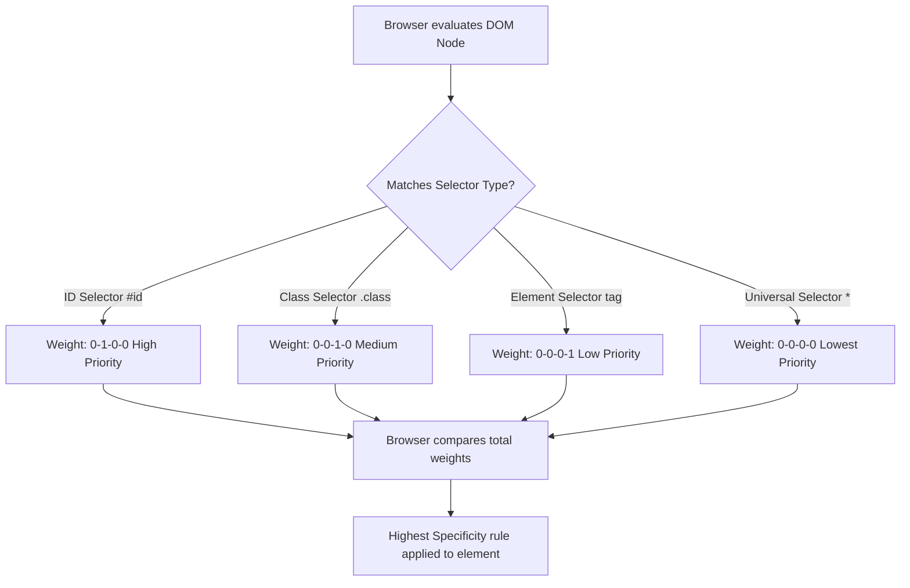

# CSS Selectors

Estimated Reading Time: 25 minutes

Prerequisites: [Introduction to CSS](01-introduction-to-css.md), [Ways to Add CSS](02-ways-to-add-css.md)

Learning Objectives:
- Master core CSS selector categories: Basic (Element, Class, ID, Universal) and Grouping selectors.
- Understand selector syntax, pattern matching rules, and browser target selection logic.
- Calculate CSS specificity scores to predict selector priority behavior accurately.
- Apply industry-standard naming conventions and selector best practices.

---

## Introduction

In CSS, selectors are structural patterns used to target specific HTML elements within a Document Object Model (DOM) tree so that styling rules can be applied to them.

Without selectors, CSS would have no mechanism to communicate *which* elements on a webpage should receive specific colors, fonts, margins, or positioning instructions. Selectors bridge the structural world of HTML markup with the visual world of CSS presentation.

Mastering selectors is crucial for every web developer. Whether you are targeting every paragraph on a page, a single unique navigation button, or a specific group of interactive card containers, CSS selectors provide the precise targeting mechanisms required to build sophisticated user interfaces.

---

## Real-World Analogy

Imagine an announcements system at a large university campus with thousands of students.

- **Universal Selector (`*`)**: The administrator makes an all-hands public broadcast: *"Attention all campus occupants: please pick up your trash."* Every single person on campus is targeted regardless of role.
- **Element Selector (`p`, `h1`)**: The administrator broadcasts: *"Attention all Professors: staff meeting at 3 PM."* Targets every individual holding the specific role of Professor.
- **Class Selector (`.student`)**: The administrator broadcasts: *"Attention members of the Honors Society group: your badges are ready."* Targets any individual who holds the "Honors Society" badge, regardless of whether they are a freshman, sophomore, or graduate student.
- **ID Selector (`#principal`)**: The administrator makes a direct call: *"Will Dr. Aris Thorne report to office 101."* Targets one single specific individual holding that unique identity code.

Selectors act as precise target filters for applying visual instructions across your document structure.

---

## Core Concepts

### 1. Element (Type) Selectors
Targets HTML elements based directly on their tag name (e.g., `h1`, `p`, `button`, `div`).
- **Syntax**: `elementname { ... }`
- **Use Case**: Applying broad baseline styling across all instances of an HTML tag (e.g., making all `<h1>` tags blue).

### 2. Class Selectors
Targets elements that contain a matching `class` attribute in their HTML tag.
- **Syntax**: `.classname { ... }`
- **Use Case**: Reusable component styling. Multiple HTML elements on the same page can share the exact same class name.

### 3. ID Selectors
Targets a single unique HTML element containing a matching `id` attribute.
- **Syntax**: `#idname { ... }`
- **Rule**: An `id` attribute value must be completely unique within a single HTML document. No two elements should share the same ID.

### 4. Universal Selector
Targets every single element tag within the entire document object tree.
- **Syntax**: `* { ... }`
- **Use Case**: Resetting global default browser margins, padding, and box-sizing rules.

### 5. Grouping Selectors
Combines multiple CSS selectors into a comma-separated list to share identical styling declarations without duplicating code blocks.
- **Syntax**: `selector1, selector2, selector3 { ... }`

### 6. Specificity Overview
Specificity is a calculation system browsers use to determine which rule wins when multiple competing selectors target the same element.
- **Inline Style**: Weight = `1,0,0,0`
- **ID Selector**: Weight = `0,1,0,0`
- **Class / Attribute / Pseudo-class Selector**: Weight = `0,0,1,0`
- **Element / Pseudo-element Selector**: Weight = `0,0,0,1`
- **Universal Selector (`*`)**: Weight = `0,0,0,0`

---

## Syntax

```css
/* 1. Element Selector */
p {
    color: #333333;
}

/* 2. Class Selector (prefixed with dot .) */
.btn-primary {
    background-color: #3182ce;
    color: #ffffff;
}

/* 3. ID Selector (prefixed with hash #) */
#main-header {
    background-color: #1a202c;
}

/* 4. Universal Selector */
* {
    box-sizing: border-box;
}

/* 5. Grouping Selectors (separated by commas) */
h1, h2, h3 {
    font-family: Arial, sans-serif;
    color: #2d3748;
}
```

---

## Property Reference

| Selector Type | Syntax Pattern | Matching Criteria | Specificity Weight | Example |
| :--- | :--- | :--- | :--- | :--- |
| **Universal** | `*` | Every DOM node tag | `0,0,0,0` | `* { margin: 0; }` |
| **Element** | `tagname` | All matching HTML tag names | `0,0,0,1` | `h1 { color: red; }` |
| **Class** | `.classname` | Elements with `class="classname"` | `0,0,1,0` | `.card { padding: 10px; }` |
| **ID** | `#idname` | Single element with `id="idname"` | `0,1,0,0` | `#nav { background: black; }` |
| **Grouping** | `sel1, sel2` | Any element matching listed selectors | Evaluated per selector | `h1, .title { color: blue; }` |

---

## Visual Explanation



---

## Example 1

### HTML
```html
<!DOCTYPE html>
<html lang="en">
<head>
    <meta charset="UTF-8">
    <title>Basic Selectors Example</title>
    <style>
        /* Element Selector */
        h1 {
            color: #2b6cb0;
            font-family: Arial, sans-serif;
        }
        /* Class Selectors */
        .info-card {
            background-color: #ebf8ff;
            border-width: 1px;
            border-style: solid;
            border-color: #bee3f8;
            padding: 15px;
        }
        .highlight {
            color: #c53030;
            font-weight: bold;
        }
        /* ID Selector */
        #featured-text {
            font-size: 18px;
        }
    </style>
</head>
<body>
    <h1>Basic Selectors Overview</h1>
    <div class="info-card">
        <p id="featured-text">This paragraph is styled via element, class, and ID selectors.</p>
        <p>This paragraph displays <span class="highlight">highlighted red text</span> using a class.</p>
    </div>
</body>
</html>
```

### CSS
```css
h1 {
    color: #2b6cb0;
    font-family: Arial, sans-serif;
}
.info-card {
    background-color: #ebf8ff;
    border-width: 1px;
    border-style: solid;
    border-color: #bee3f8;
    padding: 15px;
}
.highlight {
    color: #c53030;
    font-weight: bold;
}
#featured-text {
    font-size: 18px;
}
```

### Explanation
The `h1` element selector styles the main heading blue (`#2b6cb0`). The `.info-card` class selector creates a light blue background card around the container. The `#featured-text` ID selector uniquely targets the first paragraph to increase its font size to 18px. The `.highlight` class selector targets the inner `<span>` to render text in bold red (`#c53030`).

---

## Output Image Prompt

A browser window displaying a clean web interface on a white background. At the top left, an `<h1>` heading "Basic Selectors Overview" appears in medium blue (`#2b6cb0`) Arial font. Below the heading is a light blue rectangular container card (`#ebf8ff`) bordered by a thin 1-pixel border (`#bee3f8`) with 15 pixels padding. Inside the card, the top line of text "This paragraph is styled via element, class, and ID selectors." displays in dark text at an 18-pixel font size. The second line below reads "This paragraph displays highlighted red text using a class." with the phrase "highlighted red text" rendered in bold dark crimson red (`#c53030`).

---

## Code Explanation

- `h1`: Target selector for all top-level `<h1>` tags.
- `.info-card`: Class selector prefixed with a dot `.`, targeting `<div class="info-card">`.
- `#featured-text`: ID selector prefixed with a hash `#`, targeting `<p id="featured-text">`.
- `.highlight`: Reusable class selector targeting inline `<span>` tags to apply accent text color.

---

## Example 2

### HTML
```html
<!DOCTYPE html>
<html lang="en">
<head>
    <meta charset="UTF-8">
    <title>Grouping Selectors Component</title>
    <style>
        /* Reset margins */
        * {
            box-sizing: border-box;
        }
        /* Grouping Selector */
        h1, h2, h3 {
            color: #1a202c;
            font-family: Arial, sans-serif;
            margin-bottom: 10px;
        }
        /* Multiple class assignment */
        .btn {
            padding: 10px 20px;
            font-size: 14px;
            border-style: none;
            cursor: pointer;
        }
        .btn-success {
            background-color: #38a169;
            color: #ffffff;
        }
        .btn-danger {
            background-color: #e53e3e;
            color: #ffffff;
        }
    </style>
</head>
<body>
    <h2>User Action Buttons</h2>
    <button class="btn btn-success">Confirm</button>
    <button class="btn btn-danger">Cancel</button>
</body>
</html>
```

### CSS
```css
* {
    box-sizing: border-box;
}

h1, h2, h3 {
    color: #1a202c;
    font-family: Arial, sans-serif;
    margin-bottom: 10px;
}

.btn {
    padding: 10px 20px;
    font-size: 14px;
    border-style: none;
    cursor: pointer;
}

.btn-success {
    background-color: #38a169;
    color: #ffffff;
}

.btn-danger {
    background-color: #e53e3e;
    color: #ffffff;
}
```

### Explanation
This component uses a grouping selector `h1, h2, h3` to share typography rules across headings. It also demonstrates class composition: the HTML buttons combine the base `.btn` class (providing shared padding, sizing, and cursor behavior) with contextual variant classes `.btn-success` (green) and `.btn-danger` (red).

---

## Output Image Prompt

A browser window displaying a simple button bar component on a white background. An `<h2>` heading "User Action Buttons" appears in dark charcoal text (`#1a202c`) using Arial typography. Below the heading are two side-by-side rectangular buttons. The left button contains white text "Confirm" on a solid green background (`#38a169`) with 10px top/bottom padding and 20px left/right padding. The right button contains white text "Cancel" on a solid red background (`#e53e3e`) with identical padding dimensions. Both buttons have border-free edges.

---

## Code Explanation

- `h1, h2, h3`: Comma-separated grouping selector applying shared styles to three heading tag types simultaneously.
- `.btn`: Base class assigning foundational layout dimensions to all buttons.
- `.btn-success` & `.btn-danger`: Modifier classes that extend base button styles with specific background colors.
- `class="btn btn-success"`: HTML class attribute containing multiple space-separated class names to merge style rules.

---

## Best Practices

- **Prefer Class Selectors**: Build components using class selectors (`.card`, `.btn`) to ensure high style reusability across your codebase.
- **Avoid ID Selectors for Styling**: IDs carry high specificity weights (`0,1,0,0`) which makes them difficult to override without using bad practices like `!important`. Save IDs for JS hooks and HTML anchor tags.
- **Use Class Composition**: Combine small, modular classes (e.g. `class="btn btn-primary"`) instead of writing long, repetitive CSS blocks.
- **Keep Specificity Low**: Aim to keep selector specificity as low and flat as possible for easier long-term maintenance.
- **Use Semantic Class Naming**: Name classes according to what an element *is* (`.alert-box`) rather than how it *looks* (`.red-box`).

---

## Common Mistakes

### Mistake 1: Forgetting the Dot (.) or Hash (#) Prefix in CSS

```css
/* INCORRECT */
card {
    background-color: white;
}
```

#### Explanation
Writing `card` without a dot prefix causes CSS to look for an HTML element named `<card>`. To target elements with `class="card"`, you must include the dot prefix.

```css
/* CORRECT */
.card {
    background-color: white;
}
```

---

### Mistake 2: Reusing the Same ID Across Multiple Elements

```html
<!-- INCORRECT -->
<p id="info">First text block</p>
<p id="info">Second text block</p>
```

#### Explanation
HTML IDs must be strictly unique within a document. Reusing IDs breaks HTML validation and can cause unexpected JavaScript behavior.

```html
<!-- CORRECT -->
<p class="info">First text block</p>
<p class="info">Second text block</p>
```

---

### Mistake 3: Over-using the Universal Selector (*)

```css
/* INCORRECT */
* {
    color: red;
    font-size: 16px;
}
```

#### Explanation
Applying visual properties like color or font size globally via `*` overrides inheritances and forces browser calculation engines to evaluate every DOM node explicitly. Restrict `*` usage to layout resets (such as `box-sizing` or `margin: 0`).

```css
/* CORRECT */
body {
    color: red;
    font-size: 16px;
}
```

---

## Browser Compatibility

Basic CSS selectors (Element, Class, ID, Grouping, and Universal) have 100% full compatibility across every desktop and mobile browser version ever released, including legacy IE5+.

---

## Real-World Applications

- **UI Button Libraries**: Building base `.btn` classes extended by color variants (`.btn-primary`, `.btn-secondary`).
- **Card Design Patterns**: Styling reusable `.card`, `.card-header`, and `.card-body` containers across e-commerce grids.
- **Global CSS Resets**: Utilizing `*` to establish consistent border-box sizing across entire application layouts.
- **Navigation Systems**: Applying `#main-nav` or `.nav-link` selectors to structure header links consistently.

---

## Mini Project

### Project Objective: Styled Notification Alert System
Build a set of notification banner alerts using base and modifier class selectors.

#### Requirements:
1. Create a baseline class `.alert` that defines padding, border-radius, font family, and margin.
2. Create modifier classes `.alert-info`, `.alert-success`, and `.alert-warning` that apply different background and text colors.
3. Apply these classes to three separate HTML banner elements and verify proper visual rendering.

---

## Practice Exercises

### Beginner Level
1. Write a CSS element selector that sets the color of all `<h3>` headings to navy blue.
2. Create a class selector named `.lead-text` that sets font size to `20px`.
3. Create an ID selector named `#site-footer` that sets background color to dark gray (`#2d3748`).
4. Write a universal selector rule that removes default margins from all elements.
5. Use a grouping selector to make `h4`, `h5`, and `h6` headings uppercase (`text-transform: uppercase`).

### Intermediate Level
6. Calculate the specificity score of `#header .nav li.active`.
7. Create an HTML element assigned two classes (`.card` and `.featured`) and write CSS rules for both.
8. Refactor three separate CSS rules setting `font-family: Arial` on `p`, `span`, and `li` into a single grouping selector.
9. Fix a CSS bug where `.button` rules are failing to target `<a class="button">` due to a missing dot prefix.
10. Write CSS targeting an element with both a class `.box` and ID `#hero` simultaneously.

### Advanced Level
11. Construct a specificity hierarchy table showing how `#nav` overrides `.nav-item` which overrides `nav a`.
12. Create a component layout relying exclusively on modular class composition without using ID selectors.
13. Write a global CSS reset block using `*`, `*::before`, and `*::after`.
14. Explain how browser parsing engines evaluate CSS selectors from right to left during DOM matching.
15. Demonstrate how specificity conflict resolution operates when source order is reversed between class and element rules.

---

## Quick Quiz

**1. Which prefix character identifies a class selector in CSS?**
A) Hash (`#`)  
B) Dot (`.`)  
C) At symbol (`@`)  
D) Ampersand (`&`)  

**2. Which prefix character identifies an ID selector in CSS?**
A) Hash (`#`)  
B) Dot (`.`)  
C) Semicolon (`;`)  
D) Slash (`/`)  

**3. How many elements on a single HTML page should share the same ID value?**
A) Unlimited  
B) Up to 5  
C) Exactly 1  
D) Exactly 10  

**4. What does the universal selector `*` target?**
A) Only paragraph tags  
B) Only elements with classes  
C) Every element in the HTML DOM tree  
D) Only head tags  

**5. How are multiple selectors separated when using a grouping selector?**
A) Semicolons  
B) Spaces  
C) Commas  
D) Plus signs  

**6. Which selector type carries the highest specificity score?**
A) Element selector  
B) Class selector  
C) ID selector  
D) Universal selector  

**7. In the selector `.nav .item`, what does the dot before `item` indicate?**
A) `item` is an ID  
B) `item` is a class  
C) `item` is an HTML tag  
D) `item` is a JavaScript variable  

**8. What is the specificity weight of an element selector (e.g. `div`)?**
A) `0,1,0,0`  
B) `0,0,1,0`  
C) `0,0,0,1`  
D) `1,0,0,0`  

**9. What happens if two competing CSS class selectors with equal specificity target the same element property?**
A) The browser crashes  
B) The rule declared later in the CSS stylesheet source code wins  
C) The rule declared first wins  
D) Neither rule applies  

**10. Why are class selectors preferred over ID selectors for styling reusable UI components?**
A) Classes load faster over the network  
B) Classes can be reused on multiple elements and maintain lower specificity  
C) IDs cannot hold color properties  
D) IDs only work in Internet Explorer  

---

### Answers
1: B | 2: A | 3: C | 4: C | 5: C | 6: C | 7: B | 8: C | 9: B | 10: B

---

## Interview Questions

**1. What are basic CSS selectors and what are their primary categories?**  
*Answer:* Basic CSS selectors match HTML elements to apply styles. Core categories include Element Selectors (target tag names like `p`), Class Selectors (target `.class`), ID Selectors (target `#id`), Universal Selector (`*`), and Grouping Selectors (comma-separated lists like `h1, h2`).

**2. Explain CSS Specificity and how it is calculated.**  
*Answer:* Specificity is the calculation algorithm browsers use to resolve conflicting style rules. It is calculated as a 4-part weight: Inline Styles (`1,0,0,0`), IDs (`0,1,0,0`), Classes/Attributes/Pseudo-classes (`0,0,1,0`), and Elements/Pseudo-elements (`0,0,0,1`). The rule with highest weight wins.

**3. Why should web developers generally avoid using ID selectors for visual styling?**  
*Answer:* ID selectors carry a very high specificity score (`0,1,0,0`). Using IDs for styling makes rules difficult to override in modular component stylesheets, forcing developers into bad practices like using `!important`. Classes offer reusable, lower-specificity styling.

**4. What is a Grouping Selector and what problem does it solve?**  
*Answer:* A grouping selector combines multiple selectors separated by commas (e.g. `h1, h2, p { font-family: Arial; }`). It prevents code duplication by allowing multiple elements to share identical CSS declaration blocks.

**5. What is the difference between `.title` and `h1.title`?**  
*Answer:* `.title` targets *any* element assigned `class="title"`. `h1.title` targets *only* `<h1>` tags that contain `class="title"`. `h1.title` has higher specificity (`0,0,1,1`) than `.title` (`0,0,1,0`).

**6. What is the specificity weight of the universal selector `*`?**  
*Answer:* The universal selector `*` has a specificity weight of `0,0,0,0`. It targets all DOM nodes but is easily overridden by any element, class, or ID selector rule.

**7. Can an HTML element have multiple classes assigned to it? How is this written in HTML and CSS?**  
*Answer:* Yes. In HTML, multiple class names are space-separated within the `class` attribute (e.g. `<button class="btn btn-primary">`). In CSS, rules are defined for `.btn` and `.btn-primary` independently.

**8. What occurs when two rules targeting the exact same element have completely identical specificity?**  
*Answer:* When specificity scores are identical, the Cascade uses Source Order to resolve the tie: the rule defined *latest* (lower down) in the stylesheet overrides earlier rules.

**9. How do browsers evaluate CSS selectors during layout engine parsing?**  
*Answer:* Modern browser parsing engines evaluate complex CSS selectors from **right to left** (key selector first). This allows engines to quickly eliminate non-matching DOM elements without traversing unnecessary parent trees.

**10. What is semantic class naming? Give an example.**  
*Answer:* Semantic class naming means naming classes based on what an element represents functionally in the application (e.g., `.site-header`, `.nav-menu`, `.alert-banner`) rather than its visual styling details (e.g., `.blue-header`, `.centered-text`).

---

## Summary

- CSS Selectors target HTML elements in the DOM tree to apply styling declaration blocks.
- **Element Selectors** target HTML tag names (`p`, `h1`).
- **Class Selectors** (`.classname`) target elements via `class` attributes and are reusable.
- **ID Selectors** (`#idname`) target single unique elements and carry high specificity.
- **Universal Selector** (`*`) targets all elements in the DOM.
- **Grouping Selectors** (`h1, h2, h3`) share declarations across multiple selectors.
- **Specificity** calculates selector priority to resolve styling conflicts.

---

## Cheat Sheet

```css
/* SELECTOR SYNTAX CHEAT SHEET */

* { }             /* Universal Selector (all elements) */
p { }             /* Element Selector (all <p> tags) */
.card { }         /* Class Selector (elements with class="card") */
#header { }       /* ID Selector (element with id="header") */
h1, h2 { }        /* Grouping Selector (all <h1> and <h2> tags) */
div.card { }      /* Compound Selector (<div> tags with class="card") */

/* SPECIFICITY WEIGHT MATRIX */
/* Inline style -> 1,0,0,0 */
/* ID           -> 0,1,0,0 */
/* Class        -> 0,0,1,0 */
/* Element      -> 0,0,0,1 */
```

---

## Related Topics

- **Previous Topic**: [Ways to Add CSS](02-ways-to-add-css.md)
- **Next Topic**: [CSS Colors](04-css-colors.md)
- **Recommended Learning Order**: Introduction to CSS -> Ways to Add CSS -> CSS Selectors -> CSS Colors -> CSS Box Model
