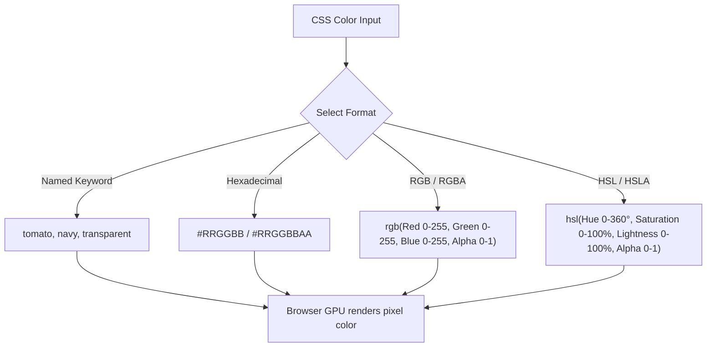

# CSS Colors

Estimated Reading Time: 25 minutes

Prerequisites: [Introduction to CSS](01-introduction-to-css.md), [CSS Selectors](03-css-selectors.md)

Learning Objectives:
- Understand color formats in CSS: Named Colors, Hexadecimal, RGB, RGBA, HSL, and HSLA.
- Master alpha channels and transparency controls in digital color models.
- Learn how to choose appropriate color properties for text, backgrounds, and borders.
- Apply contrast and accessibility standards (WCAG guidelines) when styling modern user interfaces.

---

## Introduction

Color is one of the most fundamental visual mediums in digital user interface design. CSS provides comprehensive color tools that allow developers to set foreground text colors, background fills, border outlines, shadows, and vector accents.

CSS supports multiple color notation formats, ranging from simple keyword names (like `red` or `navy`) to numeric digital color spaces such as Hexadecimal (`#ff0000`), RGB/RGBA (`rgb(255, 0, 0)`), and HSL/HSLA (`hsl(0, 100%, 50%)`).

Understanding how color spaces function in browsers enables developers to create vibrant palettes, control overlay transparency, implement dark mode themes, and guarantee WCAG accessibility standards for vision-impaired users.

---

## Real-World Analogy

Imagine you are mixing physical paint at an art store paint counter.

- **Named Colors**: You ask the clerk for "Navy Blue". The clerk grabs a pre-mixed bucket off the shelf. Simple, but limited to exact pre-made colors.
- **RGB (Red, Green, Blue)**: The paint mixing machine has three primary color dispensers: Red, Green, and Blue light channels. You dial three knobs from 0 to 255 to mix precise amounts of red light, green light, and blue light into a digital tube.
- **RGBA (Alpha Channel)**: You take your mixed RGB paint tube and dilute it with clear glass gel. Adding alpha transparency lets underlying background surfaces show through the paint.
- **HSL (Hue, Saturation, Lightness)**: You pick colors using an artist's color wheel:
  1. **Hue**: You spin the wheel to pick the color angle (0° Red, 120° Green, 240° Blue).
  2. **Saturation**: You choose how intense/pure the pigment is (100% vibrant vs 0% dull gray).
  3. **Lightness**: You add black or white paint to make the shade darker or brighter.

HSL feels natural to human designers, while Hex and RGB map directly to digital monitor pixels.

---

## Core Concepts

### 1. Color Properties in CSS
- **`color`**: Controls the foreground color of text content and inline icons.
- **`background-color`**: Controls the surface background color fill behind an element.
- **`border-color`**: Controls the color of an element's structural border outline.

### 2. Named Colors
CSS includes 147 standard keyword color names (e.g. `red`, `blue`, `tomato`, `cornflowerblue`, `transparent`, `currentColor`).
- **Pros**: Easy to write and memorize.
- **Cons**: Extremely limited palette, lacks transparency adjustments.

### 3. Hexadecimal Notation (HEX)
Hexadecimal uses a 6-character code prefixed by a hash symbol `#RRGGBB` representing Red, Green, and Blue channels in base-16 arithmetic (`00` to `FF`).
- **Syntax**: `#ff0000` (Red), `#00ff00` (Green), `#0000ff` (Blue).
- **Shorthand**: 3-digit shorthand `#RGB` expands identical pairs (e.g., `#f00` expands to `#ff0000`).
- **8-digit Hex**: `#RRGGBBAA` includes alpha opacity.

### 4. RGB and RGBA Notation
RGB specifies primary light channel values ranging from `0` to `255` (or `0%` to `100%`).
- **RGB Syntax**: `rgb(red, green, blue)` -> `rgb(255, 0, 0)`
- **RGBA Syntax**: `rgba(red, green, blue, alpha)` -> `rgba(255, 0, 0, 0.5)` where alpha ranges from `0.0` (fully transparent) to `1.0` (fully opaque).
- *Modern CSS Color Level 4 Syntax*: `rgb(255 0 0 / 50%)`

### 5. HSL and HSLA Notation
HSL represents colors using Hue angle, Saturation percentage, and Lightness percentage.
- **Hue**: Angle on the color wheel from `0` to `360` degrees (`0` = Red, `120` = Green, `240` = Blue).
- **Saturation**: Percentage from `0%` (gray scale) to `100%` (full color vibrancy).
- **Lightness**: Percentage from `0%` (pure black) to `100%` (pure white). `50%` is normal lightness.
- **HSLA Syntax**: `hsla(hue, saturation, lightness, alpha)` -> `hsla(210, 100%, 50%, 0.8)`

---

## Syntax

```css
/* 1. Named Color Keyword */
.box-named {
    color: darknavy;
    background-color: lightgray;
}

/* 2. Hexadecimal Format (#RRGGBB) */
.box-hex {
    color: #1a202c;
    background-color: #ebf8ff;
    border-color: #3182ce;
}

/* 3. RGB & RGBA Format */
.box-rgb {
    color: rgb(45, 55, 72);
    background-color: rgba(49, 130, 206, 0.15); /* 15% opacity blue */
}

/* 4. HSL & HSLA Format */
.box-hsl {
    color: hsl(210, 30%, 20%);
    background-color: hsla(210, 80%, 60%, 0.2);
}
```

---

## Property Reference

| Format Name | Syntax Example | Color Space Basis | Alpha Channel Support | Readability |
| :--- | :--- | :--- | :--- | :--- |
| **Named** | `color: tomato;` | Predefined Keywords | No (except `transparent`) | High |
| **HEX** | `color: #3182ce;` | Base-16 Red/Green/Blue | Yes (`#3182ce80`) | Machine Readable |
| **RGB / RGBA** | `color: rgba(49,130,206,0.5);` | 0-255 Red/Green/Blue | Yes (0.0 to 1.0) | High |
| **HSL / HSLA** | `color: hsla(210,100%,50%,0.8);` | Hue Angle / Sat% / Light% | Yes (0.0 to 1.0) | Designer Friendly |

---

## Visual Explanation



---

## Example 1

### HTML
```html
<!DOCTYPE html>
<html lang="en">
<head>
    <meta charset="UTF-8">
    <title>CSS Color Formats Demo</title>
    <style>
        body {
            background-color: #f7fafc;
            font-family: Arial, sans-serif;
            padding: 20px;
        }
        .color-card {
            background-color: #ffffff;
            border-width: 1px;
            border-style: solid;
            border-color: #e2e8f0;
            padding: 20px;
        }
        .text-hex {
            color: #2b6cb0;
        }
        .text-rgba {
            color: rgba(45, 55, 72, 0.7);
        }
        .badge-hsl {
            background-color: hsla(145, 63%, 42%, 0.15);
            color: hsl(145, 63%, 32%);
            padding: 5px 10px;
        }
    </style>
</head>
<body>
    <div class="color-card">
        <h2 class="text-hex">Hexadecimal Title (#2b6cb0)</h2>
        <p class="text-rgba">Paragraph rendered using RGBA color with 70% opacity.</p>
        <span class="badge-hsl">HSL Status Badge</span>
    </div>
</body>
</html>
```

### CSS
```css
body {
    background-color: #f7fafc;
    font-family: Arial, sans-serif;
    padding: 20px;
}
.color-card {
    background-color: #ffffff;
    border-width: 1px;
    border-style: solid;
    border-color: #e2e8f0;
    padding: 20px;
}
.text-hex {
    color: #2b6cb0;
}
.text-rgba {
    color: rgba(45, 55, 72, 0.7);
}
.badge-hsl {
    background-color: hsla(145, 63%, 42%, 0.15);
    color: hsl(145, 63%, 32%);
    padding: 5px 10px;
}
```

### Explanation
This example demonstrates three separate CSS color formats in action. The heading uses Hex format (`#2b6cb0`) for crisp dark blue text. The body paragraph uses RGBA (`rgba(45, 55, 72, 0.7)`) to apply a dark slate text color with 70% opacity. The inline badge uses HSLA to create a light green background tint (`hsla(145, 63%, 42%, 0.15)`) paired with a darker green text color (`hsl(145, 63%, 32%)`).

---

## Output Image Prompt

A browser window displaying a white rectangular card container (`#ffffff`) on a soft off-white background (`#f7fafc`) with 20 pixels padding around the screen. Inside the card container, an `<h2>` heading reads "Hexadecimal Title (#2b6cb0)" in vibrant medium blue text. Below the heading is a text line "Paragraph rendered using RGBA color with 70% opacity." in dark slate gray at 70% opacity. Below the text is a small green inline badge pill reading "HSL Status Badge" featuring a light mint green background tint and dark emerald green text.

---

## Code Explanation

- `color: #2b6cb0;`: Sets blue foreground text color using a 6-digit Hex code.
- `color: rgba(45, 55, 72, 0.7);`: Sets foreground color using RGBA. The `0.7` alpha channel renders text with 30% transparency.
- `background-color: hsla(145, 63%, 42%, 0.15);`: Sets badge background using HSL hue 145 (green) at 15% opacity transparency.

---

## Example 2

### HTML
```html
<!DOCTYPE html>
<html lang="en">
<head>
    <meta charset="UTF-8">
    <title>Transparent Overlay Component</title>
    <style>
        .banner {
            background-color: #2d3748;
            padding: 40px;
            color: #ffffff;
            font-family: Arial, sans-serif;
        }
        .overlay-box {
            background-color: rgba(0, 0, 0, 0.5);
            border-width: 1px;
            border-style: solid;
            border-color: rgba(255, 255, 255, 0.3);
            padding: 20px;
        }
        .overlay-title {
            margin: 0;
            color: #ffffff;
        }
    </style>
</head>
<body>
    <div class="banner">
        <div class="overlay-box">
            <h3 class="overlay-title">Semi-Transparent Overlay</h3>
            <p>This container uses RGBA transparency to blend over dark background surfaces.</p>
        </div>
    </div>
</body>
</html>
```

### CSS
```css
.banner {
    background-color: #2d3748;
    padding: 40px;
    color: #ffffff;
    font-family: Arial, sans-serif;
}
.overlay-box {
    background-color: rgba(0, 0, 0, 0.5);
    border-width: 1px;
    border-style: solid;
    border-color: rgba(255, 255, 255, 0.3);
    padding: 20px;
}
.overlay-title {
    margin: 0;
    color: #ffffff;
}
```

### Explanation
This component creates a transparent card overlay. The `.banner` container has a solid dark gray background (`#2d3748`). The nested `.overlay-box` applies a semi-transparent black background fill (`rgba(0, 0, 0, 0.5)`) and a semi-transparent white border (`rgba(255, 255, 255, 0.3)`), allowing underlying background tones to subtly pass through.

---

## Output Image Prompt

A browser viewport showing a dark slate gray background section (`#2d3748`) with 40 pixels padding. Inside the dark area sits a rectangular overlay box featuring a semi-transparent black background tint (`rgba(0, 0, 0, 0.5)`) outlined by a thin translucent white border (`rgba(255, 255, 255, 0.3)`). Inside the overlay box, white Arial heading text reads "Semi-Transparent Overlay" alongside white body text reading "This container uses RGBA transparency to blend over dark background surfaces."

---

## Code Explanation

- `background-color: rgba(0, 0, 0, 0.5);`: Creates a 50% translucent black background overlay layer.
- `border-color: rgba(255, 255, 255, 0.3);`: Creates a 30% translucent white outline border.
- Transparency blending allows complex UI card layering over background colors or hero banners.

---

## Best Practices

- **Ensure WCAG Text Contrast**: Guarantee a minimum contrast ratio of 4.5:1 for standard body text against background colors to ensure readability for visually impaired users.
- **Use HSL for Color Themes**: Use HSL when creating light/dark theme variants or hover states—adjusting Lightness (`L`) creates consistent lighter/darker color shades effortlessly.
- **Use RGBA/HSLA for Overlays**: Prefer RGBA or HSLA over the `opacity` property when you want transparent background fills without making inner child text transparent.
- **Use Consistent Formats**: Standardize on Hex or HSL across project stylesheets for consistent code maintenance.

---

## Common Mistakes

### Mistake 1: Using `opacity` Property Instead of `rgba()` for Backgrounds

```css
/* INCORRECT */
.card {
    background-color: black;
    opacity: 0.5; /* Makes text inside card transparent as well! */
}
```

#### Explanation
Applying the `opacity` property to a parent container makes the entire container—including all child text and images—transparent. Use `rgba()` on `background-color` to transparentize only the background fill.

```css
/* CORRECT */
.card {
    background-color: rgba(0, 0, 0, 0.5); /* Only background is transparent */
}
```

---

### Mistake 2: Missing Percentage Symbols in HSL Parameters

```css
/* INCORRECT */
p {
    color: hsl(210, 50, 50);
}
```

#### Explanation
In HSL notation, Saturation and Lightness values **must** include explicit percentage symbols `%`. Omitting `%` causes syntax parsing failures.

```css
/* CORRECT */
p {
    color: hsl(210, 50%, 50%);
}
```

---

### Mistake 3: Poor Text Color Contrast Ratios

```css
/* INCORRECT */
body {
    background-color: #ffffff;
    color: #cccccc; /* Light gray text on white background violates WCAG contrast */
}
```

#### Explanation
Using extremely low-contrast text colors makes content unreadable and violates accessibility laws.

```css
/* CORRECT */
body {
    background-color: #ffffff;
    color: #2d3748; /* High contrast readable dark gray */
}
```

---

## Browser Compatibility

All standard CSS color formats (Named Keywords, 6-digit Hex, 3-digit Hex, RGB, RGBA, HSL, and HSLA) have 100% full cross-browser support across all modern browsers (Chrome, Safari, Firefox, Edge, Opera) and historical releases (IE9+).

Modern CSS Color Level 4 space-separated syntaxes (`rgb(0 0 0 / 50%)`) have full support across all modern evergreen browser versions updated since 2020.

---

## Real-World Applications

- **Theme Systems**: Using HSL variables to toggle between Light Mode and Dark Mode color schemes seamlessly.
- **Status Badges**: Formatting green success alerts (`hsla(145, 60%, 40%, 0.1)`), red error alerts, and yellow warning tags.
- **Hero Image Overlays**: Placing semi-transparent dark RGBA overlays over background images to keep white text readable.
- **Interactive States**: Lightening or darkening button background colors on `:hover` using HSL lightness adjustments.

---

## Mini Project

### Project Objective: Accessible Alert Banner Component Palette
Build a set of status alert notification banners (Success, Warning, Error) using HSL color modeling.

#### Requirements:
1. Define a baseline card container with 15px padding and 1px border.
2. Create a Success alert with a light green background fill (`HSLA`), dark green border (`HSL`), and dark green text (`HSL`).
3. Create an Error alert with a light red background fill (`HSLA`), dark red border (`HSL`), and dark red text (`HSL`).
4. Ensure text contrast ratios meet accessibility standards.

---

## Practice Exercises

### Beginner Level
1. Set the background color of a web page to `lightgray` using a named color keyword.
2. Change the text color of an `<h1>` tag to dark blue using 6-digit Hex notation (`#00008b`).
3. Write an `rgba()` declaration that sets a background color to black with 50% transparency.
4. Set an element border color to solid green using RGB notation (`rgb(0, 128, 0)`).
5. Convert the hex color `#ffffff` into RGB format.

### Intermediate Level
6. Write an HSL declaration representing a pure bright red color at 50% lightness.
7. Create a button that has a solid blue background (`#3182ce`) and a hover state that darkens lightness using HSL.
8. Apply a semi-transparent white background (`rgba(255, 255, 255, 0.8)`) to a card overlay.
9. Write 3-digit hex shorthand equivalent for `#ff0000` and `#006699`.
10. Calculate text contrast ratio for dark text (`#1a202c`) on a white background (`#ffffff`).

### Advanced Level
11. Build a CSS variable color system using HSL values to enable instant Dark Mode palette toggling.
12. Compare memory and GPU parsing characteristics of Hex codes vs RGBA in high-frequency animations.
13. Formulate a semi-transparent glassmorphism background effect combining `rgba()` fills with border outlines.
14. Demonstrate how `currentColor` keyword inherits parent text color for SVG icons and border lines dynamically.
15. Explain how the browser engine processes color conversions between sRGB and HSL color spaces.

---

## Quick Quiz

**1. What does the "A" in RGBA and HSLA stand for?**
A) Accent  
B) Alpha  
C) Angle  
D) Attribute  

**2. What is the range of values for the Alpha channel in RGBA?**
A) 0 to 255  
B) 0% to 100%  
C) 0.0 to 1.0  
D) 0 to 360  

**3. In Hexadecimal color notation `#RRGGBB`, what number base is used?**
A) Base-2 (Binary)  
B) Base-10 (Decimal)  
C) Base-16 (Hexadecimal)  
D) Base-8 (Octal)  

**4. What does a Hue angle of 0° represent on the HSL color wheel?**
A) Green  
B) Blue  
C) Red  
D) Yellow  

**5. What is the Lightness percentage for pure white in HSL?**
A) 0%  
B) 50%  
C) 100%  
D) 360%  

**6. Which property changes the background color fill of a DOM element?**
A) `color`  
B) `background-color`  
C) `border-color`  
D) `text-fill`  

**7. Why is `background-color: rgba(...)` preferred over `opacity: 0.5` for card overlays?**
A) `rgba()` runs faster  
B) `rgba()` transparentizes only the background fill without making child text transparent  
C) `opacity` does not work in Chrome  
D) `rgba()` works without HTML tags  

**8. What 3-digit shorthand represents the 6-digit Hex color `#00ff00`?**
A) `#0f0`  
B) `#00f`  
C) `#f00`  
D) `#0ff`  

**9. What is the maximum value for Red, Green, and Blue channels in `rgb()` notation?**
A) 100  
B) 255  
C) 360  
D) 1024  

**10. What accessibility guidelines dictate minimum color contrast ratios for web text?**
A) DOM Level 3  
B) W3C HTML5  
C) WCAG (Web Content Accessibility Guidelines)  
D) ECMAScript 6  

---

### Answers
1: B | 2: C | 3: C | 4: C | 5: C | 6: B | 7: B | 8: A | 9: B | 10: C

---

## Interview Questions

**1. What are the primary color formats supported in CSS and how do they differ?**  
*Answer:* Primary formats include Named Keywords (simple strings like `red`), Hexadecimal (`#RRGGBB` base-16), RGB (`rgb(r,g,b)` light values 0-255), RGBA (RGB + alpha opacity), HSL (`hsl(h,s%,l%)` hue/saturation/lightness), and HSLA (HSL + alpha opacity).

**2. Explain the difference between setting `opacity: 0.5` vs `background-color: rgba(0,0,0,0.5)`.**  
*Answer:* `opacity: 0.5` applies transparency to the target element and **all** of its children (including text and images). `background-color: rgba(...)` applies transparency strictly to the element's background color fill, leaving child text and content 100% opaque.

**3. How does the HSL color model work and why do designers favor it?**  
*Answer:* HSL models color using Hue (angle 0-360° on color wheel), Saturation (0-100% color purity), and Lightness (0-100% white/black balance). Designers favor it because creating monochromatic palettes, hover states, or dark mode themes simply requires tweaking Lightness or Saturation values logically.

**4. What is 3-digit Hex shorthand and how is `#f4c` interpreted by the browser?**  
*Answer:* 3-digit Hex shorthand expands single hex characters into repeated pairs. `#f4c` expands to `#ff44cc` (Red `FF`, Green `44`, Blue `CC`).

**5. What is the `currentColor` keyword in CSS and how is it used?**  
*Answer:* `currentColor` is a dynamic CSS keyword representing the computed value of the element's `color` property. It allows borders, shadows, or nested SVG fill paths to automatically adopt the current text color without declaring explicit color codes.

**6. How does 8-digit Hex notation work in modern CSS?**  
*Answer:* 8-digit Hex notation `#RRGGBBAA` appends two extra base-16 digits (`AA`) at the end of a standard Hex code to specify alpha channel opacity (e.g. `#00000080` represents 50% translucent black).

**7. Why is color contrast ratio important for web accessibility?**  
*Answer:* Sufficient color contrast ensures text remains readable for users with visual impairments, color blindness, or users viewing screens under bright ambient light. WCAG AA standards require a minimum contrast ratio of 4.5:1 for standard text.

**8. What does a Saturation value of 0% produce in HSL?**  
*Answer:* A Saturation value of 0% removes all color pigment, producing a neutral grayscale tone determined strictly by the Lightness percentage.

**9. How do you create a smooth transparent color overlay over a background image in CSS?**  
*Answer:* You can apply a linear gradient containing `rgba()` or `hsla()` color stops over the background image using `background-image: linear-gradient(rgba(0,0,0,0.6), rgba(0,0,0,0.6)), url('image.jpg');`.

**10. What is the default value of `background-color` in standard CSS?**  
*Answer:* The default value of `background-color` is `transparent`. The background of parent containers or the root document viewport shows through unstyled elements.

---

## Summary

- CSS supports multiple color formats: **Named Keywords**, **HEX**, **RGB/RGBA**, and **HSL/HSLA**.
- **HEX** uses 6 or 8-digit base-16 notation (`#RRGGBB` / `#RRGGBBAA`).
- **RGB** mixes Red, Green, and Blue light channels (0-255).
- **HSL** mixes Hue angle (0-360°), Saturation (%), and Lightness (%), providing an intuitive format for thematic design adjustments.
- **Alpha Channels** (`rgba()`, `hsla()`, 8-digit Hex) control transparency from `0.0` (transparent) to `1.0` (opaque).
- Always maintain WCAG AA contrast standards (minimum 4.5:1 ratio) for text legibility.

---

## Cheat Sheet

```css
/* COLOR FORMAT CHEAT SHEET */

/* Named Keyword */
color: navy;

/* Hexadecimal (6-digit & 8-digit alpha) */
color: #3182ce;
color: #3182ce80; /* 50% opacity */

/* RGB & RGBA */
color: rgb(49, 130, 206);
background-color: rgba(49, 130, 206, 0.5); /* 50% opacity */

/* HSL & HSLA */
color: hsl(210, 60%, 50%);
background-color: hsla(210, 60%, 50%, 0.2); /* 20% opacity */

/* Dynamic Text Color Inheritance */
border-color: currentColor;
```

---

## Related Topics

- **Previous Topic**: [CSS Selectors](03-css-selectors.md)
- **Next Topic**: [CSS Fonts](05-css-fonts.md)
- **Recommended Learning Order**: Introduction to CSS -> Ways to Add CSS -> CSS Selectors -> CSS Colors -> CSS Fonts -> CSS Box Model
