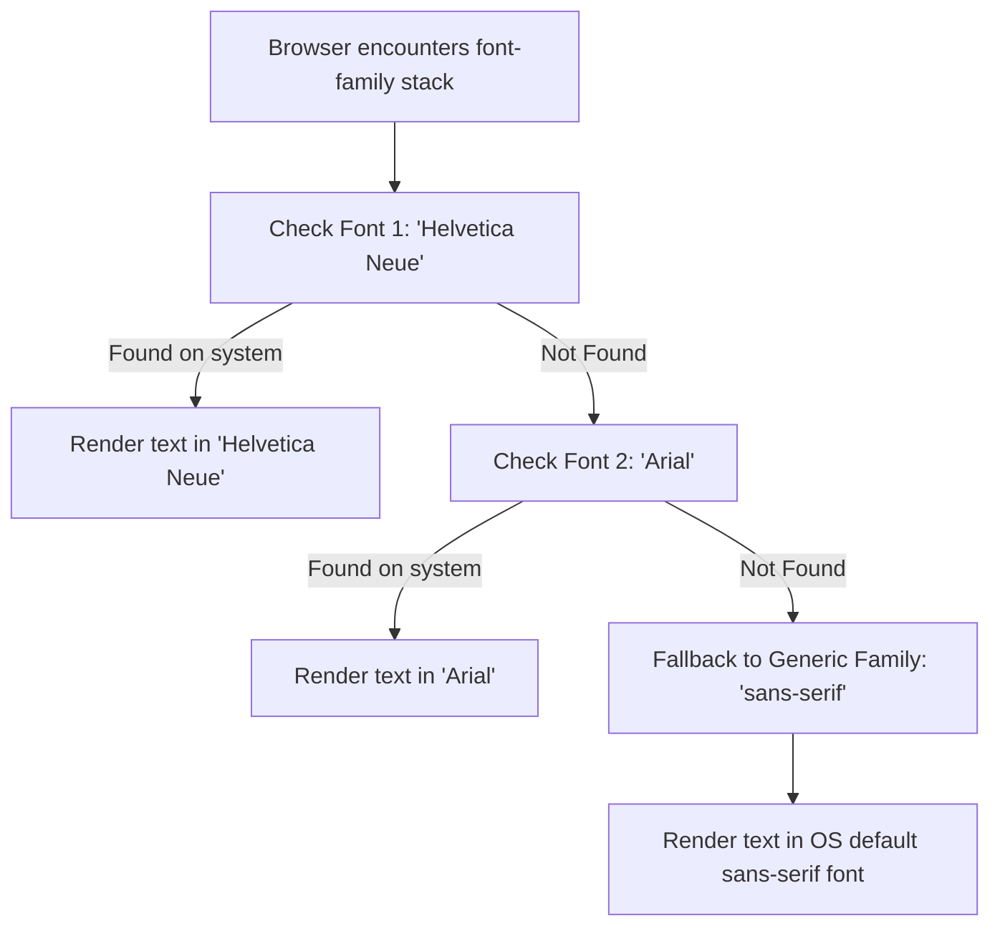

# CSS Fonts

Estimated Reading Time: 25 minutes

Prerequisites: [Introduction to CSS](01-introduction-to-css.md), [CSS Selectors](03-css-selectors.md)

Learning Objectives:
- Master core font properties: `font-family`, `font-size`, `font-weight`, `font-style`, and `line-height`.
- Understand generic font families (serif, sans-serif, monospace, cursive, fantasy).
- Learn web-safe font fallback stacks and font loading mechanisms.
- Utilize the `font` shorthand property cleanly and accurately.

---

## Introduction

Typography is one of the most critical aspects of web design. More than 90% of information on the web is delivered in the form of written text. CSS font properties give developers full control over how text characters are styled, sized, formatted, and rendered across user displays.

CSS font properties dictate the typeface family (e.g. Arial, Georgia), character size (`font-size`), character boldness (`font-weight`), posture (`font-style`), and vertical line spacing (`line-height`).

By understanding typography principles in CSS, developers can build clear reading hierarchies, enhance content legibility, improve brand identity, and maintain consistent text formatting across various operating systems and mobile devices.

---

## Real-World Analogy

Imagine a book printing press publishing different types of literature.

- **Serif Fonts (Georgia, Times New Roman)**: The publisher prints an ancient history textbook using traditional letters with small decorative strokes (serifs) attached to the ends of letter stems. This evokes elegance, authority, and traditional print media.
- **Sans-Serif Fonts (Arial, Helvetica)**: The publisher prints a modern technology magazine using clean, streamlined letters *without* decorative tail strokes ("sans" means without). This provides a crisp, contemporary aesthetic ideal for digital computer screens.
- **Monospace Fonts (Courier New, Consolas)**: The publisher prints a computer programming guide where every character—from a narrow 'i' to a wide 'w'—takes up the exact same horizontal width. This ensures code alignment.
- **Font Stack Fallbacks**: If the printing press runs out of a special custom typeface, it automatically falls back to standard Arial, and if Arial is missing, it falls back to the system's default sans-serif font.

Font stacks ensure your text always renders legibly, even if a user's device lacks a specific font.

---

## Core Concepts

### 1. `font-family` and Fallback Stacks
The `font-family` property specifies a prioritized list of font family names for the browser to apply to target elements.
- **Font Stacks**: Browsers evaluate font names from left to right. If the first font is not installed on the user's system, the browser moves to the next font in the list.
- **Generic Families**: Always end a font stack with a generic family keyword (`sans-serif`, `serif`, `monospace`, `cursive`, `fantasy`).

### 2. `font-size`
Controls the vertical height of text characters.
- **Absolute Units**: `px` (fixed pixels, e.g. `16px`).
- **Relative Units**: `rem` (relative to root `<html>` font size), `em` (relative to parent element font size), `%` (percentage of parent font size).

### 3. `font-weight`
Controls the thickness or stroke boldness of text characters.
- **Keywords**: `normal` (400), `bold` (700).
- **Numeric Scale**: `100` (Thin), `300` (Light), `400` (Normal), `500` (Medium), `600` (Semi-Bold), `700` (Bold), `900` (Black).

### 4. `font-style`
Controls character slant posture.
- **Values**: `normal` (upright), `italic` (uses dedicated italic glyph shapes), `oblique` (slanted version of normal glyphs).

### 5. `line-height`
Sets the total vertical height of a line box containing text.
- **Unitless Multiplier (Recommended)**: `line-height: 1.5;` multiplies current font size by 1.5. This scales proportionally when font sizes change.

---

## Syntax

```css
/* Individual Font Properties */
h1 {
    font-family: Arial, Helvetica, sans-serif;
    font-size: 32px;
    font-weight: 700;
    font-style: normal;
    line-height: 1.2;
}

p {
    font-family: Georgia, 'Times New Roman', serif;
    font-size: 1rem;
    font-weight: 400;
    font-style: italic;
    line-height: 1.6;
}

/* Shorthand Property: font */
/* Syntax: font: font-style font-weight font-size/line-height font-family; */
.badge {
    font: italic bold 14px/1.4 Arial, sans-serif;
}
```

---

## Property Reference

| Property | Description | Common Values | Default Value |
| :--- | :--- | :--- | :--- |
| `font-family` | Specifies font fallback list | `Arial, sans-serif`, `Georgia, serif` | Browser dependent |
| `font-size` | Sets text character height | `16px`, `1rem`, `1.2em`, `100%` | `medium` (16px) |
| `font-weight` | Sets stroke thickness/boldness | `normal`, `bold`, `400`, `600`, `700` | `normal` (400) |
| `font-style` | Sets character slant posture | `normal`, `italic`, `oblique` | `normal` |
| `line-height` | Sets vertical line height spacing | `normal`, `1.5`, `24px`, `160%` | `normal` (~1.2) |
| `font` | Shorthand for all font properties | `italic bold 16px/1.5 Arial, sans-serif` | Component defaults |

---

## Visual Explanation



---

## Example 1

### HTML
```html
<!DOCTYPE html>
<html lang="en">
<head>
    <meta charset="UTF-8">
    <title>CSS Fonts Demo</title>
    <style>
        body {
            font-family: Arial, Helvetica, sans-serif;
            font-size: 16px;
            color: #2d3748;
        }
        .main-heading {
            font-family: Georgia, serif;
            font-size: 32px;
            font-weight: 700;
            color: #1a202c;
            line-height: 1.2;
        }
        .subtitle {
            font-size: 18px;
            font-weight: 600;
            color: #4a5568;
        }
        .body-text {
            font-size: 16px;
            font-style: normal;
            line-height: 1.6;
        }
        .quote {
            font-family: Georgia, serif;
            font-style: italic;
            color: #718096;
            line-height: 1.5;
        }
    </style>
</head>
<body>
    <h1 class="main-heading">Typography in Web Design</h1>
    <p class="subtitle">Building readable and beautiful web interfaces</p>
    <p class="body-text">Good typography improves readability, establishes visual hierarchy, and makes web content enjoyable to consume across all devices.</p>
    <p class="quote">"Typography is the craft of endowing human language with a durable visual form."</p>
</body>
</html>
```

### CSS
```css
body {
    font-family: Arial, Helvetica, sans-serif;
    font-size: 16px;
    color: #2d3748;
}
.main-heading {
    font-family: Georgia, serif;
    font-size: 32px;
    font-weight: 700;
    color: #1a202c;
    line-height: 1.2;
}
.subtitle {
    font-size: 18px;
    font-weight: 600;
    color: #4a5568;
}
.body-text {
    font-size: 16px;
    font-style: normal;
    line-height: 1.6;
}
.quote {
    font-family: Georgia, serif;
    font-style: italic;
    color: #718096;
    line-height: 1.5;
}
```

### Explanation
This example establishes a clear typographic hierarchy. The main heading uses Georgia serif font at 32px bold (`font-weight: 700`) with tight line height (`1.2`). The subtitle uses a 18px semi-bold sans-serif font (`font-weight: 600`). The main body paragraph sets a comfortable 16px size with a generous `1.6` line height for reading ease. The blockquote applies Georgia italic posture (`font-style: italic`) in a slate color (`#718096`).

---

## Output Image Prompt

A desktop browser viewport displaying a article section on a white background. At the top, a prominent serif main heading "Typography in Web Design" appears in dark charcoal Georgia font at 32-pixel size. Below it, a semi-bold sans-serif subtitle "Building readable and beautiful web interfaces" displays in dark slate gray at 18-pixel font height. Below the subtitle is a multi-line paragraph reading "Good typography improves readability, establishes visual hierarchy, and makes web content enjoyable to consume across all devices." rendered in clean Arial sans-serif typography at 16-pixel size with generous 1.6 line spacing. At the bottom, an italicized quote reads "Typography is the craft of endowing human language with a durable visual form." rendered in gray Georgia italic font.

---

## Code Explanation

- `font-family: Arial, Helvetica, sans-serif;`: Sets primary body font stack to Arial, falling back to Helvetica, then OS default sans-serif.
- `font-size: 32px; font-weight: 700;`: Sizes main heading to 32px and sets bold stroke thickness.
- `line-height: 1.6;`: Multiplies 16px body font size by 1.6 to create 25.6px vertical line height boxes, preventing line crowding.
- `font-style: italic;`: Applies italic character posture to quote text.

---

## Example 2

### HTML
```html
<!DOCTYPE html>
<html lang="en">
<head>
    <meta charset="UTF-8">
    <title>Monospace Code Component</title>
    <style>
        .code-card {
            background-color: #1a202c;
            padding: 20px;
            color: #e2e8f0;
        }
        .code-title {
            font-family: Arial, sans-serif;
            font-size: 14px;
            color: #a0aec0;
            margin-bottom: 10px;
        }
        .code-block {
            font-family: 'Consolas', 'Courier New', monospace;
            font-size: 14px;
            line-height: 1.5;
            color: #63b3ed;
        }
    </style>
</head>
<body>
    <div class="code-card">
        <div class="code-title">JAVASCRIPT SNIPPET</div>
        <pre class="code-block">function calculateTotal(price, tax) {
    return price + (price * tax);
}</pre>
    </div>
</body>
</html>
```

### CSS
```css
.code-card {
    background-color: #1a202c;
    padding: 20px;
    color: #e2e8f0;
}
.code-title {
    font-family: Arial, sans-serif;
    font-size: 14px;
    color: #a0aec0;
    margin-bottom: 10px;
}
.code-block {
    font-family: 'Consolas', 'Courier New', monospace;
    font-size: 14px;
    line-height: 1.5;
    color: #63b3ed;
}
```

### Explanation
This example demonstrates styling code snippet components using monospace font stacks. The `.code-block` uses Consolas (falling back to Courier New, then generic `monospace`). Monospace ensures every letter and space has uniform horizontal width, keeping indentation aligned.

---

## Output Image Prompt

A browser viewport showing a dark charcoal rectangular card container (`#1a202c`) with 20 pixels padding. Inside the dark card, a small sans-serif header label "JAVASCRIPT SNIPPET" appears in light gray text (`#a0aec0`) at 14-pixel font size. Below the label is a multi-line JavaScript function code snippet rendered in a light blue (`#63b3ed`) monospace font (Consolas) with aligned vertical spacing and clean indentation.

---

## Code Explanation

- `font-family: 'Consolas', 'Courier New', monospace;`: Applies a fixed-width monospace font stack.
- Single quotes `'Consolas'` are used around font names that contain spaces or special characters.
- `line-height: 1.5;`: Ensures adequate vertical breathing room between lines of code.

---

## Best Practices

- **Always Include a Generic Fallback**: End every `font-family` stack with a generic family keyword (`sans-serif`, `serif`, `monospace`).
- **Use Unitless Line Height**: Express `line-height` as a unitless multiplier (e.g., `1.5`) so it scales automatically when font sizes change.
- **Quote Multi-Word Font Names**: Wrap font family names containing spaces in quotes (e.g. `'Times New Roman'`).
- **Limit Font Family Variety**: Use no more than 2 to 3 distinct font families per website to maintain design unity and performance.
- **Set Base Font Size on Body**: Define a base `font-size` and `font-family` on the `body` selector so all child components inherit baseline typography.

---

## Common Mistakes

### Mistake 1: Omitting Quotes on Multi-Word Font Names

```css
/* INCORRECT */
p {
    font-family: Times New Roman, serif;
}
```

#### Explanation
Font names containing spaces must be enclosed in single or double quotes. Without quotes, CSS parsers can misinterpret font name tokens.

```css
/* CORRECT */
p {
    font-family: 'Times New Roman', serif;
}
```

---

### Mistake 2: Using Fixed Units for Line Height

```css
/* INCORRECT */
p {
    font-size: 20px;
    line-height: 20px; /* Text lines will overlap vertically! */
}
```

#### Explanation
Setting `line-height` equal to or smaller than `font-size` causes overlapping text lines. Use a unitless ratio like `1.5` instead.

```css
/* CORRECT */
p {
    font-size: 20px;
    line-height: 1.5; /* Resolves to 30px height */
}
```

---

### Mistake 3: Omitting Generic Fallback Keywords

```css
/* INCORRECT */
body {
    font-family: CustomFontName; /* If CustomFontName is missing, OS default serif applies unexpectedly */
}
```

#### Explanation
If custom fonts fail to load, omitting a generic family keyword gives the browser total freedom to pick arbitrary system fonts, breaking layouts.

```css
/* CORRECT */
body {
    font-family: CustomFontName, Arial, sans-serif;
}
```

---

## Browser Compatibility

All standard CSS font properties (`font-family`, `font-size`, `font-weight`, `font-style`, `line-height`, and `font` shorthand) have 100% full compatibility across all desktop and mobile browsers ever released.

Web-safe system fonts (Arial, Times New Roman, Georgia, Courier New, Verdana) render identically across Windows, macOS, Linux, iOS, and Android systems.

---

## Real-World Applications

- **Editorial & Blog Publishing**: Utilizing high-contrast serif typography (`Georgia`) for long-form reading comfort.
- **SaaS Dashboards**: Applying clean sans-serif typography (`Arial`, `Inter`) for compact UI data tables and control panels.
- **Developer Portfolios**: Styling code samples using crisp monospace fonts (`Consolas`, `Fira Code`).
- **Marketing Banners**: Using bold font weights (`700`, `900`) on hero headings to command visual focus.

---

## Mini Project

### Project Objective: Blog Article Typography Layout
Create an unstyled HTML article containing a title, author line, introductory paragraph, sub-heading, body text, and blockquote, and format it into an elegant blog layout using CSS font properties.

#### Requirements:
1. Set a sans-serif font stack on `body` with a base size of `16px` and unitless line height of `1.6`.
2. Style the main article title using a bold serif font at `36px`.
3. Format the author info line in small semi-bold text (`14px`, `font-weight: 600`).
4. Style the blockquote using italic posture (`font-style: italic`) in a serif typeface.

---

## Practice Exercises

### Beginner Level
1. Set the font family of all paragraphs to Arial with a fallback of sans-serif.
2. Change the font size of an `<h1>` heading to `40px`.
3. Set the font weight of a subtitle class `.sub` to bold (`700`).
4. Apply italic posture (`font-style: italic`) to all `<em>` tags.
5. Set `line-height: 1.5` on the entire page `body`.

### Intermediate Level
6. Construct a web-safe font stack for serif typography containing Georgia, Times New Roman, and generic serif.
7. Create a button class that uses uppercase text, bold weight (`600`), and a font size of `14px`.
8. Write a CSS shorthand `font` declaration that sets font-style to italic, font-weight to bold, font-size to 18px, line-height to 1.4, and font-family to Arial.
9. Format a code block using a monospace font stack with `line-height: 1.4`.
10. Set a root font size of `16px` on `html` and use `rem` units for all heading sizes.

### Advanced Level
11. Build a typographic scale hierarchy mapping `h1` through `h6` using `rem` multipliers.
12. Compare rendering performance and FOUT/FOIT behaviors of system fonts vs web fonts.
13. Formulate a fluid typography calculation using viewport units (`vw`) combined with `rem`.
14. Create a responsive typography system that adjusts body `font-size` across mobile and desktop breakpoints.
15. Demonstrate how `font-weight` values map across variable font files supporting numeric weights from 100 to 900.

---

## Quick Quiz

**1. What is a generic font family keyword?**
A) Arial  
B) Georgia  
C) sans-serif  
D) Times New Roman  

**2. How does a browser evaluate a CSS `font-family` stack?**
A) Right to left  
B) Left to right  
C) Alphabetically  
D) By font file size  

**3. Why should multi-word font family names be wrapped in quotes?**
A) To make fonts render in color  
B) To prevent browser parser errors on spaces  
C) To download the font automatically  
D) Quotes are optional and have no effect  

**4. What numeric `font-weight` value corresponds to standard `normal` text?**
A) 100  
B) 300  
C) 400  
D) 700  

**5. What numeric `font-weight` value corresponds to standard `bold` text?**
A) 400  
B) 500  
C) 600  
D) 700  

**6. Which unit for `line-height` is recommended because it scales proportionally?**
A) `px`  
B) Unitless multiplier (e.g. `1.5`)  
C) `cm`  
D) `pt`  

**7. Which generic font family features small decorative strokes attached to character ends?**
A) `sans-serif`  
B) `serif`  
C) `monospace`  
D) `cursive`  

**8. Which generic font family guarantees that all characters share identical horizontal width?**
A) `serif`  
B) `sans-serif`  
C) `monospace`  
D) `fantasy`  

**9. What does `font-style: italic;` do to text?**
A) Makes text bold  
B) Slants text using italic glyph shapes  
C) Adds an underline  
D) Converts text to uppercase  

**10. In the shorthand property `font: 16px/1.5 Arial, sans-serif;`, what does `1.5` represent?**
A) `font-weight`  
B) `line-height`  
C) `letter-spacing`  
D) `font-size` multiplier  

---

### Answers
1: C | 2: B | 3: B | 4: C | 5: D | 6: B | 7: B | 8: C | 9: B | 10: B

---

## Interview Questions

**1. What is a font stack in CSS and why is it necessary?**  
*Answer:* A font stack is a prioritized list of font names assigned to `font-family`. It is necessary because browsers rely on fonts installed locally on the user's operating system (or downloaded web fonts). If the first font is unavailable, the browser falls back through the stack to render text legibly.

**2. Explain the difference between `serif`, `sans-serif`, and `monospace` generic font families.**  
*Answer:* `serif` fonts feature small decorative tails at character strokes (traditional, elegant). `sans-serif` fonts have clean edges without tails (modern, screen-friendly). `monospace` fonts assign equal horizontal width to every character (ideal for code alignment).

**3. Why is an ununitized `line-height` value (e.g. `1.5`) preferred over fixed units (e.g. `24px`)?**  
*Answer:* Unitless line height acts as a proportional multiplier of the element's computed font size. If child elements change their font size, a unitless line height recalculates proportionally, preventing overlapping text lines that occur with fixed pixel heights.

**4. What is the difference between `font-style: italic` and `font-style: oblique`?**  
*Answer:* `italic` uses a specially designed italic typeface variant with custom cursive character forms. `oblique` takes the standard upright font glyphs and artificially slants them by an angle.

**5. How do numeric `font-weight` values map to standard weight names?**  
*Answer:* `100` = Thin, `300` = Light, `400` = Normal/Regular, `500` = Medium, `600` = Semi-Bold, `700` = Bold, `900` = Black.

**6. What are web-safe fonts? Give three examples.**  
*Answer:* Web-safe fonts are typefaces pre-installed across virtually all operating systems (Windows, macOS, Linux, iOS, Android). Examples include Arial, Georgia, Times New Roman, Verdana, and Courier New.

**7. How does the shorthand `font` property work and what mandatory properties must be included?**  
*Answer:* The `font` shorthand sets multiple font properties in a single line. The syntax is `[font-style] [font-weight] font-size[/line-height] font-family`. `font-size` and `font-family` are **mandatory**—if either is omitted, the shorthand rule fails.

**8. What is FOUT (Flash of Unstyled Text) vs FOIT (Flash of Invisible Text)?**  
*Answer:* FOUT occurs when a browser displays fallback system text while a web font downloads, then swaps to the custom font. FOIT occurs when a browser hides text completely until the custom web font finishes downloading.

**9. What is the difference between `em` and `rem` units for `font-size`?**  
*Answer:* `rem` (root em) is relative strictly to the font size of the root `<html>` element. `em` is relative to the font size of the immediate parent element, which can compound when nested.

**10. How do you quote font family names correctly in CSS?**  
*Answer:* Font names containing spaces, numbers, or special characters (such as `'Times New Roman'` or `'Courier New'`) must be enclosed in single or double quotes. Single-word names (such as `Arial` or `Georgia`) do not require quotes.

---

## Summary

- CSS font properties control typeface selection, sizing, stroke boldness, posture, and line spacing.
- **`font-family`** defines prioritized font stacks ending in generic family keywords (`sans-serif`, `serif`, `monospace`).
- **`font-size`** sets text character height using absolute (`px`) or relative (`rem`, `em`) units.
- **`font-weight`** sets stroke thickness on a numeric scale from `100` to `900` (`400` = normal, `700` = bold).
- **`line-height`** sets vertical spacing using unitless multipliers (e.g. `1.5`).
- The shorthand **`font`** property requires at minimum `font-size` and `font-family`.

---

## Cheat Sheet

```css
/* FONT PROPERTIES CHEAT SHEET */

/* Font Family Stack */
font-family: Arial, Helvetica, sans-serif;
font-family: 'Times New Roman', Georgia, serif;
font-family: 'Consolas', 'Courier New', monospace;

/* Font Size & Weight */
font-size: 16px;       /* Absolute */
font-size: 1rem;       /* Relative to root */
font-weight: 400;      /* Normal */
font-weight: 700;      /* Bold */

/* Posture & Line Height */
font-style: italic;
line-height: 1.5;      /* Unitless multiplier */

/* Shorthand Property */
/* font: style weight size/line-height family; */
font: italic bold 16px/1.5 Arial, sans-serif;
```

---

## Related Topics

- **Previous Topic**: [CSS Colors](04-css-colors.md)
- **Next Topic**: [Google Fonts](06-google-fonts.md)
- **Recommended Learning Order**: Introduction to CSS -> Ways to Add CSS -> CSS Selectors -> CSS Colors -> CSS Fonts -> Google Fonts -> CSS Box Model
