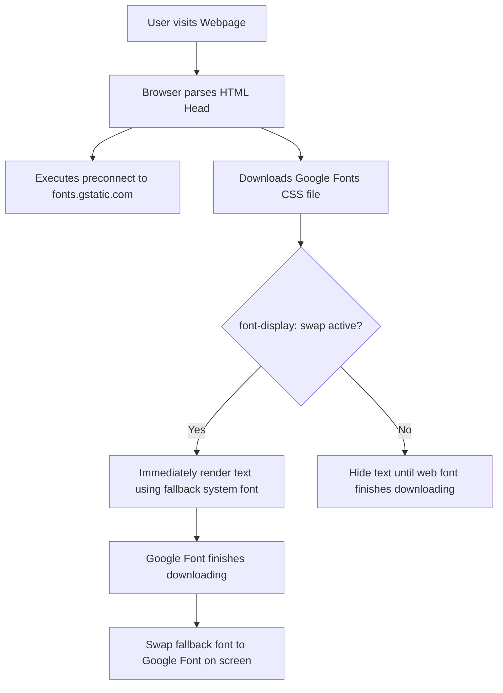

# Google Fonts

Estimated Reading Time: 20 minutes

Prerequisites: [Introduction to CSS](01-introduction-to-css.md), [CSS Fonts](05-css-fonts.md)

Learning Objectives:
- Learn how to import external custom web fonts using Google Fonts.
- Understand the difference between `<link>` HTML embedding and `@import` CSS embedding methods.
- Master `@font-face` rule fundamentals and web font performance optimization.
- Control web font display behavior using `font-display` (`swap`, `block`, `fallback`).

---

## Introduction

While web-safe fonts (like Arial or Georgia) are reliable because they come pre-installed on user devices, they limit design freedom to a small set of system typefaces. Google Fonts is a free, open-source library of over 1,500 custom web fonts that developers can integrate into websites to create distinct visual branding and modern typography.

Web fonts differ from system fonts: when a user visits a website that uses Google Fonts, their web browser automatically downloads the required font files from Google's Content Delivery Network (CDN) servers in the background and renders the text using those downloaded typefaces.

Understanding how to integrate Google Fonts properly allows developers to incorporate popular modern typefaces (such as Inter, Roboto, Open Sans, Lato, and Montserrat) efficiently while keeping page load speeds fast and responsive.

---

## Real-World Analogy

Imagine ordering a specialized dish at a restaurant.

- **System Fonts (Kitchen Pantry)**: The chef makes a meal using ingredients already sitting in the kitchen pantry (Arial, Times New Roman). It is served instantly with zero delay, but the menu choices are basic.
- **Google Fonts (Special Delivery Service)**: You order an exotic dish requiring a specialty ingredient not stocked in the local pantry. The restaurant sends a fast delivery driver to pick up the ingredient from a central gourmet warehouse (Google CDN).
- **FOUT / FOIT (Waiting at the Table)**:
  - **FOIT (Flash of Invisible Text)**: You sit at the table with an empty plate until the delivery driver arrives with the ingredient.
  - **FOUT (Flash of Unstyled Text)**: The chef serves a temporary snack from the pantry (system font) while you wait. When the specialty ingredient arrives, the chef swaps out your plate for the gourmet meal (Google Font).

Managing font loading controls whether users see temporary text (`FOUT`) or invisible text (`FOIT`) while custom fonts download.

---

## Core Concepts

### 1. The Google Fonts Library
Google Fonts provides free hosted font families under open-source licenses. Fonts are served in modern optimized font file formats (WOFF2) directly from Google's high-speed CDN.

### 2. Embedding Methods
There are two primary methods to add Google Fonts to a project:
1. **HTML `<link>` Method (Recommended)**: Adding `<link>` tags inside the HTML `<head>`. Includes preconnect hints to speed up network connection setups.
2. **CSS `@import` Method**: Placing an `@import url(...)` statement at the very top of a `.css` file.

### 3. Font Weights and Variants
When selecting a font on Google Fonts, you explicitly select which weights (e.g. `400` Regular, `700` Bold) and styles (`italic`) to load. Loading only the weights you actually use reduces HTTP download size.

### 4. The `@font-face` Rule
Under the hood, Google Fonts supplies a stylesheet containing `@font-face` blocks. The `@font-face` rule defines custom font family names, points to remote font file URLs (`woff2`), and maps numeric weights.

### 5. `font-display: swap;`
Instructs the browser to render text immediately using a fallback system font while the custom Google Font downloads over the network. Once downloaded, the browser seamlessly swaps the fallback font for the Google Font. This prevents invisible text blocks during initial page loads.

---

## Syntax

### Method 1: HTML `<link>` Embedding (Recommended)
```html
<head>
    <!-- Preconnect hints establish fast DNS/TLS handshakes -->
    <link rel="preconnect" href="https://fonts.googleapis.com">
    <link rel="preconnect" href="https://fonts.gstatic.com" crossorigin>
    
    <!-- Stylesheet request for Inter font (weights 400 and 700) -->
    <link href="https://fonts.googleapis.com/css2?family=Inter:wght@400;700&display=swap" rel="stylesheet">
</head>
```

```css
/* Apply font inside stylesheet */
body {
    font-family: 'Inter', sans-serif;
}
```

---

### Method 2: CSS `@import` Embedding
```css
/* Must be placed at the very top of your .css file */
@import url('https://fonts.googleapis.com/css2?family=Roboto:wght@400;700&display=swap');

body {
    font-family: 'Roboto', sans-serif;
}
```

---

## Property Reference

| Parameter / Technique | Location | Purpose | Performance Impact |
| :--- | :--- | :--- | :--- |
| `<link rel="preconnect">` | HTML `<head>` | Pre-establishes network socket connection to Google CDN | Faster font download |
| `display=swap` | URL Query Param | Triggers `font-display: swap` behavior | Eliminates invisible text (FOIT) |
| `@import url(...)` | Top of `.css` | Imports Google Font stylesheet directly inside CSS | Slower (blocks CSS parser) |
| `@font-face` | Inside CSS | Native browser rule defining custom font URL and name | Standard web font engine |

---

## Visual Explanation



---

## Example 1

### HTML
```html
<!DOCTYPE html>
<html lang="en">
<head>
    <meta charset="UTF-8">
    <title>Google Fonts Link Method</title>
    <!-- Preconnect optimizations -->
    <link rel="preconnect" href="https://fonts.googleapis.com">
    <link rel="preconnect" href="https://fonts.gstatic.com" crossorigin>
    <!-- Importing Inter font family -->
    <link href="https://fonts.googleapis.com/css2?family=Inter:wght@400;600;700&display=swap" rel="stylesheet">
    <style>
        body {
            font-family: 'Inter', sans-serif;
            background-color: #f8fafc;
            color: #1e293b;
            padding: 30px;
        }
        .title {
            font-size: 32px;
            font-weight: 700;
            color: #0f172a;
        }
        .subtitle {
            font-size: 18px;
            font-weight: 600;
            color: #2563eb;
        }
        .body-copy {
            font-size: 16px;
            font-weight: 400;
            line-height: 1.6;
            color: #334155;
        }
    </style>
</head>
<body>
    <h1 class="title">Modern Typography with Inter</h1>
    <p class="subtitle">Loaded directly from Google Fonts CDN</p>
    <p class="body-copy">The Inter font family is designed specifically for computer screens. It features tall lower-case letter heights to maximize legibility across user interfaces.</p>
</body>
</html>
```

### CSS
```css
body {
    font-family: 'Inter', sans-serif;
    background-color: #f8fafc;
    color: #1e293b;
    padding: 30px;
}
.title {
    font-size: 32px;
    font-weight: 700;
    color: #0f172a;
}
.subtitle {
    font-size: 18px;
    font-weight: 600;
    color: #2563eb;
}
.body-copy {
    font-size: 16px;
    font-weight: 400;
    line-height: 1.6;
    color: #334155;
}
```

### Explanation
This example embeds the popular Google Font **Inter** using the `<link>` method in the HTML `<head>`. Preconnect links optimize DNS handshakes to Google servers. The stylesheet imports three weights: `400` (Regular), `600` (Semi-Bold), and `700` (Bold). The `body` element assigns `'Inter', sans-serif` as its primary font family, allowing all sub-elements to inherit modern typography seamlessly.

---

## Output Image Prompt

A browser window displaying a clean software landing page layout on a light slate background (`#f8fafc`). At the top left with 30 pixels padding, a bold main heading "Modern Typography with Inter" displays in deep slate black (`#0f172a`) rendered in the Inter typeface at 32 pixels font height. Below it, a vibrant blue subtitle "Loaded directly from Google Fonts CDN" appears in 18-pixel semi-bold Inter font (`#2563eb`). Below the subtitle, a multi-line paragraph reading "The Inter font family is designed specifically for computer screens. It features tall lower-case letter heights to maximize legibility across user interfaces." displays in clean 16-pixel regular Inter typography with 1.6 line height.

---

## Code Explanation

- `<link rel="preconnect" href="...">`: Instructs the browser to perform DNS lookups and TLS handshakes to Google servers before downloading CSS, reducing latency.
- `family=Inter:wght@400;600;700`: Requests specific weights of the Inter font from the Google API.
- `display=swap`: Appends font-display swap parameter to guarantee fallback text displays immediately while downloading.
- `font-family: 'Inter', sans-serif;`: Sets Inter as primary typeface with generic sans-serif fallback.

---

## Example 2

### HTML
```html
<!DOCTYPE html>
<html lang="en">
<head>
    <meta charset="UTF-8">
    <title>Dual Google Fonts Setup</title>
    <!-- Linking two Google Fonts: Playfair Display (Serif) and Montserrat (Sans-Serif) -->
    <link rel="preconnect" href="https://fonts.googleapis.com">
    <link rel="preconnect" href="https://fonts.gstatic.com" crossorigin>
    <link href="https://fonts.googleapis.com/css2?family=Montserrat:wght@400;500&family=Playfair+Display:ital,wght@0,700;1,400&display=swap" rel="stylesheet">
    <style>
        body {
            font-family: 'Montserrat', sans-serif;
            background-color: #ffffff;
            color: #2d3748;
            padding: 40px;
        }
        .hero-title {
            font-family: 'Playfair Display', serif;
            font-size: 40px;
            font-weight: 700;
            color: #1a202c;
        }
        .hero-quote {
            font-family: 'Playfair Display', serif;
            font-style: italic;
            font-size: 20px;
            color: #718096;
        }
        .hero-body {
            font-size: 16px;
            line-height: 1.7;
            color: #4a5568;
        }
    </style>
</head>
<body>
    <h1 class="hero-title">Editorial Excellence</h1>
    <p class="hero-quote">"Pairing a classic serif title with a clean sans-serif body creates timeless typography."</p>
    <p class="hero-body">Montserrat provides clear body legibility for modern digital devices, while Playfair Display delivers elegant editorial contrast for hero titles and quote blocks.</p>
</body>
</html>
```

### CSS
```css
body {
    font-family: 'Montserrat', sans-serif;
    background-color: #ffffff;
    color: #2d3748;
    padding: 40px;
}
.hero-title {
    font-family: 'Playfair Display', serif;
    font-size: 40px;
    font-weight: 700;
    color: #1a202c;
}
.hero-quote {
    font-family: 'Playfair Display', serif;
    font-style: italic;
    font-size: 20px;
    color: #718096;
}
.hero-body {
    font-size: 16px;
    line-height: 1.7;
    color: #4a5568;
}
```

### Explanation
This example demonstrates font pairing by linking two distinct Google Fonts in a single URL request: **Playfair Display** (a classic serif font for titles) and **Montserrat** (a geometric sans-serif font for body copy). Combining font requests into a single `<link>` tag minimizes HTTP network requests.

---

## Output Image Prompt

A desktop browser viewport displaying an editorial layout on a white canvas. A large 40-pixel main heading "Editorial Excellence" appears in elegant Playfair Display bold serif font (`#1a202c`). Below the heading, an italicized quote line '"Pairing a classic serif title with a clean sans-serif body creates timeless typography."' displays in 20-pixel Playfair Display italic serif font in medium gray (`#718096`). Below the quote, body text reading "Montserrat provides clear body legibility for modern digital devices, while Playfair Display delivers elegant editorial contrast for hero titles and quote blocks." displays in clean Montserrat sans-serif typography at 16 pixels with 1.7 line height.

---

## Code Explanation

- `family=Montserrat:wght@400;500&family=Playfair+Display:ital,wght@0,700;1,400`: Requests multiple font families, weights, and italic variants in a single combined Google Fonts CDN request.
- `.hero-title { font-family: 'Playfair Display', serif; }`: Overrides body font for headings to use Playfair Display.
- `.hero-body`: Inherits default Montserrat sans-serif font from `body`.

---

## Best Practices

- **Prefer HTML `<link>` over `@import`**: The `<link>` method allows parallel network downloading, whereas `@import` inside CSS blocks rendering and delays font downloads.
- **Use Preconnect Tags**: Include `<link rel="preconnect" href="https://fonts.googleapis.com">` and `gstatic` to speed up initial network handshakes.
- **Select Only Required Weights**: Do not download all font weights (100–900). Pick only the specific weights (e.g. `400` and `700`) used in your design to save bandwidth.
- **Combine Font Requests**: When using multiple Google Fonts, combine them into a single URL request instead of embedding multiple separate link tags.
- **Always Specify `display=swap`**: Include `&display=swap` in Google Font URLs to prevent invisible text during font loading.

---

## Common Mistakes

### Mistake 1: Placing `@import` Below Other CSS Rules

```css
/* INCORRECT */
body {
    color: black;
}
/* @import must be at the top! */
@import url('https://fonts.googleapis.com/css2?family=Roboto&display=swap');
```

#### Explanation
CSS specifications mandate that `@import` rules **must** precede all other rules in a stylesheet. Placing `@import` below standard CSS rules causes the import statement to be completely ignored by the parser.

```css
/* CORRECT */
@import url('https://fonts.googleapis.com/css2?family=Roboto&display=swap');

body {
    color: black;
}
```

---

### Mistake 2: Downloading Unused Font Weights

```html
<!-- INCORRECT: Loading 10 font weights when only 2 are used -->
<link href="https://fonts.googleapis.com/css2?family=Roboto:wght@100;200;300;400;500;600;700;800;900&display=swap" rel="stylesheet">
```

#### Explanation
Downloading every font weight creates massive network payload sizes (often hundreds of kilobytes), resulting in slow page load performance and poor mobile experiences.

```html
<!-- CORRECT: Downloading only needed weights -->
<link href="https://fonts.googleapis.com/css2?family=Roboto:wght@400;700&display=swap" rel="stylesheet">
```

---

### Mistake 3: Omitting Fallback Fonts

```css
/* INCORRECT */
body {
    font-family: 'Open Sans'; /* Missing generic fallback */
}
```

#### Explanation
If network connectivity fails or Google CDN is blocked, omitting a fallback generic family (`sans-serif`) causes the browser to pick unpredictable default system fonts.

```css
/* CORRECT */
body {
    font-family: 'Open Sans', Arial, sans-serif;
}
```

---

## Browser Compatibility

Google Fonts delivers modern WOFF2 (Web Open Font Format 2.0) compressed font files supported by 99.5%+ of all active browsers worldwide (Chrome, Firefox, Safari, Edge, Opera, iOS Safari, Android Chrome).

Preconnect link tags and `font-display: swap` are fully supported across all modern evergreen browser engines.

---

## Real-World Applications

- **SaaS Web Applications**: Utilizing modern sans-serif typefaces like **Inter** or **Roboto** for clean UI dashboards and controls.
- **E-Commerce Stores**: Pairing high-end serif titles (**Playfair Display**) with clean sans-serif body text (**Lato**) for luxury brand appeal.
- **Blogs and News Outlets**: Loading custom serif fonts (**Merriweather**) for high-legibility body articles.
- **Corporate Portfolios**: Establishing brand identity through custom Google Fonts across hero sections and button components.

---

## Mini Project

### Project Objective: Google Fonts Typography Theme Integration
Build a landing page layout utilizing two Google Fonts (one for headings, one for body copy).

#### Requirements:
1. Embed Google Fonts **Montserrat** (weights 400, 700) and **Lora** (weights 400, 400italic) using a single `<link>` tag with preconnect hints.
2. Apply `display=swap` performance parameters.
3. Style main headings using Lora serif font.
4. Style body content and buttons using Montserrat sans-serif font.

---

## Practice Exercises

### Beginner Level
1. Search Google Fonts and select the font family **Roboto**. Generate its HTML `<link>` tag.
2. Add preconnect links for `fonts.googleapis.com` and `fonts.gstatic.com` into an HTML document.
3. Write a CSS rule that applies `'Roboto', sans-serif` to all paragraph elements.
4. Import the **Lato** font using the CSS `@import` method.
5. Create a heading styled with Google Font **Montserrat** at weight `700`.

### Intermediate Level
6. Combine requests for **Open Sans** (weight 400) and **Oswald** (weight 600) into a single Google Fonts URL.
7. Explain the visual difference between a page loaded with `display=swap` vs `display=block`.
8. Write a CSS font stack that uses a Google Font, a web-safe fallback, and a generic family keyword.
9. Fix a broken `@import` statement that was placed below a `body { }` rule.
10. Download and test a Google Font locally using custom `@font-face` rules.

### Advanced Level
11. Audit a web application's Network tab in DevTools to measure font load times and WOFF2 file sizes.
12. Compare performance characteristics of Google CDN hosted fonts vs self-hosted web fonts.
13. Implement a variable Google Font (`family=Roboto+Flex`) and control weight dynamically using `font-weight`.
14. Optimize font loading strategies to achieve a 100 Performance score on Google Lighthouse.
15. Formulate a fallback font matching strategy using `size-adjust` to eliminate Cumulative Layout Shift (CLS) during font swapping.

---

## Quick Quiz

**1. What is Google Fonts?**
A) A paid font software library  
B) A free, open-source library of hosted custom web fonts  
C) A browser extension for magnifying text  
D) An HTML validator  

**2. Which embedding method is recommended for optimal performance?**
A) CSS `@import`  
B) HTML `<link>` tags in `<head>`  
C) Inline JavaScript string  
D) HTML `<b>` tags  

**3. What does `<link rel="preconnect">` do for Google Fonts?**
A) Automatically downloads all 1,500 fonts  
B) Pre-establishes network connections to Google servers to speed up font loading  
C) Changes text color to blue  
D) Validates CSS code  

**4. What parameter in a Google Fonts URL enables `font-display: swap`?**
A) `swap=true`  
B) `display=swap`  
C) `font=swap`  
D) `mode=fast`  

**5. What is FOIT (Flash of Invisible Text)?**
A) Text flashing in different colors  
B) Invisible text caused by browsers hiding text while custom fonts load  
C) Text displaying in uppercase  
D) Text moving across the screen  

**6. How does `font-display: swap;` solve the FOIT problem?**
A) It cancels custom font downloads  
B) It displays a fallback system font immediately, then swaps to the custom font once loaded  
C) It converts text to images  
D) It forces users to install fonts manually  

**7. Where must a CSS `@import` rule be placed inside a stylesheet?**
A) Inside the `body` selector  
B) At the very top of the stylesheet before all other rules  
C) At the very bottom of the stylesheet  
D) Inside a media query  

**8. Why should developers avoid downloading all font weights (100 through 900)?**
A) Google limits downloads to 2 weights  
B) Downloading unused weights increases file size and slows page load speeds  
C) Font weights above 500 do not work on mobile  
D) Extra weights change text colors  

**9. What font file format is modernly served by Google Fonts for maximum compression?**
A) TTF  
B) OTF  
C) WOFF2  
D) SVG  

**10. What generic font family should follow `'Open Sans'` in a fallback stack?**
A) `serif`  
B) `sans-serif`  
C) `monospace`  
D) `cursive`  

---

### Answers
1: B | 2: B | 3: B | 4: B | 5: B | 6: B | 7: B | 8: B | 9: C | 10: B

---

## Interview Questions

**1. What is Google Fonts and how does it deliver web fonts to browsers?**  
*Answer:* Google Fonts is a free CDN service hosting open-source web fonts. When a user visits a page, the browser fetches an optimized CSS file pointing to compressed WOFF2 font files hosted on Google CDN servers, rendering custom typefaces dynamically.

**2. Compare the HTML `<link>` method vs the CSS `@import` method for embedding Google Fonts.**  
*Answer:* HTML `<link>` tags allow parallel file downloading alongside preconnect network optimizations, making them faster. CSS `@import` blocks stylesheet parsing because the browser must download the CSS file before discovering the import URL, delaying rendering.

**3. What is `font-display: swap` and why is it important for Web Vitals performance?**  
*Answer:* `font-display: swap` instructs browsers to display fallback system text immediately during font downloads, swapping to the web font when ready. This eliminates Flash of Invisible Text (FOIT), improves First Contentful Paint (FCP), and enhances perceived load speed.

**4. What are preconnect link hints (`rel="preconnect"`) and how do they optimize Google Font loading?**  
*Answer:* Preconnect hints inform browsers to initiate early DNS lookups, TCP handshakes, and TLS negotiations with `fonts.googleapis.com` and `fonts.gstatic.com` before font requests occur, saving critical milliseconds.

**5. How does loading multiple font weights impact website performance?**  
*Answer:* Each font weight and style (e.g. 400, 700, 400italic) requires downloading a separate font file. Requesting excessive weights bloats network payloads, slows down page load times, and worsens mobile performance.

**6. What is Cumulative Layout Shift (CLS) in relation to web font loading?**  
*Answer:* CLS occurs when a fallback font swaps to a custom web font with different character dimensions, causing text blocks to resize and surrounding page elements to jump visually. Matching fallback font metrics reduces CLS.

**7. Under the hood, what CSS rule does Google Fonts generate to define custom fonts?**  
*Answer:* Google Fonts generates a stylesheet containing `@font-face` rules. Each `@font-face` rule defines a `font-family` name, specifies numeric `font-weight`, sets `font-display`, and points to font file URLs (`src: url(...) format('woff2')`).

**8. Can you combine multiple Google Fonts into a single CDN URL request? Give an example.**  
*Answer:* Yes. Combining requests minimizes HTTP request overhead. Example: `href="https://fonts.googleapis.com/css2?family=Inter:wght@400;700&family=Playfair+Display:wght@700&display=swap"`.

**9. What are the advantages of self-hosting Google Fonts vs using the Google CDN?**  
*Answer:* Self-hosting eliminates third-party tracking concerns, satisfies strict privacy regulations (such as GDPR), allows serving fonts from the same domain (saving DNS lookups), and ensures offline reliability.

**10. What is a Variable Font in Google Fonts?**  
*Answer:* A variable font stores continuous ranges of design variations (such as weight from 100 to 900) inside a single font file. This provides design flexibility while reducing the total file download size compared to fetching multiple static font files.

---

## Summary

- Google Fonts provides free, hosted custom web fonts to expand typography beyond standard system fonts.
- The **HTML `<link>` method** in `<head>` is the recommended performance standard over CSS `@import`.
- Use **preconnect link hints** (`fonts.googleapis.com` and `fonts.gstatic.com`) to speed up network setup.
- Always include **`display=swap`** to eliminate Flash of Invisible Text (FOIT).
- Select only the **specific font weights** used in your project to prevent unnecessary bandwidth bloat.
- Combine multiple Google Font family requests into a single URL request.

---

## Cheat Sheet

```html
<!-- RECOMMENDED GOOGLE FONTS HTML EMBEDDING TEMPLATE -->
<head>
    <!-- 1. Preconnect hints -->
    <link rel="preconnect" href="https://fonts.googleapis.com">
    <link rel="preconnect" href="https://fonts.gstatic.com" crossorigin>
    
    <!-- 2. Combined Font Request with display=swap -->
    <link href="https://fonts.googleapis.com/css2?family=Inter:wght@400;600;700&family=Lora:ital,wght@0,600;1,400&display=swap" rel="stylesheet">
</head>
```

```css
/* CSS FONT APPLICATION */
body {
    font-family: 'Inter', Arial, sans-serif;
}

h1, h2 {
    font-family: 'Lora', Georgia, serif;
}
```

---

## Related Topics

- **Previous Topic**: [CSS Fonts](05-css-fonts.md)
- **Next Topic**: [CSS Borders](07-css-borders.md)
- **Recommended Learning Order**: Introduction to CSS -> Ways to Add CSS -> CSS Selectors -> CSS Colors -> CSS Fonts -> Google Fonts -> CSS Borders -> CSS Box Model
