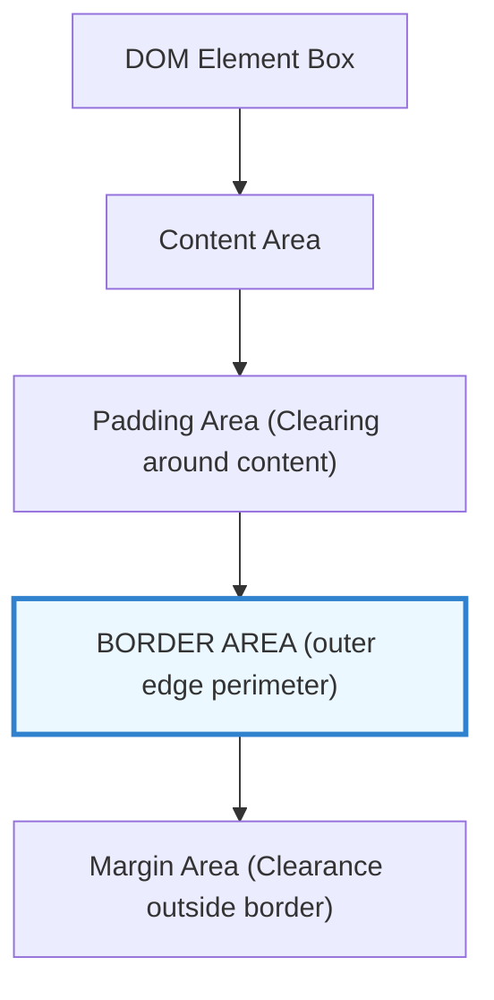

# CSS Borders

Estimated Reading Time: 25 minutes

Prerequisites: [Introduction to CSS](01-introduction-to-css.md), [CSS Colors](04-css-colors.md)

Learning Objectives:
- Understand the role of borders in the CSS Box Model.
- Master border sub-properties: `border-width`, `border-style`, and `border-color`.
- Apply directional borders (`border-top`, `border-right`, `border-bottom`, `border-left`).
- Utilize the `border` shorthand property cleanly and accurately.

---

## Introduction

In the CSS Box Model, a border is a decorative perimeter line that wraps around an element's padding and content area. CSS border properties give developers control over the thickness (`border-width`), pattern design (`border-style`), and color (`border-color`) of an element's outer edge.

Borders serve critical visual user interface functions: they delineate content cards, divide list items, outline input fields, emphasize active UI buttons, and frame image galleries.

Mastering border properties enables developers to create clean visual separations, define clear component containers, and structure polished UI layouts without relying on graphic design software.

---

## Real-World Analogy

Imagine putting a physical photograph inside a picture frame.

- **Content**: The photo itself represents your HTML element content (text, image).
- **Padding**: The white mat board surrounding the photo represents padding space inside the frame.
- **Border Width**: The physical thickness of the wooden frame (thin wire frame vs 2-inch wide oak frame).
- **Border Style**: The texture of the frame edge—smooth solid wood (`solid`), dashed decorative stitching (`dashed`), or dotted beadwork (`dotted`).
- **Border Color**: The paint finish applied to the wooden frame (black, metallic gold, dark mahogany).
- **Single-Side Borders**: Frame mounting where only a thick brass plate is placed along the bottom edge of the photo frame (`border-bottom`).

Borders define visual boundaries around structural containers.

---

## Core Concepts

### 1. Border Sub-Properties
A border requires three independent sub-properties to render:
1. **`border-width`**: Sets border line thickness (e.g. `1px`, `4px`, `thin`, `medium`, `thick`).
2. **`border-style`**: Sets border line pattern (`none`, `solid`, `dashed`, `dotted`, `double`, `groove`, `ridge`, `inset`, `outset`).
3. **`border-color`**: Sets border line color (Hex, RGB, HSL, named keywords).

> **Important**: If `border-style` is not declared (or set to `none`), the border will **not** render on screen, regardless of width or color settings!

### 2. The `border` Shorthand Property
Combines width, style, and color into a single line declaration.
- **Syntax**: `border: [width] [style] [color];`
- **Example**: `border: 2px solid #3182ce;`

### 3. Directional Borders
Borders can be controlled independently on individual sides of an element:
- **`border-top`**: Top edge border.
- **`border-right`**: Right edge border.
- **`border-bottom`**: Bottom edge border.
- **`border-left`**: Left edge border.

### 4. Border Box Model Interaction
By default (`box-sizing: content-box`), border thickness adds to an element's total calculated layout width and height. Using `box-sizing: border-box` includes border width inside the element's declared dimensions.

---

## Syntax

```css
/* Individual Border Properties */
.box-longhand {
    border-width: 2px;
    border-style: solid;
    border-color: #cbd5e0;
}

/* Shorthand Property: border */
.box-shorthand {
    border: 2px solid #cbd5e0;
}

/* Directional Borders */
.card-accent {
    border-left: 4px solid #3182ce; /* Accent line on left side only */
    border-bottom: 1px solid #e2e8f0;
}

/* Side-Specific Longhand */
.divider {
    border-bottom-width: 2px;
    border-bottom-style: dashed;
    border-bottom-color: #e2e8f0;
}
```

---

## Property Reference

| Property | Description | Common Values | Default Value |
| :--- | :--- | :--- | :--- |
| `border-width` | Sets border line thickness | `1px`, `2px`, `thin`, `medium`, `thick` | `medium` (3px) |
| `border-style` | Sets border pattern (MANDATORY) | `none`, `solid`, `dashed`, `dotted`, `double` | `none` |
| `border-color` | Sets border line color | `#000000`, `blue`, `rgba(0,0,0,0.1)` | `currentColor` |
| `border` | Shorthand for all 4 sides | `1px solid #000000` | None |
| `border-top` | Shorthand for top edge only | `2px solid red` | None |
| `border-right` | Shorthand for right edge only | `2px solid red` | None |
| `border-bottom` | Shorthand for bottom edge only | `2px solid red` | None |
| `border-left` | Shorthand for left edge only | `4px solid blue` | None |

---

## Visual Explanation



### Border Styles Pattern Comparison
```
solid:   ─────────────────────────
dashed:  ── ── ── ── ── ── ── ── ─
dotted:  · · · · · · · · · · · · ·
double:  ═════════════════════════
```

---

## Example 1

### HTML
```html
<!DOCTYPE html>
<html lang="en">
<head>
    <meta charset="UTF-8">
    <title>CSS Border Styles Demo</title>
    <style>
        body {
            font-family: Arial, sans-serif;
            background-color: #f7fafc;
            padding: 30px;
        }
        .container {
            background-color: #ffffff;
            padding: 20px;
            border: 1px solid #e2e8f0;
        }
        .border-solid {
            border: 2px solid #3182ce;
            padding: 15px;
            margin-bottom: 15px;
        }
        .border-dashed {
            border: 2px dashed #dd6b20;
            padding: 15px;
            margin-bottom: 15px;
        }
        .border-left-accent {
            border-left: 5px solid #38a169;
            background-color: #f0fff4;
            padding: 15px;
        }
    </style>
</head>
<body>
    <div class="container">
        <div class="border-solid">
            <strong>Solid Blue Border:</strong> 2px solid #3182ce
        </div>
        <div class="border-dashed">
            <strong>Dashed Orange Border:</strong> 2px dashed #dd6b20
        </div>
        <div class="border-left-accent">
            <strong>Left Accent Green Border:</strong> 5px solid #38a169
        </div>
    </div>
</body>
</html>
```

### CSS
```css
body {
    font-family: Arial, sans-serif;
    background-color: #f7fafc;
    padding: 30px;
}
.container {
    background-color: #ffffff;
    padding: 20px;
    border: 1px solid #e2e8f0;
}
.border-solid {
    border: 2px solid #3182ce;
    padding: 15px;
    margin-bottom: 15px;
}
.border-dashed {
    border: 2px dashed #dd6b20;
    padding: 15px;
    margin-bottom: 15px;
}
.border-left-accent {
    border-left: 5px solid #38a169;
    background-color: #f0fff4;
    padding: 15px;
}
```

### Explanation
This example demonstrates different border style configurations. The main container features a thin, continuous light-gray border (`1px solid #e2e8f0`). The first box applies a 2px solid blue border (`#3182ce`). The second box applies a 2px dashed orange border (`#dd6b20`). The third box demonstrates a directional left-accent border (`5px solid #38a169`) paired with a soft green background fill (`#f0fff4`).

---

## Output Image Prompt

A browser viewport displaying a white card container (`#ffffff`) on a soft off-white background (`#f7fafc`) with 30 pixels padding. The outer container has a subtle 1-pixel gray border (`#e2e8f0`) and 20 pixels padding. Inside the container are three stacked message boxes. The top box has a solid 2-pixel blue border (`#3182ce`) containing text "Solid Blue Border: 2px solid #3182ce". The middle box has a dashed 2-pixel orange border (`#dd6b20`) containing text "Dashed Orange Border: 2px dashed #dd6b20". The bottom box has a light mint-green background (`#f0fff4`) with a thick 5-pixel solid green left-side accent line (`#38a169`) and no top, right, or bottom borders.

---

## Code Explanation

- `border: 2px solid #3182ce;`: Shorthand setting 2px thickness, solid pattern, and blue color on all 4 sides.
- `border: 2px dashed #dd6b20;`: Shorthand applying a dashed pattern on all 4 sides.
- `border-left: 5px solid #38a169;`: Applies border styling strictly to the left edge, leaving top, right, and bottom borders unstyled (`none`).

---

## Example 2

### HTML
```html
<!DOCTYPE html>
<html lang="en">
<head>
    <meta charset="UTF-8">
    <title>Navigation Border Dividers</title>
    <style>
        .nav-bar {
            background-color: #1a202c;
            padding: 0 20px;
            font-family: Arial, sans-serif;
        }
        .nav-list {
            list-style: none;
            margin: 0;
            padding: 0;
        }
        .nav-item {
            display: inline-block;
            padding: 15px 20px;
            color: #ffffff;
            border-bottom: 3px solid transparent;
        }
        .nav-item.active {
            border-bottom: 3px solid #3182ce;
            color: #63b3ed;
        }
    </style>
</head>
<body>
    <div class="nav-bar">
        <ul class="nav-list">
            <li class="nav-item active">Dashboard</li>
            <li class="nav-item">Analytics</li>
            <li class="nav-item">Settings</li>
        </ul>
    </div>
</body>
</html>
```

### CSS
```css
.nav-bar {
    background-color: #1a202c;
    padding: 0 20px;
    font-family: Arial, sans-serif;
}
.nav-list {
    list-style: none;
    margin: 0;
    padding: 0;
}
.nav-item {
    display: inline-block;
    padding: 15px 20px;
    color: #ffffff;
    border-bottom: 3px solid transparent;
}
.nav-item.active {
    border-bottom: 3px solid #3182ce;
    color: #63b3ed;
}
```

### Explanation
This component uses directional bottom borders (`border-bottom`) to highlight active navigation menu tabs. All `.nav-item` links include a transparent 3px bottom border reserve. The `.active` tab updates its `border-bottom-color` to a vibrant blue (`#3182ce`), creating an indicator underline.

---

## Output Image Prompt

A browser window showing a dark charcoal navigation bar (`#1a202c`) stretching horizontally across the screen. Inside the navigation bar are three horizontal menu items: "Dashboard", "Analytics", and "Settings" rendered in white text. The first item "Dashboard" is highlighted with light blue text (`#63b3ed`) and features a solid 3-pixel blue accent underline (`#3182ce`) running directly along its bottom edge. The remaining items "Analytics" and "Settings" display in standard white text with no visible underline.

---

## Code Explanation

- `border-bottom: 3px solid transparent;`: Reserves 3 pixels of space beneath all navigation items to prevent visual layout jumps when switching active states.
- `.nav-item.active { border-bottom: 3px solid #3182ce; }`: Overrides the transparent bottom border of the active tab with a solid blue underline indicator.

---

## Best Practices

- **Always Declare `border-style`**: Remember that borders will not render unless `border-style` is explicitly declared (or included in the `border` shorthand).
- **Use Shorthand Properties**: Prefer `border: 1px solid #ccc;` over 3 separate longhand property lines to keep stylesheets clean and concise.
- **Use Transparent Borders for Hover States**: Set a `transparent` border on base element states before adding colored hover borders to prevent layout shifts.
- **Set `box-sizing: border-box`**: Always apply `box-sizing: border-box` globally so border widths do not expand element layouts unexpectedly.

---

## Common Mistakes

### Mistake 1: Omitting `border-style`

```css
/* INCORRECT */
.box {
    border-width: 2px;
    border-color: red;
    /* Missing border-style! Border defaults to none and will not render */
}
```

#### Explanation
`border-style` defaults to `none`. If you set `border-width` and `border-color` without specifying a style, the border remains invisible.

```css
/* CORRECT */
.box {
    border-width: 2px;
    border-style: solid;
    border-color: red;
}
```

---

### Mistake 2: Layout Jumps Caused by Hover Borders

```css
/* INCORRECT */
.button {
    border: none; /* 0px border width */
}
.button:hover {
    border: 2px solid blue; /* Adds 2px border on hover, causing element to jump 2px! */
}
```

#### Explanation
Adding a border on `:hover` increases the element's overall width by 2px, pushing surrounding elements and causing visual jitter.

```css
/* CORRECT */
.button {
    border: 2px solid transparent; /* Reserve 2px space */
}
.button:hover {
    border-color: blue; /* Only change color on hover */
}
```

---

### Mistake 3: Incorrect Shorthand Parameter Order

```css
/* INCORRECT */
.card {
    border: solid 2px; /* Missing color argument works (defaults to currentColor), but breaking standard order degrades readability */
}
```

#### Explanation
While browsers are forgiving, the standard shorthand order is `[width] [style] [color]`. Sticking to standard parameter ordering prevents parser confusion.

```css
/* CORRECT */
.card {
    border: 2px solid #e2e8f0;
}
```

---

## Browser Compatibility

All standard CSS border properties (`border-width`, `border-style`, `border-color`, `border`, and directional variants `border-top/right/bottom/left`) have 100% universal compatibility across every web browser engine ever released (Chrome, Firefox, Safari, Edge, IE6+).

---

## Real-World Applications

- **UI Card Components**: Outlining container boxes with subtle 1px gray borders (`#e2e8f0`).
- **Form Text Inputs**: Indicating active input focus states with blue outline borders (`border: 2px solid #3182ce`).
- **Sidebar Accent Indicators**: Adding thick 4px left-side colored border bars (`border-left`) to active navigation items.
- **Table Row Dividers**: Using `border-bottom: 1px solid #cbd5e0` to divide table rows cleanly.

---

## Mini Project

### Project Objective: Feature Card Grid with Accent Borders
Build a set of three feature cards (e.g. "Basic", "Pro", "Enterprise") using directional borders.

#### Requirements:
1. Wrap each card in a white container with a 1px solid gray outer border (`#e2e8f0`).
2. Add a thick 4px top accent border (`border-top`) to each card with distinct colors (Gray for Basic, Blue for Pro, Purple for Enterprise).
3. Add a 1px solid gray bottom divider (`border-bottom`) between card titles and body text.

---

## Practice Exercises

### Beginner Level
1. Create a CSS rule that adds a 1px solid black border around all `<div>` tags.
2. Set a 2px dashed red border on a class `.error-box`.
3. Add a 3px solid blue bottom border (`border-bottom`) to all `<h2>` headings.
4. Remove the default border from a button element using `border: none;`.
5. Create a `<span>` element with a 1px dotted gray border.

### Intermediate Level
6. Create an input field that shows a 1px gray border normally and changes to a 2px solid blue border on `:focus`.
7. Use transparent borders on a button component to prevent layout jumping when hovered.
8. Create a class `.accent-card` with a 5px solid green left border (`border-left`) and a light green background.
9. Format a table where rows are separated by 1px solid light-gray bottom borders.
10. Combine `border-width: 2px`, `border-style: double`, and `border-color: navy` into a single shorthand declaration.

### Advanced Level
11. Build a custom CSS triangle generator relying entirely on zero width/height elements with transparent borders.
12. Create a responsive multi-column layout where column borders disappear on mobile screens using media queries.
13. Formulate a dynamic theme system using CSS variables to update `border-color` across dark/light mode states.
14. Compare rendering performance of CSS borders vs `outline` vs `box-shadow` inset borders.
15. Demonstrate how `border-image` properties apply bitmap/gradient patterns to structural borders.

---

## Quick Quiz

**1. Which sub-property is strictly required for a border to render on screen?**
A) `border-width`  
B) `border-style`  
C) `border-color`  
D) `border-radius`  

**2. What is the default value of `border-style`?**
A) `solid`  
B) `none`  
C) `dashed`  
D) `hidden`  

**3. What is the correct order of parameters in the `border` shorthand property?**
A) `border: [color] [width] [style];`  
B) `border: [style] [color] [width];`  
C) `border: [width] [style] [color];`  
D) `border: [width] [color] [style];`  

**4. What happens if you omit `border-color` in a shorthand declaration `border: 2px solid;`?**
A) The border fails to render  
B) The border defaults to black always  
C) The border defaults to `currentColor` (the element's text color)  
D) The browser throws a console error  

**5. Which property applies a border exclusively to the left edge of an element?**
A) `border-left`  
B) `left-border`  
C) `border-side-left`  
D) `margin-left-border`  

**6. Which `border-style` value creates a line composed of short dashed segments?**
A) `dotted`  
B) `dashed`  
C) `double`  
D) `groove`  

**7. Why does adding a 2px border on `:hover` to an unbordered button cause visual layout jitter?**
A) Borders change font sizes  
B) Borders increase overall element dimensions on hover, pushing adjacent elements  
C) Hover states disable CSS  
D) Buttons do not support borders  

**8. How do you prevent layout jitter when adding a border on hover?**
A) Use `margin: -2px`  
B) Set a 2px `transparent` border on the normal state before setting border color on hover  
C) Use `display: inline`  
D) Remove all padding  

**9. What `box-sizing` value ensures border widths are included inside declared element dimensions?**
A) `box-sizing: content-box`  
B) `box-sizing: border-box`  
C) `box-sizing: padding-box`  
D) `box-sizing: fixed`  

**10. What does `border: none;` do?**
A) Changes border color to white  
B) Completely removes and suppresses border rendering  
C) Makes borders transparent  
D) Reduces border width to 1px  

---

### Answers
1: B | 2: B | 3: C | 4: C | 5: A | 6: B | 7: B | 8: B | 9: B | 10: B

---

## Interview Questions

**1. What are the three sub-properties that make up a CSS border, and which one is mandatory?**  
*Answer:* The sub-properties are `border-width`, `border-style`, and `border-color`. `border-style` is mandatory—if it is not set (or defaults to `none`), the border will not render regardless of width or color declarations.

**2. Explain the syntax of the `border` shorthand property.**  
*Answer:* The standard shorthand syntax is `border: [border-width] [border-style] [border-color];` (e.g. `border: 2px solid #3182ce;`). It applies identical border parameters across all four edges of an element.

**3. What is the difference between `border` and `outline` in CSS?**  
*Answer:* `border` is part of the CSS Box Model—it takes up physical layout space and affects element positioning. `outline` is drawn outside the element's box perimeter—it does **not** take up layout space, does not affect element sizing, and cannot be set on individual sides.

**4. How does `box-sizing: border-box` affect calculated element widths when borders are added?**  
*Answer:* Under `box-sizing: border-box`, border width and padding are included **inside** the declared `width` and `height`. A 200px wide box with a 5px border remains exactly 200px wide overall. Under `content-box`, the border expands total width to 210px.

**5. How can you create a single-sided border indicator on a card or active tab?**  
*Answer:* Use directional shorthand properties such as `border-left: 4px solid #3182ce;` or `border-bottom: 3px solid #3182ce;`, leaving unneeded edges set to `border-style: none`.

**6. What happens if you omit `border-color` in a border declaration?**  
*Answer:* If `border-color` is omitted, the browser defaults to `currentColor`, which automatically matches the element's current computed foreground text `color`.

**7. How do transparent borders prevent layout reflows during hover animations?**  
*Answer:* By reserving border space on the default element state using `border: 2px solid transparent;`, the element maintains its layout dimensions. On `:hover`, changing only `border-color` avoids adding new pixel dimensions that cause surrounding content to jump.

**8. Explain how to create CSS-only triangles using borders.**  
*Answer:* Set an element's `width` and `height` to `0`. Apply thick borders on all sides, then set three of the four border colors to `transparent`. The remaining colored border side renders as a solid triangle pointing inward.

**9. What are directional border longhand properties?**  
*Answer:* Longhand properties allow targeted styling of specific attributes on specific edges (e.g. `border-top-width`, `border-left-color`, `border-bottom-style`).

**10. What is the default value for `border-width` if omitted?**  
*Answer:* `border-width` defaults to the keyword `medium`, which evaluates to approximately `3px` in most modern browser engines.

---

## Summary

- Borders outline an element's padding and content perimeter in the CSS Box Model.
- A border requires three components: **`border-width`**, **`border-style`**, and **`border-color`**.
- **`border-style`** is mandatory (`solid`, `dashed`, `dotted`, `none`).
- The shorthand **`border`** property sets `[width] [style] [color]` in one line.
- **Directional borders** (`border-top`, `border-right`, `border-bottom`, `border-left`) allow independent edge styling.
- Use `border-color: transparent` to reserve border layout space and prevent hover jitter.

---

## Cheat Sheet

```css
/* BORDER CHEAT SHEET */

/* Standard Shorthand */
border: 1px solid #cbd5e0;
border: 2px dashed #dd6b20;
border: 3px dotted #3182ce;

/* Directional Borders */
border-top: 2px solid #e2e8f0;
border-bottom: 3px solid #3182ce;
border-left: 5px solid #38a169;

/* Removing Borders */
border: none;

/* Hover State Reserve Pattern */
.button {
    border: 2px solid transparent; /* Reserve space */
}
.button:hover {
    border-color: #3182ce; /* Swap color */
}
```

---

## Related Topics

- **Previous Topic**: [Google Fonts](06-google-fonts.md)
- **Next Topic**: [Border Radius](08-border-radius.md)
- **Recommended Learning Order**: Introduction to CSS -> Ways to Add CSS -> CSS Selectors -> CSS Colors -> CSS Fonts -> CSS Borders -> Border Radius -> CSS Box Model
