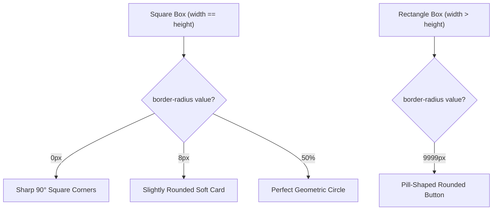

# Border Radius

Estimated Reading Time: 20 minutes

Prerequisites: [Introduction to CSS](01-introduction-to-css.md), [CSS Borders](07-css-borders.md)

Learning Objectives:
- Master the `border-radius` property to create rounded corners on HTML elements.
- Understand single-value, multi-value shorthand, and elliptical corner radius rules.
- Create perfect circles, pill-shaped buttons, and rounded UI card containers.
- Learn how `border-radius` interacts with background colors, overflow clipping, and borders.

---

## Introduction

In early web design, all HTML elements were sharp-cornered rectangles. Creating rounded corners required slicing images in graphics tools and using complex table structures. The CSS3 `border-radius` property revolutionized UI design by allowing developers to round element corners natively using simple CSS declarations.

The `border-radius` property defines the radius of an element's corner curves. It softens harsh square edges, creates modern aesthetic card designs, formats pill-shaped call-to-action buttons, and converts square image containers into perfect circular user avatars.

Understanding `border-radius` is essential for implementing modern UI design systems (such as Material Design, iOS HIG, and Tailwind-style aesthetic frameworks).

---

## Real-World Analogy

Imagine cutting pieces of cardboard with scissors.

- **Sharp Rectangle (`border-radius: 0`)**: You cut out a rectangular sheet of cardboard with sharp 90-degree pointed corners.
- **Slightly Rounded Box (`border-radius: 8px`)**: You take your scissors and trim a tiny rounded curve at each of the 4 corners. The box retains its square structure but feels smooth to touch.
- **Pill Button (`border-radius: 9999px`)**: You have a wide rectangular strip of cardboard. You cut semicircles at the extreme left and right ends until the ends curve smoothly into a pill shape.
- **Perfect Circle (`border-radius: 50%`)**: You cut a square piece of cardboard and round off every corner using a radius equal to half the side length. The square turns into a perfect geometric circle.

`border-radius` curves hard rectangular corners into smooth UI shapes.

---

## Core Concepts

### 1. How `border-radius` Works
`border-radius` draws an imaginary circle (or ellipse) in the corner of an element box. The radius value specifies the distance from the corner origin to the curve perimeter.

### 2. Units of Measurement
- **Pixels (`px`)**: Sets a fixed curve radius (e.g. `border-radius: 8px;`).
- **Percentages (`%`)**: Sets curve radius proportional to element dimensions. `50%` on a square element creates a perfect circle.
- **`rem` / `em`**: Sets curve radius relative to font sizing.

### 3. Shorthand Corner Order
Like margin and padding, `border-radius` supports 1 to 4 multi-value shorthand values:
- **1 Value**: Applies to all 4 corners (`top-left`, `top-right`, `bottom-right`, `bottom-left`).
- **2 Values**: `[top-left & bottom-right]` `[top-right & bottom-left]`.
- **3 Values**: `[top-left]` `[top-right & bottom-left]` `[bottom-right]`.
- **4 Values**: Clockwise order starting top-left: `[top-left]` `[top-right]` `[bottom-right]` `[bottom-left]`.

### 4. Corner Longhand Properties
Corners can be targeted individually:
- `border-top-left-radius`
- `border-top-right-radius`
- `border-bottom-right-radius`
- `border-bottom-left-radius`

### 5. Perfect Circles vs Pill Shapes
- **Circle**: Equal width and height (`width == height`) + `border-radius: 50%;`.
- **Pill Shape**: Unequal width and height (`width > height`) + `border-radius: 9999px;` (or large pixel value).

---

## Syntax

```css
/* 1. All Corners Equal (Single Value) */
.card {
    border-radius: 12px;
}

/* 2. Semicircle / Circle (Percentage) */
.avatar {
    width: 100px;
    height: 100px;
    border-radius: 50%;
}

/* 3. Pill-Shaped Button */
.btn-pill {
    padding: 12px 24px;
    border-radius: 9999px;
}

/* 4. Multi-Value Shorthand (4 Corners Clockwise) */
.custom-box {
    /* top-left | top-right | bottom-right | bottom-left */
    border-radius: 20px 0px 20px 0px;
}

/* 5. Individual Corner Longhand */
.notification {
    border-top-left-radius: 16px;
    border-top-right-radius: 16px;
}
```

---

## Property Reference

| Property | Description | Common Values | Default Value |
| :--- | :--- | :--- | :--- |
| `border-radius` | Shorthand for all 4 corners | `8px`, `50%`, `9999px`, `10px 20px` | `0` (sharp 90°) |
| `border-top-left-radius` | Rounds top-left corner only | `8px`, `50%` | `0` |
| `border-top-right-radius` | Rounds top-right corner only | `8px`, `50%` | `0` |
| `border-bottom-right-radius` | Rounds bottom-right corner only | `8px`, `50%` | `0` |
| `border-bottom-left-radius` | Rounds bottom-left corner only | `8px`, `50%` | `0` |

---

## Visual Explanation



---

## Example 1

### HTML
```html
<!DOCTYPE html>
<html lang="en">
<head>
    <meta charset="UTF-8">
    <title>Border Radius Variants</title>
    <style>
        body {
            font-family: Arial, sans-serif;
            background-color: #f8fafc;
            padding: 30px;
        }
        .container {
            background-color: #ffffff;
            padding: 30px;
            border: 1px solid #e2e8f0;
            border-radius: 16px;
        }
        .btn-pill {
            background-color: #2563eb;
            color: #ffffff;
            padding: 12px 28px;
            border: none;
            border-radius: 9999px;
            font-size: 16px;
            font-weight: bold;
            cursor: pointer;
            margin-right: 15px;
        }
        .avatar-circle {
            width: 60px;
            height: 60px;
            background-color: #10b981;
            color: #ffffff;
            border-radius: 50%;
            display: inline-flex;
            align-items: center;
            justify-content: center;
            font-weight: bold;
        }
    </style>
</head>
<body>
    <div class="container">
        <h2>Border Radius UI Components</h2>
        <button class="btn-pill">Pill Button</button>
        <div class="avatar-circle">JD</div>
    </div>
</body>
</html>
```

### CSS
```css
body {
    font-family: Arial, sans-serif;
    background-color: #f8fafc;
    padding: 30px;
}
.container {
    background-color: #ffffff;
    padding: 30px;
    border: 1px solid #e2e8f0;
    border-radius: 16px;
}
.btn-pill {
    background-color: #2563eb;
    color: #ffffff;
    padding: 12px 28px;
    border: none;
    border-radius: 9999px;
    font-size: 16px;
    font-weight: bold;
    cursor: pointer;
    margin-right: 15px;
}
.avatar-circle {
    width: 60px;
    height: 60px;
    background-color: #10b981;
    color: #ffffff;
    border-radius: 50%;
    display: inline-flex;
    align-items: center;
    justify-content: center;
    font-weight: bold;
}
```

### Explanation
This example demonstrates three core applications of `border-radius`. The outer card container uses `border-radius: 16px` to create a smooth modern card outline. The button applies `border-radius: 9999px` to format a pill-shaped button. The avatar element sets `width: 60px; height: 60px;` paired with `border-radius: 50%` to transform a square `<div>` into a perfect circular profile badge with centered initials "JD".

---

## Output Image Prompt

A browser viewport displaying a white card container (`#ffffff`) with 16-pixel rounded corners on a soft slate background (`#f8fafc`). The card has a thin 1-pixel gray border (`#e2e8f0`) and 30 pixels padding. Inside the card, an `<h2>` heading reads "Border Radius UI Components" in dark slate text. Below the heading sit two aligned elements: on the left, a pill-shaped blue button (`#2563eb`) with rounded stadium ends containing white bold text "Pill Button". To its right, a 60x60 pixel green circular avatar badge (`#10b981`) containing white centered text initials "JD".

---

## Code Explanation

- `border-radius: 16px;`: Rounds all four corners of the container card by 16 pixels.
- `border-radius: 9999px;`: Creates fully rounded stadium ends on rectangular button elements regardless of width.
- `width: 60px; height: 60px; border-radius: 50%;`: Creates a perfect 360-degree circle by assigning 50% radius to a 1:1 aspect ratio square.

---

## Example 2

### HTML
```html
<!DOCTYPE html>
<html lang="en">
<head>
    <meta charset="UTF-8">
    <title>Card Image Overflow Clipping</title>
    <style>
        .product-card {
            width: 280px;
            background-color: #ffffff;
            border: 1px solid #e2e8f0;
            border-radius: 12px;
            overflow: hidden; /* Clips inner image to rounded corners */
            font-family: Arial, sans-serif;
        }
        .card-header-img {
            width: 100%;
            height: 140px;
            background-color: #3b82f6;
            display: flex;
            align-items: center;
            justify-content: center;
            color: #ffffff;
            font-weight: bold;
        }
        .card-body {
            padding: 15px;
        }
        .card-title {
            margin: 0 0 10px 0;
            font-size: 18px;
            color: #1e293b;
        }
    </style>
</head>
<body>
    <div class="product-card">
        <div class="card-header-img">Header Image Area</div>
        <div class="card-body">
            <h3 class="card-title">Product Container</h3>
            <p style="margin:0; color:#64748b; font-size:14px;">Demonstrating overflow clipping on rounded card corners.</p>
        </div>
    </div>
</body>
</html>
```

### CSS
```css
.product-card {
    width: 280px;
    background-color: #ffffff;
    border: 1px solid #e2e8f0;
    border-radius: 12px;
    overflow: hidden;
    font-family: Arial, sans-serif;
}
.card-header-img {
    width: 100%;
    height: 140px;
    background-color: #3b82f6;
    display: flex;
    align-items: center;
    justify-content: center;
    color: #ffffff;
    font-weight: bold;
}
.card-body {
    padding: 15px;
}
.card-title {
    margin: 0 0 10px 0;
    font-size: 18px;
    color: #1e293b;
}
```

### Explanation
This example demonstrates `border-radius` paired with `overflow: hidden;`. When a card container has rounded corners (`border-radius: 12px`), inner child elements (such as top header images) can bleed past the curved corners with square edges. Adding `overflow: hidden;` forces the container to clip inner child backgrounds directly along its rounded perimeter.

---

## Output Image Prompt

A browser window showing a 280-pixel wide rectangular product card with 12-pixel rounded corners and a thin 1-pixel gray border (`#e2e8f0`). The top section of the card is a blue header banner (`#3b82f6`) 140 pixels high containing white text "Header Image Area". The top-left and top-right corners of the blue header banner are perfectly clipped to match the card's 12-pixel rounded top edges. Below the blue header, the white card body contains a dark title "Product Container" and gray description text with 15 pixels padding.

---

## Code Explanation

- `border-radius: 12px;`: Rounds the card outer boundary.
- `overflow: hidden;`: Crucial property that clips inner child elements (like `.card-header-img`) so their sharp square corners do not protrude outside the rounded parent boundary.

---

## Best Practices

- **Pair with `overflow: hidden`**: Always add `overflow: hidden` to parent card containers with `border-radius` if they contain full-width child images or background headers.
- **Use `50%` for Circles**: Ensure the element has equal width and height (`1:1` aspect ratio) before applying `border-radius: 50%` to generate true circles.
- **Use Large Pixels for Pills**: Use `border-radius: 9999px;` on buttons to create consistent pill shapes regardless of element width variations.
- **Maintain Nested Corner Radii Ratios**: When nesting a rounded box inside another rounded box, set the inner radius equal to `outer_radius - inner_padding` so corner curves remain concentric.

---

## Common Mistakes

### Mistake 1: Expecting `border-radius: 50%` to Make a Circle on Non-Square Elements

```css
/* INCORRECT */
.avatar {
    width: 200px;
    height: 100px; /* Non-square dimensions! */
    border-radius: 50%; /* Results in an oval/ellipse, NOT a circle */
}
```

#### Explanation
Applying `50%` radius to an element with unequal width and height produces an oval. To get a circle, width and height **must** be equal.

```css
/* CORRECT */
.avatar {
    width: 100px;
    height: 100px; /* Equal 1:1 aspect ratio */
    border-radius: 50%; /* Renders a perfect circle */
}
```

---

### Mistake 2: Forgetting `overflow: hidden` on Rounded Cards

```css
/* INCORRECT */
.card {
    border-radius: 16px;
    /* Missing overflow: hidden allows child images to leak out with sharp corners! */
}
```

#### Explanation
Inner images or background headers retain sharp square corners and poke out past the parent's rounded perimeter unless `overflow: hidden` is applied.

```css
/* CORRECT */
.card {
    border-radius: 16px;
    overflow: hidden; /* Cleanly clips child elements */
}
```

---

### Mistake 3: Confusing Clockwise Shorthand Order

```css
/* INCORRECT */
.box {
    /* Confusing order: expected top-left to be 20px, but mistakenly wrote 3 values */
    border-radius: 20px 10px; 
}
```

#### Explanation
2-value shorthand sets `[top-left & bottom-right]` to the 1st value and `[top-right & bottom-left]` to the 2nd value. Use 4 explicit values (`top-left top-right bottom-right bottom-left`) for precise control.

```css
/* CORRECT */
.box {
    border-radius: 20px 10px 20px 10px;
}
```

---

## Browser Compatibility

The `border-radius` property and its longhand variants have 100% universal support across all modern desktop and mobile browsers (Chrome, Safari, Firefox, Edge, Opera, IE9+).

---

## Real-World Applications

- **User Profile Avatars**: Converting square profile photos into circular user badges (`border-radius: 50%`).
- **Pill Buttons & Tags**: Formatting call-to-action buttons and status chips (`border-radius: 9999px`).
- **Modern UI Card Containers**: Rounding dashboard widget borders (`border-radius: 12px`).
- **Modal Dialog Windows**: Styling rounded pop-up overlay containers for mobile and desktop apps.

---

## Mini Project

### Project Objective: User Profile Card Component
Build a modern user profile card containing a circular avatar image, a pill-shaped "Follow" button, and a rounded container card.

#### Requirements:
1. Outer card container must have 16px rounded corners, a 1px border, and `overflow: hidden`.
2. Profile avatar must be a 80x80px element converted into a circle using `border-radius: 50%`.
3. "Follow" button must be pill-shaped using `border-radius: 9999px`.

---

## Practice Exercises

### Beginner Level
1. Set all four corners of a `<div>` to a 10px radius curve.
2. Turn a 100px by 100px square image into a perfect circle using `border-radius`.
3. Round only the top-left and top-right corners of a card container to 15px.
4. Create a pill-shaped button using `border-radius: 9999px`.
5. Remove all corner rounding from an element using `border-radius: 0;`.

### Intermediate Level
6. Create an asymmetrical leaf shape box using shorthand `border-radius: 30px 0px 30px 0px;`.
7. Fix an issue where a top image bleeds past a rounded card container using `overflow: hidden`.
8. Calculate the inner border-radius for an inner box with 10px outer radius and 4px padding (`outer - padding`).
9. Format a status badge pill using `em` units for proportional font scaling.
10. Style a tab container where only top corners are rounded (`12px 12px 0 0`).

### Advanced Level
11. Build an organic liquid shape container using elliptical 8-value `border-radius` syntax (`30% 70% 70% 30% / 30% 30% 70% 70%`).
12. Compare GPU composite rendering layer performance of `border-radius` clipping vs SVG `clip-path`.
13. Create a smooth hover animation that transitions a square card to a fully rounded circle using CSS transitions.
14. Construct a concentric nested card hierarchy where inner and outer corner radii maintain mathematical visual harmony.
15. Demonstrate how `border-radius` interacts with complex CSS gradients and box shadows.

---

## Quick Quiz

**1. What does the `border-radius` property do?**
A) Adds a shadow behind elements  
B) Rounds the corners of an element's outer border edge  
C) Increases element margin space  
D) Rotates an element on screen  

**2. What value of `border-radius` creates a perfect circle on a 100px by 100px square element?**
A) `100px`  
B) `25px`  
C) `50%`  
D) `9999px`  

**3. What happens if you apply `border-radius: 50%` to a rectangle that is 200px wide and 100px high?**
A) It renders a circle  
B) It renders an oval/ellipse  
C) It renders a square  
D) The CSS fails  

**4. What property must be added to a parent card container to clip child images to rounded corners?**
A) `clip-path: true`  
B) `overflow: hidden`  
C) `display: block`  
D) `box-sizing: border-box`  

**5. What is the value order in 4-value shorthand `border-radius: 10px 20px 30px 40px;`?**
A) Top, Right, Bottom, Left  
B) Top-Left, Top-Right, Bottom-Right, Bottom-Left (Clockwise)  
C) Top-Left, Bottom-Right, Top-Right, Bottom-Left  
D) Left, Right, Top, Bottom  

**6. How do you create a pill-shaped button regardless of how wide the text inside is?**
A) `border-radius: 50%`  
B) `border-radius: 9999px`  
C) `border-radius: 1px`  
D) `border-radius: 10%`  

**7. Which longhand property targets only the top-left corner?**
A) `border-left-top-radius`  
B) `border-top-left-radius`  
C) `corner-top-left`  
D) `radius-top-left`  

**8. What unit creates a corner curve proportional to element size?**
A) `px`  
B) `%`  
C) `pt`  
D) `deg`  

**9. What is the default value of `border-radius`?**
A) `5px`  
B) `0` (sharp 90-degree corners)  
C) `50%`  
D) `1px`  

**10. How does `border-radius` interact with element background colors?**
A) Background colors bleed outside the radius curve  
B) Background colors are automatically clipped to the curved radius boundary  
C) Background colors turn transparent  
D) Background colors require extra code to round  

---

### Answers
1: B | 2: C | 3: B | 4: B | 5: B | 6: B | 7: B | 8: B | 9: B | 10: B

---

## Interview Questions

**1. What is the `border-radius` property and how is it processed in the CSS Box Model?**  
*Answer:* `border-radius` defines the curvature radius applied to an element's corners. It draws an imaginary arc at each corner and clips the background fill, border, and content box along that curved boundary.

**2. How do you create a perfect circle using `border-radius`?**  
*Answer:* Ensure the element has equal width and height (`1:1` aspect ratio, e.g. `width: 100px; height: 100px;`) and apply `border-radius: 50%;`.

**3. Why does an inner child image sometimes show sharp square corners even when the parent card has `border-radius: 12px`? How do you fix it?**  
*Answer:* Child elements render on top of parent layers and do not automatically inherit parent corner clipping. Adding `overflow: hidden;` to the parent container forces it to clip all child content to its rounded border boundary.

**4. How do you create a pill-shaped button that adapts seamlessly to variable text lengths?**  
*Answer:* Apply a very large fixed pixel radius, such as `border-radius: 9999px;`. The browser caps maximum curve height at half the element's height, creating smooth semicircular stadium caps on both ends.

**5. Explain the multi-value shorthand syntax for `border-radius`.**  
*Answer:* 
- **1 value**: All 4 corners.
- **2 values**: `[top-left & bottom-right] [top-right & bottom-left]`.
- **3 values**: `[top-left] [top-right & bottom-left] [bottom-right]`.
- **4 values**: `[top-left] [top-right] [bottom-right] [bottom-left]` (clockwise).

**6. What is concentric corner radius matching for nested elements?**  
*Answer:* To make nested rounded boxes look visually parallel, the inner box corner radius should equal the outer box corner radius minus the padding clearance between them (`r_inner = r_outer - padding`).

**7. Can `border-radius` take different horizontal and vertical radii for elliptical corners?**  
*Answer:* Yes. Using slash syntax `border-radius: horizontal_radius / vertical_radius;` (e.g. `border-radius: 50px / 25px;`) creates asymmetrical elliptical corner curves.

**8. What happens when the sum of adjacent `border-radius` values exceeds element dimensions?**  
*Answer:* The browser automatically reduces all corner radii proportionally so that curves meet seamlessly without overlapping or distorting.

**9. Does `border-radius` affect click hit areas on interactive elements?**  
*Answer:* Technically, mouse click event hitboxes remain rectangular DOM boxes, but visual boundaries and outline focus rings follow the rounded `border-radius` curve.

**10. What longhand properties exist for individual corners?**  
*Answer:* `border-top-left-radius`, `border-top-right-radius`, `border-bottom-right-radius`, and `border-bottom-left-radius`.

---

## Summary

- `border-radius` rounds element corners by drawing curved arcs along perimeter edges.
- **`50%`** on a square element (`1:1` aspect ratio) creates a **perfect circle**.
- **`9999px`** on a rectangle creates a **pill-shaped stadium button**.
- Use **`overflow: hidden;`** on rounded parent cards to clip inner child images cleanly.
- Shorthand value order runs **clockwise** from top-left: `top-left`, `top-right`, `bottom-right`, `bottom-left`.

---

## Cheat Sheet

```css
/* BORDER RADIUS CHEAT SHEET */

/* Equal Corners */
border-radius: 8px;     /* Slight rounding */
border-radius: 16px;    /* Card rounding */

/* Circular & Pill Shapes */
width: 80px; height: 80px;
border-radius: 50%;     /* Perfect Circle (Square required) */

border-radius: 9999px;  /* Pill Button */

/* Clockwise Shorthand */
/* top-left | top-right | bottom-right | bottom-left */
border-radius: 12px 12px 0 0; /* Top corners only */

/* Parent Card Clipping */
.card {
    border-radius: 12px;
    overflow: hidden;   /* Clips inner images */
}
```

---

## Related Topics

- **Previous Topic**: [CSS Borders](07-css-borders.md)
- **Next Topic**: [CSS Shadows](09-css-shadows.md)
- **Recommended Learning Order**: Introduction to CSS -> Ways to Add CSS -> CSS Selectors -> CSS Colors -> CSS Fonts -> CSS Borders -> Border Radius -> CSS Shadows -> CSS Box Model
