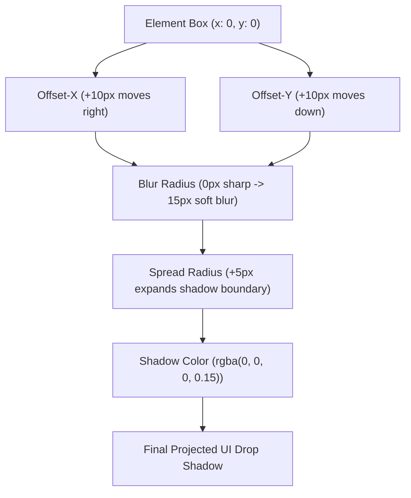

# CSS Shadows

Estimated Reading Time: 25 minutes

Prerequisites: [Introduction to CSS](01-introduction-to-css.md), [CSS Colors](04-css-colors.md), [Border Radius](08-border-radius.md)

Learning Objectives:
- Master `box-shadow` to create visual elevation and depth on DOM element containers.
- Master `text-shadow` to apply drop shadows behind text glyphs.
- Understand shadow parameters: X-offset, Y-offset, blur radius, spread radius, color, and `inset`.
- Implement modern elevation systems (soft ambient shadows, layered shadows, hover elevation).

---

## Introduction

In modern user interface design, shadows create a sense of three-dimensional depth, physical elevation, and visual hierarchy. Without shadows, web interfaces appear flat. CSS provides two primary shadow properties: `box-shadow` (for element containers, cards, and buttons) and `text-shadow` (for text headings).

`box-shadow` allows developers to project soft drop shadows behind DOM boxes or inner inset shadows inside container borders. By adjusting offset distances, blur softeness, and color opacities, developers can simulate natural light sources and make interactive elements appear "raised" off the screen canvas.

Mastering CSS shadows is essential for creating modern UI component libraries, floating navigation bars, modal dialog overlays, and material elevation systems.

---

## Real-World Analogy

Imagine holding a physical sheet of paper above a white desk under a overhead lamp.

- **Flat Object on Table (`box-shadow: none`)**: The paper rests flat against the desk surface. No shadow is visible.
- **Slightly Lifted Sheet (`box-shadow: 0 2px 4px rgba(0,0,0,0.1)`)**: You lift the paper 2 millimeters off the desk. A tight, soft dark shadow forms directly beneath its edges.
- **High Elevation Modal (`box-shadow: 0 20px 25px rgba(0,0,0,0.25)`)**: You lift the paper 20 centimeters off the desk toward the light bulb. The shadow cast onto the desk becomes larger, softer, more blurred, and spreads farther away.
- **Inset Shadow (`box-shadow: inset ...`)**: Instead of lifting paper off a desk, imagine pressing an engraved stamp *into* a soft clay block. The shadow casts inward inside the carved edges.

Shadows communicate physical elevation and proximity to the user.

---

## Core Concepts

### 1. The `box-shadow` Property Parameters
`box-shadow` accepts up to 6 parameters in order:
1. **`inset` (Optional)**: Changes shadow from an outer drop shadow to an inner inset shadow.
2. **Offset-X (Mandatory)**: Horizontal shadow displacement (positive moves right, negative moves left).
3. **Offset-Y (Mandatory)**: Vertical shadow displacement (positive moves down, negative moves up).
4. **Blur Radius (Optional)**: Blurs shadow edges (`0px` is sharp, higher values create soft ambient blurs).
5. **Spread Radius (Optional)**: Expands or contracts shadow size (`+px` expands, `-px` shrinks).
6. **Shadow Color (Optional)**: Color of shadow (defaults to `currentColor`, best used with semi-transparent `rgba()`).

### 2. The `text-shadow` Property Parameters
`text-shadow` applies drop shadows directly behind text character glyphs.
- **Syntax**: `text-shadow: [offset-x] [offset-y] [blur-radius] [color];`
- Note: `text-shadow` does **not** support `spread-radius` or `inset`.

### 3. Layered Shadows for Realism
Real-world light sources create multiple overlapping shadow layers. Combining two comma-separated shadow definitions inside a single `box-shadow` property produces hyper-realistic, soft ambient UI shadows:
`box-shadow: 0 4px 6px -1px rgba(0,0,0,0.1), 0 2px 4px -1px rgba(0,0,0,0.06);`

---

## Syntax

```css
/* 1. Basic Box Shadow (Offset-X, Offset-Y, Blur, Color) */
.card-simple {
    box-shadow: 0px 4px 10px rgba(0, 0, 0, 0.1);
}

/* 2. Complete Box Shadow (X, Y, Blur, Spread, Color) */
.card-elevated {
    box-shadow: 0px 10px 15px -3px rgba(0, 0, 0, 0.1);
}

/* 3. Inset Shadow (Inside Container) */
.input-pressed {
    box-shadow: inset 0px 2px 4px rgba(0, 0, 0, 0.06);
}

/* 4. Multiple Layered Shadows (Comma-Separated) */
.card-material {
    box-shadow: 
        0 1px 3px rgba(0, 0, 0, 0.1),
        0 10px 20px rgba(0, 0, 0, 0.05);
}

/* 5. Text Shadow (X, Y, Blur, Color) */
.hero-heading {
    text-shadow: 2px 2px 4px rgba(0, 0, 0, 0.3);
}
```

---

## Property Reference

| Property | Description | Syntax Parameters | Example |
| :--- | :--- | :--- | :--- |
| `box-shadow` | Projects outer/inner drop shadow behind elements | `[inset] X Y [blur] [spread] [color]` | `0 4px 6px rgba(0,0,0,0.1)` |
| `text-shadow` | Projects drop shadow behind text characters | `X Y [blur] [color]` | `2px 2px 4px rgba(0,0,0,0.3)` |

---

## Visual Explanation



---

## Example 1

### HTML
```html
<!DOCTYPE html>
<html lang="en">
<head>
    <meta charset="UTF-8">
    <title>CSS Box Shadow Elevation Levels</title>
    <style>
        body {
            font-family: Arial, sans-serif;
            background-color: #f8fafc;
            padding: 40px;
        }
        .grid {
            display: flex;
            gap: 25px;
        }
        .card {
            background-color: #ffffff;
            padding: 25px;
            border-radius: 12px;
            width: 200px;
        }
        .shadow-low {
            box-shadow: 0 1px 3px rgba(0, 0, 0, 0.1), 0 1px 2px rgba(0, 0, 0, 0.06);
        }
        .shadow-medium {
            box-shadow: 0 4px 6px -1px rgba(0, 0, 0, 0.1), 0 2px 4px -1px rgba(0, 0, 0, 0.06);
        }
        .shadow-high {
            box-shadow: 0 20px 25px -5px rgba(0, 0, 0, 0.1), 0 10px 10px -5px rgba(0, 0, 0, 0.04);
        }
    </style>
</head>
<body>
    <div class="grid">
        <div class="card shadow-low">
            <h4>Low Elevation</h4>
            <p style="color:#64748b; font-size:14px; margin:0;">Subtle resting shadow</p>
        </div>
        <div class="card shadow-medium">
            <h4>Medium Elevation</h4>
            <p style="color:#64748b; font-size:14px; margin:0;">Hover card shadow</p>
        </div>
        <div class="card shadow-high">
            <h4>High Elevation</h4>
            <p style="color:#64748b; font-size:14px; margin:0;">Modal popover shadow</p>
        </div>
    </div>
</body>
</html>
```

### CSS
```css
body {
    font-family: Arial, sans-serif;
    background-color: #f8fafc;
    padding: 40px;
}
.grid {
    display: flex;
    gap: 25px;
}
.card {
    background-color: #ffffff;
    padding: 25px;
    border-radius: 12px;
    width: 200px;
}
.shadow-low {
    box-shadow: 0 1px 3px rgba(0, 0, 0, 0.1), 0 1px 2px rgba(0, 0, 0, 0.06);
}
.shadow-medium {
    box-shadow: 0 4px 6px -1px rgba(0, 0, 0, 0.1), 0 2px 4px -1px rgba(0, 0, 0, 0.06);
}
.shadow-high {
    box-shadow: 0 20px 25px -5px rgba(0, 0, 0, 0.1), 0 10px 10px -5px rgba(0, 0, 0, 0.04);
}
```

### Explanation
This example demonstrates layered elevation shadows. The first card (`.shadow-low`) casts a tight subtle shadow simulating resting flat content. The second card (`.shadow-medium`) casts a medium blur shadow simulating raised card components. The third card (`.shadow-high`) projects a deep 25px blurred shadow simulating high elevation modal dialogs floating above the screen canvas.

---

## Output Image Prompt

A browser window displaying three side-by-side white card containers on a soft off-white background (`#f8fafc`). All three cards have 12-pixel rounded corners, white backgrounds, and 25 pixels padding. The left card "Low Elevation" projects a subtle tight dark shadow barely visible beneath its bottom edge. The middle card "Medium Elevation" casts a noticeable soft medium drop shadow. The right card "High Elevation" casts a dramatic, soft, deep 25-pixel blurred drop shadow that extends significantly below the card, giving the visual illusion that the right card is floating high above the page canvas.

---

## Code Explanation

- `box-shadow: 0 1px 3px rgba(0, 0, 0, 0.1)`: `0` X-offset centers shadow horizontally, `1px` Y-offset pushes shadow slightly downward, `3px` blur softens shadow edges, and 10% opacity black (`rgba`) prevents harsh black edges.
- Multiple comma-separated shadow declarations combine ambient directional lighting with soft outline halos.

---

## Example 2

### HTML
```html
<!DOCTYPE html>
<html lang="en">
<head>
    <meta charset="UTF-8">
    <title>Text Shadow & Interactive Hover Card</title>
    <style>
        body {
            font-family: Arial, sans-serif;
            background-color: #0f172a;
            padding: 40px;
        }
        .hero-heading {
            color: #ffffff;
            font-size: 36px;
            text-shadow: 0 4px 12px rgba(59, 130, 246, 0.5);
            margin-bottom: 30px;
        }
        .interactive-card {
            background-color: #1e293b;
            color: #ffffff;
            padding: 25px;
            border-radius: 12px;
            width: 260px;
            box-shadow: 0 4px 6px rgba(0, 0, 0, 0.3);
            transition: transform 0.2s, box-shadow 0.2s;
            cursor: pointer;
        }
        .interactive-card:hover {
            transform: translateY(-4px);
            box-shadow: 0 12px 20px rgba(59, 130, 246, 0.3);
        }
    </style>
</head>
<body>
    <h1 class="hero-heading">Glow Effect Title</h1>
    <div class="interactive-card">
        <h3 style="margin-top:0;">Interactive Card</h3>
        <p style="color:#94a3b8; font-size:14px; margin:0;">Hover over this card to lift elevation and add a blue glow shadow.</p>
    </div>
</body>
</html>
```

### CSS
```css
body {
    font-family: Arial, sans-serif;
    background-color: #0f172a;
    padding: 40px;
}
.hero-heading {
    color: #ffffff;
    font-size: 36px;
    text-shadow: 0 4px 12px rgba(59, 130, 246, 0.5);
    margin-bottom: 30px;
}
.interactive-card {
    background-color: #1e293b;
    color: #ffffff;
    padding: 25px;
    border-radius: 12px;
    width: 260px;
    box-shadow: 0 4px 6px rgba(0, 0, 0, 0.3);
    transition: transform 0.2s, box-shadow 0.2s;
    cursor: pointer;
}
.interactive-card:hover {
    transform: translateY(-4px);
    box-shadow: 0 12px 20px rgba(59, 130, 246, 0.3);
}
```

### Explanation
This example demonstrates `text-shadow` and interactive hover elevation. The main heading uses `text-shadow` with a blue translucent color (`rgba(59, 130, 246, 0.5)`) to create a glowing text title. The interactive card uses `box-shadow` on hover, lifting upward (`translateY(-4px)`) while expanding its shadow spread into a vibrant blue glow halo.

---

## Output Image Prompt

A browser window displaying a dark theme interface (`#0f172a`). At the top left, a white main heading "Glow Effect Title" appears with a luminous blue glow drop shadow projected directly behind the letters. Below the heading sits a dark slate card container (`#1e293b`) with 12-pixel rounded corners. The card features white title text and light gray description text. A subtle dark shadow casts beneath the card resting state, which expands into a soft blue ambient glow shadow on hover interaction.

---

## Code Explanation

- `text-shadow: 0 4px 12px rgba(59, 130, 246, 0.5);`: Applies a soft 12px blurred blue drop shadow behind text characters to simulate a neon text glow.
- `box-shadow: 0 12px 20px rgba(59, 130, 246, 0.3);`: Expands shadow blur radius on `:hover` state while applying matching blue accent colors.

---

## Best Practices

- **Use Translucent RGBA/HSLA Colors**: Always use semi-transparent colors (like `rgba(0, 0, 0, 0.1)`) for shadows. Pure solid black (`#000000`) creates unnaturally harsh, fake-looking shadows.
- **Keep Shadows Subtle**: Use small blur radii and low alpha opacity (5% to 15%) for standard UI cards to maintain clean, professional aesthetic quality.
- **Layer Multiple Shadows**: Combine a tight sharp shadow (for border definition) with a soft spread shadow (for ambient depth) to create realistic elevation.
- **Match Shadows to Light Source**: Maintain consistent shadow offset directions (e.g. positive Y-offset simulating an overhead lamp) across all site elements.

---

## Common Mistakes

### Mistake 1: Using Solid Black for Shadows

```css
/* INCORRECT */
.card {
    box-shadow: 5px 5px 10px #000000; /* Solid black creates harsh, ugly shadow edges */
}
```

#### Explanation
Real-world shadows are translucent ambient light gradients. Using solid `#000000` creates heavy black marks that degrade visual quality.

```css
/* CORRECT */
.card {
    box-shadow: 0 4px 12px rgba(0, 0, 0, 0.1); /* Soft, natural translucent shadow */
}
```

---

### Mistake 2: Confusing `box-shadow` and `text-shadow` Parameters

```css
/* INCORRECT */
h1 {
    text-shadow: 0 2px 4px 2px red; /* text-shadow does NOT support 4th spread parameter! */
}
```

#### Explanation
`text-shadow` accepts only `[offset-x] [offset-y] [blur] [color]`. Adding a 4th numeric spread parameter breaks syntax parsing.

```css
/* CORRECT */
h1 {
    text-shadow: 0 2px 4px red;
}
```

---

### Mistake 3: Over-using Excessive Blur Values

```css
/* INCORRECT */
.card {
    box-shadow: 0 50px 100px black; /* Massive blur causes performance lag and dirty layouts */
}
```

#### Explanation
Extremely large blur values degrade GPU rendering performance during scrolling and create muddy visual overlap between adjacent UI elements.

```css
/* CORRECT */
.card {
    box-shadow: 0 10px 15px -3px rgba(0, 0, 0, 0.1);
}
```

---

## Browser Compatibility

Both `box-shadow` and `text-shadow` have 100% universal support across all modern desktop and mobile browser engines (Chrome, Firefox, Safari, Edge, Opera, IE9+).

Inset shadows and comma-separated multi-layer shadows enjoy 100% cross-browser compatibility.

---

## Real-World Applications

- **Floating Navigation Bars**: Adding `box-shadow: 0 2px 10px rgba(0,0,0,0.1)` to sticky headers to separate them from scrolling page body content.
- **UI Action Buttons**: Enhancing call-to-action buttons with subtle drop shadows that expand on `:hover`.
- **Modal Popups & Dropdown Menus**: Projecting deep elevation shadows (`shadow-high`) to visually separate overlays from background page layers.
- **Form Text Inputs**: Applying `box-shadow: inset 0 2px 4px rgba(0,0,0,0.06)` to create carved form field aesthetics.

---

## Mini Project

### Project Objective: Material Design Elevation Card Grid
Build a 3-tier elevation component system (Resting Card, Hover Card, Active Modal) utilizing `box-shadow`.

#### Requirements:
1. Resting Card must have subtle 2px blur shadow at 8% opacity.
2. Hover Card must smoothly lift (`transform: translateY(-4px)`) and project a 12px blur shadow at 15% opacity on `:hover`.
3. Active Modal card must float with a deep 25px blur shadow and a semi-transparent dark backdrop overlay.

---

## Practice Exercises

### Beginner Level
1. Apply a basic drop shadow to a `.card` element using 0px X-offset, 4px Y-offset, 10px blur, and 10% opacity black.
2. Add a subtle text shadow (`1px 1px 2px rgba(0,0,0,0.5)`) to an `<h1>` heading.
3. Create an inset shadow inside a text input field using `box-shadow: inset ...`.
4. Remove shadows completely from an element using `box-shadow: none;`.
5. Create a colored glow effect around a button using a red RGBA shadow.

### Intermediate Level
6. Combine two comma-separated `box-shadow` declarations into a single realistic card shadow rule.
7. Build an interactive button that moves down 2px (`translateY(2px)`) and reduces shadow blur on `:active` press state.
8. Create a sticky header with a subtle bottom drop shadow that activates on page scroll.
9. Format a dark theme card using a glowing primary-colored shadow (`rgba(59, 130, 246, 0.25)`).
10. Apply a spread parameter (`-3px`) to contract a shadow perimeter tightly under a box.

### Advanced Level
11. Build a custom Neumorphism soft-UI container combining convex light and dark inset/outset shadows.
12. Audit GPU paint box performance overhead of heavily blurred animated `box-shadow` rules vs `will-change`.
13. Formulate a dynamic elevation token design system using CSS custom properties (`--shadow-sm`, `--shadow-lg`).
14. Create a 3D layered text effect stacking 5 comma-separated `text-shadow` layers.
15. Demonstrate how `box-shadow` renders around elements with custom `border-radius` corners vs clipped paths.

---

## Quick Quiz

**1. Which property applies drop shadows behind element box containers?**
A) `text-shadow`  
B) `box-shadow`  
C) `element-shadow`  
D) `border-shadow`  

**2. What does a positive Y-offset value (e.g. `0 10px 5px black`) do to a shadow?**
A) Moves shadow to the left  
B) Moves shadow downward  
C) Moves shadow upward  
D) Expands shadow size  

**3. What does the 3rd numeric parameter in `box-shadow: 0 4px 10px rgba(0,0,0,0.1);` represent?**
A) Offset-X  
B) Offset-Y  
C) Blur Radius  
D) Spread Radius  

**4. How do you convert an outer drop shadow into an inner shadow cast inside element boundaries?**
A) Add the keyword `inner`  
B) Add the keyword `inset`  
C) Use negative blur numbers  
D) Set Y-offset to 0  

**5. Why are semi-transparent `rgba()` colors preferred over pure `#000000` black for shadows?**
A) `rgba()` renders faster  
B) `rgba()` creates realistic, soft ambient light gradients without harsh artificial edges  
C) Solid black is not supported in Chrome  
D) `rgba()` automatically centers shadows  

**6. Does `text-shadow` support the `spread-radius` parameter?**
A) Yes  
B) No  
C) Only in Firefox  
D) Only with inset keywords  

**7. How can you apply multiple overlapping shadows to a single element in CSS?**
A) Write multiple `box-shadow` property lines  
B) Separate individual shadow definitions with commas in a single `box-shadow` declaration  
C) Use `@import shadow`  
D) It is impossible  

**8. What parameter in `box-shadow: 0 10px 15px -3px black;` is `-3px`?**
A) Blur Radius  
B) Spread Radius  
C) Offset-Y  
D) Opacity  

**9. What happens to a shadow when `blur-radius` is set to `0px`?**
A) The shadow disappears  
B) The shadow renders as a solid, hard-edged shape with no blur softness  
C) The shadow turns white  
D) The element rotates  

**10. What is the default color of a shadow if color is omitted from `box-shadow`?**
A) Black (`#000000`)  
B) White (`#ffffff`)  
C) `currentColor` (the current text color of the element)  
D) Transparent  

---

### Answers
1: B | 2: B | 3: C | 4: B | 5: B | 6: B | 7: B | 8: B | 9: B | 10: C

---

## Interview Questions

**1. Explain all parameters of the `box-shadow` property in correct order.**  
*Answer:* Syntax: `box-shadow: [inset] offset-x offset-y [blur-radius] [spread-radius] [color];`. `inset` shifts shadow inside, `offset-x` moves right/left, `offset-y` moves down/up, `blur-radius` softens edge blur, `spread-radius` expands/contracts size, and `color` sets translucent color.

**2. What is the difference between `box-shadow` and `text-shadow`?**  
*Answer:* `box-shadow` projects drop shadows behind DOM element box containers (supporting `spread-radius` and `inset`). `text-shadow` projects drop shadows strictly behind individual text character glyphs (and does not support spread or inset parameters).

**3. What is the purpose of the `spread-radius` parameter in `box-shadow`?**  
*Answer:* `spread-radius` expands or contracts the shadow boundary relative to the parent element box size before blur is applied. A positive value expands shadow coverage; a negative value shrinks shadow coverage.

**4. Why are layered (multi-stop) shadows used in modern design systems?**  
*Answer:* Real-world ambient light produces complex multi-layered light diffusion. Combining a small sharp shadow with a larger soft blur shadow creates realistic 3D depth and eliminates harsh single-blur artifacts.

**5. How do shadows interact with `border-radius` on rounded containers?**  
*Answer:* Browsers automatically curve `box-shadow` boundaries to match the element's computed `border-radius` corners seamlessly.

**6. What is an `inset` shadow and when is it commonly used?**  
*Answer:* An `inset` shadow places drop shadows inside the element's frame perimeter instead of casting outward. It is commonly used for pressed button states, form input inner recesses, or carved UI containers.

**7. How can animating `box-shadow` on hover impact web performance, and how can it be optimized?**  
*Answer:* Animating `box-shadow` forces browser GPU engines to re-render paint layers on every frame, causing scroll jank. Optimization strategies include animating `opacity` on a pre-rendered pseudo-element (`::after`) shadow layer instead.

**8. What does a negative Y-offset (e.g. `box-shadow: 0 -5px 10px rgba(0,0,0,0.1)`) do?**  
*Answer:* A negative Y-offset projects the shadow **upward** above the top edge of the element box.

**9. How do you create a clean glowing border effect using `box-shadow`?**  
*Answer:* Set X and Y offsets to `0`, apply a medium blur radius (e.g. `8px`), a small spread radius (e.g. `2px`), and a vibrant accent color (e.g. `rgba(59, 130, 246, 0.5)`).

**10. What is Neumorphism in CSS styling?**  
*Answer:* Neumorphism is a design trend combining dual light and dark inset/outset shadows on light gray backgrounds to create soft, extruded, plastic-like UI components.

---

## Summary

- **`box-shadow`** projects depth shadows behind element box containers.
- **`text-shadow`** projects drop shadows behind text character glyphs.
- `box-shadow` syntax: `[inset] offset-x offset-y [blur-radius] [spread-radius] [color]`.
- Always use **semi-transparent `rgba()` colors** for realistic, soft ambient shadows.
- Combine multiple comma-separated shadows to build natural elevation systems.

---

## Cheat Sheet

```css
/* CSS SHADOW CHEAT SHEET */

/* Subtle Card Resting Shadow */
box-shadow: 0 1px 3px rgba(0, 0, 0, 0.1), 0 1px 2px rgba(0, 0, 0, 0.06);

/* Medium Elevated Card Shadow */
box-shadow: 0 4px 6px -1px rgba(0, 0, 0, 0.1), 0 2px 4px -1px rgba(0, 0, 0, 0.06);

/* High Elevation Modal Shadow */
box-shadow: 0 20px 25px -5px rgba(0, 0, 0, 0.1), 0 10px 10px -5px rgba(0, 0, 0, 0.04);

/* Inset Input Field Shadow */
box-shadow: inset 0 2px 4px rgba(0, 0, 0, 0.06);

/* Glowing Colored Accent Shadow */
box-shadow: 0 0 15px rgba(59, 130, 246, 0.5);

/* Text Drop Shadow */
text-shadow: 0 2px 4px rgba(0, 0, 0, 0.3);
```

---

## Related Topics

- **Previous Topic**: [Border Radius](08-border-radius.md)
- **Next Topic**: [CSS Margins](10-css-margins.md)
- **Recommended Learning Order**: Introduction to CSS -> Ways to Add CSS -> CSS Selectors -> CSS Colors -> CSS Fonts -> CSS Borders -> Border Radius -> CSS Shadows -> CSS Margins -> CSS Box Model
