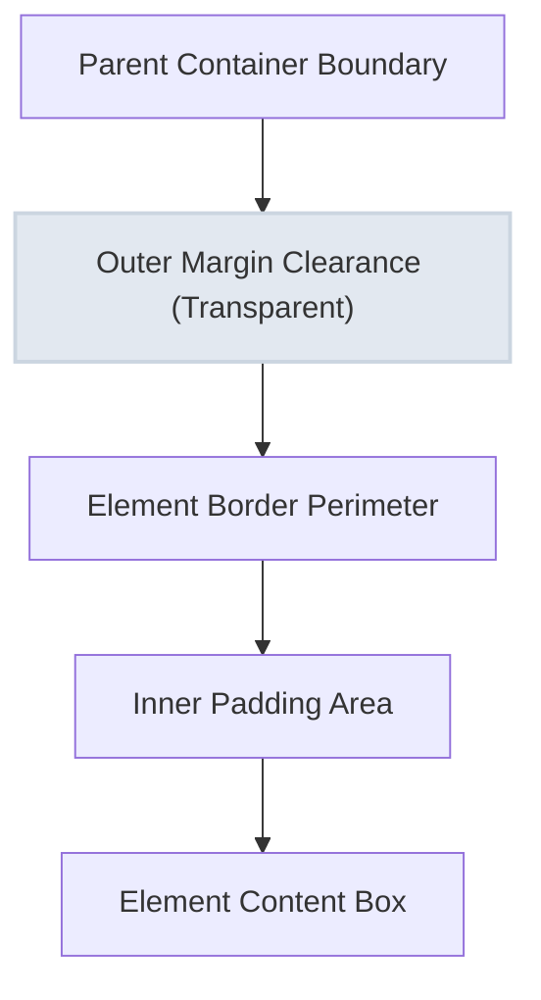

# CSS Margins

Estimated Reading Time: 25 minutes

Prerequisites: [Introduction to CSS](01-introduction-to-css.md), [CSS Selectors](03-css-selectors.md), [CSS Borders](07-css-borders.md)

Learning Objectives:
- Master `margin` property usage to create outer clearance space around HTML elements.
- Understand single-value, 2-value, 3-value, and 4-value shorthand rules.
- Master horizontal block centering using `margin: 0 auto;`.
- Comprehend vertical margin collapsing behavior and negative margins.

---

## Introduction

In web design, whitespace is essential for readability and visual balance. In the CSS Box Model, margin is the transparent outer clearance area surrounding an element's border. Margin separates adjacent elements on a page, preventing content cards, headings, buttons, and text blocks from crowding together.

Unlike padding (which adds internal spacing *inside* an element's border), margin creates external buffer space *outside* the element's border boundary. Margins can take positive pixel lengths, percentages, automatic keywords (`auto`), or even negative values to pull elements closer together.

Understanding margin behavior—including directional controls, auto-centering, margin collapse, and layout rhythm—is fundamental to building clean, organized user interfaces.

---

## Real-World Analogy

Imagine houses built along a suburban neighborhood street.

- **Element Content & Padding**: The physical structure of a house and its private fenced front yard.
- **Border**: The wooden fence outlining the property line.
- **Margin**: The grassy setback lawn and sidewalk space between neighboring fences. It guarantees that neighboring houses are not touching wall-to-wall.
- **`margin: auto`**: Parking a car in the exact center of a two-car garage by leaving equal empty space on both the left and right sides.
- **Negative Margin**: A house extension structure that overlaps past the property line, pulling neighboring yards closer together.

Margins create external breathing room between independent DOM elements.

---

## Core Concepts

### 1. Directional Margin Properties
Margins can be controlled on all four sides independently:
- **`margin-top`**: Clearance space above the element.
- **`margin-right`**: Clearance space to the right of the element.
- **`margin-bottom`**: Clearance space below the element.
- **`margin-left`**: Clearance space to the left of the element.

### 2. Multi-Value Shorthand Rules
The `margin` shorthand supports 1 to 4 parameter values:
- **1 Value**: All 4 sides (`top`, `right`, `bottom`, `left`).
- **2 Values**: `[top & bottom]` `[left & right]`.
- **3 Values**: `[top]` `[left & right]` `[bottom]`.
- **4 Values**: Clockwise order: `[top]` `[right]` `[bottom]` `[left]`.

### 3. Centering Elements with `margin: auto`
When a block-level element has a fixed `width` (or `max-width`), setting `margin-left: auto;` and `margin-right: auto;` (commonly written as `margin: 0 auto;`) forces the browser engine to split remaining horizontal space equally on both sides, centering the element within its parent container.

### 4. Vertical Margin Collapsing
When two vertical block elements touch (e.g. a paragraph with `margin-bottom: 20px` placed directly above another paragraph with `margin-top: 30px`), their top and bottom margins do **not** add together to create 50px. Instead, the margins collapse into a single margin equal to the **largest** of the two margins (in this case, 30px).

### 5. Negative Margins
Negative margin values (e.g., `margin-top: -20px;`) pull an element closer to adjacent elements or pull it out of its normal document flow position.

---

## Syntax

```css
/* Individual Directional Margins */
.box-longhand {
    margin-top: 20px;
    margin-right: 15px;
    margin-bottom: 30px;
    margin-left: 15px;
}

/* 1-Value Shorthand (All 4 sides) */
.box-equal {
    margin: 20px;
}

/* 2-Value Shorthand (Top/Bottom | Left/Right) */
.box-symmetric {
    margin: 20px 40px;
}

/* Horizontal Centering Pattern */
.container-centered {
    max-width: 800px;
    margin-top: 0;
    margin-right: auto;
    margin-bottom: 0;
    margin-left: auto;
    /* Equivalently: margin: 0 auto; */
}

/* Negative Margin */
.overlap-card {
    margin-top: -30px;
}
```

---

## Property Reference

| Property | Description | Common Values | Default Value |
| :--- | :--- | :--- | :--- |
| `margin` | Shorthand for all 4 outer clearance sides | `20px`, `10px 20px`, `0 auto` | `0` |
| `margin-top` | Clearance above top border | `20px`, `1rem`, `-10px` | `0` |
| `margin-right` | Clearance right of right border | `20px`, `auto`, `5%` | `0` |
| `margin-bottom` | Clearance below bottom border | `20px`, `2rem`, `0` | `0` |
| `margin-left` | Clearance left of left border | `20px`, `auto`, `5%` | `0` |

---

## Visual Explanation



### Vertical Margin Collapse Flow
```
[ Element A ]  bottom-margin: 30px
     │
     ├── collapsed margin = 30px (NOT 50px!)
     │
[ Element B ]  top-margin: 20px
```

---

## Example 1

### HTML
```html
<!DOCTYPE html>
<html lang="en">
<head>
    <meta charset="UTF-8">
    <title>Centered Layout with Margins</title>
    <style>
        body {
            font-family: Arial, sans-serif;
            background-color: #f1f5f9;
            margin: 0;
            padding: 40px 0;
        }
        .main-container {
            max-width: 600px;
            margin: 0 auto; /* Centering block container */
            background-color: #ffffff;
            padding: 30px;
            border: 1px solid #cbd5e1;
            border-radius: 8px;
        }
        .card-one {
            background-color: #e0f2fe;
            padding: 15px;
            margin-bottom: 25px; /* Creates clearance to next box */
            border-left: 4px solid #0284c7;
        }
        .card-two {
            background-color: #f0fdf4;
            padding: 15px;
            margin-top: 15px; /* Collapses with card-one margin-bottom */
            border-left: 4px solid #16a34a;
        }
    </style>
</head>
<body>
    <div class="main-container">
        <h2>Centered Container Demo</h2>
        <div class="card-one">
            <strong>Card One:</strong> Has margin-bottom: 25px.
        </div>
        <div class="card-two">
            <strong>Card Two:</strong> Has margin-top: 15px.
        </div>
    </div>
</body>
</html>
```

### CSS
```css
body {
    font-family: Arial, sans-serif;
    background-color: #f1f5f9;
    margin: 0;
    padding: 40px 0;
}
.main-container {
    max-width: 600px;
    margin: 0 auto;
    background-color: #ffffff;
    padding: 30px;
    border: 1px solid #cbd5e1;
    border-radius: 8px;
}
.card-one {
    background-color: #e0f2fe;
    padding: 15px;
    margin-bottom: 25px;
    border-left: 4px solid #0284c7;
}
.card-two {
    background-color: #f0fdf4;
    padding: 15px;
    margin-top: 15px;
    border-left: 4px solid #16a34a;
}
```

### Explanation
This example illustrates auto-centering and vertical margin collapse. The `.main-container` has a `max-width` of 600px and uses `margin: 0 auto` to center itself horizontally within the browser viewport. Inside the container, `.card-one` sets `margin-bottom: 25px` and `.card-two` sets `margin-top: 15px`. Because of vertical margin collapse, the actual gap between the two cards is 25px (the larger value), not 40px.

---

## Output Image Prompt

A browser viewport showing a centered 600-pixel wide white container card on a soft blue-gray background (`#f1f5f9`). The main container has a subtle 1-pixel border (`#cbd5e1`) and 30 pixels padding. Inside the container, an `<h2>` title reads "Centered Container Demo". Below the title sit two stacked cards. The top light-blue card has a blue left border accent and reads "Card One: Has margin-bottom: 25px.". Below it, separated by a 25-pixel vertical margin gap, sits a light-green card with a green left border accent reading "Card Two: Has margin-top: 15px.".

---

## Code Explanation

- `margin: 0 auto;`: Centers the 600px fixed-width container horizontally across the browser screen.
- `margin-bottom: 25px;` & `margin-top: 15px;`: Demonstrates CSS vertical margin collapsing where adjacent vertical margins collapse into a single 25px buffer gap.

---

## Example 2

### HTML
```html
<!DOCTYPE html>
<html lang="en">
<head>
    <meta charset="UTF-8">
    <title>Negative Margin Overlap Banner</title>
    <style>
        body {
            font-family: Arial, sans-serif;
            background-color: #f8fafc;
            margin: 0;
        }
        .hero-banner {
            background-color: #1e293b;
            color: #ffffff;
            padding: 60px 20px;
            text-align: center;
        }
        .overlapping-card {
            max-width: 450px;
            margin: -40px auto 0 auto; /* Negative top margin pulls card into hero */
            background-color: #ffffff;
            padding: 25px;
            border-radius: 12px;
            box-shadow: 0 10px 25px rgba(0, 0, 0, 0.1);
        }
    </style>
</head>
<body>
    <div class="hero-banner">
        <h1 style="margin:0;">Hero Header Section</h1>
        <p style="color:#94a3b8;">Welcome to our web portal</p>
    </div>
    <div class="overlapping-card">
        <h3 style="margin-top:0; color:#0f172a;">Floating Overlap Card</h3>
        <p style="color:#475569; font-size:14px; margin:0;">This card uses negative top margin (-40px) to overlap the dark hero banner above it.</p>
    </div>
</body>
</html>
```

### CSS
```css
body {
    font-family: Arial, sans-serif;
    background-color: #f8fafc;
    margin: 0;
}
.hero-banner {
    background-color: #1e293b;
    color: #ffffff;
    padding: 60px 20px;
    text-align: center;
}
.overlapping-card {
    max-width: 450px;
    margin: -40px auto 0 auto;
    background-color: #ffffff;
    padding: 25px;
    border-radius: 12px;
    box-shadow: 0 10px 25px rgba(0, 0, 0, 0.1);
}
```

### Explanation
This component uses negative margins to create a modern overlapping card design. The dark `.hero-banner` sits at the top. The white `.overlapping-card` applies a negative top margin (`margin-top: -40px`), which pulls the card 40 pixels upward so it floats over the seam between the dark header and light page background.

---

## Output Image Prompt

A browser viewport displaying a full-width dark slate header banner (`#1e293b`) containing white heading text "Hero Header Section" and light gray subtitle text. Below the dark banner, the page background is light gray (`#f8fafc`). A white 450-pixel wide floating card container with 12-pixel rounded corners and a soft drop shadow rests centered horizontally, pulled 40 pixels upward so its top portion overlaps directly over the dark header banner above it.

---

## Code Explanation

- `margin: -40px auto 0 auto;`: Combines negative top margin (`-40px` pulls element upward) with horizontal auto-centering (`auto` left and right).

---

## Best Practices

- **Use `margin: 0 auto` for Centering**: Always ensure a block element has a fixed `width` or `max-width` before using `margin: 0 auto;` for centering.
- **Maintain Consistent Vertical Spacing**: Establish a single vertical margin direction policy (such as applying `margin-bottom` on headings and paragraphs) to keep visual rhythm predictable.
- **Zero Out Body Margins**: Include `body { margin: 0; }` in your global CSS reset to eliminate default browser viewport edge gaps.
- **Avoid Overusing Negative Margins**: Restrict negative margins to controlled layout overlap components (like hero overlays) to prevent broken document structures.

---

## Common Mistakes

### Mistake 1: Trying to Center an Element Without a Fixed Width

```css
/* INCORRECT */
.box {
    /* Missing width! Block elements take 100% width by default, so auto margins have 0 effect */
    margin: 0 auto;
}
```

#### Explanation
Block elements naturally stretch across 100% of parent width. Without a declared `width` or `max-width`, there is no leftover space for `auto` margins to divide.

```css
/* CORRECT */
.box {
    max-width: 500px;
    margin: 0 auto;
}
```

---

### Mistake 2: Expecting Adjacent Vertical Margins to Add Together

```css
/* INCORRECT logic */
.title { margin-bottom: 30px; }
.text  { margin-top: 20px; }
/* Developer expects 50px space between title and text, but actual space is 30px due to margin collapse! */
```

#### Explanation
Vertical margins on adjacent block elements collapse into a single margin equal to the maximum single margin value.

```css
/* CORRECT: Adjust single margin to achieve exact desired clearance */
.title { margin-bottom: 50px; }
.text  { margin-top: 0; }
```

---

### Mistake 3: Confusing Margin with Padding

```css
/* INCORRECT */
.card {
    background-color: blue;
    margin: 20px; /* Developer wanted internal space inside blue box, but margin pushes box away from outside! */
}
```

#### Explanation
`margin` creates clearance **outside** the border and background color. To create space **inside** the background container, use `padding`.

```css
/* CORRECT */
.card {
    background-color: blue;
    padding: 20px; /* Internal space inside background boundary */
}
```

---

## Browser Compatibility

All CSS margin properties (`margin`, `margin-top/right/bottom/left`, negative margins, `auto` centering, and vertical margin collapsing) have 100% universal support across all browsers ever created.

---

## Real-World Applications

- **Page Container Centering**: Centering main web content areas horizontally (`max-width: 1200px; margin: 0 auto;`).
- **Typography Separation**: Applying `margin-bottom: 1rem` beneath headings and body paragraphs to establish vertical reading hierarchy.
- **Hero Banner Overlaps**: Pulling pricing cards or search bars upward over hero background images using negative top margins.
- **Button Row Clearance**: Adding `margin-right: 15px` between adjacent action buttons.

---

## Mini Project

### Project Objective: Centered Profile Card Layout with Hero Overlap
Build a centered web page containing a dark hero header, a floating white profile card overlapping the header, and stacked text elements with proper margin spacing.

#### Requirements:
1. Reset `body { margin: 0; }`.
2. Center a 500px wide card container using `margin: 0 auto;`.
3. Apply a `-50px` negative top margin to pull the card container over the hero header.
4. Separate card elements internally using consistent `margin-bottom` spacing.

---

## Practice Exercises

### Beginner Level
1. Remove all default margin clearance from the HTML `<body>` element.
2. Add a 20px bottom margin to all `<h1>` headings.
3. Center a 400px wide `<div>` horizontally using `margin: 0 auto;`.
4. Create a shorthand margin declaration setting top/bottom margins to 10px and left/right margins to 20px.
5. Apply a 15px right margin to a button to separate it from an adjacent button.

### Intermediate Level
6. Demonstrate vertical margin collapse by placing a box with `margin-bottom: 40px` above a box with `margin-top: 25px`.
7. Pull an overlapping image 30px upward into a parent section using negative `margin-top`.
8. Write a 4-value shorthand margin declaration setting top to 10px, right to 15px, bottom to 20px, and left to 25px.
9. Fix a broken `margin: 0 auto;` declaration on an element missing a declared `width`.
10. Combine `max-width: 800px` and `margin: 0 auto` with 20px left/right safety margins for responsive screens.

### Advanced Level
11. Prevent margin collapsing between a parent container and its first child element using padding or borders.
12. Compare margin auto behavior in standard Block Flow vs Flexbox vs Grid containers.
13. Build a dynamic grid layout relying on negative margin container offsets to balance card padding gaps.
14. Explain how vertical margins collapse when empty block elements with top and bottom margins touch.
15. Demonstrate how `margin-inline` and `margin-block` logical properties handle international right-to-left (RTL) writing modes.

---

## Quick Quiz

**1. What does the CSS `margin` property control?**
A) Space inside an element's border  
B) Transparent clearance space outside an element's border  
C) Text font thickness  
D) Element background color  

**2. Which shorthand declaration centers a fixed-width block element horizontally?**
A) `margin: auto 0;`  
B) `margin: 0 auto;`  
C) `margin: center;`  
D) `align: center;`  

**3. What requirement must a block element meet before `margin: 0 auto;` can center it?**
A) Must have a background color  
B) Must have a declared `width` or `max-width` smaller than parent  
C) Must have `position: absolute`  
D) Must have `border: none`  

**4. What is vertical margin collapsing?**
A) Margins turn invisible  
B) Adjacent top and bottom margins of vertical block elements collapse into a single margin equal to the largest value  
C) Margins double in size  
D) Margins shift to the right  

**5. What is the value order in 4-value shorthand `margin: 10px 20px 30px 40px;`?**
A) Top, Right, Bottom, Left (Clockwise)  
B) Left, Right, Top, Bottom  
C) Top, Bottom, Left, Right  
D) Top-Left, Top-Right, Bottom-Right, Bottom-Left  

**6. What does a negative margin value (e.g. `margin-top: -20px;`) do?**
A) Causes a syntax error  
B) Pulls the element closer to adjacent elements or overlaps them  
C) Hides the element  
D) Rotates the element  

**7. How does margin differ from padding?**
A) Margin is inside the border; padding is outside  
B) Margin is outside the border; padding is inside the border  
C) Margin applies only to text  
D) There is no difference  

**8. What does `margin: 20px 40px;` mean?**
A) 20px on all sides  
B) 20px Top/Bottom, 40px Left/Right  
C) 40px Top/Bottom, 20px Left/Right  
D) 20px Top, 40px Bottom  

**9. Can margin background colors be styled directly?**
A) Yes, using `margin-color`  
B) No, margins are always 100% transparent clearance areas showing parent backgrounds  
C) Only in Firefox  
D) Only with images  

**10. What property sets margin space above an element only?**
A) `margin-above`  
B) `margin-top`  
C) `top-margin`  
D) `padding-top`  

---

### Answers
1: B | 2: B | 3: B | 4: B | 5: A | 6: B | 7: B | 8: B | 9: B | 10: B

---

## Interview Questions

**1. What is the CSS `margin` property and how does it fit into the Box Model?**  
*Answer:* `margin` is the outermost layer of the CSS Box Model. It creates transparent clearance buffer space outside an element's border boundary to separate adjacent DOM elements.

**2. How does `margin: 0 auto;` work to center block elements horizontally?**  
*Answer:* Setting left and right margins to `auto` instructs the browser layout engine to calculate the remaining available horizontal space in the parent container and divide it equally between the left and right margin clearance areas, placing the element in the center.

**3. What is Margin Collapsing and under what conditions does it occur?**  
*Answer:* Margin collapsing occurs when adjacent vertical margins of block-level elements touch. Instead of adding together, the margins collapse into a single margin equal to the maximum of the adjacent margin values. It occurs between adjacent siblings or parent and first/last child elements.

**4. How can you prevent vertical margin collapsing between a parent element and its child?**  
*Answer:* You can prevent parent-child margin collapse by: (1) adding a 1px border to the parent, (2) adding 1px padding to the parent, (3) applying `overflow: hidden` to the parent, or (4) using Flexbox/Grid layouts.

**5. What are negative margins and what practical UI problems do they solve?**  
*Answer:* Negative margins assign negative length values (e.g. `-20px`) to pull elements in the opposite direction of normal flow. They are used to create floating hero section overlays, eliminate container padding gaps, or create overlapping card stacks.

**6. Explain the difference between 1-value, 2-value, 3-value, and 4-value shorthand `margin` syntax.**  
*Answer:* 
- 1 value: `all`
- 2 values: `top/bottom` `left/right`
- 3 values: `top` `left/right` `bottom`
- 4 values: `top` `right` `bottom` `left` (clockwise)

**7. Why doesn't `margin: auto` center elements vertically in standard Block Flow layout?**  
*Answer:* In standard document flow, parent containers do not have a fixed implicit height; they expand to fit children. Because available vertical space is unconstrained, vertical `auto` margins evaluate to `0`. (Vertical auto margins *do* work inside Flexbox containers).

**8. What is the difference between `margin` and `padding`?**  
*Answer:* `margin` creates space **outside** the border perimeter (transparent buffer). `padding` creates space **inside** the border perimeter (inherits element background fills).

**9. Do margins apply to inline elements (like `<span>` or `<a>`)?**  
*Answer:* Horizontal margins (`margin-left` and `margin-right`) apply normally to inline elements. However, vertical margins (`margin-top` and `margin-bottom`) have **no effect** on non-replaced inline elements.

**10. What are CSS Logical Margin Properties?**  
*Answer:* Logical properties replace physical directions (`top`, `right`, `bottom`, `left`) with writing-mode relative directions (`margin-block-start`, `margin-block-end`, `margin-inline-start`, `margin-inline-end`). This ensures proper margin positioning in international right-to-left (RTL) or vertical text modes.

---

## Summary

- **`margin`** creates transparent clearance space **outside** an element's border.
- **`margin: 0 auto;`** centers fixed-width block elements horizontally.
- **Vertical Margin Collapsing** collapses touching top/bottom margins into a single maximum value.
- **Negative Margins** pull elements closer or create floating layout overlays.
- Shorthand syntax runs clockwise: `top`, `right`, `bottom`, `left`.

---

## Cheat Sheet

```css
/* CSS MARGIN CHEAT SHEET */

/* Directional Margins */
margin-top: 20px;
margin-right: 15px;
margin-bottom: 30px;
margin-left: 15px;

/* Shorthand Formats */
margin: 20px;                 /* All 4 sides */
margin: 20px 40px;            /* Top/Bottom | Left/Right */
margin: 10px 20px 30px;       /* Top | Left/Right | Bottom */
margin: 10px 20px 30px 40px;  /* Top | Right | Bottom | Left */

/* Block Horizontal Centering Pattern */
.container {
    max-width: 1200px;
    margin: 0 auto;           /* Centered */
}

/* Negative Margin Overlap */
.card-overlap {
    margin-top: -40px;
}
```

---

## Related Topics

- **Previous Topic**: [CSS Shadows](09-css-shadows.md)
- **Next Topic**: [CSS Padding](11-css-padding.md)
- **Recommended Learning Order**: Introduction to CSS -> Ways to Add CSS -> CSS Selectors -> CSS Colors -> CSS Fonts -> CSS Borders -> Border Radius -> CSS Shadows -> CSS Margins -> CSS Padding -> CSS Box Model
