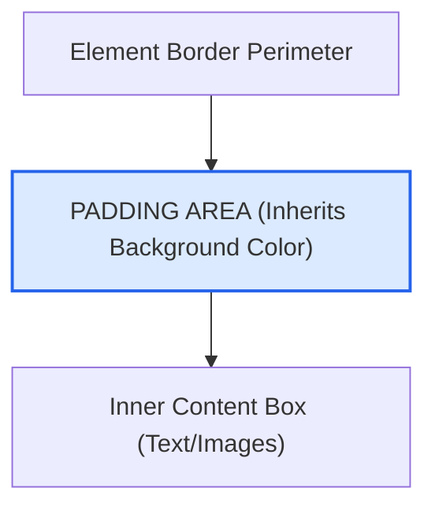

# CSS Padding

Estimated Reading Time: 12 minutes

Prerequisites: [Introduction to CSS](01-introduction-to-css.md), [CSS Margins](10-css-margins.md)

Learning Objectives:
- Understand `padding` as internal clearance space inside an element's border.
- Master directional longhand and multi-value shorthand syntax.
- Understand how padding inherits element background colors.
- Learn padding behavior in the CSS Box Model.

---

## Introduction

In the CSS Box Model, **padding** is the clearance space generated *inside* an element's border, between the border and the inner content.

While margin creates space outside an element to separate it from neighboring tags, padding creates breathing room inside the element so text and images do not press against container edges or button borders.

---

## Real-World Analogy

Imagine a fragile glass gift packed inside a wooden shipping box.

- **Content**: The fragile glass gift inside.
- **Padding**: The foam peanuts or bubble wrap packed inside the box surrounding the gift. It creates internal protective space so the gift does not smash against the wooden walls.
- **Border**: The wooden walls of the shipping box.
- **Margin**: The distance between this shipping box and other boxes in the delivery truck.

Padding is the internal bubble wrap surrounding content.

---

## Core Concepts

### 1. Directional Padding
Padding can be set on individual sides:
- `padding-top`: Internal space above content.
- `padding-right`: Internal space to the right of content.
- `padding-bottom`: Internal space below content.
- `padding-left`: Internal space to the left of content.

### 2. Multi-Value Shorthand
- **1 Value**: `padding: 20px;` (All 4 sides).
- **2 Values**: `padding: 10px 20px;` (Top/Bottom | Left/Right).
- **3 Values**: `padding: 10px 20px 30px;` (Top | Left/Right | Bottom).
- **4 Values**: `padding: 10px 15px 20px 25px;` (Top Right Bottom Left clockwise).

### 3. Background Color Inheritance
Unlike margin (which is always transparent), padding area displays the element's `background-color` or `background-image`.

### 4. Negative Values Not Allowed
Unlike margin, padding **cannot** accept negative values. Padding values must be `0` or positive.

---

## Syntax

```css
/* Individual Directions */
.box {
    padding-top: 15px;
    padding-right: 20px;
    padding-bottom: 15px;
    padding-left: 20px;
}

/* Shorthand Formats */
.card { padding: 20px; }            /* All sides */
.btn  { padding: 10px 24px; }       /* Top/Bottom 10px, Left/Right 24px */
```

---

## Property Reference

| Property | Description | Common Values | Default Value |
| :--- | :--- | :--- | :--- |
| `padding` | Shorthand for all 4 inner padding sides | `16px`, `10px 20px`, `1rem` | `0` |
| `padding-top` | Clearance above inner content | `10px`, `1rem`, `5%` | `0` |
| `padding-right` | Clearance right of inner content | `10px`, `1rem`, `5%` | `0` |
| `padding-bottom` | Clearance below inner content | `10px`, `1rem`, `5%` | `0` |
| `padding-left` | Clearance left of inner content | `10px`, `1rem`, `5%` | `0` |

---

## Visual Explanation



---

## Example 1

### HTML
```html
<!DOCTYPE html>
<html lang="en">
<head>
    <meta charset="UTF-8">
    <title>CSS Padding Demo</title>
    <style>
        .card {
            background-color: #2563eb;
            color: #ffffff;
            padding: 24px;
            border-radius: 8px;
            font-family: Arial, sans-serif;
        }
    </style>
</head>
<body>
    <div class="card">
        <h3 style="margin-top:0;">Padded Container</h3>
        <p style="margin:0;">Padding creates 24px of internal clearance space between this text and the blue card edges.</p>
    </div>
</body>
</html>
```

### CSS
```css
.card {
    background-color: #2563eb;
    color: #ffffff;
    padding: 24px;
    border-radius: 8px;
    font-family: Arial, sans-serif;
}
```

### Explanation
The `.card` container sets `padding: 24px`. This generates 24 pixels of internal clearance around all four inner edges. Because padding inherits background colors, the blue fill (`#2563eb`) covers the entire padded area.

---

## Output Image Prompt

A browser window displaying a blue rectangular card (`#2563eb`) with 8-pixel rounded corners on a white background. Inside the card, white heading text "Padded Container" and paragraph text are surrounded by 24 pixels of uniform blue internal padding clearance on all four sides.

---

## Code Explanation

- `padding: 24px;`: Creates 24px of internal clearance between text content and card boundaries.
- Background color `#2563eb` fills the padded clearance area seamlessly.

---

## Example 2

### HTML
```html
<!DOCTYPE html>
<html lang="en">
<head>
    <meta charset="UTF-8">
    <title>Symmetric Button Padding</title>
    <style>
        .btn-action {
            background-color: #16a34a;
            color: #ffffff;
            padding: 12px 28px; /* 12px top/bottom, 28px left/right */
            border: none;
            border-radius: 6px;
            font-size: 16px;
            font-weight: bold;
            cursor: pointer;
        }
    </style>
</head>
<body>
    <button class="btn-action">Submit Form</button>
</body>
</html>
```

### CSS
```css
.btn-action {
    background-color: #16a34a;
    color: #ffffff;
    padding: 12px 28px;
    border: none;
    border-radius: 6px;
    font-size: 16px;
    font-weight: bold;
    cursor: pointer;
}
```

### Explanation
This button uses 2-value shorthand `padding: 12px 28px`. It applies 12px top/bottom vertical padding and 28px left/right horizontal padding, creating a comfortable clickable button area.

---

## Output Image Prompt

A browser window displaying a green rectangular action button (`#16a34a`) with 6-pixel rounded corners on a white canvas. Inside the button, bold white text "Submit Form" is padded with 12 pixels top/bottom vertical space and 28 pixels left/right horizontal space.

---

## Code Explanation

- `padding: 12px 28px;`: Sets 12px vertical padding and 28px horizontal padding for visual symmetry.

---

## Best Practices

- **Use Symmetric Horizontal Padding on Buttons**: Pair smaller vertical padding with larger horizontal padding (e.g. `10px 20px`) for balanced button design.
- **Use `box-sizing: border-box`**: Ensures added padding does not expand total element width unexpectedly.
- **Do Not Use Negative Padding**: Padding must be `0` or positive.

---

## Common Mistakes

### Mistake 1: Trying to Use Negative Padding

```css
/* INCORRECT */
.box {
    padding: -10px; /* Invalid CSS! Padding cannot be negative */
}
```

#### Explanation
Negative padding is invalid in CSS. Use negative margins if you need to pull elements.

```css
/* CORRECT */
.box {
    margin: -10px;
}
```

---

## Browser Compatibility

CSS padding properties have 100% universal support across all desktop and mobile web browsers.

---

## Real-World Applications

- **UI Button Component Sizing**: Expanding button hit areas cleanly (`padding: 12px 24px`).
- **Card Containers**: Keeping text from touching container border edges (`padding: 20px`).
- **Form Text Fields**: Giving typed text breathing room inside `<input>` boxes (`padding: 10px 14px`).

---

## Mini Project

### Project Objective: Styled Form Input & Button Group
Build a text input and submit button using consistent padding.

#### Requirements:
1. Input box with `padding: 10px 14px`.
2. Button with `padding: 10px 24px`.
3. Verify both elements align with matching vertical height.

---

## Practice Exercises

### Beginner Level
1. Apply 20px padding to all sides of a `.box` element.
2. Set 10px top/bottom padding and 20px left/right padding on a button.
3. Remove padding from a list using `padding: 0;`.
4. Apply 15px padding to the left side of a text container.
5. Create a card with 30px internal padding.

### Intermediate Level
6. Explain why `padding` displays background colors while `margin` is transparent.
7. Write a 4-value shorthand setting 10px top, 15px right, 20px bottom, 25px left.
8. Combine `box-sizing: border-box` with `padding: 20px` on a 100% width container.
9. Format a form input field with 12px padding.
10. Fix a broken CSS rule that attempted to use `padding: -5px`.

### Advanced Level
11. Compare padding behavior on inline vs block elements.
12. Create a responsive container using percentage-based padding.
13. Implement logical padding properties (`padding-inline`, `padding-block`).
14. Audit padding impact on scrollable container dimensions.
15. Build a nested card component with harmonic padding ratios.

---

## Quick Quiz

**1. Where is padding located in the CSS Box Model?**
A) Outside the margin  
B) Between content and border  
C) Outside the border  
D) Under the page background  

**2. Can padding values be negative?**
A) Yes  
B) No  
C) Only in Firefox  
D) Only on buttons  

**3. What does `padding: 10px 20px;` specify?**
A) 10px all sides  
B) 10px Top/Bottom, 20px Left/Right  
C) 20px Top/Bottom, 10px Left/Right  
D) 10px Top, 20px Bottom  

**4. How does padding handle background colors?**
A) Padding is transparent  
B) Padding area displays the element's background color  
C) Padding turns black  
D) Padding strips background colors  

**5. Which shorthand value order is correct for 4 values?**
A) Top, Right, Bottom, Left  
B) Left, Right, Top, Bottom  
C) Top, Bottom, Left, Right  
D) Right, Left, Top, Bottom  

**6. What property sets padding on the top edge only?**
A) `padding-above`  
B) `padding-top`  
C) `top-padding`  
D) `margin-top`  

**7. Why is padding added to buttons?**
A) To push other buttons away  
B) To increase internal clickable area around button text  
C) To change text font  
D) To hide borders  

**8. What is the default value of padding?**
A) `10px`  
B) `0`  
C) `auto`  
D) `1em`  

**9. What happens to element size when padding is added under `box-sizing: content-box`?**
A) Total size increases  
B) Total size decreases  
C) Size remains unchanged  
D) Element hides  

**10. What logical property replaces `padding-left` in RTL languages?**
A) `padding-inline-start`  
B) `padding-start-left`  
C) `padding-rtl`  
D) `padding-side`  

---

### Answers
1: B | 2: B | 3: B | 4: B | 5: A | 6: B | 7: B | 8: B | 9: A | 10: A

---

## Interview Questions

**1. What is padding in CSS?**  
*Answer:* Padding is the internal clearance space generated inside an element's border, separating the element's inner content from its border perimeter.

**2. How does padding differ from margin?**  
*Answer:* Padding is *inside* the border and inherits background colors. Margin is *outside* the border and is transparent buffer clearance. Padding cannot be negative; margin can be negative.

**3. Explain `padding: 10px 20px 30px;` shorthand syntax.**  
*Answer:* Top = 10px, Left/Right = 20px, Bottom = 30px.

**4. How does `box-sizing: border-box` affect padding calculations?**  
*Answer:* Under `border-box`, padding is absorbed inside the declared width/height rather than expanding overall container dimensions.

**5. Do vertical paddings work on inline elements like `<span>`?**  
*Answer:* Vertical padding applies visually on inline elements, but it does **not** push away surrounding line-height content vertically.

---

## Summary

- Padding is clearance space **inside** an element's border.
- Padding **inherits background colors** and **cannot be negative**.
- Use `padding: 10px 20px` for clean button and card formatting.

---

## Cheat Sheet

```css
/* PADDING CHEAT SHEET */
padding: 20px;                /* All 4 sides */
padding: 10px 20px;           /* Top/Bottom | Left/Right */
padding: 10px 15px 20px 25px; /* Top Right Bottom Left */

padding-top: 10px;
padding-right: 15px;
padding-bottom: 20px;
padding-left: 25px;
```

---

## Related Topics

- **Previous Topic**: [CSS Margins](10-css-margins.md)
- **Next Topic**: [CSS Width](12-css-width.md)
- **Recommended Learning Order**: Introduction to CSS -> Ways to Add CSS -> CSS Selectors -> CSS Colors -> CSS Fonts -> CSS Borders -> Border Radius -> CSS Shadows -> CSS Margins -> CSS Padding -> CSS Width -> CSS Box Model
