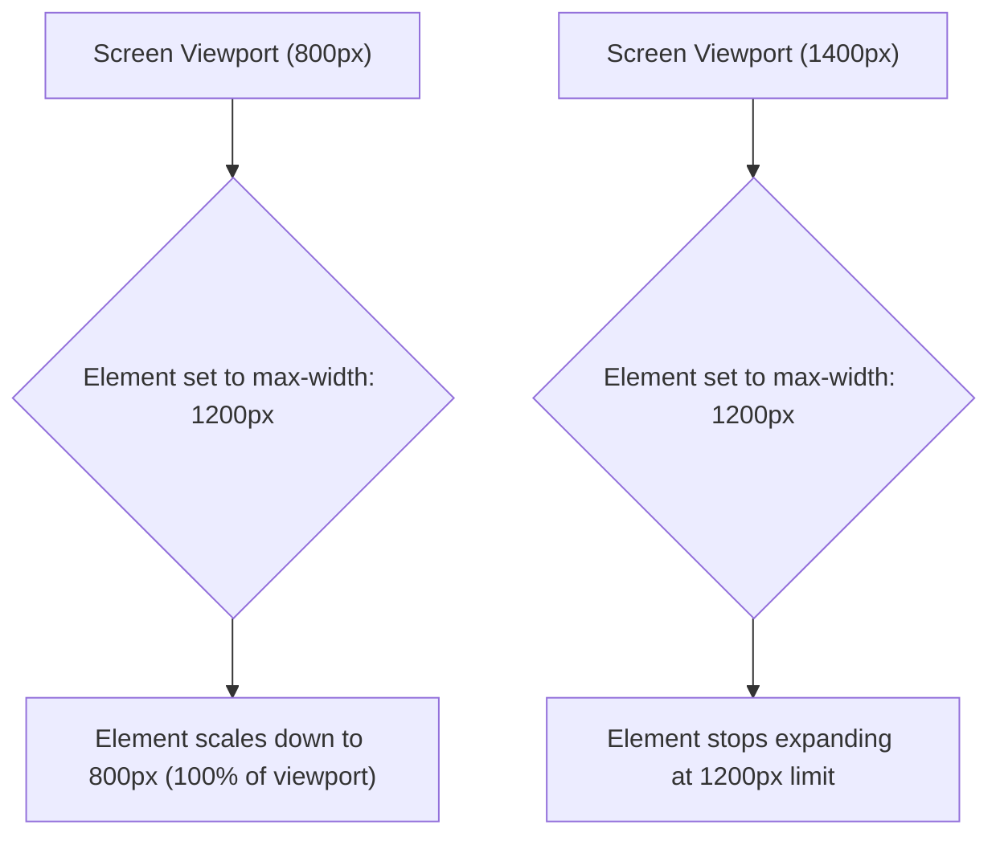

# CSS Width

Estimated Reading Time: 12 minutes

Prerequisites: [Introduction to CSS](01-introduction-to-css.md), [CSS Margins](10-css-margins.md), [CSS Padding](11-css-padding.md)

Learning Objectives:
- Master `width`, `min-width`, and `max-width` properties.
- Understand fixed units (`px`), relative units (`%`, `vw`, `rem`), and `auto`.
- Build responsive container layouts using `max-width`.
- Avoid horizontal overflow scrollbars.

---

## Introduction

The `width` property controls the horizontal dimension of an element's content area in the CSS Box Model.

By default, block-level elements (like `<div>` or `<p>`) take up 100% of their parent container's width, while inline elements (like `<span>` or `<a>`) span only as wide as their inner text content. Controlling width using pixels, percentages, `min-width`, and `max-width` is critical to building responsive layouts across desktop and mobile screens.

---

## Real-World Analogy

Imagine adjustable bookshelves inside a room.

- **Fixed Width (`width: 600px`)**: A solid wooden bookshelf built to exactly 600mm width. If you try to fit it into a tight 400mm narrow closet, it sticks out through the door frame (horizontal overflow).
- **Max Width (`max-width: 600px`)**: An elastic bookshelf that expands up to 600mm on large walls, but automatically shrinks down to fit narrow 400mm walls without breaking the room frame.
- **Min Width (`min-width: 300px`)**: A shelf that refuses to shrink smaller than 300mm so its contents remain readable.

`max-width` guarantees responsive flexibility across mobile viewports.

---

## Core Concepts

### 1. The `width` Property
Sets the horizontal size of an element.
- `auto` (Default): Browser calculates width automatically (Block elements expand 100%, inline elements shrink-wrap content).
- Length Units: `px`, `rem`, `em`, `%`, `vw`.

### 2. `max-width`
Sets the maximum horizontal boundary. If the viewport becomes narrower than `max-width`, the element automatically scales down to 100% of the screen width, preventing horizontal scrollbars.

### 3. `min-width`
Sets the minimum horizontal boundary. Prevents an element from shrinking smaller than the specified value.

---

## Syntax

```css
/* Fixed Width */
.card-fixed {
    width: 400px;
}

/* Percentage Width */
.col-half {
    width: 50%;
}

/* Responsive Max-Width Pattern */
.container-responsive {
    max-width: 1200px;
    width: 100%;
    margin: 0 auto;
}

/* Minimum Width Safeguard */
.btn-min {
    min-width: 120px;
}
```

---

## Property Reference

| Property | Description | Common Values | Default Value |
| :--- | :--- | :--- | :--- |
| `width` | Sets explicit content width | `400px`, `100%`, `50vw`, `auto` | `auto` |
| `max-width` | Prevents element from exceeding a maximum width | `1200px`, `100%`, `none` | `none` |
| `min-width` | Prevents element from shrinking below a minimum width | `200px`, `0`, `auto` | `0` |

---

## Visual Explanation



---

## Example 1

### HTML
```html
<!DOCTYPE html>
<html lang="en">
<head>
    <meta charset="UTF-8">
    <title>Responsive Max-Width Layout</title>
    <style>
        body {
            font-family: Arial, sans-serif;
            background-color: #f8fafc;
            margin: 0;
            padding: 20px;
        }
        .responsive-box {
            max-width: 600px;
            width: 100%;
            margin: 0 auto;
            background-color: #ffffff;
            padding: 20px;
            border: 1px solid #cbd5e1;
            border-radius: 8px;
        }
    </style>
</head>
<body>
    <div class="responsive-box">
        <h2>Responsive Container</h2>
        <p>This box expands up to 600px on large displays, but scales down smoothly on mobile screens without causing horizontal overflow scrollbars.</p>
    </div>
</body>
</html>
```

### CSS
```css
.responsive-box {
    max-width: 600px;
    width: 100%;
    margin: 0 auto;
    background-color: #ffffff;
    padding: 20px;
    border: 1px solid #cbd5e1;
    border-radius: 8px;
}
```

### Explanation
Combining `max-width: 600px;` and `width: 100%;` creates a responsive layout container. On desktop screens, the box caps at 600px wide and centers via `margin: 0 auto`. On small mobile screens, it scales down proportionally.

---

## Output Image Prompt

A browser window showing a white container card (`#ffffff`) centered on a light gray canvas (`#f8fafc`). The card has a 1-pixel border (`#cbd5e1`), 20px padding, 8px rounded corners, and rests at exactly 600px wide on desktop while shrinking smoothly on smaller viewports.

---

## Code Explanation

- `max-width: 600px;`: Caps maximum horizontal width at 600px.
- `width: 100%;`: Ensures full fluid responsiveness on viewports smaller than 600px.

---

## Example 2

### HTML
```html
<!DOCTYPE html>
<html lang="en">
<head>
    <meta charset="UTF-8">
    <title>Min-Width Button Safeguard</title>
    <style>
        .btn {
            background-color: #2563eb;
            color: #ffffff;
            padding: 10px 20px;
            min-width: 140px; /* Guarantees button never looks awkwardly tiny */
            border: none;
            border-radius: 6px;
            text-align: center;
        }
    </style>
</head>
<body>
    <button class="btn">OK</button>
</body>
</html>
```

### CSS
```css
.btn {
    background-color: #2563eb;
    color: #ffffff;
    padding: 10px 20px;
    min-width: 140px;
    border: none;
    border-radius: 6px;
    text-align: center;
}
```

### Explanation
Even though text "OK" is short, `min-width: 140px;` forces the button to maintain a professional, wide touch target area.

---

## Output Image Prompt

A browser canvas showing a blue rectangular button (`#2563eb`) with white text "OK". Despite the short text, the button maintains a wide 140-pixel horizontal dimension.

---

## Code Explanation

- `min-width: 140px;`: Enforces a 140px horizontal minimum width threshold.

---

## Best Practices

- **Prefer `max-width` over fixed `width`**: Avoid hardcoding fixed `width: 800px` on main page containers—use `max-width: 800px; width: 100%;` for responsive design.
- **Use `min-width` for Touch Targets**: Set `min-width: 44px` on mobile buttons to satisfy accessibility touch standards.

---

## Common Mistakes

### Mistake 1: Hardcoding Fixed Pixel Widths on Main Containers

```css
/* INCORRECT */
.container {
    width: 1000px; /* Causes horizontal scrollbars on mobile devices smaller than 1000px! */
}
```

#### Explanation
Fixed widths force small mobile screens to display unwanted horizontal scrollbars.

```css
/* CORRECT */
.container {
    max-width: 1000px;
    width: 100%;
}
```

---

## Browser Compatibility

CSS width properties have 100% universal support across all desktop and mobile web browsers.

---

## Real-World Applications

- **Main Site Containers**: `max-width: 1200px; margin: 0 auto;` for main page content wrappers.
- **Multi-Column Layout Grids**: Setting `width: 50%` or `width: 33.33%` for multi-column grids.
- **Form Modal Windows**: `max-width: 500px; width: 90%;` for responsive popups.

---

## Mini Project

### Project Objective: Responsive Card Component
Build a product card with `max-width: 350px`, `width: 100%`, and centered layout.

---

## Practice Exercises

### Beginner Level
1. Set the width of an element to 300px.
2. Make an image span 100% width of its parent container.
3. Apply `max-width: 800px` to a main content block.
4. Set a button `min-width` to 120px.
5. Center a 500px wide box using `margin: 0 auto`.

### Intermediate Level
6. Explain why `max-width` is better than `width` for mobile responsiveness.
7. Combine percentage width with pixel max-width (`width: 100%; max-width: 600px;`).
8. Create a 3-column layout where each column has `width: 33.33%`.
9. Fix a mobile horizontal overflow scrollbar bug caused by fixed width.
10. Use viewport width units (`width: 50vw`) to size a split-screen banner.

### Advanced Level
11. Compare `width: fit-content`, `width: max-content`, and `width: min-content`.
12. Audit layout reflow performance when animating width vs `transform: scaleX()`.
13. Implement responsive typography using fluid container widths.
14. Combine `min-width` and `flex-grow` inside a Flexbox container.
15. Solve sub-pixel rounding width bugs in percentage-based grids.

---

## Quick Quiz

**1. What happens when an element has `width: 600px` on a 400px wide screen?**
A) It shrinks to 400px  
B) It causes horizontal overflow scrollbars  
C) It hides automatically  
D) It rotates 90 degrees  

**2. Which combination creates a fluid responsive container?**
A) `width: 600px; max-width: 100%;`  
B) `max-width: 600px; width: 100%;`  
C) `min-width: 600px;`  
D) `width: 600px; min-width: 1000px;`  

**3. What is the default `width` value for block-level elements?**
A) `100px`  
B) `50%`  
C) `auto`  
D) `0`  

**4. What does `min-width: 200px;` guarantee?**
A) Element cannot expand beyond 200px  
B) Element cannot shrink smaller than 200px  
C) Element is exactly 200px  
D) Element padding is 200px  

**5. What unit represents percentage of screen viewport width?**
A) `vh`  
B) `vw`  
C) `rem`  
D) `px`  

**6. What does `width: auto` do on a block element?**
A) Expands to fill available parent width  
B) Sets width to 0  
C) Centers text  
D) Hides container  

**7. Why should fixed pixel widths be avoided on main content containers?**
A) They slow down CSS loading  
B) They break mobile responsiveness  
C) They change text colors  
D) They disable JavaScript  

**8. What does `max-width: none;` do?**
A) Sets width to 0  
B) Removes maximum width constraints  
C) Makes element invisible  
D) Turns container into a circle  

**9. Can `min-width` be larger than `max-width`?**
A) Yes, `min-width` overrides `max-width`  
B) No, it throws a browser crash  
C) Only in Safari  
D) Only on images  

**10. What property sets a container's maximum horizontal width?**
A) `width-max`  
B) `max-width`  
C) `limit-width`  
D) `bound-width`  

---

### Answers
1: B | 2: B | 3: C | 4: B | 5: B | 6: A | 7: B | 8: B | 9: A | 10: B

---

## Interview Questions

**1. What is the difference between `width` and `max-width`?**  
*Answer:* `width` sets a strict fixed horizontal size regardless of screen space. `max-width` sets an upper boundary—allowing the element to shrink smoothly on smaller screens while capping expansion on larger screens.

**2. How do you construct a responsive container in CSS?**  
*Answer:* Use `max-width: [target_width]; width: 100%; margin: 0 auto;`.

**3. What happens if `min-width` conflicts with `max-width`?**  
*Answer:* In CSS conflict resolution, `min-width` wins over `max-width` if `min-width` is assigned a larger value than `max-width`.

---

## Summary

- Use **`max-width: [pixels]; width: 100%;`** for responsive containers.
- Use **`min-width`** to guarantee minimum touch target sizes on buttons.
- Avoid fixed `width` declarations on main page wrappers to prevent horizontal scrollbars.

---

## Cheat Sheet

```css
/* RESPONSIVE CONTAINER PATTERN */
.container {
    max-width: 1200px;
    width: 100%;
    margin: 0 auto;
}

/* MIN-WIDTH BUTTON PATTERN */
.btn {
    min-width: 120px;
}
```

---

## Related Topics

- **Previous Topic**: [CSS Padding](11-css-padding.md)
- **Next Topic**: [CSS Height](13-css-height.md)
- **Recommended Learning Order**: Introduction to CSS -> Ways to Add CSS -> CSS Selectors -> CSS Colors -> CSS Fonts -> CSS Borders -> Border Radius -> CSS Shadows -> CSS Margins -> CSS Padding -> CSS Width -> CSS Height -> CSS Box Model
