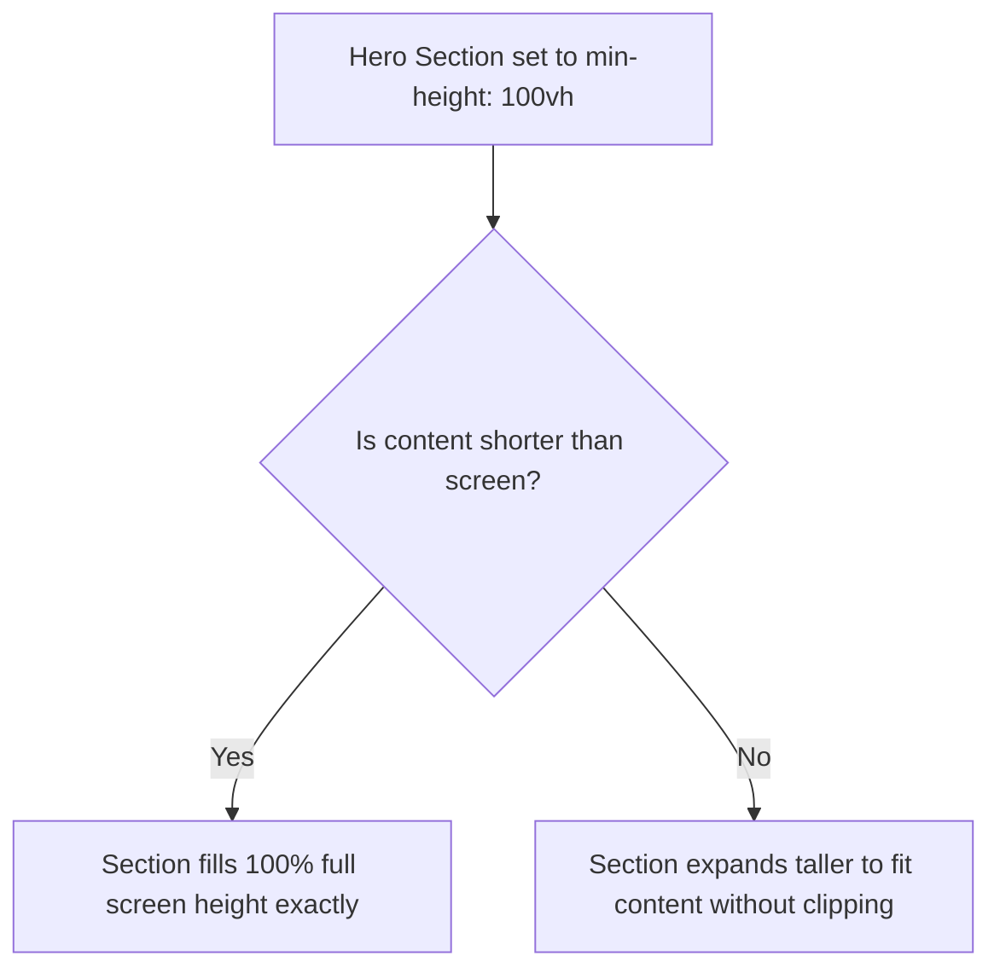

# CSS Height

Estimated Reading Time: 12 minutes

Prerequisites: [Introduction to CSS](01-introduction-to-css.md), [CSS Width](12-css-width.md)

Learning Objectives:
- Master `height`, `min-height`, and `max-height` properties.
- Understand fixed units (`px`), relative units (`vh`, `%`), and `auto`.
- Learn why percentage height requires parent height declarations.
- Utilize `min-height: 100vh` for full-screen hero sections.

---

## Introduction

The `height` property specifies the vertical dimension of an element's content area in the CSS Box Model.

By default (`height: auto`), elements expand vertically to fit their inner child content. Setting explicit heights, minimum heights (`min-height`), and maximum heights (`max-height`) allows developers to build full-screen hero sections, scrollable card bodies, and flexible layout containers.

---

## Real-World Analogy

Imagine an accordion file folder versus a rigid cardboard box.

- **Auto Height (`height: auto`)**: An accordion folder that naturally expands vertically when you insert documents and collapses flat when empty.
- **Fixed Height (`height: 200px`)**: A rigid cardboard box cut to 200mm height. If you try to stack 400mm worth of books inside, the books spill over top edges (vertical overflow).
- **Min Height (`min-height: 100vh`)**: A retractable banner stand pulled up to cover the full height of a floor-to-ceiling wall. If more content is added, the banner can extend even higher.

`min-height: 100vh` guarantees full-viewport coverage without clipping content.

---

## Core Concepts

### 1. The `height` Property
- `auto` (Default): Height calculates dynamically based on inner content.
- Length Units: `px`, `rem`, `vh` (viewport height), `%`.

### 2. Percentage Height Rules
Setting `height: 100%` works **only** if the parent container has an explicit height defined. If the parent height is `auto`, `height: 100%` resolves to `0` or `auto`.

### 3. `min-height`
Ensures an element is at least a specified vertical size while allowing it to grow taller if inner content increases.

### 4. `max-height`
Caps maximum vertical size. Often paired with `overflow: auto` to create scrollable text boxes.

---

## Syntax

```css
/* Fixed Height */
.header-bar {
    height: 60px;
}

/* Full Viewport Height Hero */
.hero-section {
    min-height: 100vh;
}

/* Scrollable Box with Max-Height */
.scroll-box {
    max-height: 300px;
    overflow-y: auto;
}
```

---

## Property Reference

| Property | Description | Common Values | Default Value |
| :--- | :--- | :--- | :--- |
| `height` | Sets explicit vertical content height | `300px`, `100vh`, `100%`, `auto` | `auto` |
| `min-height` | Prevents element from shrinking below vertical height | `100vh`, `200px` | `0` |
| `max-height` | Prevents element from exceeding vertical height | `400px`, `80vh`, `none` | `none` |

---

## Visual Explanation



---

## Example 1

### HTML
```html
<!DOCTYPE html>
<html lang="en">
<head>
    <meta charset="UTF-8">
    <title>Full Viewport Hero</title>
    <style>
        body {
            margin: 0;
            font-family: Arial, sans-serif;
        }
        .hero {
            min-height: 100vh;
            background-color: #0f172a;
            color: #ffffff;
            display: flex;
            align-items: center;
            justify-content: center;
            text-align: center;
        }
    </style>
</head>
<body>
    <div class="hero">
        <div>
            <h1 style="font-size:40px; margin:0;">Full Screen Hero</h1>
            <p style="color:#94a3b8;">Uses min-height: 100vh to cover full screen height</p>
        </div>
    </div>
</body>
</html>
```

### CSS
```css
body {
    margin: 0;
    font-family: Arial, sans-serif;
}
.hero {
    min-height: 100vh;
    background-color: #0f172a;
    color: #ffffff;
    display: flex;
    align-items: center;
    justify-content: center;
    text-align: center;
}
```

### Explanation
`min-height: 100vh` forces `.hero` to fill at least 100% of the screen viewport height, centering content perfectly on screen.

---

## Output Image Prompt

A browser viewport displaying a full-screen dark slate section (`#0f172a`). White heading text "Full Screen Hero" and light gray subtitle text rest perfectly centered vertically and horizontally on the screen canvas.

---

## Code Explanation

- `min-height: 100vh;`: Guarantees vertical section height matches 100% of screen height (`vh` = viewport height).

---

## Example 2

### HTML
```html
<!DOCTYPE html>
<html lang="en">
<head>
    <meta charset="UTF-8">
    <title>Max-Height Scroll Box</title>
    <style>
        .scroll-card {
            max-height: 150px;
            overflow-y: auto;
            border: 1px solid #cbd5e1;
            padding: 15px;
            border-radius: 8px;
            width: 300px;
            font-family: Arial, sans-serif;
        }
    </style>
</head>
<body>
    <div class="scroll-card">
        <h4>Terms of Service</h4>
        <p>Paragraph line 1...</p>
        <p>Paragraph line 2...</p>
        <p>Paragraph line 3...</p>
        <p>Paragraph line 4...</p>
    </div>
</body>
</html>
```

### CSS
```css
.scroll-card {
    max-height: 150px;
    overflow-y: auto;
    border: 1px solid #cbd5e1;
    padding: 15px;
    border-radius: 8px;
    width: 300px;
    font-family: Arial, sans-serif;
}
```

### Explanation
Setting `max-height: 150px` caps box height. Paired with `overflow-y: auto`, vertical scrollbars appear automatically when text exceeds 150px.

---

## Output Image Prompt

A browser canvas showing a 300px wide white card with a 150px capped vertical height. A vertical scrollbar appears on the right edge to allow reading overflowing text.

---

## Code Explanation

- `max-height: 150px;`: Caps vertical height at 150px.
- `overflow-y: auto;`: Triggers vertical scrollbars when text exceeds 150px height limit.

---

## Best Practices

- **Use `min-height: 100vh` for Full-Screen Layouts**: Prefer `min-height: 100vh` over fixed `height: 100vh` so content can grow if screen sizes change.
- **Avoid Fixed Heights on Text Boxes**: Fixed `height` causes text overflow bugs when text wraps on mobile screens.

---

## Common Mistakes

### Mistake 1: Setting `height: 100%` on a Child Without Parent Height

```css
/* INCORRECT */
.child {
    height: 100%; /* Has 0 effect because parent height is auto! */
}
```

#### Explanation
Percentage height requires an explicit parent height.

```css
/* CORRECT */
html, body {
    height: 100%;
}
.child {
    height: 100%;
}
```

---

## Browser Compatibility

CSS height properties have 100% universal support across all web browsers.

---

## Real-World Applications

- **Full-Screen Hero Sections**: `min-height: 100vh` for splash landing pages.
- **Fixed Top Navbars**: `height: 64px` for navigation header bars.
- **Scrollable Chat Windows**: `max-height: 400px; overflow-y: auto;` for chat components.

---

## Mini Project

### Project Objective: Full Screen Hero Section
Build a full-screen landing banner using `min-height: 100vh`.

---

## Practice Exercises

### Beginner Level
1. Set container height to 400px.
2. Create a 60px high header bar.
3. Make a hero section fill 100vh screen height.
4. Set a box `max-height` to 200px.
5. Apply `min-height: 300px` to a card.

### Intermediate Level
6. Explain why `height: 100%` fails if parent height is `auto`.
7. Combine `max-height: 250px` and `overflow-y: auto` to create a scrollable list.
8. Fix a text overflow bug caused by a hardcoded fixed height.
9. Use `vh` units to size a responsive sidebar.
10. Set `html, body { height: 100%; }` for a full-height app wrapper.

### Advanced Level
11. Compare `height: 100vh` vs `height: 100dvh` (dynamic viewport height on mobile).
12. Resolve mobile browser address bar height jumping bugs using `svh` / `dvh`.
13. Implement fluid aspect-ratio height using CSS `aspect-ratio: 16/9`.
14. Audit layout reflow cost of height transitions vs `transform: scaleY()`.
15. Solve Flexbox stretch height inheritance bugs across multi-column grids.

---

## Quick Quiz

**1. What unit represents 100% of the screen viewport height?**
A) `100vw`  
B) `100vh`  
C) `100px`  
D) `100%`  

**2. What is the default `height` value of a block element?**
A) `0`  
B) `100%`  
C) `auto`  
D) `100vh`  

**3. Why is `min-height: 100vh` preferred over `height: 100vh` for hero sections?**
A) `min-height` loads faster  
B) `min-height` allows the section to expand taller if content overflows  
C) `height: 100vh` does not work in Chrome  
D) `min-height` changes background color  

**4. When does `height: 100%` work on an element?**
A) Always  
B) Only when parent container has an explicit height  
C) Only on buttons  
D) Never  

**5. What property caps maximum vertical element expansion?**
A) `max-width`  
B) `max-height`  
C) `height-cap`  
D) `top-limit`  

**6. What property pairs with `max-height` to create scrollable text boxes?**
A) `overflow-y: auto`  
B) `margin: auto`  
C) `display: flex`  
D) `position: fixed`  

**7. What mobile unit addresses URL bar height resizing issue?**
A) `vh`  
B) `dvh` (dynamic viewport height)  
C) `px`  
D) `rem`  

**8. What does `min-height: 300px;` guarantee?**
A) Height is capped at 300px  
B) Height cannot shrink below 300px  
C) Height is exactly 300px always  
D) Width is 300px  

**9. What happens if content exceeds a fixed `height: 100px` container without overflow property?**
A) Container expands automatically  
B) Content overflows vertically past container border  
C) Content hides  
D) Browser crashes  

**10. What property sets dynamic aspect ratio heights (e.g. 16:9 video boxes)?**
A) `aspect-ratio`  
B) `box-ratio`  
C) `flex-ratio`  
D) `scale-height`  

---

### Answers
1: B | 2: C | 3: B | 4: B | 5: B | 6: A | 7: B | 8: B | 9: B | 10: A

---

## Interview Questions

**1. What is the difference between `height` and `min-height`?**  
*Answer:* `height` locks vertical size strictly. `min-height` establishes a baseline minimum height while allowing the element to grow taller if content increases.

**2. Why does `height: 100%` often fail to stretch an element full-screen?**  
*Answer:* Percentage heights resolve relative to the explicit height of the parent element. If parent height is `auto` (unspecified), percentage calculation resolves to `auto`/`0`.

**3. What are modern CSS units `dvh`, `svh`, and `lvh`?**  
*Answer:* They solve mobile browser address bar UI shifting. `dvh` is dynamic viewport height (adapts as URL bar opens/closes), `svh` is small viewport height (with URL bar expanded), and `lvh` is large viewport height (with URL bar collapsed).

---

## Summary

- Use **`min-height: 100vh`** for full-screen hero sections.
- Pair **`max-height`** with **`overflow-y: auto`** for scrollable containers.
- Avoid fixed `height` on text boxes to prevent content clipping.

---

## Cheat Sheet

```css
/* FULL SCREEN HERO PATTERN */
.hero {
    min-height: 100vh;
}

/* SCROLLABLE CONTAINER PATTERN */
.scroll-box {
    max-height: 300px;
    overflow-y: auto;
}
```

---

## Related Topics

- **Previous Topic**: [CSS Width](12-css-width.md)
- **Next Topic**: [CSS Box Model](14-css-box-model.md)
- **Recommended Learning Order**: Introduction to CSS -> Ways to Add CSS -> CSS Selectors -> CSS Colors -> CSS Fonts -> CSS Borders -> Border Radius -> CSS Shadows -> CSS Margins -> CSS Padding -> CSS Width -> CSS Height -> CSS Box Model
