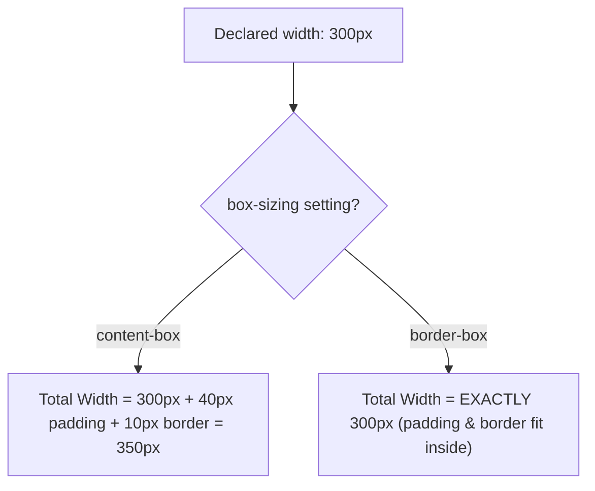

# CSS Box Model

Estimated Reading Time: 15 minutes

Prerequisites: [CSS Borders](07-css-borders.md), [CSS Margins](10-css-margins.md), [CSS Padding](11-css-padding.md), [CSS Width](12-css-width.md)

Learning Objectives:
- Master the 4 concentric layers of the CSS Box Model (Content, Padding, Border, Margin).
- Understand calculated total width and height formulas.
- Compare `box-sizing: content-box` vs `box-sizing: border-box`.
- Apply universal `box-sizing: border-box` resets across stylesheets.

---

## Introduction

The **CSS Box Model** is the core layout architecture of the web. In HTML, every element rendered on screen is treated as a rectangular box by the browser layout engine.

The box model consists of four concentric rectangular layers wrapping around content:
1. **Content Area**: Inner core where text, images, or child elements sit.
2. **Padding Area**: Transparent space surrounding the content area (inside the border).
3. **Border Area**: Perimeter frame surrounding the padding area.
4. **Margin Area**: Transparent clearance space surrounding the border area (outside the box).

Understanding how these 4 layers calculate total element width and height is essential for building accurate, responsive layouts.

---

## Real-World Analogy

Imagine receiving a fragile framed painting shipped in a box.

- **Content**: The canvas artwork itself.
- **Padding**: Bubble wrap packed inside the box surrounding the canvas.
- **Border**: The wooden picture frame holding the canvas and bubble wrap.
- **Margin**: The empty clearance distance between this package and other packages on the delivery counter.

The Box Model calculates total footprint space taken up by the package.

---

## Core Concepts

### 1. The 4 Concentric Layers
```
┌─────────────────────────────────────────┐
│ MARGIN (Outer Clearance Area)          │
│  ┌───────────────────────────────────┐  │
│  │ BORDER (Outer Perimeter Line)     │  │
│  │  ┌─────────────────────────────┐  │  │
│  │  │ PADDING (Internal Clearance)│  │  │
│  │  │  ┌───────────────────────┐  │  │  │
│  │  │  │ CONTENT AREA          │  │  │  │
│  │  │  └───────────────────────┘  │  │  │
│  │  └─────────────────────────────┘  │  │
│  └───────────────────────────────────┘  │
└─────────────────────────────────────────┘
```

### 2. Default Box Model (`box-sizing: content-box`)
By default, declaring `width: 300px` sets width for the **Content Area** only.
- **Total Calculated Width** = `width` + `left padding` + `right padding` + `left border` + `right border`.
- *Example*: A 300px box with 20px padding and 5px border expands to a total calculated width of `300 + 20 + 20 + 5 + 5 = 350px`! This causes unexpected layout breaking.

### 3. Modern Box Model (`box-sizing: border-box`)
Under `border-box`, declared `width` includes content, padding, and border combined.
- **Total Calculated Width** = declared `width` (Padding and border shrink the content area inward).
- *Example*: A 300px box with 20px padding and 5px border remains **exactly 300px wide** overall.

---

## Syntax

```css
/* Universal Box-Sizing Reset Pattern */
*, *::before, *::after {
    box-sizing: border-box;
}

/* Explicit Box Model Properties */
.box {
    width: 300px;
    padding: 20px;
    border: 5px solid #2563eb;
    margin: 30px;
    box-sizing: border-box;
}
```

---

## Property Reference

| Property | Description | Values | Default Value |
| :--- | :--- | :--- | :--- |
| `box-sizing` | Defines how total element width and height are calculated | `content-box`, `border-box` | `content-box` |
| `width` | Horizontal content width | Lengths (`px`, `%`, `rem`) | `auto` |
| `padding` | Internal clearance around content | Lengths | `0` |
| `border` | Perimeter line around padding | Lengths, styles, colors | `none` |
| `margin` | External clearance around border | Lengths, `auto` | `0` |

---

## Visual Explanation



---

## Example 1

### HTML
```html
<!DOCTYPE html>
<html lang="en">
<head>
    <meta charset="UTF-8">
    <title>Box Sizing Comparison</title>
    <style>
        /* Universal reset */
        *, *::before, *::after {
            box-sizing: border-box;
        }
        body {
            font-family: Arial, sans-serif;
            background-color: #f8fafc;
            padding: 20px;
        }
        .card {
            width: 300px;
            padding: 20px;
            border: 4px solid #2563eb;
            background-color: #ffffff;
            margin-bottom: 20px;
        }
    </style>
</head>
<body>
    <div class="card">
        <h3>Border-Box Card</h3>
        <p>Declared width: 300px, Padding: 20px, Border: 4px. Total computed width remains exactly 300px!</p>
    </div>
</body>
</html>
```

### CSS
```css
*, *::before, *::after {
    box-sizing: border-box;
}
.card {
    width: 300px;
    padding: 20px;
    border: 4px solid #2563eb;
    background-color: #ffffff;
    margin-bottom: 20px;
}
```

### Explanation
Using `box-sizing: border-box` guarantees that `.card` stays exactly 300px wide on screen, absorbing the 20px padding and 4px border inside the 300px boundary.

---

## Output Image Prompt

A browser window showing a white rectangular card (`#ffffff`) with a solid 4px blue border (`#2563eb`) on a light gray canvas (`#f8fafc`). The card displays title and paragraph text with 20px padding. The total measured width of the card box on screen is exactly 300 pixels.

---

## Code Explanation

- `*, *::before, *::after { box-sizing: border-box; }`: Standard global reset forcing all elements to use the border-box model.
- `width: 300px;`: Total outer width including border and padding.

---

## Example 2

### HTML
```html
<!DOCTYPE html>
<html lang="en">
<head>
    <meta charset="UTF-8">
    <title>Side-by-Side Column Grid</title>
    <style>
        *, *::before, *::after {
            box-sizing: border-box;
        }
        .column-row {
            width: 100%;
            background-color: #e2e8f0;
        }
        .col-half {
            width: 50%;
            float: left;
            padding: 20px;
            border: 2px solid #0f172a;
            background-color: #ffffff;
        }
    </style>
</head>
<body>
    <div class="column-row">
        <div class="col-half">Column 1 (50%)</div>
        <div class="col-half">Column 2 (50%)</div>
    </div>
</body>
</html>
```

### CSS
```css
*, *::before, *::after {
    box-sizing: border-box;
}
.col-half {
    width: 50%;
    float: left;
    padding: 20px;
    border: 2px solid #0f172a;
    background-color: #ffffff;
}
```

### Explanation
Under `border-box`, two `width: 50%` columns with padding and borders fit perfectly side-by-side (50% + 50% = 100%). Under `content-box`, padding and borders would push total width past 100%, breaking Column 2 onto a new line!

---

## Output Image Prompt

A browser window displaying two side-by-side white column cards (`#ffffff`) with 2px dark outline borders (`#0f172a`). Each column takes exactly half (50%) of the container width and fits seamlessly side-by-side.

---

## Code Explanation

- `width: 50%; padding: 20px;`: Under `border-box`, padding does not expand column width past 50%, maintaining exact 2-column alignment.

---

## Best Practices

- **Always Apply Universal `border-box` Reset**: Place `*, *::before, *::after { box-sizing: border-box; }` at the top of every stylesheet.
- **Inspect Box Model in DevTools**: Use Chrome/Firefox Developer Tools Box Model panel to debug padding, border, and margin sizes visually.

---

## Common Mistakes

### Mistake 1: Leaving Default `content-box` Active

```css
/* INCORRECT */
.col-6 {
    width: 50%;
    padding: 20px; /* Expands column width past 50%, breaking grid layouts! */
}
```

#### Explanation
Default `content-box` adds padding to width, causing percentage grid layouts to wrap onto multi-line breaks.

```css
/* CORRECT */
*, *::before, *::after {
    box-sizing: border-box;
}
.col-6 {
    width: 50%;
    padding: 20px;
}
```

---

## Browser Compatibility

The CSS Box Model and `box-sizing: border-box` have 100% universal support across all desktop and mobile web browsers.

---

## Real-World Applications

- **Grid Systems**: Ensuring `width: 50%` or `width: 25%` columns remain aligned when padding is added.
- **Form Inputs**: Sizing `<input>` fields to `width: 100%` without breaking parent card boundaries.
- **Card UI Components**: Standardizing container layout dimensions.

---

## Mini Project

### Project Objective: Universal Box-Sizing Reset Demo
Build a 2-column card grid using `box-sizing: border-box`.

---

## Practice Exercises

### Beginner Level
1. List the 4 concentric layers of the CSS Box Model in order from inside to outside.
2. Write the universal CSS `border-box` reset rule.
3. Calculate total width of a 200px box with 10px padding and 2px border under `content-box`.
4. Calculate total width of the same box under `border-box`.
5. Identify which Box Model layer inherits background colors.

### Intermediate Level
6. Explain why percentage columns break when padding is added under `content-box`.
7. Inspect and document an element's Box Model metrics using browser DevTools.
8. Create a 100% wide text input box with 15px padding that stays inside a 400px container.
9. Fix a broken layout grid caused by missing `box-sizing: border-box`.
10. Describe how `margin` clearance interacts with adjacent box borders.

### Advanced Level
11. Compare layout engine performance of `content-box` vs `border-box`.
12. Audit margin collapsing exceptions across flexbox containers vs standard block flow.
13. Build a multi-nested card component testing nested padding and border calculations.
14. Explain logical box model properties (`block-size`, `inline-size`).
15. Solve box model layout bugs occurring in legacy print stylesheets.

---

## Quick Quiz

**1. What are the 4 layers of the CSS Box Model from inside to outside?**
A) Margin, Border, Padding, Content  
B) Content, Padding, Border, Margin  
C) Content, Border, Padding, Margin  
D) Padding, Content, Margin, Border  

**2. What is the default browser value of `box-sizing`?**
A) `border-box`  
B) `content-box`  
C) `padding-box`  
D) `margin-box`  

**3. Under `box-sizing: border-box`, what does declaring `width: 400px` set?**
A) Content width only  
B) Total width including Content, Padding, and Border  
C) Margin width only  
D) Padding width only  

**4. Under default `content-box`, what is total width of `width: 200px` + `padding: 20px` + `border: 5px`?**
A) 200px  
B) 225px  
C) 250px  
D) 240px  

**5. Under `border-box`, what is total width of `width: 200px` + `padding: 20px` + `border: 5px`?**
A) 200px  
B) 250px  
C) 225px  
D) 175px  

**6. Which layer of the Box Model is located OUTSIDE the border?**
A) Padding  
B) Content  
C) Margin  
D) Outline  

**7. Which Box Model layers are 100% transparent clearance areas?**
A) Border and Padding  
B) Margin and Padding (Padding displays background fills)  
C) Content and Border  
D) Margin only (Margin is transparent; Padding inherits background fill)  

**8. Why is `box-sizing: border-box` universally recommended?**
A) It makes text load faster  
B) It keeps total element width predictable when padding and borders are added  
C) It changes background colors  
D) It converts text to uppercase  

**9. What selector applies the box-sizing reset globally to all elements and pseudo-elements?**
A) `body`  
B) `*, *::before, *::after`  
C) `div`  
D) `html`  

**10. What DevTools feature helps debug Box Model layers visually?**
A) Console tab  
B) Elements / Computed Box Model panel  
C) Network tab  
D) Storage tab  

---

### Answers
1: B | 2: B | 3: B | 4: C | 5: A | 6: C | 7: D | 8: B | 9: B | 10: B

---

## Interview Questions

**1. Explain the CSS Box Model and its 4 core layers.**  
*Answer:* The CSS Box Model treats every HTML element as a rectangular box comprising 4 concentric layers: Content (inner text/images), Padding (internal space inside border), Border (outer edge line), and Margin (external clearance outside border).

**2. Compare `box-sizing: content-box` vs `box-sizing: border-box`.**  
*Answer:* Under `content-box` (default), declared `width` applies strictly to content area—added padding and border expand total outer dimensions. Under `border-box`, declared `width` includes content, padding, and border combined, keeping total outer dimensions predictable.

**3. What is the standard CSS Box Model reset rule?**  
*Answer:* `*, *::before, *::after { box-sizing: border-box; }`.

---

## Summary

- The Box Model comprises **Content**, **Padding**, **Border**, and **Margin**.
- **`box-sizing: border-box`** ensures padding and border fit *inside* declared width.
- Always include the global `border-box` reset at the top of your CSS files.

---

## Cheat Sheet

```css
/* GLOBAL BOX-SIZING RESET */
*, *::before, *::after {
    box-sizing: border-box;
}

/* TOTAL WIDTH CALCULATION (border-box) */
/* Declared width = Content + Padding + Border */
.card {
    width: 300px; /* Remains exactly 300px total */
    padding: 20px;
    border: 2px solid blue;
}
```

---

## Related Topics

- **Previous Topic**: [CSS Height](13-css-height.md)
- **Next Topic**: [CSS Float](15-css-float.md)
- **Recommended Learning Order**: Introduction to CSS -> Ways to Add CSS -> CSS Selectors -> CSS Colors -> CSS Fonts -> CSS Borders -> Border Radius -> CSS Shadows -> CSS Margins -> CSS Padding -> CSS Width -> CSS Height -> CSS Box Model -> CSS Float
