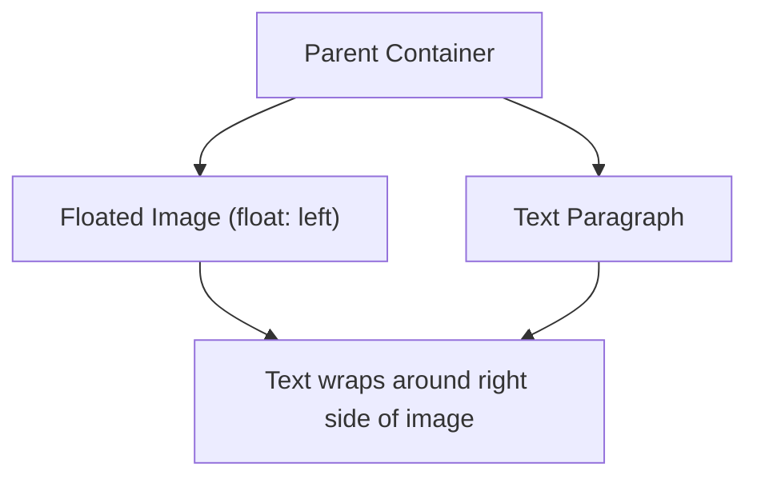

# CSS Float

Estimated Reading Time: 12 minutes

Prerequisites: [Introduction to CSS](01-introduction-to-css.md), [CSS Box Model](14-css-box-model.md)

Learning Objectives:
- Understand the `float` property (`left`, `right`, `none`).
- Learn how inline text wraps around floated elements.
- Master container collapse solutions using the `clear` property and the `clearfix` hack.
- Identify legacy layout techniques vs modern Flexbox/Grid standards.

---

## Introduction

Originally designed for newspaper-style editorial text wrapping around images, the `float` property pushes an element to the left or right boundary of its parent container, allowing text and inline content to wrap around it.

Before modern Flexbox and Grid layout specifications were introduced, developers relied on `float` to build multi-column website layouts. Today, `float` is primarily used for its original purpose: wrapping body text around floating images or callout quote boxes.

---

## Real-World Analogy

Imagine a printed magazine column layout.

- **Floating Image (`float: left`)**: A rectangular photograph positioned at the top-left corner of an article page. Paragraph text flows down along its right side and wraps cleanly underneath its bottom edge.
- **Clearing Below Image (`clear: both`)**: A new section sub-heading starting on a fresh line completely below the photograph, refusing to wrap alongside its right edge.

`float` controls inline text wrapping around images and callout boxes.

---

## Core Concepts

### 1. The `float` Property Values
- `left`: Floats element to the left boundary; text wraps along its right side.
- `right`: Floats element to the right boundary; text wraps along its left side.
- `none` (Default): Element renders in normal document flow.

### 2. The `clear` Property
Prevents elements from wrapping next to floated elements.
- `clear: left`: Moves below left-floated elements.
- `clear: right`: Moves below right-floated elements.
- `clear: both`: Moves completely below all floated elements.

### 3. Container Collapse & Clearfix
When a parent container contains **only** floated children, its calculated height collapses to `0` because floated elements are pulled out of normal vertical flow.
- **Micro Clearfix Solution**: Adding a pseudo-element reset to the parent container restores height automatically:
```css
.clearfix::after {
    content: "";
    display: block;
    clear: both;
}
```

---

## Syntax

```css
/* Float Image Left */
.img-float-left {
    float: left;
    margin-right: 20px;
    margin-bottom: 10px;
}

/* Float Image Right */
.img-float-right {
    float: right;
    margin-left: 20px;
    margin-bottom: 10px;
}

/* Clearfix Parent Hack */
.container::after {
    content: "";
    display: block;
    clear: both;
}
```

---

## Property Reference

| Property | Description | Common Values | Default Value |
| :--- | :--- | :--- | :--- |
| `float` | Pushes element to left/right, allowing text to wrap | `left`, `right`, `none` | `none` |
| `clear` | Prevents element from wrapping next to floated boxes | `left`, `right`, `both`, `none` | `none` |

---

## Visual Explanation



---

## Example 1

### HTML
```html
<!DOCTYPE html>
<html lang="en">
<head>
    <meta charset="UTF-8">
    <title>Text Wrapping Around Floated Image</title>
    <style>
        .article {
            background-color: #ffffff;
            border: 1px solid #cbd5e1;
            padding: 20px;
            max-width: 600px;
            font-family: Arial, sans-serif;
        }
        .float-img {
            float: left;
            width: 140px;
            height: 100px;
            background-color: #2563eb;
            color: #ffffff;
            display: flex;
            align-items: center;
            justify-content: center;
            margin-right: 15px;
            margin-bottom: 10px;
            font-weight: bold;
        }
        .clearfix::after {
            content: "";
            display: block;
            clear: both;
        }
    </style>
</head>
<body>
    <div class="article clearfix">
        <div class="float-img">Floated Box</div>
        <p>This paragraph text wraps cleanly around the right side and bottom of the left-floated image container, simulating editorial magazine typography.</p>
    </div>
</body>
</html>
```

### CSS
```css
.float-img {
    float: left;
    width: 140px;
    height: 100px;
    background-color: #2563eb;
    margin-right: 15px;
    margin-bottom: 10px;
}
.clearfix::after {
    content: "";
    display: block;
    clear: both;
}
```

### Explanation
The `.float-img` box floats left. The article paragraph wraps around its right edge. The `.clearfix` pseudo-element on `.article` guarantees the parent container wraps around the floated box height.

---

## Output Image Prompt

A browser window showing a white article card container (`#ffffff`) on a light canvas. On the left side of the card sits a blue rectangular box (`#2563eb`) with white text "Floated Box". Paragraph text flows down along the right side of the blue box and wraps underneath its bottom edge.

---

## Code Explanation

- `float: left;`: Pushes box to left margin, enabling text wrapping along its right edge.
- `margin-right: 15px;`: Adds horizontal buffer space so text does not press against the image.
- `.clearfix::after`: Restores parent height collapse.

---

## Example 2

### HTML
```html
<!DOCTYPE html>
<html lang="en">
<head>
    <meta charset="UTF-8">
    <title>Clear Both Layout Reset</title>
    <style>
        .box-float {
            float: left;
            width: 100px;
            height: 60px;
            background-color: #16a34a;
            color: white;
            margin-right: 10px;
            display: flex;
            align-items: center;
            justify-content: center;
        }
        .cleared-section {
            clear: both;
            background-color: #f1f5f9;
            padding: 10px;
            margin-top: 15px;
        }
    </style>
</head>
<body>
    <div class="box-float">Box 1</div>
    <div class="box-float">Box 2</div>
    <div class="cleared-section">
        <strong>Cleared Section:</strong> Positioned completely below floated boxes using clear: both.
    </div>
</body>
</html>
```

### CSS
```css
.box-float {
    float: left;
    width: 100px;
    height: 60px;
    background-color: #16a34a;
    margin-right: 10px;
}
.cleared-section {
    clear: both;
    background-color: #f1f5f9;
    padding: 10px;
}
```

### Explanation
`clear: both` forces `.cleared-section` to start below all floated elements.

---

## Output Image Prompt

A browser canvas showing two side-by-side green boxes ("Box 1", "Box 2") floated left. Directly below them, a light gray section titled "Cleared Section" rests completely beneath both green boxes.

---

## Code Explanation

- `clear: both;`: Prevents element from floating next to floated boxes, resetting document flow underneath.

---

## Best Practices

- **Use `float` for Text Wrapping Only**: Do not use `float` to build multi-column website layouts—use Flexbox or CSS Grid instead.
- **Always Apply Clearfix to Parent**: Add clearfix to containers holding floated children to prevent 0px parent height collapse.

---

## Common Mistakes

### Mistake 1: Parent Height Collapse

```css
/* INCORRECT */
.parent {
    /* Missing clearfix! Parent collapses to 0px height if all children are floated */
}
.child { float: left; }
```

#### Explanation
Floated children are removed from standard flow, causing parent height to collapse to 0.

```css
/* CORRECT */
.parent::after {
    content: "";
    display: block;
    clear: both;
}
```

---

## Browser Compatibility

CSS `float` and `clear` properties have 100% universal support across all web browsers.

---

## Real-World Applications

- **Magazine Editorial Layouts**: Wrapping article text around author photos or callout images.
- **Rich Text Editors**: Rendering CMS image alignments (`align-left`, `align-right`).

---

## Mini Project

### Project Objective: Editorial Article Block
Format a news article with a right-floated image (`float: right`) and clearfix container.

---

## Practice Exercises

### Beginner Level
1. Float an image to the left of a paragraph.
2. Float a callout box to the right.
3. Use `clear: both` to push a heading below floated images.
4. Add margin to a floated image to prevent text touching.
5. Reset float using `float: none;`.

### Intermediate Level
6. Fix a 0px parent height collapse bug using `.clearfix::after`.
7. Compare `clear: left` vs `clear: right`.
8. Explain why `float` is no longer recommended for full page layouts.
9. Format a blog post with alternating left and right floated images.
10. Combine `float: left` with `max-width: 50%` for responsive text wrapping.

### Advanced Level
11. Compare performance of clearfix hacks vs `display: flow-root`.
12. Audit legacy float grid frameworks (Bootstrap 3) vs modern CSS Grid.
13. Combine `shape-outside` with `float` to wrap text around organic circle image curves.
14. Explain how floated elements affect inline line-box rendering engines.
15. Solve margin-doubling bugs in legacy IE6 float implementations.

---

## Quick Quiz

**1. What was `float` originally designed for in CSS?**
A) Building multi-column page layouts  
B) Wrapping inline text around images  
C) Animating popups  
D) Styling buttons  

**2. What happens to a parent container's height if all its child elements are floated?**
A) Height expands to 100%  
B) Height collapses to 0px (unless cleared)  
C) Height turns blue  
D) Parent hides  

**3. What property prevents an element from wrapping alongside floated boxes?**
A) `display`  
B) `clear`  
C) `overflow`  
D) `position`  

**4. What modern CSS property replacement eliminates the need for `.clearfix` hacks?**
A) `display: flow-root`  
B) `position: fixed`  
C) `float: clean`  
D) `clear: auto`  

**5. What value of `float` pushes an element to the left boundary?**
A) `float: top`  
B) `float: left`  
C) `float: start`  
D) `float: align-left`  

**6. Which CSS layout specs should be used today instead of `float` for multi-column grids?**
A) CSS Flexbox and CSS Grid  
B) HTML Tables  
C) Inline styles  
D) Margin auto  

**7. What pseudo-element is commonly used to construct a clearfix hack?**
A) `::before`  
B) `::after`  
C) `::first-line`  
D) `::hover`  

**8. What does `clear: both;` do?**
A) Clears browser cache  
B) Moves an element below both left and right floated elements  
C) Removes background colors  
D) Deletes text  

**9. Can text wrap around elements with `float: left`?**
A) Yes, text wraps around its right side  
B) No, text hides  
C) Only in Firefox  
D) Only on desktop  

**10. What property creates curved organic text wrapping around circular floated images?**
A) `border-radius`  
B) `shape-outside`  
C) `clip-path`  
D) `text-wrap`  

---

### Answers
1: B | 2: B | 3: B | 4: A | 5: B | 6: A | 7: B | 8: B | 9: A | 10: B

---

## Interview Questions

**1. What is the `float` property in CSS?**  
*Answer:* `float` positions an element to the left or right side of its parent container, pulling it out of vertical flow and allowing inline text content to wrap around it.

**2. What is container height collapse and how is it fixed?**  
*Answer:* Height collapse occurs when all children inside a container are floated, leaving the parent with 0px computed height. It is fixed using a `clearfix` pseudo-element hack (`.parent::after { content: ""; display: block; clear: both; }`) or applying `display: flow-root` to the parent.

**3. Why should modern developers avoid using `float` for page layout structure?**  
*Answer:* `float` was never designed for page layout structure—it requires hacky clearfixes, breaks vertical alignment, and lacks flex alignment controls. Flexbox and CSS Grid provide native, resilient layout systems.

---

## Summary

- Use **`float`** for wrapping body text around images.
- Use **`clear: both`** or **`.clearfix`** to fix 0px parent height collapse.
- Use **Flexbox** or **Grid** for multi-column layouts.

---

## Cheat Sheet

```css
/* TEXT WRAPPING IMAGE */
.img-float {
    float: left;
    margin-right: 15px;
}

/* MODERN CLEARFIX ALTERNATIVE */
.parent {
    display: flow-root;
}
```

---

## Related Topics

- **Previous Topic**: [CSS Box Model](14-css-box-model.md)
- **Next Topic**: [CSS Overflow](16-css-overflow.md)
- **Recommended Learning Order**: Introduction to CSS -> Ways to Add CSS -> CSS Selectors -> CSS Colors -> CSS Fonts -> CSS Borders -> Border Radius -> CSS Shadows -> CSS Margins -> CSS Padding -> CSS Width -> CSS Height -> CSS Box Model -> CSS Float -> CSS Overflow
