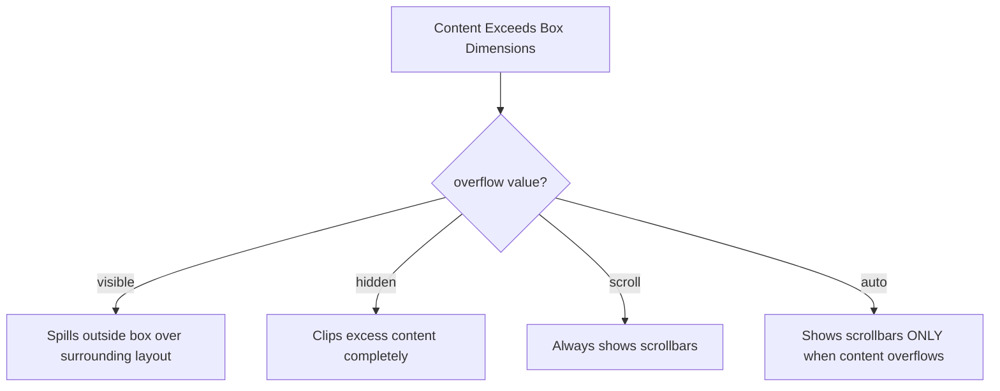

# CSS Overflow

Estimated Reading Time: 12 minutes

Prerequisites: [Introduction to CSS](01-introduction-to-css.md), [CSS Height](13-css-height.md)

Learning Objectives:
- Master the `overflow` property and its sub-properties (`overflow-x`, `overflow-y`).
- Understand values: `visible`, `hidden`, `scroll`, and `auto`.
- Build custom scrollable UI containers and modal bodies.
- Prevent unwanted page scrollbars.

---

## Introduction

The `overflow` property dictates how a browser handles content that is too large to fit inside an element's fixed dimensions (`width` or `height`).

When child text, images, or large boxes exceed their parent's boundaries, `overflow` controls whether the extra content spills outside (`visible`), gets clipped into invisibility (`hidden`), or generates scrollbars (`scroll` or `auto`).

---

## Real-World Analogy

Imagine filling a glass with water.

- **`visible`**: You fill the glass past the brim. Water spills out over the sides and runs down onto the table.
- **`hidden`**: Excess water over the brim is instantly vaporized into thin air. Only what fits in the glass remains visible.
- **`scroll`**: The glass automatically attaches an elevator straw so you can scroll down to access all the liquid without spilling a drop onto the table.

`overflow` manages content spillover behavior.

---

## Core Concepts

### 1. The `overflow` Values
- `visible` (Default): Content is not clipped; it renders outside the box boundary.
- `hidden`: Content exceeding box boundaries is clipped and hidden completely.
- `scroll`: Content is clipped, and scrollbars are **always** added (even if content fits).
- `auto`: Content is clipped, and scrollbars appear **only when needed**.

### 2. Axis-Specific Properties
- `overflow-x`: Controls horizontal clipping and scrollbars.
- `overflow-y`: Controls vertical clipping and scrollbars.

---

## Syntax

```css
/* Universal Overflow */
.card-scroll {
    overflow: auto;
}

/* Hide Horizontal Overflow, Scroll Vertical */
.modal-body {
    overflow-x: hidden;
    overflow-y: auto;
}

/* Clip Excess Content */
.badge-container {
    overflow: hidden;
}
```

---

## Property Reference

| Property | Description | Common Values | Default Value |
| :--- | :--- | :--- | :--- |
| `overflow` | Shorthand for horizontal and vertical overflow | `visible`, `hidden`, `scroll`, `auto` | `visible` |
| `overflow-x` | Controls horizontal spillover | `visible`, `hidden`, `scroll`, `auto` | `visible` |
| `overflow-y` | Controls vertical spillover | `visible`, `hidden`, `scroll`, `auto` | `visible` |

---

## Visual Explanation



---

## Example 1

### HTML
```html
<!DOCTYPE html>
<html lang="en">
<head>
    <meta charset="UTF-8">
    <title>Scrollable Card Container</title>
    <style>
        .scroll-card {
            width: 280px;
            height: 140px;
            overflow-y: auto;
            border: 1px solid #cbd5e1;
            padding: 15px;
            border-radius: 8px;
            background-color: #ffffff;
            font-family: Arial, sans-serif;
        }
    </style>
</head>
<body>
    <div class="scroll-card">
        <h4 style="margin-top:0;">Scrollable Feed</h4>
        <p>Line 1: Notification message update...</p>
        <p>Line 2: System alert message...</p>
        <p>Line 3: User logged into dashboard...</p>
        <p>Line 4: Database backup completed...</p>
    </div>
</body>
</html>
```

### CSS
```css
.scroll-card {
    width: 280px;
    height: 140px;
    overflow-y: auto;
    border: 1px solid #cbd5e1;
    padding: 15px;
    border-radius: 8px;
}
```

### Explanation
The `.scroll-card` has a fixed height of 140px. Setting `overflow-y: auto` displays vertical scrollbars automatically when paragraph lines exceed 140px.

---

## Output Image Prompt

A browser window showing a 280x140 pixel white container card (`#ffffff`) with 15px padding and an active vertical scrollbar along its right edge allowing users to scroll through text lines.

---

## Code Explanation

- `height: 140px;`: Fixes card vertical dimension.
- `overflow-y: auto;`: Triggers vertical scrollbars only when text content overflows.

---

## Example 2

### HTML
```html
<!DOCTYPE html>
<html lang="en">
<head>
    <meta charset="UTF-8">
    <title>Horizontal Carousel Strip</title>
    <style>
        .carousel-strip {
            display: flex;
            gap: 15px;
            overflow-x: auto;
            width: 320px;
            padding: 10px;
            border: 1px solid #cbd5e1;
            background-color: #f8fafc;
        }
        .carousel-item {
            min-width: 120px;
            height: 80px;
            background-color: #2563eb;
            color: white;
            display: flex;
            align-items: center;
            justify-content: center;
            border-radius: 6px;
        }
    </style>
</head>
<body>
    <div class="carousel-strip">
        <div class="carousel-item">Item 1</div>
        <div class="carousel-item">Item 2</div>
        <div class="carousel-item">Item 3</div>
        <div class="carousel-item">Item 4</div>
    </div>
</body>
</html>
```

### CSS
```css
.carousel-strip {
    display: flex;
    gap: 15px;
    overflow-x: auto;
    width: 320px;
}
.carousel-item {
    min-width: 120px;
    height: 80px;
}
```

### Explanation
`overflow-x: auto` on a flex row creates a horizontal scrolling product carousel strip.

---

## Output Image Prompt

A browser window showing a horizontal strip (`320px` wide) containing blue rectangular cards with a bottom horizontal scrollbar for side-scrolling.

---

## Code Explanation

- `overflow-x: auto;`: Enables horizontal touch and mouse scrollbars for flex items extending past 320px.

---

## Best Practices

- **Use `auto` instead of `scroll`**: `auto` displays scrollbars only when content overflows, whereas `scroll` shows empty permanent scrollbar tracks even when content fits.
- **Prevent Body Horizontal Scrollbars**: Use `body { overflow-x: hidden; }` if animated elements trigger horizontal scrollbars.

---

## Common Mistakes

### Mistake 1: Using `scroll` Instead of `auto`

```css
/* INCORRECT */
.box {
    overflow: scroll; /* Shows ugly inactive scrollbars even when text fits! */
}
```

#### Explanation
`scroll` permanently locks visible scrollbar frames regardless of content height.

```css
/* CORRECT */
.box {
    overflow: auto; /* Displays scrollbar only when overflow occurs */
}
```

---

## Browser Compatibility

CSS `overflow` properties have 100% universal support across all desktop and mobile web browsers.

---

## Real-World Applications

- **Modal Dialog Bodies**: `max-height: 70vh; overflow-y: auto;` for scrollable popup windows.
- **Mobile Product Carousels**: `overflow-x: auto` for touch-swipable product cards.
- **Code Block Snippets**: `overflow-x: auto` on `<pre><code>` blocks.

---

## Mini Project

### Project Objective: Scrollable Code Block Component
Build a `<pre><code>` code container with `overflow-x: auto`.

---

## Practice Exercises

### Beginner Level
1. Hide overflowing content in a container using `overflow: hidden;`.
2. Add automatic scrollbars to a fixed-height box using `overflow: auto;`.
3. Create a horizontal scroll strip using `overflow-x: auto;`.
4. Hide horizontal scrollbars on body using `overflow-x: hidden;`.
5. Restore default overflow behavior using `overflow: visible;`.

### Intermediate Level
6. Explain the difference between `overflow: scroll` and `overflow: auto`.
7. Combine `max-height: 300px` and `overflow-y: auto` on a dropdown menu.
8. Fix an issue where rounded card corners bleed using `overflow: hidden`.
9. Build a mobile touch-scroll gallery strip.
10. Style custom scrollbars using `::-webkit-scrollbar` pseudo-elements.

### Advanced Level
11. Compare `overflow-clip-margin` behavior with `overflow: hidden`.
12. Audit mobile smooth momentum scrolling using `-webkit-overflow-scrolling: touch`.
13. Combine CSS Scroll Snap (`scroll-snap-type: x mandatory`) with `overflow-x: auto`.
14. Explain scroll-anchoring behavior when dynamic content prepends above scrollable containers.
15. Solve stacking context clipping bugs caused by parent `overflow: hidden` rules.

---

## Quick Quiz

**1. What is the default value of the `overflow` property?**
A) `hidden`  
B) `scroll`  
C) `visible`  

**2. Which value displays scrollbars ONLY when content overflows?**
A) `scroll`  
B) `auto`  
C) `visible`  

**3. What does `overflow: hidden` do to content extending past box boundaries?**
A) Displays scrollbars  
B) Clips excess content completely into invisibility  
C) Expands box dimensions  

**4. Which property controls horizontal overflow only?**
A) `overflow-y`  
B) `overflow-x`  
C) `overflow-side`  

**5. Why is `auto` preferred over `scroll`?**
A) `auto` loads faster  
B) `auto` avoids displaying permanent inactive scrollbar frames when text fits  
C) `scroll` is deprecated  

**6. What property pairs with `overflow-x: auto` to build swipable touch galleries?**
A) `scroll-snap-type`  
B) `margin: auto`  

**7. How does `overflow: hidden` interact with parent `border-radius` corners?**
A) Removes borders  
B) Clips child images to matching rounded corner shapes  

**8. What happens with `overflow: visible`?**
A) Overflowing content spills out over surrounding elements  
B) Content turns blue  

**9. Can `overflow-x` and `overflow-y` have different values on the same element?**
A) Yes  
B) No  

**10. What pseudo-element styles custom scrollbar tracks in WebKit browsers?**
A) `::scroll`  
B) `::-webkit-scrollbar`  

---

### Answers
1: C | 2: B | 3: B | 4: B | 5: B | 6: A | 7: B | 8: A | 9: A | 10: B

---

## Interview Questions

**1. What is the `overflow` property in CSS?**  
*Answer:* `overflow` specifies how browsers handle content that extends past an element's fixed width or height boundaries (`visible`, `hidden`, `scroll`, or `auto`).

**2. What is the difference between `overflow: scroll` and `overflow: auto`?**  
*Answer:* `scroll` permanently renders scrollbar tracks whether content overflows or not. `auto` renders scrollbars dynamically **only when** content overflows.

**3. How does `overflow: hidden` affect BFC (Block Formatting Context)?**  
*Answer:* Setting `overflow: hidden` (or any value other than `visible`) creates a new Block Formatting Context, which automatically clears internal floated children and prevents parent margin collapsing.

---

## Summary

- Use **`overflow: auto`** for dynamic scrollbars when content overflows.
- Use **`overflow: hidden`** to clip excess content or force card rounded corner bounds.
- Use **`overflow-x: auto`** for horizontal scroll strips and carousels.

---

## Cheat Sheet

```css
/* SCROLLABLE VERTICAL CONTAINER */
.scroll-y {
    max-height: 300px;
    overflow-y: auto;
}

/* HORIZONTAL CAROUSEL STRIP */
.carousel {
    overflow-x: auto;
    display: flex;
}
```

---

## Related Topics

- **Previous Topic**: [CSS Float](15-css-float.md)
- **Next Topic**: [CSS Display](17-css-display.md)
- **Recommended Learning Order**: Introduction to CSS -> Ways to Add CSS -> CSS Selectors -> CSS Colors -> CSS Fonts -> CSS Borders -> Border Radius -> CSS Shadows -> CSS Margins -> CSS Padding -> CSS Width -> CSS Height -> CSS Box Model -> CSS Float -> CSS Overflow -> CSS Display
