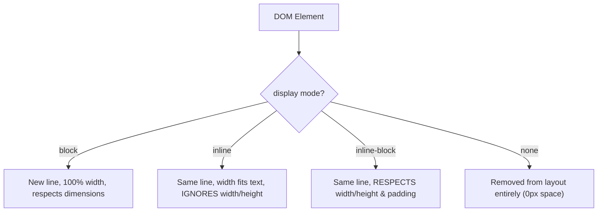

# CSS Display

Estimated Reading Time: 15 minutes

Prerequisites: [Introduction to CSS](01-introduction-to-css.md), [CSS Box Model](14-css-box-model.md)

Learning Objectives:
- Master core display modes: `block`, `inline`, `inline-block`, and `none`.
- Understand layout behavior differences between block and inline boxes.
- Hide elements cleanly using `display: none` vs `visibility: hidden`.
- Understand modern layout engine values (`flex`, `grid`).

---

## Introduction

The `display` property is the single most important CSS property for controlling document layout behavior. It specifies how an element renders inside the page layout flow and how its child elements behave.

Every HTML element has a default display value depending on its tag type (e.g. `<div>` defaults to `block`, `<span>` defaults to `inline`). Changing `display` allows developers to convert line-wrapping blocks into inline pills, hide modal popups dynamically, or activate powerful layout engines like Flexbox (`display: flex`) and CSS Grid (`display: grid`).

---

## Real-World Analogy

Imagine queuing people in an airport security line vs seating passengers on an airplane row.

- **Block Element (`display: block`)**: A tall passenger who insists on occupying an entire row of seats alone. No one else can sit next to them; the next passenger must sit on a completely new row below.
- **Inline Element (`display: inline`)**: Small luggage bags placed side-by-side on a conveyor belt. They sit next to each other on the same line until the belt runs out of horizontal space.
- **Inline-Block Element (`display: inline-block`)**: Luggage boxes that sit side-by-side on the belt (inline), but allow you to measure and lock their width and height (block).
- **None (`display: none`)**: A magician making a passenger disappear from the airport line entirely. The line behind them steps forward instantly to fill the empty floor space.

`display` controls how elements flow together in layout space.

---

## Core Concepts

### 1. `display: block`
- Starts on a **new line**.
- Expands automatically to fill **100% parent width** by default.
- Respects `width`, `height`, `margin`, and `padding` on all sides.
- Default for: `<div>`, `<p>`, `<h1>`-`<h6>`, `<section>`, `<header>`.

### 2. `display: inline`
- Renders **on the same line** alongside adjacent inline elements.
- Width and height span **only as wide as inner text content**.
- **Ignores** `width` and `height` properties!
- Ignores vertical margins (`margin-top` / `margin-bottom`).
- Default for: `<span>`, `<a>`, `<strong>`, `<em>`.

### 3. `display: inline-block`
- Renders **on the same line** (like `inline`).
- **Respects** `width`, `height`, `margin`, and `padding` (like `block`).
- Ideal for: Navigation links, buttons, badge tags.

### 4. `display: none`
- Removes the element completely from the visual page layout.
- Occupies **zero space** (adjacent elements shift to fill the gap).

### 5. `visibility: hidden` vs `display: none`
- `display: none`: Element is removed; occupies **no space**.
- `visibility: hidden`: Element is invisible, but still occupies its **original layout space**.

---

## Syntax

```css
/* Block Conversion */
a.button-block {
    display: block;
    width: 100%;
}

/* Inline-Block Buttons */
.nav-link {
    display: inline-block;
    padding: 10px 20px;
    width: 140px;
}

/* Hiding Elements */
.modal-hidden {
    display: none;
}
```

---

## Property Reference

| Value | Starts New Line? | Respects Width & Height? | Respects Vertical Margins? | Common Use Case |
| :--- | :--- | :--- | :--- | :--- |
| `block` | Yes | Yes | Yes | Structural containers, cards, headings |
| `inline` | No | **No** | **No** | Inline text styling (`<span>`, `<a>`) |
| `inline-block` | No | Yes | Yes | Buttons, badge tags, navigation items |
| `none` | N/A (Hidden) | N/A | N/A | Hiding popups, tab content |
| `flex` | Yes (Container) | Yes | Yes | Flexbox multi-element alignment |
| `grid` | Yes (Container) | Yes | Yes | 2D Grid layouts |

---

## Visual Explanation



---

## Example 1

### HTML
```html
<!DOCTYPE html>
<html lang="en">
<head>
    <meta charset="UTF-8">
    <title>Display Modes Comparison</title>
    <style>
        body { font-family: Arial, sans-serif; padding: 20px; }
        
        .box-inline {
            display: inline;
            background-color: #fde047;
            padding: 8px;
            /* width & height ignored on inline */
        }
        
        .box-inline-block {
            display: inline-block;
            background-color: #2563eb;
            color: white;
            padding: 8px 16px;
            width: 150px;
            text-align: center;
        }
    </style>
</head>
<body>
    <p>
        Text with an <span class="box-inline">Inline Element</span> sitting inside sentence flow.
    </p>
    <div>
        <div class="box-inline-block">Button 1</div>
        <div class="box-inline-block">Button 2</div>
    </div>
</body>
</html>
```

### CSS
```css
.box-inline {
    display: inline;
    background-color: #fde047;
    padding: 8px;
}
.box-inline-block {
    display: inline-block;
    background-color: #2563eb;
    color: white;
    padding: 8px 16px;
    width: 150px;
}
```

### Explanation
The yellow `<span>` uses `display: inline`, flowing seamlessly inside paragraph text. The blue buttons use `display: inline-block`, sitting side-by-side on one row while accepting a fixed 150px width.

---

## Output Image Prompt

A browser window showing a paragraph with a yellow highlighted inline text phrase. Below the paragraph, two blue rectangular button pills ("Button 1", "Button 2") sit side-by-side on the same horizontal row, each measuring 150px wide.

---

## Code Explanation

- `display: inline`: Flows inside text sentence line without creating line breaks.
- `display: inline-block`: Places elements side-by-side while respecting explicit 150px width properties.

---

## Example 2

### HTML
```html
<!DOCTYPE html>
<html lang="en">
<head>
    <meta charset="UTF-8">
    <title>Display None vs Visibility Hidden</title>
    <style>
        .box {
            padding: 15px;
            margin: 10px 0;
            color: white;
            font-family: Arial, sans-serif;
        }
        .box-1 { background-color: #0284c7; }
        .box-2 { background-color: #dc2626; display: none; }
        .box-3 { background-color: #16a34a; }
    </style>
</head>
<body>
    <div class="box box-1">Box 1 (Visible)</div>
    <div class="box box-2">Box 2 (display: none)</div>
    <div class="box box-3">Box 3 (Visible)</div>
</body>
</html>
```

### CSS
```css
.box-2 {
    display: none;
}
```

### Explanation
Box 2 is assigned `display: none`. It disappears completely, and Box 3 moves up directly underneath Box 1.

---

## Output Image Prompt

A browser window showing a blue box "Box 1" stacked directly above a green box "Box 3" with zero empty gap between them. Red "Box 2" is completely invisible and occupies no layout space.

---

## Code Explanation

- `display: none;`: Removes element from rendered DOM flow, collapsing space completely.

---

## Best Practices

- **Use `inline-block` for Side-by-Side Buttons**: Convert links or buttons to `inline-block` to apply padding, width, and height while keeping them on one line.
- **Use `display: none` for Modal Hiding**: Use `display: none` when toggling hidden UI elements via JavaScript.

---

## Common Mistakes

### Mistake 1: Setting `width` on an `inline` Element

```css
/* INCORRECT */
span {
    display: inline;
    width: 200px; /* Ignored! Inline elements ignore width and height */
}
```

#### Explanation
Standard `inline` elements ignore `width` and `height`. Change display to `inline-block` or `block`.

```css
/* CORRECT */
span {
    display: inline-block;
    width: 200px;
}
```

---

## Browser Compatibility

CSS `display` properties have 100% universal support across all desktop and mobile web browsers.

---

## Real-World Applications

- **Navigation Menus**: Converting `<li>` items to `display: inline-block` or `display: flex`.
- **Toggle Popups**: Toggling `display: none` vs `display: block` via JS dropdown triggers.
- **Full Width Buttons**: Setting `display: block; width: 100%;` on mobile CTA buttons.

---

## Mini Project

### Project Objective: Inline-Block Navigation Bar
Build a horizontal navbar with 4 `inline-block` link buttons.

---

## Practice Exercises

### Beginner Level
1. Convert an `<a>` link to `display: block`.
2. Hide a element using `display: none`.
3. Set display mode of list items to `inline-block`.
4. Explain why `width` does not work on a standard `<span>`.
5. Make a hidden modal visible using `display: block`.

### Intermediate Level
6. Compare `display: none` vs `visibility: hidden`.
7. Build a responsive button bar using `display: inline-block`.
8. Explain whitespace gap bugs between `inline-block` HTML elements.
9. Convert a block heading to `display: inline`.
10. Combine `display: none` with CSS media queries to hide mobile sidebars.

### Advanced Level
11. Compare performance of toggling `display: none` vs `opacity: 0` for accessibility screen readers.
12. Audit layout reflow cost of dynamic `display` mode changes.
13. Explain inner/outer display values in modern CSS (`display: block flex`).
14. Use `display: contents` to strip parent container boxes while preserving children.
15. Solve baseline alignment issues across adjacent `inline-block` boxes.

---

## Quick Quiz

**1. What happens when an element has `display: block`?**
A) Renders on the same line  
B) Starts on a new line and expands 100% parent width  
C) Hides content  

**2. Which display mode allows setting `width` and `height` while staying on the same horizontal line?**
A) `inline`  
B) `inline-block`  
C) `block`  

**3. What happens to space occupied by an element styled with `display: none`?**
A) Space remains empty  
B) Space collapses completely (occupies 0px)  
C) Space turns red  

**4. How does `visibility: hidden` differ from `display: none`?**
A) `visibility: hidden` retains the element's layout space  
B) `display: none` retains space  
C) They are identical  

**5. What is the default `display` value for a `<div>` tag?**
A) `inline`  
B) `block`  
C) `flex`  

**6. What is the default `display` value for a `<span>` tag?**
A) `block`  
B) `inline`  
C) `inline-block`  

**7. Does `display: inline` respect `width: 200px`?**
A) Yes  
B) No (ignores width and height)  

**8. Which display value activates Flexbox layout engines?**
A) `display: flex`  
B) `display: grid`  

**9. What display value removes container boxes while rendering inner children?**
A) `display: contents`  
B) `display: none`  

**10. Why are buttons often styled with `display: inline-block`?**
A) To make text blue  
B) To allow setting padding, width, and height while keeping buttons side-by-side  

---

### Answers
1: B | 2: B | 3: B | 4: A | 5: B | 6: B | 7: B | 8: A | 9: A | 10: B

---

## Interview Questions

**1. Compare `display: block`, `display: inline`, and `display: inline-block`.**  
*Answer:* `block` starts on a new line and respects all dimensions. `inline` stays on the same line but ignores `width`, `height`, and vertical margins. `inline-block` stays on the same line while respecting `width`, `height`, and padding.

**2. What is the difference between `display: none` and `visibility: hidden`?**  
*Answer:* `display: none` removes the element completely from document layout (occupying 0px space). `visibility: hidden` renders the element invisible while preserving its physical layout space.

**3. What does `display: contents` do?**  
*Answer:* `display: contents` causes an element's container box to be ignored by the renderer, making its direct child elements behave as if they were immediate children of the outer parent container.

---

## Summary

- **`block`**: New line, 100% width.
- **`inline`**: Same line, fits text content (ignores width/height).
- **`inline-block`**: Same line, respects width/height/padding.
- **`none`**: Removes element (0px layout space).

---

## Cheat Sheet

```css
/* INLINE-BLOCK BUTTON */
.btn {
    display: inline-block;
    padding: 10px 20px;
    width: 140px;
}

/* HIDING CONTAINERS */
.hidden { display: none; }
```

---

## Related Topics

- **Previous Topic**: [CSS Overflow](16-css-overflow.md)
- **Next Topic**: [CSS Position](18-css-position.md)
- **Recommended Learning Order**: Introduction to CSS -> Ways to Add CSS -> CSS Selectors -> CSS Colors -> CSS Fonts -> CSS Borders -> Border Radius -> CSS Shadows -> CSS Margins -> CSS Padding -> CSS Width -> CSS Height -> CSS Box Model -> CSS Float -> CSS Overflow -> CSS Display -> CSS Position
