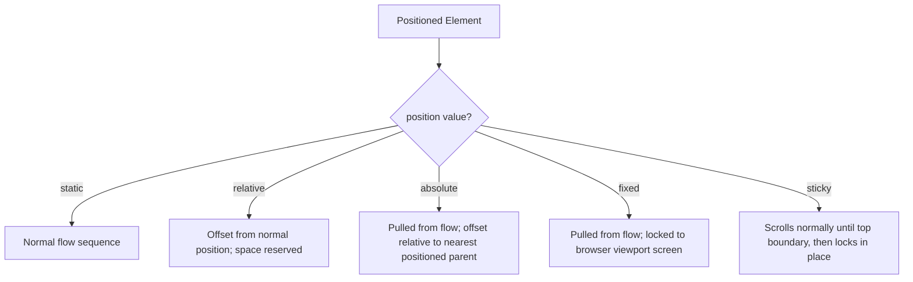

# CSS Position

Estimated Reading Time: 15 minutes

Prerequisites: [Introduction to CSS](01-introduction-to-css.md), [CSS Display](17-css-display.md)

Learning Objectives:
- Master positioning modes: `static`, `relative`, `absolute`, `fixed`, and `sticky`.
- Understand coordinate properties (`top`, `right`, `bottom`, `left`).
- Control stacking order using `z-index`.
- Master the `position: relative` parent + `position: absolute` child positioning anchor pattern.

---

## Introduction

The `position` property dictates how an element is positioned within the document visual hierarchy.

By default (`position: static`), elements flow sequentially in natural HTML order. Changing `position` allows developers to offset elements relative to their normal position (`relative`), pin badge icons inside container cards (`absolute`), lock navigation bars to the top of the browser screen (`fixed`), or create sticky headers that lock in place when scrolled (`sticky`).

---

## Real-World Analogy

Imagine positioning sticky notes on a wall chart.

- **`static`**: A standard printed chart entry stuck permanently in line order.
- **`relative`**: Nudging a sticky note 10mm lower than its printed slot on the chart. The original slot stays empty.
- **`absolute`**: Sticking a pushpin badge directly inside the top-right corner of a specific bulletin card frame (`position: relative` parent).
- **`fixed`**: Taping a clear plastic ruler onto your reading glasses. As you look around or scroll through pages, the ruler remains locked in the exact same spot on your screen view.
- **`sticky`**: A magnet on your refrigerator door that slides smoothly as you scroll down, but locks firmly at the top edge when it hits the top border.

`position` provides precise spatial control over UI elements.

---

## Core Concepts

### 1. Positioning Modes
1. **`static`** (Default): Normal document flow. Offset properties (`top`, `right`, `bottom`, `left`) have **no effect**.
2. **`relative`**: Positioned relative to its **normal position**. Leaves its original space reserved in document flow.
3. **`absolute`**: Pulled out of normal document flow. Positioned relative to its **nearest non-static ancestor**.
4. **`fixed`**: Pulled out of normal flow. Positioned relative to the **browser viewport window**. Stays fixed during page scroll.
5. **`sticky`**: Toggles between `relative` and `fixed` based on page scroll position.

### 2. Coordinate Properties
Used to offset positioned elements: `top`, `right`, `bottom`, `left`.

### 3. Stacking Order (`z-index`)
Controls depth stacking layer for overlapping positioned elements. Higher `z-index` values render on top of lower values.

---

## Syntax

```css
/* Relative Parent Anchor */
.card {
    position: relative; /* Anchor for absolute children */
}

/* Absolute Child Badge */
.card-badge {
    position: absolute;
    top: 10px;
    right: 10px;
    z-index: 10;
}

/* Fixed Header Navbar */
.navbar-fixed {
    position: fixed;
    top: 0;
    left: 0;
    width: 100%;
    z-index: 1000;
}

/* Sticky Section Header */
.sticky-header {
    position: sticky;
    top: 0;
    z-index: 100;
}
```

---

## Property Reference

| Position Mode | Removed from Flow? | Positioned Relative To? | Respects Coordinates (`top/left/etc`)? |
| :--- | :--- | :--- | :--- |
| `static` | No | Normal flow | **No** |
| `relative` | No (Space reserved) | Its own normal position | Yes |
| `absolute` | **Yes** | Nearest non-static ancestor | Yes |
| `fixed` | **Yes** | Browser viewport window | Yes |
| `sticky` | Conditional | Scroll container boundary | Yes |

---

## Visual Explanation



---

## Example 1

### HTML
```html
<!DOCTYPE html>
<html lang="en">
<head>
    <meta charset="UTF-8">
    <title>Relative Parent & Absolute Child Badge</title>
    <style>
        .card {
            position: relative; /* Anchor point */
            width: 260px;
            background-color: #ffffff;
            border: 1px solid #cbd5e1;
            padding: 20px;
            border-radius: 8px;
            font-family: Arial, sans-serif;
        }
        .badge {
            position: absolute;
            top: -10px;
            right: -10px;
            background-color: #dc2626;
            color: #ffffff;
            padding: 4px 10px;
            border-radius: 9999px;
            font-size: 12px;
            font-weight: bold;
        }
    </style>
</head>
<body>
    <div class="card">
        <span class="badge">HOT</span>
        <h3 style="margin-top:0;">Product Card</h3>
        <p style="margin:0; color:#64748b;">Badge positioned absolutely relative to card parent.</p>
    </div>
</body>
</html>
```

### CSS
```css
.card {
    position: relative;
    width: 260px;
}
.badge {
    position: absolute;
    top: -10px;
    right: -10px;
    background-color: #dc2626;
}
```

### Explanation
The `.card` container sets `position: relative`. The `.badge` sets `position: absolute; top: -10px; right: -10px;`, pinning the red "HOT" pill directly to the top-right corner of the card container.

---

## Output Image Prompt

A browser window showing a white product card container with a red circular pill badge reading "HOT" pinned directly over its top-right corner boundary.

---

## Code Explanation

- `position: relative;`: Establishes positional anchor context for child elements.
- `position: absolute; top: -10px; right: -10px;`: Pins child element relative to parent corner boundaries.

---

## Example 2

### HTML
```html
<!DOCTYPE html>
<html lang="en">
<head>
    <meta charset="UTF-8">
    <title>Fixed Navbar Demo</title>
    <style>
        body { margin: 0; padding-top: 60px; font-family: Arial, sans-serif; }
        .fixed-nav {
            position: fixed;
            top: 0;
            left: 0;
            width: 100%;
            height: 50px;
            background-color: #0f172a;
            color: white;
            display: flex;
            align-items: center;
            padding: 0 20px;
            box-shadow: 0 2px 10px rgba(0,0,0,0.2);
            z-index: 1000;
        }
    </style>
</head>
<body>
    <div class="fixed-nav">Fixed Top Navigation Bar</div>
    <div style="padding:20px;">
        <h2>Page Content</h2>
        <p>Scroll down to see the fixed top navbar remain locked at the top of the browser screen.</p>
    </div>
</body>
</html>
```

### CSS
```css
.fixed-nav {
    position: fixed;
    top: 0;
    left: 0;
    width: 100%;
    height: 50px;
    z-index: 1000;
}
```

### Explanation
`position: fixed` locks `.fixed-nav` to the top edge of the browser viewport (`top: 0; left: 0`). `padding-top: 60px` on `body` prevents fixed header from obscuring page body text.

---

## Output Image Prompt

A browser window showing a dark slate horizontal navbar (`#0f172a`) locked across the top edge of the screen canvas above light page content.

---

## Code Explanation

- `position: fixed; top: 0; left: 0;`: Locks header bar to browser viewport top edge regardless of page scroll.
- `z-index: 1000;`: Keeps header bar stacked above all scrolling body content.

---

## Best Practices

- **Pair `position: absolute` with `position: relative` Parent**: Always set `position: relative` on the parent container when positioning absolute children.
- **Add Body Padding for Fixed Navbars**: Always add `padding-top` equal to navbar height on `body` when using `position: fixed` top headers.

---

## Common Mistakes

### Mistake 1: Missing `position: relative` on Parent Container

```css
/* INCORRECT */
.parent {
    /* Missing position: relative! */
}
.child-badge {
    position: absolute;
    top: 0;
    right: 0; /* Badge flies all the way to top-right corner of the HTML page! */
}
```

#### Explanation
If no ancestor has `position: relative` (or absolute/fixed), an absolute child positions itself relative to the root `<html>` document.

```css
/* CORRECT */
.parent {
    position: relative;
}
.child-badge {
    position: absolute;
    top: 0;
    right: 0;
}
```

---

## Browser Compatibility

CSS positioning properties (`static`, `relative`, `absolute`, `fixed`, `sticky`, `z-index`) have 100% universal support across all modern desktop and mobile browsers.

---

## Real-World Applications

- **Sticky Navigation Headers**: `position: sticky; top: 0;` for table and navbar headers.
- **Card Notification Badges**: `position: absolute` for red counter icons on profile avatars.
- **Modal Popups**: `position: fixed` for screen overlay popups.

---

## Mini Project

### Project Objective: Profile Avatar with Status Badge
Build a circular user avatar with an absolute green online status indicator badge (`position: absolute`).

---

## Practice Exercises

### Beginner Level
1. Set an element to `position: relative` and move it 10px lower using `top: 10px`.
2. Pin a notification badge to the top-right corner of a card.
3. Lock a header bar to the top of screen using `position: fixed`.
4. Create a sticky table header using `position: sticky; top: 0;`.
5. Set stacking layer order using `z-index: 10;`.

### Intermediate Level
6. Explain why `position: absolute` elements require a `position: relative` parent.
7. Fix an issue where a fixed navbar covers top paragraph text.
8. Compare `position: fixed` vs `position: sticky`.
9. Use `z-index` to place a modal popup window over a dark backdrop.
10. Center an absolute element using `top: 50%; left: 50%; transform: translate(-50%, -50%);`.

### Advanced Level
11. Audit GPU compositing performance of `position: fixed` elements during scroll events.
12. Explain how `transform` or `filter` on a parent creates a new containing block for `position: fixed` children.
13. Solve stacking context isolation issues using `isolation: isolate`.
14. Build a multi-layered parallax scrolling effect using CSS positioning.
15. Demonstrate sticky container boundary clipping rules when parent height ends.

---

## Quick Quiz

**1. What is the default `position` value in CSS?**
A) `relative`  
B) `static`  
C) `absolute`  

**2. Which position mode positions an element relative to the browser viewport window?**
A) `relative`  
B) `absolute`  
C) `fixed`  

**3. What positioning mode should be set on a parent card container to anchor an absolute child badge inside it?**
A) `position: relative`  
B) `position: static`  
C) `position: inline`  

**4. What property controls depth layer stacking order for overlapping elements?**
A) `order`  
B) `z-index`  
C) `depth`  

**5. Does `position: relative` remove an element from normal document layout flow?**
A) Yes  
B) No (leaves original space reserved)  

**6. What position mode toggles between relative and fixed based on page scroll?**
A) `sticky`  
B) `static`  

**7. Where does an absolute child position itself if no ancestor has `position: relative`?**
A) Parent container  
B) The root `<html>` document viewport  

**8. Which coordinates offset a positioned element?**
A) `top`, `right`, `bottom`, `left`  
B) `x`, `y`, `z`  

**9. Does `top: 20px` work on an element with default `position: static`?**
A) Yes  
B) No (ignored on static elements)  

**10. What stacking context issue can occur if `z-index` is set on unpositioned static elements?**
A) `z-index` is ignored on `position: static` elements  
B) Element hides  

---

### Answers
1: B | 2: C | 3: A | 4: B | 5: B | 6: A | 7: B | 8: A | 9: B | 10: A

---

## Interview Questions

**1. Explain all 5 values of the CSS `position` property.**  
*Answer:* `static` (normal flow), `relative` (offset from normal position; space reserved), `absolute` (removed from flow; positioned relative to nearest non-static ancestor), `fixed` (removed from flow; locked to viewport window), `sticky` (scrolls until threshold, then locks in place).

**2. What is a Stacking Context and how does `z-index` work?**  
*Answer:* A stacking context is a 3D conceptual layering of elements along the Z-axis. `z-index` determines stacking order within the same stacking context. Non-static elements with higher `z-index` render in front of lower values.

**3. Why does `position: fixed` sometimes fail to stay fixed relative to the viewport?**  
*Answer:* If any parent ancestor has a CSS `transform`, `perspective`, or `filter` property applied, that parent creates a new containing block, trapping the `position: fixed` child relative to that ancestor rather than the viewport window.

---

## Summary

- Use **`position: relative`** on parent containers as anchor points.
- Use **`position: absolute`** for badges and corner icons.
- Use **`position: fixed`** for top navigation bars.
- Use **`position: sticky`** for scroll-locked headers.

---

## Cheat Sheet

```css
/* PARENT / CHILD ANCHOR PATTERN */
.parent { position: relative; }
.child-badge {
    position: absolute;
    top: 10px;
    right: 10px;
}

/* FIXED NAVBAR PATTERN */
.navbar {
    position: fixed;
    top: 0;
    left: 0;
    width: 100%;
    z-index: 1000;
}
```

---

## Related Topics

- **Previous Topic**: [CSS Display](17-css-display.md)
- **Next Topic**: [CSS Background Images](19-css-background-images.md)
- **Recommended Learning Order**: Introduction to CSS -> Ways to Add CSS -> CSS Selectors -> CSS Colors -> CSS Fonts -> CSS Borders -> Border Radius -> CSS Shadows -> CSS Margins -> CSS Padding -> CSS Width -> CSS Height -> CSS Box Model -> CSS Float -> CSS Overflow -> CSS Display -> CSS Position -> CSS Background Images
