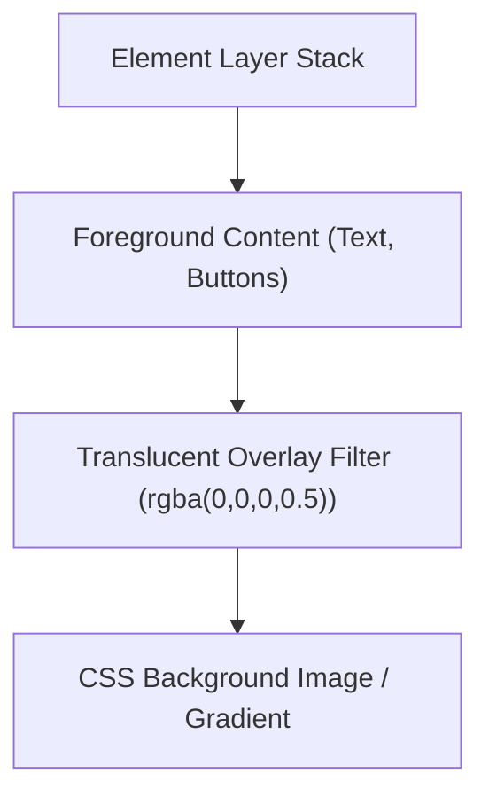

# CSS Background Images

Estimated Reading Time: 12 minutes

Prerequisites: [Introduction to CSS](01-introduction-to-css.md), [CSS Colors](04-css-colors.md)

Learning Objectives:
- Master `background-image` using `url()` syntax.
- Understand CSS gradients (`linear-gradient`, `radial-gradient`) as background images.
- Combine background images with translucent overlay fills for readable hero text.
- Differentiate between structural `` tags and decorative `background-image`.

---

## Introduction

The `background-image` property applies graphic images or generated color gradients behind an element's text and child content.

Unlike HTML `` tags (which represent semantic page content), CSS background images are purely decorative visual styles. Understanding how to link external image files, create CSS gradients, and overlay translucent color filters is essential for designing modern website hero banners and dark UI cards.

---

## Real-World Analogy

Imagine wallpaper in a bedroom.

- **HTML `` Tag**: A framed painting hanging on the wall. It is a distinct physical object with fixed dimensions that occupies wall space.
- **CSS `background-image`**: Decorative patterned wallpaper pasted directly onto the wall surface. The wallpaper sits behind furniture (text content) without taking up physical floor space.
- **CSS Gradient**: Paint brushed onto the wall with a smooth blend from dark navy at the ceiling down to bright teal at the floor.

`background-image` styles the backdrop surface behind HTML content.

---

## Core Concepts

### 1. Linking External Images
Uses the `url()` function: `background-image: url('images/hero.jpg');`.

### 2. CSS Linear Gradients
Gradients are generated dynamically by the browser as vector images:
- **Syntax**: `background-image: linear-gradient(direction, color1, color2);`
- **Example**: `linear-gradient(to right, #2563eb, #1d4ed8);`

### 3. Dark Overlay Pattern for Text Legibility
Bright background images can make white text unreadable. Combining a translucent dark gradient overlay with an image solves legibility issues:
`background-image: linear-gradient(rgba(0,0,0,0.6), rgba(0,0,0,0.6)), url('hero.jpg');`

### 4. Semantic `` vs CSS `background-image`
- **Use ``**: Product photos, user avatars, logo graphics (search engines and screen readers index them).
- **Use `background-image`**: Decorative textures, hero banner backdrops, UI icons.

---

## Syntax

```css
/* 1. Image File */
.hero-bg {
    background-image: url('banner.jpg');
}

/* 2. Linear Gradient */
.gradient-bg {
    background-image: linear-gradient(135deg, #0f172a, #2563eb);
}

/* 3. Image with Translucent Overlay Filter */
.overlay-hero {
    background-image: 
        linear-gradient(rgba(15, 23, 42, 0.7), rgba(15, 23, 42, 0.7)),
        url('hero-bg.jpg');
}
```

---

## Property Reference

| Property | Description | Syntax Examples |
| :--- | :--- | :--- |
| `background-image` | Sets backdrop image or gradient | `url('image.jpg')`, `linear-gradient(...)` |
| `linear-gradient()` | Directional color transition | `linear-gradient(to right, red, blue)` |
| `radial-gradient()` | Circular color transition | `radial-gradient(circle, red, blue)` |

---

## Visual Explanation



---

## Example 1

### HTML
```html
<!DOCTYPE html>
<html lang="en">
<head>
    <meta charset="UTF-8">
    <title>Gradient Hero Section</title>
    <style>
        .hero-banner {
            background-image: linear-gradient(135deg, #0f172a 0%, #2563eb 100%);
            color: #ffffff;
            padding: 60px 30px;
            border-radius: 12px;
            font-family: Arial, sans-serif;
            text-align: center;
        }
    </style>
</head>
<body>
    <div class="hero-banner">
        <h1 style="margin-top:0;">Linear Gradient Banner</h1>
        <p style="color:#e2e8f0; margin:0;">Dynamic CSS gradient background generated natively without external image files.</p>
    </div>
</body>
</html>
```

### CSS
```css
.hero-banner {
    background-image: linear-gradient(135deg, #0f172a 0%, #2563eb 100%);
    color: #ffffff;
    padding: 60px 30px;
    border-radius: 12px;
}
```

### Explanation
`background-image: linear-gradient(...)` generates a smooth diagonal color blend from dark slate (`#0f172a`) to vibrant blue (`#2563eb`) without requiring external image files.

---

## Output Image Prompt

A browser window showing a hero banner card with 12px rounded corners featuring a rich diagonal gradient blending smoothly from dark slate navy on the top-left to vibrant blue on the bottom-right. Crisp white heading text rests in the center.

---

## Code Explanation

- `linear-gradient(135deg, #0f172a 0%, #2563eb 100%);`: Renders a 135-degree angled vector gradient blend.

---

## Example 2

### HTML
```html
<!DOCTYPE html>
<html lang="en">
<head>
    <meta charset="UTF-8">
    <title>Dark Overlay Hero Pattern</title>
    <style>
        .overlay-card {
            background-image: 
                linear-gradient(rgba(15, 23, 42, 0.75), rgba(15, 23, 42, 0.75)),
                url('https://images.unsplash.com/photo-1518770660439-4636190af475?w=800');
            background-size: cover;
            background-position: center;
            color: #ffffff;
            padding: 50px 30px;
            border-radius: 12px;
            font-family: Arial, sans-serif;
        }
    </style>
</head>
<body>
    <div class="overlay-card">
        <h2 style="margin-top:0;">Translucent Overlay Banner</h2>
        <p style="margin:0;">The dark translucent gradient overlay guarantees high text contrast over background photos.</p>
    </div>
</body>
</html>
```

### CSS
```css
.overlay-card {
    background-image: 
        linear-gradient(rgba(15, 23, 42, 0.75), rgba(15, 23, 42, 0.75)),
        url('hero.jpg');
    background-size: cover;
    background-position: center;
}
```

### Explanation
Comma-separated background images stack layers: the top layer is a 75% dark navy translucent overlay; the bottom layer is the background photo. This guarantees white text contrast.

---

## Output Image Prompt

A browser window showing a dark hero card. A dark semi-transparent tint covers a background tech photograph, making the white text title sharp and readable.

---

## Code Explanation

- `linear-gradient(rgba(...), rgba(...)), url(...)`: Stacks a semi-transparent dark tint on top of the image file.

---

## Best Practices

- **Always Provide Fallback `background-color`**: Set `background-color` alongside `background-image` so text remains readable if the image fails to load.
- **Use Translucent Overlays for Text Contrast**: Overlay dark RGBA tints over hero images to satisfy accessibility text contrast guidelines.

---

## Common Mistakes

### Mistake 1: Using Decorative Background Images for Semantic Content

```html
<!-- INCORRECT for accessible product photos -->
<div class="product-photo" style="background-image: url('laptop.jpg');"></div>
```

#### Explanation
Screen readers and search engines cannot read or index background images. Use HTML `` with `alt` text for semantic content.

```html
<!-- CORRECT -->

```

---

## Browser Compatibility

CSS `background-image`, `url()`, and gradient functions have 100% universal support across all desktop and mobile web browsers.

---

## Real-World Applications

- **Website Hero Banners**: Full-width landing page hero images with dark color overlays.
- **UI Button Gradients**: Styling vibrant call-to-action buttons.
- **Dark Mode UI Headers**: Rendering smooth dark gradient headers.

---

## Mini Project

### Project Objective: Overlay Hero Section
Build a hero container combining a dark RGBA linear gradient overlay with a background photo.

---

## Practice Exercises

### Beginner Level
1. Apply a background image to a `<div>` using `url()`.
2. Create a horizontal linear gradient from blue to green.
3. Apply a dark RGBA background color fallback.
4. Create a 45-degree angled color gradient.
5. Create a circular radial gradient (`radial-gradient`).

### Intermediate Level
6. Stack a translucent dark overlay over a background image.
7. Explain when to use HTML `` vs CSS `background-image`.
8. Create a 3-stop linear gradient (`red 0%, yellow 50%, green 100%`).
9. Fix text contrast issues on a hero banner using gradient overlays.
10. Combine linear gradients with border radius on rounded cards.

### Advanced Level
11. Build a high-performance animated gradient background using CSS keyframes.
12. Optimize image asset loading using modern WebP formats in CSS `image-set()`.
13. Combine multiple background images in a single container.
14. Audit browser rendering layer costs of complex radial gradients.
15. Use CSS conic gradients (`conic-gradient`) to build a color wheel or pie chart.

---

## Quick Quiz

**1. What CSS function is used to link image files in `background-image`?**
A) `link()`  
B) `url()`  
C) `src()`  

**2. Which background type is generated dynamically as a vector by the browser without external files?**
A) `url('hero.png')`  
B) `linear-gradient()`  

**3. Why should dark RGBA overlays be stacked over background images?**
A) To speed up image loading  
B) To increase visual text contrast for accessibility legibility  

**4. When should an HTML `` tag be used instead of CSS `background-image`?**
A) Never  
B) When the image is important semantic content requiring search indexing and alt text  

**5. What angle value creates a diagonal gradient from top-left to bottom-right?**
A) `0deg`  
B) `135deg`  

**6. What property provides fallback color if a background image fails to load?**
A) `background-color`  
B) `color`  

**7. Can multiple background images be stacked in a single CSS declaration?**
A) Yes (comma-separated)  
B) No  

**8. What gradient function creates circular outward color transitions?**
A) `linear-gradient()`  
B) `radial-gradient()`  

**9. What function creates pie chart color sweeps around a center point?**
A) `conic-gradient()`  
B) `linear-gradient()`  

**10. What layer renders on top when listing comma-separated backgrounds?**
A) The first image/gradient listed  
B) The last image listed  

---

### Answers
1: B | 2: B | 3: B | 4: B | 5: B | 6: A | 7: A | 8: B | 9: A | 10: A

---

## Interview Questions

**1. What is the difference between an HTML `` tag and CSS `background-image`?**  
*Answer:* HTML `` represents semantic content—it participates in document layout flow, supports `alt` text for screen readers, and is indexed by search engines. CSS `background-image` is purely decorative styling—it sits behind content, does not support `alt` text, and is ignored by search engine indexing.

**2. How do you create a dark overlay over a background image for text readability?**  
*Answer:* List a semi-transparent dark linear gradient before the image URL: `background-image: linear-gradient(rgba(0,0,0,0.6), rgba(0,0,0,0.6)), url('bg.jpg');`.

**3. What are CSS Gradients and why are they performant?**  
*Answer:* CSS gradients are browser-generated vector graphics created via math algorithms. They require zero HTTP network requests, scale infinitely without pixelation, and consume negligible file bandwidth.

---

## Summary

- Use **`url()`** to load background image files.
- Use **`linear-gradient()`** for modern vector color blends.
- Stack **semi-transparent RGBA overlays** for text readability.

---

## Cheat Sheet

```css
/* LINEAR GRADIENT */
background-image: linear-gradient(135deg, #0f172a, #2563eb);

/* DARK OVERLAY HERO PATTERN */
background-image: 
    linear-gradient(rgba(0, 0, 0, 0.6), rgba(0, 0, 0, 0.6)),
    url('hero.jpg');
```

---

## Related Topics

- **Previous Topic**: [CSS Position](18-css-position.md)
- **Next Topic**: [CSS Background Properties](20-css-background-properties.md)
- **Recommended Learning Order**: Introduction to CSS -> Ways to Add CSS -> CSS Selectors -> CSS Colors -> CSS Fonts -> CSS Borders -> Border Radius -> CSS Shadows -> CSS Margins -> CSS Padding -> CSS Width -> CSS Height -> CSS Box Model -> CSS Float -> CSS Overflow -> CSS Display -> CSS Position -> CSS Background Images -> CSS Background Properties
