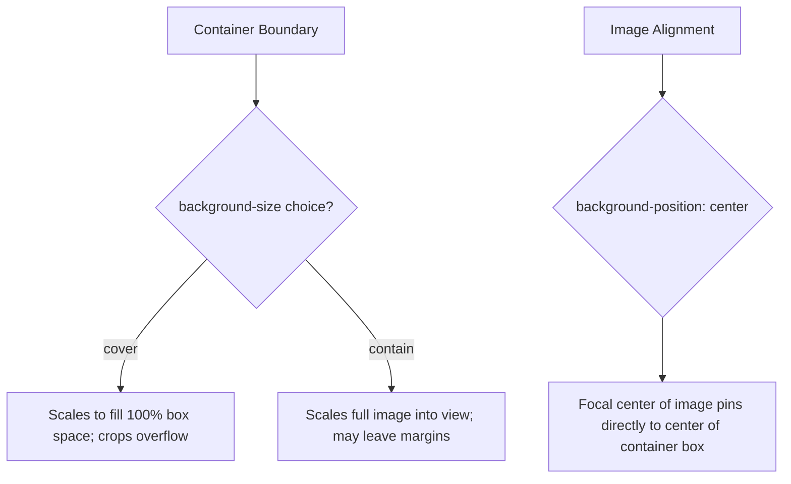

# CSS Background Properties

Estimated Reading Time: 12 minutes

Prerequisites: [CSS Background Images](19-css-background-images.md)

Learning Objectives:
- Master `background-size` (`cover`, `contain`, explicit dimensions).
- Understand `background-position` (`center`, percentage, keyword coordinates).
- Control tiling repetition using `background-repeat`.
- Create Parallax scrolling effects using `background-attachment: fixed`.
- Utilize the `background` shorthand property cleanly.

---

## Introduction

Applying a `background-image` is only the first step. CSS provides a suite of companion background properties to control how images fit, position, tile, and scroll within container boxes.

Without properties like `background-size: cover` or `background-position: center`, background images can appear stretched, tiled awkwardly, or cut off. Master control over background sizing, alignment, and attachment is essential for building polished hero headers and responsive card UI components.

---

## Real-World Analogy

Imagine fitting a printed poster inside a picture frame.

- **`background-size: cover`**: Stretching and trimming the poster so it completely covers the entire frame area without leaving any empty white edges, even if top or side edges must be cropped.
- **`background-size: contain`**: Scaling the poster so the entire complete image fits inside the frame boundaries without cropping any edges, even if empty letterbox margins remain.
- **`background-position: center`**: Aligning the center point of the poster directly over the center point of the frame.
- **`background-attachment: fixed`**: Mounting the poster onto a wall behind a cut-out window frame. As you walk past the window, the poster stays fixed to the wall while the window frame moves.

Background properties control backdrop scaling, positioning, and scrolling behavior.

---

## Core Concepts

### 1. `background-size`
- `cover`: Scales image proportionally so it **completely fills** the container box (crops overflowing edges).
- `contain`: Scales image proportionally so the **entire image is visible** (may leave empty margins).
- Explicit dimensions: `100% 100%`, `400px auto`.

### 2. `background-position`
Sets the focal alignment point of the image inside the box:
- Keywords: `center`, `top left`, `bottom right`, `top center`.
- Values: `50% 50%`, `0 0`.

### 3. `background-repeat`
Controls tiling repetition:
- `no-repeat`: Renders image once without repeating (standard for hero banners).
- `repeat`: Tiles image horizontally and vertically (default).
- `repeat-x` / `repeat-y`: Tiles along horizontal or vertical axis only.

### 4. `background-attachment`
- `scroll` (Default): Background scrolls along with page body.
- `fixed`: Background locks in place relative to viewport screen, creating a Parallax effect.

### 5. `background` Shorthand
Combines color, image, repeat, attachment, position, and size:
`background: #0f172a url('hero.jpg') no-repeat center / cover fixed;`

---

## Syntax

```css
/* Individual Companion Properties */
.hero-box {
    background-image: url('hero.jpg');
    background-size: cover;
    background-position: center;
    background-repeat: no-repeat;
    background-attachment: fixed;
    background-color: #0f172a;
}

/* Complete Shorthand Syntax */
/* background: color image repeat attachment position / size; */
.hero-shorthand {
    background: #0f172a url('hero.jpg') no-repeat fixed center / cover;
}
```

---

## Property Reference

| Property | Description | Key Values | Default Value |
| :--- | :--- | :--- | :--- |
| `background-size` | Image scaling mode | `cover`, `contain`, `100% auto` | `auto` |
| `background-position` | Focal alignment coordinates | `center`, `top right`, `50% 50%` | `0% 0%` |
| `background-repeat` | Image tiling behavior | `no-repeat`, `repeat`, `repeat-x` | `repeat` |
| `background-attachment` | Viewport scroll attachment | `scroll`, `fixed`, `local` | `scroll` |
| `background-color` | Solid backdrop color | Hex, RGB, HSL | `transparent` |
| `background` | All-in-one shorthand | `[color] [url] [repeat] [pos]/[size]` | None |

---

## Visual Explanation



---

## Example 1

### HTML
```html
<!DOCTYPE html>
<html lang="en">
<head>
    <meta charset="UTF-8">
    <title>Cover vs Contain Demo</title>
    <style>
        body { font-family: Arial, sans-serif; padding: 20px; background-color: #f8fafc; }
        .grid { display: flex; gap: 20px; }
        .box {
            width: 260px;
            height: 160px;
            border: 2px solid #0f172a;
            border-radius: 8px;
            color: white;
            padding: 15px;
            background-color: #2563eb;
            background-image: url('https://images.unsplash.com/photo-1579546929518-9e396f3cc809?w=400');
            background-repeat: no-repeat;
            background-position: center;
        }
        .bg-cover { background-size: cover; }
        .bg-contain { background-size: contain; }
    </style>
</head>
<body>
    <div class="grid">
        <div class="box bg-cover">
            <strong>background-size: cover</strong>
        </div>
        <div class="box bg-contain">
            <strong>background-size: contain</strong>
        </div>
    </div>
</body>
</html>
```

### CSS
```css
.bg-cover {
    background-size: cover;
    background-position: center;
    background-repeat: no-repeat;
}
.bg-contain {
    background-size: contain;
    background-position: center;
    background-repeat: no-repeat;
}
```

### Explanation
The left box uses `background-size: cover`, stretching the abstract artwork to fill every pixel of the box. The right box uses `background-size: contain`, scaling the graphic so the entire image fits inside without cropping.

---

## Output Image Prompt

A browser window displaying two side-by-side rectangular card containers with dark outline borders. The left card "cover" is filled seamlessly edge-to-edge by colorful abstract background graphics. The right card "contain" displays the full complete graphic scaled in the middle with blue background margins on the sides.

---

## Code Explanation

- `background-size: cover;`: Fills container box edge-to-edge.
- `background-size: contain;`: Fits entire image into view without edge cropping.
- `background-position: center;`: Aligns focal point of image to exact center of container.

---

## Example 2

### HTML
```html
<!DOCTYPE html>
<html lang="en">
<head>
    <meta charset="UTF-8">
    <title>Parallax Background Attachment</title>
    <style>
        body { margin: 0; font-family: Arial, sans-serif; }
        .parallax-hero {
            height: 300px;
            background: #0f172a url('https://images.unsplash.com/photo-1518770660439-4636190af475?w=1000') no-repeat fixed center / cover;
            display: flex;
            align-items: center;
            justify-content: center;
            color: white;
        }
    </style>
</head>
<body>
    <div class="parallax-hero">
        <h1>Parallax Fixed Header</h1>
    </div>
</body>
</html>
```

### CSS
```css
.parallax-hero {
    height: 300px;
    background: #0f172a url('hero.jpg') no-repeat fixed center / cover;
}
```

### Explanation
The `background` shorthand sets `fixed` attachment, creating a Parallax scrolling window effect where the background image stays locked to the screen viewport while body text scrolls over it.

---

## Output Image Prompt

A browser window showing a 300px hero banner with white centered text "Parallax Fixed Header". The dark tech photo background is locked fixed to the screen viewport canvas.

---

## Code Explanation

- `background: ... fixed center / cover;`: Shorthand setting fixed attachment, centered focal alignment, and cover scaling. Note slash `/` syntax separating position and size.

---

## Best Practices

- **Use `center / cover` for Hero Banners**: Always pair `background-position: center` with `background-size: cover` and `background-repeat: no-repeat` for responsive landing page banners.
- **Use Slash `/` Syntax in Shorthand**: Remember that in `background` shorthand syntax, `background-size` must be separated from `background-position` with a forward slash (`position / size`).

---

## Common Mistakes

### Mistake 1: Forgetting `no-repeat` on Background Images

```css
/* INCORRECT */
.hero {
    background-image: url('hero.jpg');
    /* Missing background-repeat! Image tiles horizontally and vertically if box is larger than image file */
}
```

#### Explanation
Default `background-repeat` is `repeat`. Larger screens will display tiled duplicate copies of small images unless `no-repeat` is specified.

```css
/* CORRECT */
.hero {
    background-image: url('hero.jpg');
    background-repeat: no-repeat;
    background-size: cover;
}
```

---

## Browser Compatibility

All CSS background companion properties (`background-size`, `background-position`, `background-repeat`, `background-attachment`, `background`) have 100% universal browser compatibility.

---

## Real-World Applications

- **Responsive Landing Page Hero Banners**: `background-size: cover; background-position: center;`.
- **CSS Parallax Sections**: `background-attachment: fixed`.
- **Card Thumbnail Boxes**: Scaling card preview images uniformly across dynamic card grid layouts.

---

## Mini Project

### Project Objective: Parallax Hero Banner
Build a responsive landing banner with `background-size: cover`, `background-position: center`, and `background-attachment: fixed`.

---

## Practice Exercises

### Beginner Level
1. Prevent a background image from repeating using `background-repeat: no-repeat`.
2. Center a background image using `background-position: center`.
3. Scale a background image to cover its box using `background-size: cover`.
4. Fit an entire background image without cropping using `background-size: contain`.
5. Repeat a background pattern horizontally only using `background-repeat: repeat-x`.

### Intermediate Level
6. Build a Parallax hero section using `background-attachment: fixed`.
7. Write a complete single-line `background` shorthand declaration.
8. Align a background image to `top right`.
9. Combine `background-color` fallback with `background-size: cover`.
10. Fix an issue where a background image tiles awkwardly on 4K screens.

### Advanced Level
11. Compare mobile browser performance of `background-attachment: fixed` vs CSS `clip-path` parallax.
12. Use `background-origin` and `background-clip` to position images relative to padding/border boxes.
13. Build a multi-background hero combining 2 SVG pattern overlays.
14. Audit GPU compositing costs of background fixed attachment during scroll events.
15. Solve mobile Safari height jump bugs on `background-attachment: fixed`.

---

## Quick Quiz

**1. Which property value scales a background image to fill 100% of container space, cropping edges if needed?**
A) `contain`  
B) `cover`  
C) `auto`  

**2. Which value scales a background image so the ENTIRE image is visible without cropping?**
A) `cover`  
B) `contain`  

**3. What is the default value of `background-repeat`?**
A) `no-repeat`  
B) `repeat`  

**4. What property value creates a Parallax scrolling background locked to the viewport screen?**
A) `background-attachment: fixed`  
B) `background-attachment: scroll`  

**5. How are position and size separated in the `background` shorthand syntax?**
A) With a comma (`,`)  
B) With a forward slash (`position / size`)  

**6. What `background-position` value centers an image horizontally and vertically?**
A) `center`  
B) `top left`  

**7. Which property sets image tiling along the vertical axis only?**
A) `background-repeat: repeat-x`  
B) `background-repeat: repeat-y`  

**8. What does `background-clip: padding-box` do?**
A) Clips background color/image to padding perimeter (inside border)  
B) Deletes background  

**9. What happens if a background image fails to load and no `background-color` is set?**
A) Text remains visible over transparent parent backdrop  
B) Browser crashes  

**10. What is the default value of `background-position`?**
A) `center`  
B) `0% 0%` (top left)  

---

### Answers
1: B | 2: B | 3: B | 4: A | 5: B | 6: A | 7: B | 8: A | 9: A | 10: B

---

## Interview Questions

**1. Compare `background-size: cover` vs `background-size: contain`.**  
*Answer:* `cover` scales the image so it completely fills the container box (cropping overflowing edges if aspect ratios differ). `contain` scales the image so the entire graphic fits inside the container without cropping (which may leave empty letterbox margins).

**2. How does `background-attachment: fixed` create a Parallax effect?**  
*Answer:* `fixed` locks the background image's positioning context to the browser viewport window rather than its parent container element. As the user scrolls the page, the container frame moves while the background image remains frozen in place.

**3. What is the correct syntax for `background` shorthand incorporating size?**  
*Answer:* Position and size must be grouped with a forward slash: `background: [color] [url] [repeat] [attachment] [position] / [size];` (e.g. `background: #0f172a url('bg.jpg') no-repeat fixed center / cover;`).

---

## Summary

- Use **`background-size: cover`** for full-bleed background fills.
- Use **`background-position: center`** for focal alignment.
- Use **`background-repeat: no-repeat`** to suppress unwanted tiling.
- Use **`background-attachment: fixed`** for Parallax visual effects.

---

## Cheat Sheet

```css
/* RESPONSIVE BACKGROUND PATTERN */
.hero {
    background-image: url('hero.jpg');
    background-size: cover;
    background-position: center;
    background-repeat: no-repeat;
}

/* SHORTHAND WITH FIXED PARALLAX */
.parallax {
    background: #0f172a url('hero.jpg') no-repeat fixed center / cover;
}
```

---

## Related Topics

- **Previous Topic**: [CSS Background Images](19-css-background-images.md)
- **Next Topic**: [CSS Combinators](21-css-combinators.md)
- **Recommended Learning Order**: Introduction to CSS -> Ways to Add CSS -> CSS Selectors -> CSS Colors -> CSS Fonts -> CSS Borders -> Border Radius -> CSS Shadows -> CSS Margins -> CSS Padding -> CSS Width -> CSS Height -> CSS Box Model -> CSS Float -> CSS Overflow -> CSS Display -> CSS Position -> CSS Background Images -> CSS Background Properties -> CSS Combinators
