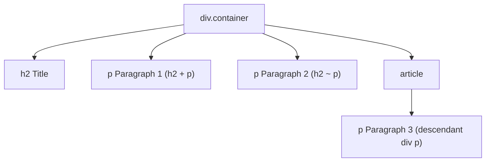

# CSS Combinators

Estimated Reading Time: 12 minutes

Prerequisites: [CSS Selectors](03-css-selectors.md)

Learning Objectives:
- Master the 4 CSS combinators: Descendant (` `), Child (`>`), Adjacent Sibling (`+`), and General Sibling (`~`).
- Target elements precisely based on DOM tree hierarchy relationships.
- Avoid unnecessary class names using structural combinators.

---

## Introduction

CSS combinators explain the relationship between selector elements in the DOM tree hierarchy.

While a simple selector targets elements directly by tag, class, or ID (e.g. `p` or `.card`), a **combinator** combines two simple selectors to target elements based on their ancestor, parent, sibling, or child relationship.

---

## Real-World Analogy

Imagine a family tree.

- **Descendant (`div p`)**: All descendants (children, grandchildren, great-grandchildren) of a family elder.
- **Child (`div > p`)**: Direct biological children only (no grandchildren).
- **Adjacent Sibling (`h2 + p`)**: The immediate younger brother or sister born directly after a specific sibling.
- **General Sibling (`h2 ~ p`)**: All younger siblings born anytime after a specific sibling.

Combinators target elements using DOM family tree relationships.

---

## Core Concepts

### 1. Descendant Selector (`space`)
Matches **all** nested elements inside a parent container, regardless of how deep they are nested.
- **Syntax**: `div p`

### 2. Child Selector (`>`)
Matches **only direct children** located one level down from the parent container.
- **Syntax**: `ul > li`

### 3. Adjacent Sibling Selector (`+`)
Matches an element located **immediately after** a specified target element on the same parent level.
- **Syntax**: `h2 + p` (Targets the first paragraph directly following an H2).

### 4. General Sibling Selector (`~`)
Matches **all sibling elements** located anywhere after a specified target element on the same parent level.
- **Syntax**: `h2 ~ p` (Targets all paragraphs that come after an H2).

---

## Syntax

```css
/* 1. Descendant Selector (space) */
.card p {
    color: #475569;
}

/* 2. Direct Child Selector (>) */
.nav-list > li {
    display: inline-block;
}

/* 3. Adjacent Sibling Selector (+) */
h2 + p {
    font-weight: bold; /* Only paragraph directly after H2 */
}

/* 4. General Sibling Selector (~) */
.active ~ li {
    opacity: 0.5; /* All sibling LIs after .active */
}
```

---

## Property Reference

| Combinator | Symbol | Relationship Targeted | Example |
| :--- | :--- | :--- | :--- |
| Descendant | ` ` (space) | Any nested child/grandchild | `article p` |
| Child | `>` | Direct child only (1 level down) | `ul > li` |
| Adjacent Sibling | `+` | First sibling directly after | `h1 + p` |
| General Sibling | `~` | All siblings anywhere after | `h1 ~ p` |

---

## Visual Explanation



---

## Example 1

### HTML
```html
<!DOCTYPE html>
<html lang="en">
<head>
    <meta charset="UTF-8">
    <title>Combinators Demo</title>
    <style>
        body { font-family: Arial, sans-serif; padding: 20px; }
        
        /* Direct Child */
        .menu > li {
            color: #2563eb;
            font-weight: bold;
        }
        
        /* Adjacent Sibling */
        h3 + p {
            color: #16a34a;
            font-style: italic;
        }
    </style>
</head>
<body>
    <h3>Introductory Heading</h3>
    <p>This paragraph directly follows H3 and turns italic green (h3 + p).</p>
    <p>This second paragraph is a general sibling, not adjacent.</p>

    <ul class="menu">
        <li>Direct Menu Item (Blue)</li>
        <li>
            Direct Menu Item (Blue)
            <ul>
                <li>Nested Sub-item (Not direct child of .menu)</li>
            </ul>
        </li>
    </ul>
</body>
</html>
```

### CSS
```css
.menu > li {
    color: #2563eb;
    font-weight: bold;
}
h3 + p {
    color: #16a34a;
    font-style: italic;
}
```

### Explanation
`.menu > li` styles only direct child `<li>` elements blue, ignoring nested sub-menu items. `h3 + p` targets strictly the first paragraph directly following `<h3>`.

---

## Output Image Prompt

A browser window showing an italic green paragraph directly under a heading. Below, a menu displays blue bold top-level list items, while nested sub-items remain unstyled standard black text.

---

## Code Explanation

- `.menu > li`: Targets top-level menu list items strictly.
- `h3 + p`: Applies green italic styling to the immediate first paragraph after H3.

---

## Best Practices

- **Use Child Selector `>` to Avoid Unintended Styling**: Use `ul > li` rather than `ul li` when styling top-level navigation to prevent polluting nested dropdown menus.
- **Use `h2 + p` for Lead Paragraphs**: Format introductory article lead text cleanly without adding extra HTML classes.

---

## Common Mistakes

### Mistake 1: Confusing Descendant (` `) and Child (`>`)

```css
/* INCORRECT */
.nav li {
    /* Targets ALL LIs, including nested sub-menus, breaking sub-menu layouts! */
}
```

#### Explanation
Descendant selectors target nested grandchildren. Use direct child selector `>` to restrict styling to top-level items.

```css
/* CORRECT */
.nav > li {
    /* Targets ONLY top-level items */
}
```

---

## Browser Compatibility

All 4 CSS combinators (` `, `>`, `+`, `~`) have 100% universal support across all desktop and mobile browsers.

---

## Real-World Applications

- **Lead Paragraph Styling**: `h1 + p.lead` for bold article intro text.
- **Form Error Message Display**: `input:invalid + .error-msg` to reveal error labels.
- **Dropdown Menus**: `.nav > li > ul` targeting top-level submenus.

---

## Mini Project

### Project Objective: Article Lead Paragraph & Menu Styling
Format an article where the first paragraph after `<h1>` is highlighted using `h1 + p`.

---

## Practice Exercises

### Beginner Level
1. Style all paragraphs inside `.card` using descendant space selector (`.card p`).
2. Style direct child list items of `.menu` using `>`.
3. Highlight the paragraph immediately following an `<h2>` using `+`.
4. Style all sibling paragraphs following an `<h2>` using `~`.
5. Remove underline from direct links inside `<nav>`.

### Intermediate Level
6. Explain why `ul > li` is safer than `ul li` for dropdown navbars.
7. Target a form error label using `input + .error`.
8. Style all `<span>` tags nested inside `<div>` containers.
9. Combine class selectors with sibling combinators (`.btn-primary + .btn-secondary`).
10. Target second-level dropdown lists using `.nav > li > ul`.

### Advanced Level
11. Audit specificity score calculations of complex combinator chains.
12. Combine `:checked` pseudo-class with general sibling `~` to build pure CSS accordion toggles.
13. Optimize browser DOM parsing engine selector matching performance.
14. Use `:has()` parent relational selector (`div:has(> h2)`).
15. Solve combinator specificity bugs in legacy theme frameworks.

---

## Quick Quiz

**1. Which symbol represents the Direct Child combinator?**
A) Space (` `)  
B) `>`  
C) `+`  

**2. Which combinator targets an element located IMMEDIATELY after a specified target element on the same level?**
A) Adjacent Sibling (`+`)  
B) General Sibling (`~`)  

**3. What element is targeted by `div p`?**
A) Direct child paragraphs only  
B) ALL paragraphs nested anywhere inside `div`  

**4. What element is targeted by `h2 + p`?**
A) The paragraph directly following H2  
B) All paragraphs on the page  

**5. Which symbol represents the General Sibling combinator?**
A) `+`  
B) `~`  

**6. Why is `.nav > li` preferred over `.nav li` for top-level navigation?**
A) `.nav > li` ignores nested dropdown sub-items  
B) `.nav li` is deprecated  

**7. Does `h2 ~ p` target paragraphs that appear BEFORE `<h2>`?**
A) Yes  
B) No (only siblings that appear AFTER `<h2>`)  

**8. How many levels down does direct child `>` target?**
A) Exactly 1 level down  
B) All levels  

**9. What combinator is used in `input:focus + label`?**
A) Adjacent Sibling (`+`)  
B) Child (`>`)  

**10. What modern CSS selector acts as a parent combinator?**
A) `:has()`  
B) `:is()`  

---

### Answers
1: B | 2: A | 3: B | 4: A | 5: B | 6: A | 7: B | 8: A | 9: A | 10: A

---

## Interview Questions

**1. Name and explain the 4 CSS combinators.**  
*Answer:* 
- **Descendant (` space `)**: All nested descendants anywhere inside parent.
- **Child (`>`)**: Direct children only (1 level down).
- **Adjacent Sibling (`+`)**: Immediate first sibling directly after target.
- **General Sibling (`~`)**: All siblings appearing anywhere after target.

**2. What is the difference between `+` (Adjacent Sibling) and `~` (General Sibling)?**  
*Answer:* `+` targets strictly the first single sibling element occurring directly after the selector. `~` targets all matching sibling elements occurring anywhere after the selector on the same DOM parent level.

**3. What is the modern CSS `:has()` pseudo-class?**  
*Answer:* `:has()` is a relational selector that functions as a parent combinator, allowing developers to style a parent element based on its children or sibling conditions (e.g. `card:has(img)`).

---

## Summary

- **Descendant (` `)**: Targets all nested children/grandchildren.
- **Child (`>`)**: Targets direct children (1 level down).
- **Adjacent Sibling (`+`)**: Targets immediate next sibling.
- **General Sibling (`~`)**: Targets all siblings after.

---

## Cheat Sheet

```css
/* COMBINATORS CHEAT SHEET */
div p     /* All nested paragraphs */
ul > li   /* Direct child LIs only */
h2 + p    /* Immediate next paragraph */
h2 ~ p    /* All paragraphs after H2 */
```

---

## Related Topics

- **Previous Topic**: [CSS Background Properties](20-css-background-properties.md)
- **Next Topic**: [CSS Pseudo Classes](22-css-pseudo-classes.md)
- **Recommended Learning Order**: Introduction to CSS -> Ways to Add CSS -> CSS Selectors -> CSS Colors -> CSS Fonts -> CSS Borders -> Border Radius -> CSS Shadows -> CSS Margins -> CSS Padding -> CSS Width -> CSS Height -> CSS Box Model -> CSS Float -> CSS Overflow -> CSS Display -> CSS Position -> CSS Background Images -> CSS Background Properties -> CSS Combinators -> CSS Pseudo Classes
