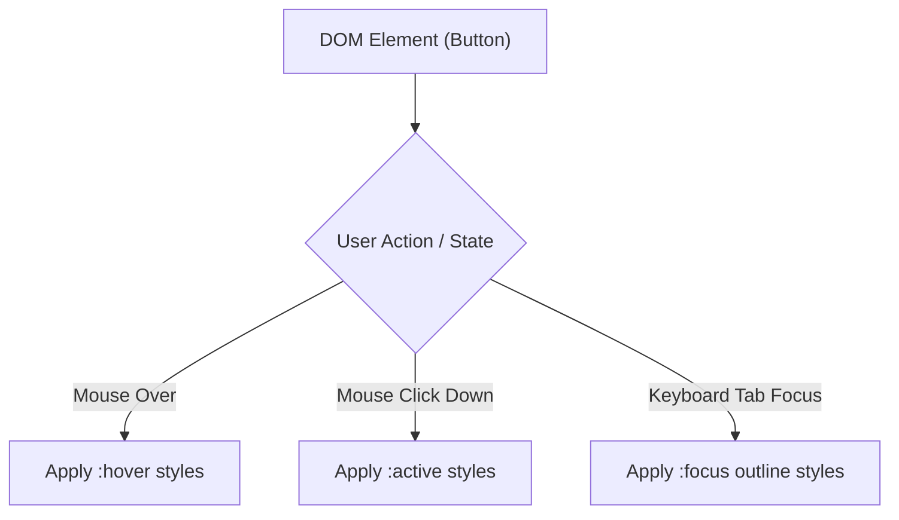

# CSS Pseudo Classes

Estimated Reading Time: 15 minutes

Prerequisites: [CSS Selectors](03-css-selectors.md), [CSS Combinators](21-css-combinators.md)

Learning Objectives:
- Master pseudo-classes used to select elements based on state (`:hover`, `:active`, `:focus`).
- Master structural pseudo-classes (`:first-child`, `:last-child`, `:nth-child()`).
- Master form state pseudo-classes (`:checked`, `:disabled`, `:invalid`).
- Build interactive UI components without JavaScript.

---

## Introduction

A **pseudo-class** is a keyword added to a CSS selector (prefixed with a single colon `:`) that selects elements based on their dynamic state, user interaction, or DOM tree position.

While standard selectors target elements by tag or class name, pseudo-classes allow you to style elements dynamically when a user hovers over a button (`:hover`), clicks a link (`:active`), focuses a text input (`:focus`), or targets alternate zebra-striped table rows (`:nth-child(even)`).

---

## Real-World Analogy

Imagine door lock indicators in an office building.

- **Standard Selector (`button`)**: The office door itself.
- **`:hover`**: A motion sensor light turning blue when someone hovers their hand over the door handle.
- **`:active`**: The door latch physically depressing as you push the handle down.
- **`:focus`**: An active green keycard reader light indicating the door has user focus.
- **`:nth-child(even)`**: Selecting every even-numbered office room door along a hallway for painting.

Pseudo-classes react dynamically to user interaction and structural placement.

---

## Core Concepts

### 1. User Interaction Pseudo-Classes
- `:hover`: Triggers when mouse hovers over an element.
- `:active`: Triggers while an element is actively clicked/pressed.
- `:focus`: Triggers when an element receives keyboard/mouse focus (e.g. text inputs).
- `:visited`: Triggers on links previously visited by the user.

### 2. Structural Pseudo-Classes
- `:first-child`: Selects first child inside parent.
- `:last-child`: Selects last child inside parent.
- `:nth-child(n)`: Selects child by formula (`even`, `odd`, `3n+1`, `2`).
- `:not(selector)`: Negates styling for elements matching specified selector.

### 3. Form Input State Pseudo-Classes
- `:checked`: Radio buttons or checkboxes currently checked.
- `:disabled`: Form elements disabled via `disabled` attribute.
- `:invalid`: Form inputs failing validation checks.

---

## Syntax

```css
/* Interaction States */
.button {
    background-color: #2563eb;
    transition: background-color 0.2s;
}
.button:hover {
    background-color: #1d4ed8; /* Darker blue on hover */
}
.button:active {
    transform: scale(0.98);    /* Click press effect */
}

/* Form Focus State */
.input-text:focus {
    outline: 2px solid #2563eb;
    border-color: #2563eb;
}

/* Structural Zebra Striping */
.table-row:nth-child(even) {
    background-color: #f8fafc;
}

/* Negation Selector */
.card:not(.featured) {
    opacity: 0.8;
}
```

---

## Property Reference

| Pseudo-Class | Trigger State / Selector Purpose | Example |
| :--- | :--- | :--- |
| `:hover` | Mouse hovers over element | `button:hover` |
| `:focus` | Element receives keyboard focus | `input:focus` |
| `:active` | Element actively pressed during click | `button:active` |
| `:nth-child(even)` | Selects even structural child rows | `tr:nth-child(even)` |
| `:first-child` | Selects first child inside parent container | `p:first-child` |
| `:last-child` | Selects last child inside parent container | `li:last-child` |
| `:not()` | Negates matching elements | `li:not(.active)` |
| `:checked` | Selected radio / checkbox inputs | `input:checked` |

---

## Visual Explanation



---

## Example 1

### HTML
```html
<!DOCTYPE html>
<html lang="en">
<head>
    <meta charset="UTF-8">
    <title>Interactive Hover & Focus Button</title>
    <style>
        body { font-family: Arial, sans-serif; padding: 20px; }
        .btn-action {
            background-color: #2563eb;
            color: #ffffff;
            padding: 12px 24px;
            border: 2px solid transparent;
            border-radius: 6px;
            font-size: 16px;
            cursor: pointer;
            transition: all 0.2s ease;
        }
        .btn-action:hover {
            background-color: #1d4ed8;
        }
        .btn-action:focus {
            outline: none;
            border-color: #93c5fd;
            box-shadow: 0 0 0 4px rgba(37, 99, 235, 0.3);
        }
        .btn-action:active {
            transform: scale(0.96);
        }
    </style>
</head>
<body>
    <button class="btn-action">Interactive Button</button>
</body>
</html>
```

### CSS
```css
.btn-action:hover {
    background-color: #1d4ed8;
}
.btn-action:focus {
    box-shadow: 0 0 0 4px rgba(37, 99, 235, 0.3);
}
.btn-action:active {
    transform: scale(0.96);
}
```

### Explanation
This button uses `:hover` to darken background color, `:focus` to show an accessibility focus ring, and `:active` to shrink slightly on click.

---

## Output Image Prompt

A browser window displaying a dark blue button (`#1d4ed8`) surrounded by a glowing translucent light blue focus ring halo (`rgba(37, 99, 235, 0.3)`).

---

## Code Explanation

- `:hover`: Darkens button fill on mouseover.
- `:focus`: Displays blue halo ring for keyboard navigation accessibility.
- `:active`: Provides visual tactile click feedback.

---

## Example 2

### HTML
```html
<!DOCTYPE html>
<html lang="en">
<head>
    <meta charset="UTF-8">
    <title>Zebra Striped Table</title>
    <style>
        table { width: 100%; border-collapse: collapse; font-family: Arial, sans-serif; }
        th, td { padding: 12px; border: 1px solid #cbd5e1; text-align: left; }
        th { background-color: #0f172a; color: white; }
        
        /* Zebra Striping */
        tr:nth-child(even) { background-color: #f1f5f9; }
        tr:hover { background-color: #e2e8f0; }
    </style>
</head>
<body>
    <table>
        <tr><th>User</th><th>Role</th></tr>
        <tr><td>Alice</td><td>Admin</td></tr>
        <tr><td>Bob</td><td>Developer</td></tr>
        <tr><td>Charlie</td><td>Designer</td></tr>
    </table>
</body>
</html>
```

### CSS
```css
tr:nth-child(even) {
    background-color: #f1f5f9;
}
tr:hover {
    background-color: #e2e8f0;
}
```

### Explanation
`tr:nth-child(even)` styles alternate table rows light gray. `tr:hover` highlights the row under the mouse cursor.

---

## Output Image Prompt

A browser window showing a clean data table with a dark header. Alternate data rows alternate between white and light gray background colors, with the hovered row highlighted in soft blue-gray.

---

## Code Explanation

- `tr:nth-child(even)`: Applies zebra-stripe row backgrounds automatically.
- `tr:hover`: Highlights rows on mouseover.

---

## Best Practices

- **Never Remove Focus Outlines Without Replacement**: If you disable default browser outlines with `outline: none`, always provide a custom `:focus` indicator for keyboard accessibility.
- **Maintain LVHA Link State Order**: Specify link pseudo-classes in correct order: `:link`, `:visited`, `:hover`, `:active` (LoVe HAte).

---

## Common Mistakes

### Mistake 1: Incorrect Pseudo-Class Syntax (Double Colon)

```css
/* INCORRECT */
button::hover { /* Double colon is for pseudo-ELEMENTS, not pseudo-classes! */
    color: red;
}
```

#### Explanation
Pseudo-classes use a single colon (`:hover`). Double colons (`::before`) are reserved for pseudo-elements.

```css
/* CORRECT */
button:hover {
    color: red;
}
```

---

## Browser Compatibility

Standard CSS pseudo-classes (`:hover`, `:focus`, `:active`, `:first-child`, `:last-child`, `:nth-child()`, `:not()`, `:checked`) have 100% universal support across all desktop and mobile browsers.

---

## Real-World Applications

- **Interactive UI Buttons**: `:hover` and `:active` button transitions.
- **Form Input Focus Rings**: `:focus` outline highlights on input boxes.
- **Zebra Striped Data Tables**: `tr:nth-child(even)` row styling.
- **Pure CSS Accordions & Toggles**: `input:checked` UI state toggles.

---

## Mini Project

### Project Objective: Interactive Data Table & Form Input
Build a zebra-striped table with row hover highlights and focused form inputs.

---

## Practice Exercises

### Beginner Level
1. Change button background color on `:hover`.
2. Add a border highlight to an input on `:focus`.
3. Style the first paragraph inside a div using `:first-child`.
4. Style the last list item using `:last-child`.
5. Remove underline from visited links using `:visited`.

### Intermediate Level
6. Style alternate table rows using `:nth-child(even)`.
7. Style every 3rd list item using `:nth-child(3n)`.
8. Style checked checkboxes using `input:checked`.
9. Exclude featured cards using `:not(.featured)`.
10. Style disabled form buttons using `:disabled`.

### Advanced Level
11. Build a pure CSS modal toggle using `:target`.
12. Use `:focus-within` to style parent card containers when child inputs gain focus.
13. Combine `:nth-of-type()` and `:not()` for complex dynamic list layouts.
14. Optimize hover state performance on mobile touch screens using `@media (hover: hover)`.
15. Use modern `:is()` and `:where()` pseudo-class functions to simplify selector specificity chains.

---

## Quick Quiz

**1. How many colons prefix a CSS pseudo-class?**
A) One (`:hover`)  
B) Two (`::hover`)  

**2. Which pseudo-class triggers when a user presses a mouse button down on an element?**
A) `:hover`  
B) `:active`  
C) `:focus`  

**3. Which structural pseudo-class selects even-numbered rows?**
A) `:first-child`  
B) `:nth-child(even)`  

**4. Why is removing `:focus` outlines without replacing them bad practice?**
A) It breaks CSS loading  
B) It destroys keyboard navigation accessibility for visually impaired users  

**5. What is the correct order of link pseudo-classes?**
A) `:hover`, `:link`, `:visited`, `:active`  
B) `:link`, `:visited`, `:hover`, `:active` (LVHA)  

**6. Which pseudo-class targets selected radio button inputs?**
A) `:checked`  
B) `:selected`  

**7. What does `:not(.active)` do?**
A) Selects elements that DO NOT have class `.active`  
B) Hides `.active` elements  

**8. Which pseudo-class triggers when an element receives keyboard focus?**
A) `:focus`  
B) `:target`  

**9. What pseudo-class styles parent containers when any child receives focus?**
A) `:focus-within`  
B) `:parent-focus`  

**10. What modern pseudo-class reduces selector specificity to zero?**
A) `:where()`  
B) `:is()`  

---

### Answers
1: A | 2: B | 3: B | 4: B | 5: B | 6: A | 7: A | 8: A | 9: A | 10: A

---

## Interview Questions

**1. What is a CSS pseudo-class and how does it differ from a pseudo-element?**  
*Answer:* A pseudo-class (`:hover`, `:focus`) selects an existing DOM element based on its state, interaction, or position using a single colon. A pseudo-element (`::before`, `::after`) creates virtual sub-elements inside the DOM using double colons.

**2. Explain `:nth-child()` vs `:nth-of-type()`.**  
*Answer:* `:nth-child(n)` counts all sibling elements regardless of tag type. `:nth-of-type(n)` counts only sibling elements matching the specific HTML tag type.

**3. What are `:is()` and `:where()` pseudo-class functions?**  
*Answer:* Both reduce code repetition by grouping multiple selectors into a single argument list (e.g. `:is(h1, h2, h3)`). `:is()` adopts the highest specificity of its argument list, whereas `:where()` sets specificity to zero.

---

## Summary

- Use **`:hover`**, **`:focus`**, and **`:active`** for interactive states.
- Use **`:nth-child(even)`** for zebra-striped lists and tables.
- Always maintain accessible **`:focus`** indicators.

---

## Cheat Sheet

```css
/* INTERACTION STATES */
.btn:hover  { background: #1d4ed8; }
.btn:focus  { outline: 2px solid #2563eb; }
.btn:active { transform: scale(0.96); }

/* STRUCTURAL & FORM STATES */
tr:nth-child(even) { background: #f8fafc; }
input:checked + label { font-weight: bold; }
```

---

## Related Topics

- **Previous Topic**: [CSS Combinators](21-css-combinators.md)
- **Next Topic**: [CSS Pseudo Elements](23-css-pseudo-elements.md)
- **Recommended Learning Order**: Introduction to CSS -> Ways to Add CSS -> CSS Selectors -> CSS Colors -> CSS Fonts -> CSS Borders -> Border Radius -> CSS Shadows -> CSS Margins -> CSS Padding -> CSS Width -> CSS Height -> CSS Box Model -> CSS Float -> CSS Overflow -> CSS Display -> CSS Position -> CSS Background Images -> CSS Background Properties -> CSS Combinators -> CSS Pseudo Classes -> CSS Pseudo Elements
