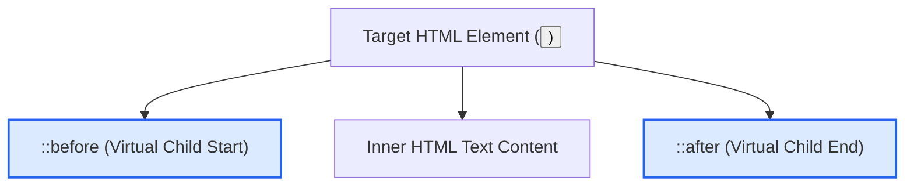

# CSS Pseudo Elements

Estimated Reading Time: 12 minutes

Prerequisites: [CSS Pseudo Classes](22-css-pseudo-classes.md)

Learning Objectives:
- Master `::before` and `::after` pseudo-elements.
- Understand the mandatory `content: ""` property requirement.
- Use `::first-letter`, `::first-line`, and `::selection`.
- Create decorative UI accents without cluttering HTML markup.

---

## Introduction

A **pseudo-element** is a keyword added to a CSS selector (prefixed with double colons `::`) that creates virtual sub-elements inside a target HTML element without adding extra HTML tags to the DOM.

While pseudo-classes (`:hover`) select existing elements based on state, pseudo-elements (`::before`, `::after`) inject decorative content, icons, quote marks, custom list bullets, or overlay banners purely through CSS.

---

## Real-World Analogy

Imagine a hardcover book.

- **HTML Element (`<article>`)**: The printed page of the book containing story text.
- **`::before`**: A decorative drop-cap monogram letter printed at the start of the first chapter.
- **`::after`**: A decorative flourish icon printed at the end of the chapter.
- **`::selection`**: Using a yellow highlighter marker over lines of text as you read.

Pseudo-elements insert visual flourishes without modifying the underlying book manuscript (HTML DOM).

---

## Core Concepts

### 1. `::before` and `::after`
Injects virtual inline element content directly before or after an element's inner content.
- **Mandatory Property**: MUST include `content: ""` (even if an empty string) for the pseudo-element to render on screen!

### 2. Typographic Pseudo-Elements
- `::first-letter`: Styles the first character of a block text (e.g. drop caps).
- `::first-line`: Styles the first rendered line of a paragraph.
- `::selection`: Styles text text highlighted by the user's cursor.

---

## Syntax

```css
/* Decorative Icon Accent Before Heading */
h2::before {
    content: "★ ";
    color: #f59e0b;
}

/* Custom Underline Line After Card Title */
.card-title::after {
    content: "";
    display: block;
    width: 40px;
    height: 3px;
    background-color: #2563eb;
    margin-top: 8px;
}

/* Custom Text Highlight Selection */
::selection {
    background-color: #2563eb;
    color: #ffffff;
}
```

---

## Property Reference

| Pseudo-Element | Purpose / Injected Location | Key Requirement |
| :--- | :--- | :--- |
| `::before` | Injects virtual child BEFORE inner content | Requires `content: ""` |
| `::after` | Injects virtual child AFTER inner content | Requires `content: ""` |
| `::first-letter` | Styles first character of text block | Applied to block elements |
| `::first-line` | Styles first line of text block | Applied to block elements |
| `::selection` | Styles user-highlighted text | Works globally or on elements |

---

## Visual Explanation



---

## Example 1

### HTML
```html
<!DOCTYPE html>
<html lang="en">
<head>
    <meta charset="UTF-8">
    <title>::after Accent Underline</title>
    <style>
        body { font-family: Arial, sans-serif; padding: 20px; }
        .section-title {
            color: #0f172a;
            font-size: 24px;
        }
        .section-title::after {
            content: "";
            display: block;
            width: 50px;
            height: 4px;
            background-color: #2563eb;
            border-radius: 2px;
            margin-top: 6px;
        }
    </style>
</head>
<body>
    <h2 class="section-title">Featured Articles</h2>
</body>
</html>
```

### CSS
```css
.section-title::after {
    content: "";
    display: block;
    width: 50px;
    height: 4px;
    background-color: #2563eb;
    border-radius: 2px;
    margin-top: 6px;
}
```

### Explanation
`::after` injects a 50px wide, 4px tall blue accent line directly beneath `.section-title` without requiring extra `<div>` markup.

---

## Output Image Prompt

A browser window showing a dark title heading "Featured Articles" with a short 50px wide solid blue accent underline bar resting beneath its first word.

---

## Code Explanation

- `content: "";`: Mandatory property creating the virtual DOM node.
- `display: block; width: 50px; height: 4px;`: Formats the pseudo-element into a rectangular accent line.

---

## Example 2

### HTML
```html
<!DOCTYPE html>
<html lang="en">
<head>
    <meta charset="UTF-8">
    <title>Custom Selection Color</title>
    <style>
        body { font-family: Arial, sans-serif; padding: 20px; }
        ::selection {
            background-color: #16a34a;
            color: #ffffff;
        }
    </style>
</head>
<body>
    <p>Highlight any text in this paragraph with your mouse cursor to see custom green selection highlights.</p>
</body>
</html>
```

### CSS
```css
::selection {
    background-color: #16a34a;
    color: #ffffff;
}
```

### Explanation
`::selection` overrides default browser text selection color with vibrant green fill and white text.

---

## Output Image Prompt

A browser window showing paragraph text where highlighted words appear highlighted in vivid green background fill with white text.

---

## Code Explanation

- `::selection`: Customizes text cursor selection color globally.

---

## Best Practices

- **Always Include `content: ""`**: `::before` and `::after` will **not** render unless `content` is declared.
- **Use Pseudo-Elements for Decorative Accents**: Use `::before` and `::after` for decorative underlines, icons, and overlays rather than adding empty `<span>` tags to HTML.

---

## Common Mistakes

### Mistake 1: Omitting `content: ""`

```css
/* INCORRECT */
.title::after {
    width: 50px;
    height: 4px;
    background: blue;
    /* Missing content: ""! Pseudo-element will NOT render on screen */
}
```

#### Explanation
Without `content: ""`, browsers ignore pseudo-elements completely.

```css
/* CORRECT */
.title::after {
    content: "";
    display: block;
    width: 50px;
    height: 4px;
    background: blue;
}
```

---

## Browser Compatibility

Standard pseudo-elements (`::before`, `::after`, `::first-letter`, `::first-line`, `::selection`) have 100% universal support across all desktop and mobile browsers.

---

## Real-World Applications

- **Decorative Section Title Underlines**: `::after` accent bars under headings.
- **Custom Tooltip Arrows**: `::after` triangles pointing to button popups.
- **Custom Bullet List Markers**: `::before` custom icon bullets.
- **Brand Selection Highlight**: `::selection` custom brand colors.

---

## Mini Project

### Project Objective: Card Accent & Custom Selection
Build a card component with a `::before` star icon, an `::after` underline, and a custom `::selection` highlight color.

---

## Practice Exercises

### Beginner Level
1. Add a star icon before an `<h2>` heading using `h2::before { content: "★ "; }`.
2. Add an accent underline under a title using `::after`.
3. Create a custom drop-cap letter using `p::first-letter`.
4. Style the first line of an article using `p::first-line`.
5. Customize text selection colors using `::selection`.

### Intermediate Level
6. Explain why `content: ""` is required for `::before` to render.
7. Build custom radio button dots using `input:checked + label::before`.
8. Create a CSS triangle tooltip arrow using `::after` borders.
9. Format blockquote quotation marks using `blockquote::before { content: "“"; }`.
10. Combine `position: absolute` with `::after` inside a `position: relative` card.

### Advanced Level
11. Build a pure CSS animated shimmer button using `::before` and `transform: translateX()`.
12. Audit screen reader accessibility when using `::before` for icon text.
13. Create custom scrollbar thumb tracks using `::-webkit-scrollbar-thumb`.
14. Use `attr()` inside `content: attr(data-tooltip)` to display dynamic HTML attributes in tooltips.
15. Solve stacking order conflicts involving pseudo-element `z-index` layers.

---

## Quick Quiz

**1. How many colons prefix a modern CSS pseudo-element?**
A) One (`:before`)  
B) Two (`::before`)  

**2. Which property is MANDATORY for `::before` and `::after` to render on screen?**
A) `display: block`  
B) `content: ""`  
C) `background-color`  

**3. What does `::first-letter` target?**
A) The first paragraph on page  
B) The first character of a text block  

**4. Where does `::before` inject content?**
A) Before the target element's inner content  
B) Outside the parent tag  

**5. What property styles text highlighted by mouse cursor drag?**
A) `::highlight`  
B) `::selection`  

**6. What function displays HTML dataset attributes inside pseudo-elements?**
A) `attr(data-name)`  
B) `url()`  

**7. Are pseudo-elements indexed as separate DOM nodes by JavaScript `querySelector`?**
A) No (they exist only in rendered CSS tree)  
B) Yes  

**8. Can `::before` take `position: absolute`?**
A) Yes  
B) No  

**9. What happens if `content: ""` is omitted from `::after`?**
A) It defaults to empty box  
B) It fails to render completely  

**10. What pseudo-element formats custom input placeholder text?**
A) `::placeholder`  
B) `::input-text`  

---

### Answers
1: B | 2: B | 3: B | 4: A | 5: B | 6: A | 7: A | 8: A | 9: B | 10: A

---

## Interview Questions

**1. Compare CSS Pseudo-Classes vs Pseudo-Elements.**  
*Answer:* Pseudo-classes (`:hover`, `:focus`) select existing DOM elements based on dynamic state or DOM position using a single colon. Pseudo-elements (`::before`, `::after`) insert virtual sub-elements into the rendering tree using double colons.

**2. Why is `content: ""` mandatory for `::before` and `::after`?**  
*Answer:* The browser layout engine uses the `content` property as the structural trigger to generate the pseudo-element box in the render tree. Without `content`, the pseudo-element box is not constructed.

**3. How do screen readers process content injected via `::before` and `::after`?**  
*Answer:* Modern screen readers speak CSS `content` text. Non-semantic decorative icons inserted via pseudo-elements should use `aria-hidden="true"` or empty strings to prevent accessibility clutter.

---

## Summary

- Use **`::before`** and **`::after`** for decorative UI accents.
- Always include **`content: ""`**.
- Use **`::selection`** for custom text highlight colors.

---

## Cheat Sheet

```css
/* DECORATIVE ACCENT LINE */
.title::after {
    content: "";
    display: block;
    width: 40px;
    height: 3px;
    background: #2563eb;
}

/* CUSTOM SELECTION */
::selection {
    background: #2563eb;
    color: #ffffff;
}
```

---

## Related Topics

- **Previous Topic**: [CSS Pseudo Classes](22-css-pseudo-classes.md)
- **Next Topic**: [CSS Pagination](24-css-pagination.md)
- **Recommended Learning Order**: Introduction to CSS -> Ways to Add CSS -> CSS Selectors -> CSS Colors -> CSS Fonts -> CSS Borders -> Border Radius -> CSS Shadows -> CSS Margins -> CSS Padding -> CSS Width -> CSS Height -> CSS Box Model -> CSS Float -> CSS Overflow -> CSS Display -> CSS Position -> CSS Background Images -> CSS Background Properties -> CSS Combinators -> CSS Pseudo Classes -> CSS Pseudo Elements -> CSS Pagination
