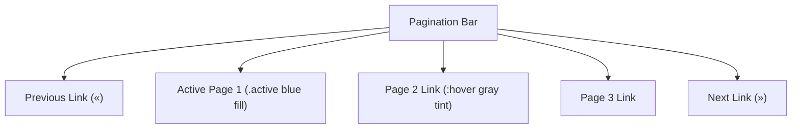

# CSS Pagination

Estimated Reading Time: 12 minutes

Prerequisites: [CSS Display](17-css-display.md), [CSS Pseudo Classes](22-css-pseudo-classes.md)

Learning Objectives:
- Build accessible, responsive pagination navigation UI bars.
- Style active, hover, and disabled page link states cleanly.
- Format pill-shaped and circular pagination page buttons.

---

## Introduction

**Pagination** is a navigation UI pattern that splits large datasets (such as search results, blog articles, or product catalogs) across multiple sequential web pages.

CSS pagination transforms standard HTML links (`<a>`) or list items (`<li>`) into horizontal rows of numbered page buttons, complete with active indicators, hover feedback, and disabled state styling.

---

## Real-World Analogy

Imagine reading a multi-chapter textbook.

- **Unstyled Links**: Scattered page numbers written on scrap paper.
- **CSS Pagination Bar**: A neat plastic tab index row along the bottom margin of the book. The current chapter page tab is highlighted in dark blue (`.active`), neighboring page numbers are clear white tabs with hover highlights, and the "Previous" tab on Chapter 1 is greyed out (`.disabled`).

Pagination provides structured page navigation across multi-page content feeds.

---

## Core Concepts

### 1. Structure
Pagination is structured using an HTML `<nav>` element containing a list of links:
```html
<nav class="pagination">
    <a href="#" class="page-link">&laquo;</a>
    <a href="#" class="page-link active">1</a>
    <a href="#" class="page-link">2</a>
    <a href="#" class="page-link">3</a>
    <a href="#" class="page-link">&raquo;</a>
</nav>
```

### 2. Key CSS States
- **Base State (`.page-link`)**: Inline-block boxes with border padding.
- **Active State (`.page-link.active`)**: Primary background fill indicating current page.
- **Hover State (`.page-link:hover`)**: Subtle background color feedback.
- **Disabled State (`.page-link.disabled`)**: Reduced opacity (`opacity: 0.5; pointer-events: none;`).

---

## Syntax

```css
.pagination {
    display: flex;
    gap: 6px;
    align-items: center;
}
.page-link {
    display: inline-flex;
    align-items: center;
    justify-content: center;
    min-width: 36px;
    height: 36px;
    padding: 0 12px;
    border: 1px solid #cbd5e1;
    border-radius: 6px;
    color: #0f172a;
    text-decoration: none;
    transition: all 0.2s;
}
.page-link:hover:not(.active) {
    background-color: #f1f5f9;
}
.page-link.active {
    background-color: #2563eb;
    color: #ffffff;
    border-color: #2563eb;
}
```

---

## Property Reference

| Pagination Element State | CSS Styling Features | Example |
| :--- | :--- | :--- |
| `.page-link` (Base) | `inline-flex`, border, padding, cursor | `display: inline-flex; min-width: 36px;` |
| `.active` (Current Page) | Primary fill color, white text, matching border | `background-color: #2563eb; color: #fff;` |
| `:hover` (Interactive) | Soft gray background tint | `background-color: #f1f5f9;` |
| `.disabled` (Inactive) | Faded opacity, pointer events disabled | `opacity: 0.5; pointer-events: none;` |

---

## Visual Explanation



---

## Example 1

### HTML
```html
<!DOCTYPE html>
<html lang="en">
<head>
    <meta charset="UTF-8">
    <title>CSS Pagination Bar</title>
    <style>
        body { font-family: Arial, sans-serif; padding: 30px; background-color: #f8fafc; }
        .pagination { display: flex; gap: 6px; }
        .page-link {
            display: inline-flex;
            align-items: center;
            justify-content: center;
            min-width: 36px;
            height: 36px;
            padding: 0 10px;
            border: 1px solid #cbd5e1;
            border-radius: 6px;
            background-color: #ffffff;
            color: #0f172a;
            text-decoration: none;
            font-size: 14px;
        }
        .page-link:hover:not(.active) { background-color: #e2e8f0; }
        .page-link.active {
            background-color: #2563eb;
            color: #ffffff;
            border-color: #2563eb;
            font-weight: bold;
        }
        .page-link.disabled {
            opacity: 0.5;
            cursor: not-allowed;
        }
    </style>
</head>
<body>
    <nav class="pagination">
        <a href="#" class="page-link disabled">&laquo; Prev</a>
        <a href="#" class="page-link active">1</a>
        <a href="#" class="page-link">2</a>
        <a href="#" class="page-link">3</a>
        <a href="#" class="page-link">Next &raquo;</a>
    </nav>
</body>
</html>
```

### CSS
```css
.pagination { display: flex; gap: 6px; }
.page-link.active {
    background-color: #2563eb;
    color: #ffffff;
}
```

### Explanation
This component styles a clean pagination bar. Page 1 is styled as `.active` with a vibrant blue background (`#2563eb`). The "Prev" button is faded as `.disabled`.

---

## Output Image Prompt

A browser window showing a horizontal pagination navigation row. "Prev" appears faded gray. Page "1" displays in a vibrant solid blue rounded button box. Pages "2", "3", and "Next" display as white rounded button boxes with dark text.

---

## Code Explanation

- `display: flex; gap: 6px;`: Aligns pagination buttons in a horizontal row with 6px spacing.
- `.page-link.active`: Highlights the current active page with blue fill.

---

## Best Practices

- **Use Accessible `<nav>` Wrap**: Wrap pagination links inside `<nav aria-label="Page navigation">` for screen readers.
- **Use `pointer-events: none` on Disabled Links**: Disable clicks on inactive "Prev/Next" buttons.

---

## Common Mistakes

### Mistake 1: Hardcoding Fixed Text Widths

```css
/* INCORRECT */
.page-link {
    width: 30px; /* Text like "Next »" will overflow! */
}
```

#### Explanation
Fixed `width` clips text on word links like "Previous" or "Next". Use `min-width` and horizontal padding instead.

```css
/* CORRECT */
.page-link {
    min-width: 36px;
    padding: 0 12px;
}
```

---

## Browser Compatibility

CSS pagination components rely on Flexbox and standard border/color properties, enjoying 100% universal browser support.

---

## Real-World Applications

- **E-Commerce Product Catalogs**: Navigating product result pages.
- **Search Engine Result Pages (SERPs)**: Page navigation bars.
- **Blog Article Feeds**: Page number navigation.

---

## Mini Project

### Project Objective: Rounded Circular Pagination Bar
Build a pagination bar with circular page number buttons (`border-radius: 50%`).

---

## Practice Exercises

### Beginner Level
1. Create a 4-button pagination row using Flexbox.
2. Highlight the active page link using a blue background fill.
3. Add a gray hover effect to inactive page links.
4. Style disabled "Prev" links with `opacity: 0.5`.
5. Remove underline from pagination link text.

### Intermediate Level
6. Turn square pagination buttons into circular buttons (`border-radius: 50%`).
7. Add `aria-current="page"` to the active pagination link.
8. Create a pill-shaped pagination container wrapping all links.
9. Format "Prev" and "Next" text buttons with arrow icons (`&laquo;`, `&raquo;`).
10. Combine focus rings (`:focus`) for keyboard navigation.

### Advanced Level
11. Build a responsive pagination component that collapses page numbers on mobile screens.
12. Animate page link hover transitions using CSS `transform: translateY(-2px)`.
13. Implement dark mode pagination styling using CSS variables.
14. Audit screen reader announcement behavior during dynamic page transitions.
15. Style ellipsis (`...`) pagination indicator items.

---

## Quick Quiz

**1. What HTML element should wrap a pagination component for accessibility?**
A) `<header>`  
B) `<nav>`  
C) `<aside>`  

**2. Which property prevents click events on disabled pagination links?**
A) `pointer-events: none`  
B) `display: none`  

**3. Why is `min-width` preferred over fixed `width` on pagination links?**
A) `min-width` prevents text like "Previous" from overflowing  
B) `width` is invalid in CSS  

**4. What class indicates the current active page?**
A) `.active`  
B) `.current-page`  

**5. What HTML entity represents the left double angle quote (`«`)?**
A) `&laquo;`  
B) `&raquo;`  

**6. What property aligns pagination link items horizontally with equal gaps?**
A) `display: flex; gap: 6px;`  
B) `display: block`  

**7. How do you create circular pagination buttons?**
A) `border-radius: 50%; min-width: 36px; height: 36px;`  
B) `border-radius: 0`  

**8. What ARIA attribute marks the active page for screen readers?**
A) `aria-current="page"`  
B) `aria-active="true"`  

**9. What pseudoclass prevents `:hover` styling from overriding the active page color?**
A) `:not(.active)`  
B) `:hover-only`  

**10. What property fades disabled navigation buttons?**
A) `opacity: 0.5`  
B) `color: transparent`  

---

### Answers
1: B | 2: A | 3: A | 4: A | 5: A | 6: A | 7: A | 8: A | 9: A | 10: A

---

## Interview Questions

**1. What is pagination in web development?**  
*Answer:* Pagination is a navigation design pattern that divides long content feeds across multiple ordered pages, providing UI controls to jump between page numbers.

**2. How do you ensure a CSS pagination bar is accessible to screen readers?**  
*Answer:* Wrap pagination links inside `<nav aria-label="Pagination Navigation">`, assign `aria-current="page"` to the active page link, and add `aria-disabled="true"` to disabled navigation buttons.

**3. How do you build a responsive pagination bar for mobile screens?**  
*Answer:* Use media queries to hide intermediate page numbers on mobile screens (`display: none`), displaying only "Previous", "Next", and the active page indicator.

---

## Summary

- Wrap pagination in **`<nav>`**.
- Highlight active page with **`.active`**.
- Disable inactive links using **`pointer-events: none`**.

---

## Cheat Sheet

```css
/* PAGINATION CONTAINER */
.pagination { display: flex; gap: 6px; }

/* BASE LINK */
.page-link {
    display: inline-flex;
    align-items: center;
    justify-content: center;
    min-width: 36px;
    height: 36px;
    padding: 0 12px;
    border: 1px solid #cbd5e1;
    border-radius: 6px;
    text-decoration: none;
}

/* ACTIVE STATE */
.page-link.active {
    background-color: #2563eb;
    color: #ffffff;
}
```

---

## Related Topics

- **Previous Topic**: [CSS Pseudo Elements](23-css-pseudo-elements.md)
- **Next Topic**: [CSS Dropdown Menu](25-css-dropdown-menu.md)
- **Recommended Learning Order**: Introduction to CSS -> Ways to Add CSS -> CSS Selectors -> CSS Colors -> CSS Fonts -> CSS Borders -> Border Radius -> CSS Shadows -> CSS Margins -> CSS Padding -> CSS Width -> CSS Height -> CSS Box Model -> CSS Float -> CSS Overflow -> CSS Display -> CSS Position -> CSS Background Images -> CSS Background Properties -> CSS Combinators -> CSS Pseudo Classes -> CSS Pseudo Elements -> CSS Pagination -> CSS Dropdown Menu
