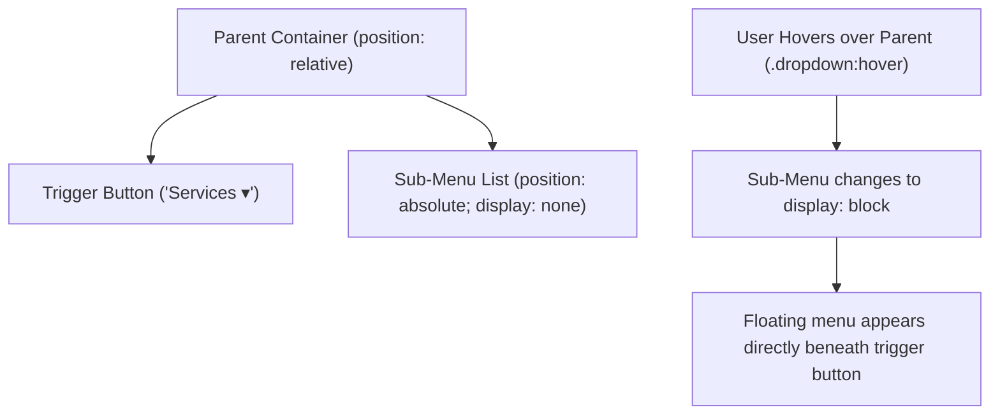

# CSS Dropdown Menu

Estimated Reading Time: 15 minutes

Prerequisites: [CSS Display](17-css-display.md), [CSS Position](18-css-position.md), [CSS Pseudo Classes](22-css-pseudo-classes.md)

Learning Objectives:
- Build pure CSS hover dropdown menus without JavaScript.
- Master positioning anchors (`position: relative` trigger + `position: absolute` sub-menu).
- Show and hide dropdown menus using `display: none` and `:hover`.
- Apply depth elevation shadows to floating sub-menu lists.

---

## Introduction

A **dropdown menu** is a navigation component that reveals a hidden list of sub-navigation links when a user hovers over or clicks a trigger element.

Pure CSS dropdown menus rely on two core properties: **positioning** (`position: relative` container with `position: absolute` sub-menu) and **display toggling** (`display: none` hidden state revealing to `display: block` on `:hover`).

---

## Real-World Analogy

Imagine a folded window blind.

- **Trigger Button**: The blind cord hanging on the wall.
- **Hidden Sub-Menu (`display: none`)**: The blind folded completely flat against the window top header, hidden from view.
- **Hover Reveal (`.dropdown:hover .dropdown-menu`)**: Pulling the cord to roll down the blind list smoothly in front of the window pane.
- **Positioning Anchor**: The top window frame anchor guaranteeing the blind rolls down directly beneath the header without floating sideways.

Dropdown menus reveal secondary navigation options on demand.

---

## Core Concepts

### 1. The Positioning Anchor Pattern
- **Parent Container (`.dropdown`)**: Styled with `position: relative` to act as positional anchor.
- **Sub-Menu List (`.dropdown-menu`)**: Styled with `position: absolute; top: 100%; left: 0;` to float directly beneath the trigger button.

### 2. Pure CSS Display Toggle
- **Default State**: `.dropdown-menu { display: none; }` (Hidden).
- **Hover Trigger State**: `.dropdown:hover .dropdown-menu { display: block; }` (Revealed).

### 3. Layer Depth (`z-index`)
Sub-menus float on top of underlying page content using `z-index: 100;` and `box-shadow`.

---

## Syntax

```css
/* 1. Relative Parent Anchor */
.dropdown {
    position: relative;
    display: inline-block;
}

/* 2. Absolute Hidden Sub-Menu */
.dropdown-menu {
    display: none;
    position: absolute;
    top: 100%;
    left: 0;
    min-width: 180px;
    background-color: #ffffff;
    box-shadow: 0 10px 15px -3px rgba(0, 0, 0, 0.1);
    border-radius: 8px;
    z-index: 100;
}

/* 3. Hover Reveal Rule */
.dropdown:hover .dropdown-menu {
    display: block;
}
```

---

## Property Reference

| Dropdown Selector | Role / Styling Features | Example |
| :--- | :--- | :--- |
| `.dropdown` (Parent) | `position: relative`, `display: inline-block` anchor | Anchor container |
| `.dropdown-menu` (Sub-menu) | `position: absolute; top: 100%; display: none;` | Floating hidden menu |
| `.dropdown:hover .dropdown-menu` | Triggers sub-menu visibility on hover | `display: block;` |

---

## Visual Explanation



---

## Example 1

### HTML
```html
<!DOCTYPE html>
<html lang="en">
<head>
    <meta charset="UTF-8">
    <title>Pure CSS Dropdown Menu</title>
    <style>
        body { font-family: Arial, sans-serif; padding: 40px; background-color: #f8fafc; }
        
        .dropdown {
            position: relative;
            display: inline-block;
        }
        .dropdown-btn {
            background-color: #2563eb;
            color: #ffffff;
            padding: 10px 20px;
            border: none;
            border-radius: 6px;
            cursor: pointer;
            font-size: 15px;
        }
        .dropdown-menu {
            display: none;
            position: absolute;
            top: 100%;
            left: 0;
            margin-top: 6px;
            min-width: 160px;
            background-color: #ffffff;
            border: 1px solid #cbd5e1;
            border-radius: 6px;
            box-shadow: 0 10px 15px rgba(0, 0, 0, 0.1);
            z-index: 100;
            list-style: none;
            padding: 6px 0;
        }
        .dropdown-menu a {
            display: block;
            padding: 8px 16px;
            color: #0f172a;
            text-decoration: none;
            font-size: 14px;
        }
        .dropdown-menu a:hover {
            background-color: #f1f5f9;
            color: #2563eb;
        }
        /* Reveal on hover */
        .dropdown:hover .dropdown-menu {
            display: block;
        }
    </style>
</head>
<body>
    <div class="dropdown">
        <button class="dropdown-btn">Services &#9660;</button>
        <ul class="dropdown-menu">
            <li><a href="#">Web Design</a></li>
            <li><a href="#">SEO Marketing</a></li>
            <li><a href="#">App Development</a></li>
        </ul>
    </div>
</body>
</html>
```

### CSS
```css
.dropdown { position: relative; display: inline-block; }
.dropdown-menu { display: none; position: absolute; top: 100%; left: 0; }
.dropdown:hover .dropdown-menu { display: block; }
```

### Explanation
Hovering over `.dropdown` triggers `.dropdown:hover .dropdown-menu { display: block; }`, floating the white sub-menu list directly beneath the blue "Services ▼" trigger button.

---

## Output Image Prompt

A browser window showing a blue button titled "Services ▼". Directly underneath it floats a white card dropdown list containing three links ("Web Design", "SEO Marketing", "App Development") with a drop shadow.

---

## Code Explanation

- `position: relative`: Sets parent container as positional anchor.
- `position: absolute; top: 100%;`: Positions sub-menu directly underneath trigger button.
- `.dropdown:hover .dropdown-menu`: Shows sub-menu on hover.

---

## Best Practices

- **Avoid Hover Gaps**: Use `margin-top` carefully or add padding to ensure mouse movement between button and menu does not trigger `:mouseleave`.
- **Add Depth Shadows**: Always apply `box-shadow` to floating dropdown menus to separate them from underlying page content.

---

## Common Mistakes

### Mistake 1: Leaving Hover Gaps Between Trigger and Sub-Menu

```css
/* INCORRECT */
.dropdown-menu {
    top: 140%; /* 40px gap between button and menu causes menu to disappear when mouse moves down! */
}
```

#### Explanation
If an empty gap exists between trigger button and sub-menu, moving the cursor off the button triggers `:mouseleave`, closing the menu prematurely.

```css
/* CORRECT */
.dropdown-menu {
    top: 100%; /* Sits flush against trigger button bottom edge */
}
```

---

## Browser Compatibility

Pure CSS dropdown menus rely on standard positioning and `:hover` selectors, enjoying 100% universal browser compatibility.

---

## Real-World Applications

- **Navbar Navigation Menus**: Nested header links.
- **User Account Settings**: Avatar dropdown popups.
- **E-Commerce Category Selectors**: Filter dropdowns.

---

## Mini Project

### Project Objective: Profile Avatar Dropdown Menu
Build a user avatar dropdown menu revealing "Profile", "Settings", and "Logout" links.

---

## Practice Exercises

### Beginner Level
1. Create a `.dropdown` parent container with `position: relative`.
2. Create an absolute sub-menu list with `display: none`.
3. Reveal the sub-menu on hover using `.dropdown:hover .dropdown-menu { display: block; }`.
4. Style sub-menu links with hover background highlights.
5. Add a downward arrow indicator (`&#9660;`) to the trigger button.

### Intermediate Level
6. Align a dropdown menu to the right edge (`right: 0; left: auto;`).
7. Add a subtle drop shadow to the dropdown menu.
8. Build a multi-level nested dropdown menu (flyout sub-menu).
9. Add a smooth fade-in animation using `opacity` and `transition`.
10. Style a divider line inside the dropdown menu (`border-bottom: 1px solid #cbd5e1`).

### Advanced Level
11. Build an accessible keyboard-navigable dropdown menu using `:focus-within`.
12. Audit mobile touch screen usability issues with hover dropdown menus.
13. Implement pure CSS checkbox toggle dropdowns for mobile screens using `:checked`.
14. Optimize stacking context `z-index` layers across complex header navbars.
15. Solve menu clipping bugs inside `overflow: hidden` parent headers.

---

## Quick Quiz

**1. What positioning mode must be set on the parent dropdown container?**
A) `position: static`  
B) `position: relative`  

**2. Where is the sub-menu positioned relative to the trigger button when `top: 100%` is set?**
A) Above the button  
B) Directly beneath the button  

**3. What rule reveals the sub-menu when mouse hovers over parent container?**
A) `.dropdown:hover .dropdown-menu { display: block; }`  
B) `.dropdown-menu:hover { display: block; }`  

**4. What default display state should be set on the sub-menu list?**
A) `display: block`  
B) `display: none`  

**5. What causes a dropdown menu to flicker closed when moving cursor down?**
A) Empty spatial gap between trigger button and sub-menu list  
B) High z-index  

**6. What property separates a floating dropdown menu from underlying page text?**
A) `box-shadow`  
B) `margin`  

**7. How do you align a dropdown menu flush with the right edge of a parent card?**
A) `right: 0; left: auto;`  
B) `left: 0;`  

**8. What HTML entity represents a downward triangle arrow icon?**
A) `&#9660;`  
B) `&amp;`  

**9. Can dropdown menus be built in pure CSS without JavaScript?**
A) Yes  
B) No  

**10. What pseudoclass keeps a dropdown menu open when keyboard focus moves inside it?**
A) `:focus-within`  
B) `:active`  

---

### Answers
1: B | 2: B | 3: A | 4: B | 5: A | 6: A | 7: A | 8: A | 9: A | 10: A

---

## Interview Questions

**1. How does a pure CSS hover dropdown menu work?**  
*Answer:* The parent container is set to `position: relative`, acting as an anchor. The sub-menu list is set to `position: absolute; top: 100%; display: none;`. When the user hovers over the parent container (`.dropdown:hover .dropdown-menu`), CSS updates display to `block`, revealing the floating menu.

**2. Why are pure CSS `:hover` dropdown menus problematic on mobile touch devices?**  
*Answer:* Mobile touch screens lack physical mouse hover states. Tapping a hover trigger may navigate away immediately or fail to open sub-menus reliably. Mobile navigation requires click/tap handlers via JavaScript or `:focus-within`/`:checked` hacks.

**3. How do you solve dropdown menu clipping when parent headers have `overflow: hidden`?**  
*Answer:* Change the parent header's `overflow` property to `visible` or move the dropdown portal container outside the clipped parent container in DOM layout hierarchy.

---

## Summary

- Set parent to **`position: relative`**.
- Set sub-menu to **`position: absolute; top: 100%; display: none;`**.
- Reveal menu using **`.dropdown:hover .dropdown-menu { display: block; }`**.

---

## Cheat Sheet

```css
/* DROPDOWN PATTERN */
.dropdown {
    position: relative;
    display: inline-block;
}
.dropdown-menu {
    display: none;
    position: absolute;
    top: 100%;
    left: 0;
    box-shadow: 0 10px 15px rgba(0,0,0,0.1);
    z-index: 100;
}
.dropdown:hover .dropdown-menu {
    display: block;
}
```

---

## Related Topics

- **Previous Topic**: [CSS Pagination](24-css-pagination.md)
- **Next Topic**: [CSS Navigation Bar](26-css-navigation-bar.md)
- **Recommended Learning Order**: Introduction to CSS -> Ways to Add CSS -> CSS Selectors -> CSS Colors -> CSS Fonts -> CSS Borders -> Border Radius -> CSS Shadows -> CSS Margins -> CSS Padding -> CSS Width -> CSS Height -> CSS Box Model -> CSS Float -> CSS Overflow -> CSS Display -> CSS Position -> CSS Background Images -> CSS Background Properties -> CSS Combinators -> CSS Pseudo Classes -> CSS Pseudo Elements -> CSS Pagination -> CSS Dropdown Menu -> CSS Navigation Bar
