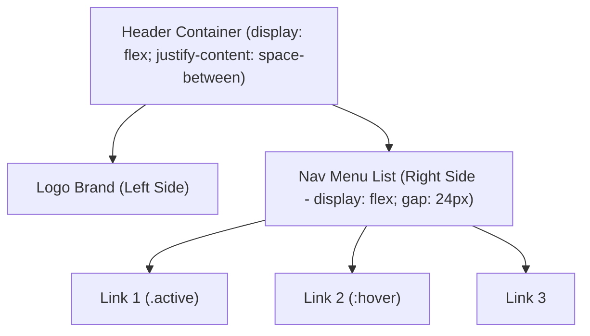

# CSS Navigation Bar

Estimated Reading Time: 15 minutes

Prerequisites: [CSS Display](17-css-display.md), [CSS Position](18-css-position.md), [CSS Flexbox](29-css-flexbox.md)

Learning Objectives:
- Build horizontal and vertical navigation bars.
- Master header layouts containing brand logo and navigation links.
- Style active nav links, hover states, and sticky navigation headers.
- Utilize Flexbox for responsive alignment.

---

## Introduction

A **navigation bar** (navbar) is the primary header component of a website. It provides users with instant access to core site sections (Home, About, Services, Contact), brand logos, search bars, and user login action buttons.

CSS navigation bars transform semantic HTML `<nav>` list structures (`<ul>` / `<li>` / `<a>`) into polished, responsive header components using Flexbox alignment, hover transitions, and sticky positioning.

---

## Real-World Analogy

Imagine the main control dashboard in an automobile.

- **Brand Logo**: The car manufacturer emblem mounted prominently on the steering wheel hub.
- **Nav Links**: The speed, fuel, and temperature gauges arranged horizontally in front of the driver for quick navigation monitoring.
- **Active State (`.active`)**: A lit indicator dashboard light showing which drive gear (e.g., "Drive") is currently engaged.
- **Sticky Navbar**: The windshield header HUD that remains fixed in your field of view as the car moves forward down the highway.

Navigation bars ground website structure across all pages.

---

## Core Concepts

### 1. Structural Architecture
Semantic HTML setup:
```html
<header class="navbar-header">
    <div class="logo">BrandLogo</div>
    <nav>
        <ul class="nav-links">
            <li><a href="#" class="active">Home</a></li>
            <li><a href="#">About</a></li>
            <li><a href="#">Contact</a></li>
        </ul>
    </nav>
</header>
```

### 2. Flexbox Header Alignment
- **Header Wrapper**: `display: flex; justify-content: space-between; align-items: center;` (Pushes logo to left, nav links to right).
- **Nav Links List**: `display: flex; gap: 20px; list-style: none;`.

### 3. Link States & Underline Indicators
- **Base Link**: `color: #ffffff; text-decoration: none;`.
- **Hover/Active**: Highlights link text or renders a `border-bottom` accent line.

---

## Syntax

```css
/* Header Container */
.navbar {
    display: flex;
    justify-content: space-between;
    align-items: center;
    background-color: #0f172a;
    padding: 0 30px;
    height: 64px;
}

/* Nav Links List */
.nav-menu {
    display: flex;
    gap: 24px;
    list-style: none;
    margin: 0;
    padding: 0;
}

/* Nav Link Styling */
.nav-link {
    color: #94a3b8;
    text-decoration: none;
    font-weight: 500;
    transition: color 0.2s;
}

.nav-link:hover, .nav-link.active {
    color: #ffffff;
}
```

---

## Property Reference

| Component Element | CSS Properties Applied | Purpose |
| :--- | :--- | :--- |
| `.navbar` Wrapper | `display: flex; justify-content: space-between;` | Aligns logo left, links right |
| `.nav-menu` List | `display: flex; gap: 24px; list-style: none;` | Arranges menu links in a row |
| `.nav-link` Link | `color: #94a3b8; text-decoration: none;` | Removes link underlines |
| `.active` Link | `color: #ffffff; border-bottom: 2px solid #2563eb;` | Marks current active page |

---

## Visual Explanation



---

## Example 1

### HTML
```html
<!DOCTYPE html>
<html lang="en">
<head>
    <meta charset="UTF-8">
    <title>Flexbox Navigation Bar</title>
    <style>
        body { margin: 0; font-family: Arial, sans-serif; background-color: #f8fafc; }
        
        .header-nav {
            display: flex;
            justify-content: space-between;
            align-items: center;
            background-color: #0f172a;
            padding: 0 40px;
            height: 64px;
            box-shadow: 0 2px 10px rgba(0,0,0,0.1);
        }
        .logo {
            color: #ffffff;
            font-size: 20px;
            font-weight: bold;
        }
        .nav-links {
            display: flex;
            gap: 30px;
            list-style: none;
            margin: 0;
            padding: 0;
        }
        .nav-link {
            color: #94a3b8;
            text-decoration: none;
            font-size: 15px;
            padding: 8px 0;
            transition: color 0.2s;
        }
        .nav-link:hover, .nav-link.active {
            color: #ffffff;
            border-bottom: 2px solid #38bdf8;
        }
    </style>
</head>
<body>
    <header class="header-nav">
        <div class="logo">DevCorp</div>
        <nav>
            <ul class="nav-links">
                <li><a href="#" class="nav-link active">Home</a></li>
                <li><a href="#" class="nav-link">Products</a></li>
                <li><a href="#" class="nav-link">Services</a></li>
                <li><a href="#" class="nav-link">Contact</a></li>
            </ul>
        </nav>
    </header>
</body>
</html>
```

### CSS
```css
.header-nav {
    display: flex;
    justify-content: space-between;
    align-items: center;
    background-color: #0f172a;
    height: 64px;
}
.nav-links { display: flex; gap: 30px; list-style: none; }
```

### Explanation
This navbar uses `display: flex; justify-content: space-between;` to position the logo on the far left and the menu links on the far right. The active link features a light-blue bottom accent line (`#38bdf8`).

---

## Output Image Prompt

A browser window showing a dark slate horizontal header bar (`#0f172a`) stretching across the top of the viewport. On the left side, bold white text reads "DevCorp". On the right side, horizontal links "Home", "Products", "Services", and "Contact" display in light gray, with "Home" highlighted in white with a light blue bottom accent line.

---

## Code Explanation

- `justify-content: space-between;`: Separates logo brand and navigation menu to opposite ends of the header bar.
- `border-bottom: 2px solid #38bdf8;`: Underlines active page link.

---

## Example 2

### HTML
```html
<!DOCTYPE html>
<html lang="en">
<head>
    <meta charset="UTF-8">
    <title>Sticky Navigation Header</title>
    <style>
        body { margin: 0; font-family: Arial, sans-serif; }
        .sticky-navbar {
            position: sticky;
            top: 0;
            display: flex;
            justify-content: space-between;
            align-items: center;
            background-color: #ffffff;
            border-bottom: 1px solid #e2e8f0;
            padding: 0 30px;
            height: 60px;
            z-index: 1000;
        }
    </style>
</head>
<body>
    <header class="sticky-navbar">
        <strong>StickyBrand</strong>
        <nav style="display:flex; gap:20px;">
            <a href="#" style="color:#2563eb; text-decoration:none;">Dashboard</a>
            <a href="#" style="color:#64748b; text-decoration:none;">Settings</a>
        </nav>
    </header>
    <div style="padding:30px; height:1200px; background-color:#f8fafc;">
        <h3>Scroll down to test sticky header behavior.</h3>
    </div>
</body>
</html>
```

### CSS
```css
.sticky-navbar {
    position: sticky;
    top: 0;
    z-index: 1000;
}
```

### Explanation
`position: sticky; top: 0;` locks the white navigation header bar to the top edge of the browser viewport during scrolling.

---

## Output Image Prompt

A browser window displaying a white top header bar with a subtle bottom border line locked at the top of a long scrolling page.

---

## Code Explanation

- `position: sticky; top: 0;`: Keeps header bar sticky at viewport top edge when scrolling down long page body content.

---

## Best Practices

- **Use Semantic HTML `<header>` and `<nav>`**: Wrap navbars inside `<header>` and `<nav>` tags for SEO and accessibility.
- **Add Mobile Hamburger Toggle Strategy**: Prepare layouts for mobile responsive breakpoint toggles.

---

## Common Mistakes

### Mistake 1: Using Floats for Navbar Items

```css
/* INCORRECT (Legacy float approach) */
.nav-item {
    float: left; /* Hard to align vertically, requires clearfix */
}
```

#### Explanation
Using `float` for navbars is obsolete. Use `display: flex` for clean alignment.

```css
/* CORRECT */
.nav-links {
    display: flex;
    gap: 20px;
}
```

---

## Browser Compatibility

Flexbox navigation bars and sticky headers have 100% universal browser compatibility.

---

## Real-World Applications

- **SaaS Web App Dashboards**: Top navigation headers with profile avatars.
- **Corporate Websites**: Full-width sticky hero navbars.
- **E-Commerce Header Bars**: Headers with search inputs and shopping cart icons.

---

## Mini Project

### Project Objective: Header Navbar with CTA Button
Build a header navbar containing a brand logo, 3 menu links, and a primary blue "Get Started" call-to-action button.

---

## Practice Exercises

### Beginner Level
1. Create a horizontal flexbox navbar container.
2. Remove default bullets from a nav list using `list-style: none`.
3. Push logo to left and links to right using `justify-content: space-between`.
4. Style nav links with white text and no underline.
5. Highlight current page link with an `.active` class.

### Intermediate Level
6. Build a sticky top navbar using `position: sticky; top: 0;`.
7. Add a subtle bottom shadow to a white navbar (`box-shadow`).
8. Add a CTA button inside the header navbar.
9. Style link hover state with a smooth `border-bottom` transition.
10. Vertical center logo and links using `align-items: center`.

### Advanced Level
11. Build a responsive mobile drawer navigation menu using media queries and CSS transitions.
12. Build a transparent-to-solid navbar color change script on page scroll.
13. Implement a mega-menu dropdown inside a navbar link item.
14. Audit screen reader landmark accessibility for `<nav aria-label="Main Navigation">`.
15. Solve stacking context bugs where sticky navbars render behind floating cards.

---

## Quick Quiz

**1. What CSS layout model is best for aligning navbar logos and links?**
A) CSS Floats  
B) CSS Flexbox  
C) Inline styles  

**2. Which property pushes logo to far left and links to far right in a header container?**
A) `justify-content: space-between`  
B) `align-items: center`  

**3. What HTML tags should wrap a website navigation bar?**
A) `<header>` and `<nav>`  
B) `<div>` and `<span>`  

**4. How do you remove list bullets from `<ul>` navigation lists?**
A) `list-style: none`  
B) `border: none`  

**5. What property locks a navbar to the top edge of the screen during scroll?**
A) `position: sticky; top: 0;`  
B) `position: static`  

**6. What property vertically centers logo and links inside a 64px tall navbar?**
A) `align-items: center`  
B) `text-align: center`  

**7. How do you remove underlines from `<a>` navigation links?**
A) `text-decoration: none`  
B) `font-style: plain`  

**8. What property creates horizontal gaps between nav links in Flexbox?**
A) `gap: 20px`  
B) `padding-gap: 20px`  

**9. What class is assigned to the current active page link?**
A) `.active`  
B) `.current`  

**10. What property keeps sticky navbars stacked above scrolling page body elements?**
A) `z-index: 1000`  
B) `depth: top`  

---

### Answers
1: B | 2: A | 3: A | 4: A | 5: A | 6: A | 7: A | 8: A | 9: A | 10: A

---

## Interview Questions

**1. How do you build a responsive header navbar using CSS Flexbox?**  
*Answer:* Set header container to `display: flex; justify-content: space-between; align-items: center;` to push the logo left and nav list right. Set the nav list `<ul>` to `display: flex; gap: 24px; list-style: none;` to arrange links in a horizontal row.

**2. Explain the difference between `position: fixed` and `position: sticky` for navigation bars.**  
*Answer:* `position: fixed` removes the navbar from document flow immediately, locking it to the viewport top edge (requiring body padding to prevent content overlap). `position: sticky` keeps the navbar in normal document flow until the page scrolls to its offset threshold (`top: 0`), where it smoothly locks in place.

**3. How do you optimize navbars for accessibility?**  
*Answer:* Wrap navigation inside `<header>` and `<nav aria-label="Main Navigation">`, structure links using lists (`<ul>`/`<li>`), provide clear `:focus` outline rings for keyboard navigation, and assign `aria-current="page"` to the active link.

---

## Summary

- Use **`<header>`** and **`<nav>`**.
- Use **`display: flex; justify-content: space-between;`** for logo/links layout.
- Use **`position: sticky; top: 0;`** for sticky headers.

---

## Cheat Sheet

```css
/* HEADER NAVBAR PATTERN */
.navbar {
    display: flex;
    justify-content: space-between;
    align-items: center;
    height: 64px;
    padding: 0 30px;
    background-color: #0f172a;
}

.nav-list {
    display: flex;
    gap: 24px;
    list-style: none;
}

.nav-link {
    color: #94a3b8;
    text-decoration: none;
}
.nav-link.active {
    color: #ffffff;
}
```

---

## Related Topics

- **Previous Topic**: [CSS Dropdown Menu](25-css-dropdown-menu.md)
- **Next Topic**: [Responsive Web Design](27-responsive-web-design.md)
- **Recommended Learning Order**: Introduction to CSS -> Ways to Add CSS -> CSS Selectors -> CSS Colors -> CSS Fonts -> CSS Borders -> Border Radius -> CSS Shadows -> CSS Margins -> CSS Padding -> CSS Width -> CSS Height -> CSS Box Model -> CSS Float -> CSS Overflow -> CSS Display -> CSS Position -> CSS Background Images -> CSS Background Properties -> CSS Combinators -> CSS Pseudo Classes -> CSS Pseudo Elements -> CSS Pagination -> CSS Dropdown Menu -> CSS Navigation Bar -> Responsive Web Design
