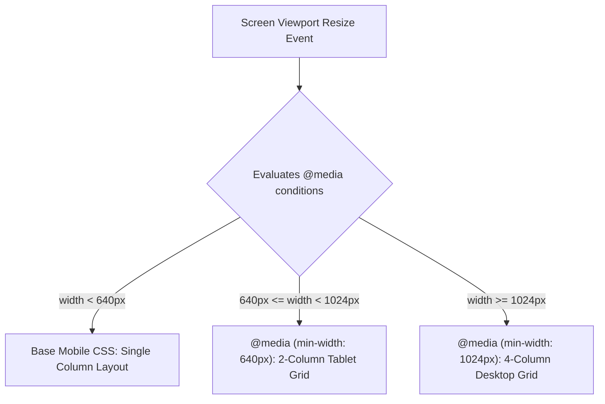

# Media Queries

Estimated Reading Time: 15 minutes

Prerequisites: [Responsive Web Design](27-responsive-web-design.md)

Learning Objectives:
- Master `@media` rule syntax and media feature expressions (`min-width`, `max-width`, `orientation`).
- Understand standard device breakpoint strategy (Mobile, Tablet, Desktop).
- Implement mobile-first (`min-width`) vs desktop-first (`max-width`) media queries.
- Query user system preferences (`prefers-color-scheme`, `prefers-reduced-motion`).

---

## Introduction

**Media Queries** are a core feature of CSS module specifications that allow developers to apply CSS rules conditionally based on device screen dimensions, screen resolution, device orientation, or user system preferences.

Using `@media` blocks, developers can alter page typography, hide mobile navigation sidebars, adjust Flexbox/Grid column arrangements, and trigger dark mode themes automatically.

---

## Real-World Analogy

Imagine a smart clothing wardrobe.

- **Mobile Viewport (`@media (max-width: 600px)`)**: When the temperature drops below 10°C outside, your wardrobe automatically hands you a heavy winter coat (single-column layout, compact font size).
- **Desktop Viewport (`@media (min-width: 1024px)`)**: When the temperature rises to 25°C, your wardrobe hands you shorts and a t-shirt (3-column layout grid, large hero text).
- **Dark Mode Preference (`@media (prefers-color-scheme: dark)`)**: When night falls, your room lights dim automatically to soft dark ambient lighting.

Media queries apply conditional styling based on environment conditions.

---

## Core Concepts

### 1. `@media` Syntax Breakdown
- **Media Type**: `screen`, `print`, `all`.
- **Media Feature**: `min-width`, `max-width`, `orientation: landscape`, `prefers-color-scheme: dark`.

### 2. Standard Industry Breakpoints
- **Mobile**: Under `640px` (Default base styles).
- **Tablet**: `640px` to `1024px` (`@media (min-width: 640px)`).
- **Desktop**: `1024px` and above (`@media (min-width: 1024px)`).
- **Large Desktop**: `1280px` and above (`@media (min-width: 1280px)`).

### 3. Mobile-First vs Desktop-First
- **Mobile-First (`min-width`)**: Base styles = mobile. Media queries activate as screen width **increases**.
- **Desktop-First (`max-width`)**: Base styles = desktop. Media queries activate as screen width **decreases**.

### 4. User Preference Queries
- `prefers-color-scheme: dark`: Automatically activates dark mode based on OS settings.
- `prefers-reduced-motion: reduce`: Disables complex CSS animations for users prone to motion sickness.

---

## Syntax

```css
/* Mobile-First Pattern (Recommended) */
/* Base Mobile Styles */
.card-grid {
    display: flex;
    flex-direction: column;
}

/* Tablet Breakpoint (640px+) */
@media (min-width: 640px) {
    .card-grid {
        flex-direction: row;
        flex-wrap: wrap;
    }
}

/* Desktop Breakpoint (1024px+) */
@media (min-width: 1024px) {
    .card-grid {
        flex-wrap: nowrap;
    }
}

/* System Dark Mode Query */
@media (prefers-color-scheme: dark) {
    body {
        background-color: #0f172a;
        color: #ffffff;
    }
}
```

---

## Property Reference

| Media Query Expression | Condition Trigger | Typical Usage |
| :--- | :--- | :--- |
| `@media (min-width: 768px)` | Viewport width is **768px or wider** | Mobile-First desktop breakpoints |
| `@media (max-width: 767px)` | Viewport width is **767px or narrower** | Desktop-First mobile overrides |
| `@media (orientation: landscape)` | Device is held horizontally | Tablet landscape layouts |
| `@media (prefers-color-scheme: dark)` | User OS set to Dark Mode | Automatic Dark Mode theme |
| `@media (prefers-reduced-motion: reduce)` | User OS requests motion reduction | Disabling animation transitions |

---

## Visual Explanation



---

## Example 1

### HTML
```html
<!DOCTYPE html>
<html lang="en">
<head>
    <meta charset="UTF-8">
    <meta name="viewport" content="width=device-width, initial-scale=1.0">
    <title>Responsive Breakpoint Grid</title>
    <style>
        body { font-family: Arial, sans-serif; padding: 20px; background-color: #f8fafc; }
        
        .container { max-width: 1200px; margin: 0 auto; }
        
        /* Mobile Base: 1 Column */
        .grid {
            display: grid;
            grid-template-columns: 1fr;
            gap: 20px;
        }
        
        .card {
            background-color: #ffffff;
            border: 1px solid #cbd5e1;
            padding: 20px;
            border-radius: 8px;
        }
        
        /* Tablet: 2 Columns */
        @media (min-width: 640px) {
            .grid { grid-template-columns: repeat(2, 1fr); }
        }
        
        /* Desktop: 3 Columns */
        @media (min-width: 1024px) {
            .grid { grid-template-columns: repeat(3, 1fr); }
        }
    </style>
</head>
<body>
    <div class="container">
        <h2>Responsive Media Query Grid</h2>
        <div class="grid">
            <div class="card">Card 1</div>
            <div class="card">Card 2</div>
            <div class="card">Card 3</div>
        </div>
    </div>
</body>
</html>
```

### CSS
```css
/* Base Mobile: 1 Column */
.grid { display: grid; grid-template-columns: 1fr; }

/* Tablet (640px+) */
@media (min-width: 640px) {
    .grid { grid-template-columns: repeat(2, 1fr); }
}

/* Desktop (1024px+) */
@media (min-width: 1024px) {
    .grid { grid-template-columns: repeat(3, 1fr); }
}
```

### Explanation
This grid adapts cleanly: 1 column on mobile (<640px), 2 columns on tablet (640px–1023px), and 3 columns on desktop (1024px+).

---

## Output Image Prompt

A browser window showing 3 white cards arranged in a single vertical column on mobile screen viewports, changing to a 2-column grid on tablet screen width, and aligning in a 3-column side-by-side row on desktop screen viewports.

---

## Code Explanation

- `grid-template-columns: 1fr;`: Mobile default single column.
- `@media (min-width: 640px)`: Expands to 2-column grid on tablet screens.
- `@media (min-width: 1024px)`: Expands to 3-column grid on desktop displays.

---

## Example 2

### HTML
```html
<!DOCTYPE html>
<html lang="en">
<head>
    <meta charset="UTF-8">
    <meta name="viewport" content="width=device-width, initial-scale=1.0">
    <title>Automatic Dark Mode Query</title>
    <style>
        body {
            font-family: Arial, sans-serif;
            padding: 30px;
            background-color: #ffffff;
            color: #0f172a;
            transition: background-color 0.3s, color 0.3s;
        }
        
        /* Dark Mode Media Query */
        @media (prefers-color-scheme: dark) {
            body {
                background-color: #0f172a;
                color: #ffffff;
            }
        }
    </style>
</head>
<body>
    <h2>Automatic Dark Mode Theme</h2>
    <p>This page adapts its theme automatically based on your operating system light/dark mode settings.</p>
</body>
</html>
```

### CSS
```css
@media (prefers-color-scheme: dark) {
    body {
        background-color: #0f172a;
        color: #ffffff;
    }
}
```

### Explanation
`@media (prefers-color-scheme: dark)` detects user OS dark mode preferences and automatically switches canvas colors.

---

## Output Image Prompt

A browser window displaying a dark slate background (`#0f172a`) with white heading text, automatically activated by system dark mode detection.

---

## Code Explanation

- `@media (prefers-color-scheme: dark)`: Native CSS query detecting system-level dark mode settings.

---

## Best Practices

- **Use Mobile-First (`min-width`) Queries**: Standardize on mobile-first `min-width` queries to reduce CSS specificity conflicts and optimize mobile performance.
- **Base Breakpoints on Content, Not Device Names**: Choose breakpoints based on where your content layout naturally breaks, rather than targeting specific smartphone brand names.

---

## Common Mistakes

### Mistake 1: Overlapping `min-width` and `max-width` Boundaries

```css
/* INCORRECT */
@media (max-width: 768px) { ... }
@media (min-width: 768px) { ... } /* 768px triggers BOTH queries simultaneously! */
```

#### Explanation
At exactly 768px, both rules evaluate as true, causing selector specificity bugs.

```css
/* CORRECT (Mobile-First) */
/* Base mobile styles (<768px) */

@media (min-width: 768px) { ... } /* 768px and above */
```

---

## Browser Compatibility

Standard CSS media queries (`min-width`, `max-width`, `orientation`, `prefers-color-scheme`) have 100% universal support across all desktop and mobile web browsers.

---

## Real-World Applications

- **Responsive Grid Breakpoints**: Adapting multi-column web layouts.
- **Mobile Navigation Drawer**: Hiding desktop nav links and displaying mobile hamburger buttons.
- **System Dark Mode Integration**: Applying automatic dark themes.

---

## Mini Project

### Project Objective: Responsive Navbar & Dark Mode
Build a navigation header that collapses menu links into a hamburger icon below `768px` and respects system dark mode.

---

## Practice Exercises

### Beginner Level
1. Write a media query for screens 768px and wider (`@media (min-width: 768px)`).
2. Change background color on mobile devices under 600px.
3. Hide an element on desktop screens over 1024px (`display: none`).
4. Increase body font size on screens wider than 1200px.
5. Create a mobile-first 1-column layout that expands to 2 columns at 640px.

### Intermediate Level
6. Implement automatic dark mode using `@media (prefers-color-scheme: dark)`.
7. Write a landscape orientation query (`@media (orientation: landscape)`).
8. Target high-resolution Retina displays using `min-resolution: 2dppx`.
9. Create a print stylesheet hiding navbar headers using `@media print`.
10. Combine multiple conditions using `@media (min-width: 768px) and (max-width: 1024px)`.

### Advanced Level
11. Disable CSS keyframe animations for users with motion sensitivity using `@media (prefers-reduced-motion: reduce)`.
12. Compare Media Query range syntax (`@media (768px <= width <= 1024px)`).
13. Combine Media Queries with CSS custom properties to build dynamic theme engines.
14. Audit CSS bundle parsing costs of excessive media query rules.
15. Solve mobile Safari dynamic address bar breakpoint bugs.

---

## Quick Quiz

**1. What CSS directive is used to write media queries?**
A) `@media`  
B) `@import`  

**2. Which expression targets screens 768px and wider in mobile-first design?**
A) `@media (min-width: 768px)`  
B) `@media (max-width: 768px)`  

**3. What media feature detects operating system dark mode settings?**
A) `prefers-color-scheme: dark`  
B) `theme: dark`  

**4. What media feature disables complex animations for motion-sensitive users?**
A) `prefers-reduced-motion: reduce`  
B) `animation: none`  

**5. What media type specifies print stylesheet styles?**
A) `@media print`  
B) `@media paper`  

**6. What device breakpoint width typically represents tablet screens?**
A) `768px`  
B) `2000px`  

**7. Why should breakpoints be based on content rather than device brand names?**
A) Device screen sizes change constantly; content-based breakpoints remain stable  
B) Devices do not support CSS  

**8. What media feature detects horizontal device holding orientation?**
A) `orientation: landscape`  
B) `direction: horizontal`  

**9. What modern CSS range syntax replaces `@media (min-width: 768px) and (max-width: 1024px)`?**
A) `@media (768px <= width <= 1024px)`  
B) `@media (between 768px and 1024px)`  

**10. In mobile-first CSS architecture, where are mobile base styles written?**
A) Outside any media queries (as un-queried default CSS)  
B) Inside `@media (max-width: 320px)`  

---

### Answers
1: A | 2: A | 3: A | 4: A | 5: A | 6: A | 7: A | 8: A | 9: A | 10: A

---

## Interview Questions

**1. What are CSS Media Queries and how do they work?**  
*Answer:* Media Queries are CSS directives (`@media`) that apply conditional CSS styling rules when specific device conditions (such as viewport width, orientation, screen resolution, or system color preferences) evaluate as true.

**2. Explain Mobile-First (`min-width`) vs Desktop-First (`max-width`) media queries.**  
*Answer:* Mobile-First writes base un-queried CSS for small screens and uses `@media (min-width)` to add layout features as screen width increases. Desktop-First writes base CSS for large desktop screens and uses `@media (max-width)` to override styles as screen width decreases. Mobile-first is industry best practice because it produces cleaner code and improves mobile rendering speed.

**3. What is the modern range syntax for CSS Media Queries Level 4?**  
*Answer:* Range syntax simplifies comparison expressions using mathematical comparison operators (e.g. `@media (768px <= width <= 1024px)` instead of `@media (min-width: 768px) and (max-width: 1024px)`).

---

## Summary

- Use **`@media (min-width)`** for mobile-first desktop breakpoints.
- Use **`prefers-color-scheme: dark`** for OS dark mode.
- Base breakpoints on **content layout boundaries**, not device names.

---

## Cheat Sheet

```css
/* MOBILE-FIRST BREAKPOINT SYSTEM */

/* Base Styles: Mobile (<640px) */
.container { padding: 15px; }

/* Tablet (640px+) */
@media (min-width: 640px) {
    .container { padding: 30px; }
}

/* Desktop (1024px+) */
@media (min-width: 1024px) {
    .container { padding: 40px; max-width: 1200px; }
}

/* System Dark Mode */
@media (prefers-color-scheme: dark) {
    body { background: #0f172a; color: #fff; }
}
```

---

## Related Topics

- **Previous Topic**: [Responsive Web Design](27-responsive-web-design.md)
- **Next Topic**: [CSS Flexbox](29-css-flexbox.md)
- **Recommended Learning Order**: Introduction to CSS -> Ways to Add CSS -> CSS Selectors -> CSS Colors -> CSS Fonts -> CSS Borders -> Border Radius -> CSS Shadows -> CSS Margins -> CSS Padding -> CSS Width -> CSS Height -> CSS Box Model -> CSS Float -> CSS Overflow -> CSS Display -> CSS Position -> CSS Background Images -> CSS Background Properties -> CSS Combinators -> CSS Pseudo Classes -> CSS Pseudo Elements -> CSS Pagination -> CSS Dropdown Menu -> CSS Navigation Bar -> Responsive Web Design -> Media Queries -> CSS Flexbox
