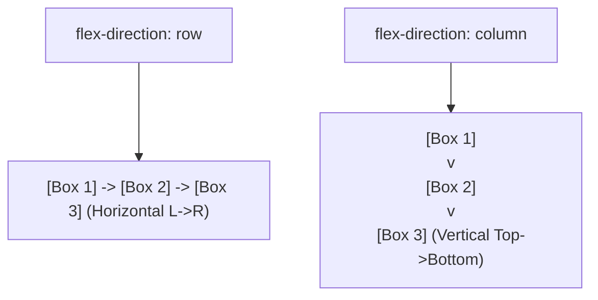

# Flex Direction

Estimated Reading Time: 12 minutes

Prerequisites: [CSS Flexbox](29-css-flexbox.md)

Learning Objectives:
- Master the `flex-direction` property.
- Understand values: `row`, `row-reverse`, `column`, and `column-reverse`.
- Learn how `flex-direction` changes Main Axis vs Cross Axis alignment directions.
- Transform mobile vertical stacked cards into desktop horizontal rows.

---

## Introduction

The `flex-direction` property establishes the Main Axis direction of a flex container, dictating whether child flex items are arranged horizontally in rows or vertically in columns.

By default (`flex-direction: row`), flex items flow left-to-right on a horizontal line. Changing `flex-direction` to `column` rotates the Main Axis 90 degrees vertically, making Flexbox ideal for responsive mobile layouts.

---

## Real-World Analogy

Imagine loading cargo containers onto a transport vehicle.

- **`row`**: Arranging cargo boxes side-by-side in a horizontal train boxcar (Left to Right).
- **`column`**: Stacking cargo boxes vertically on top of one another inside a tall shipping warehouse elevator (Top to Bottom).
- **`row-reverse`**: Reversing the train boxcar direction so cargo box 1 sits on the right, flowing Right to Left.
- **`column-reverse`**: Stacking boxes from bottom-to-top inside an inverted elevator shaft.

`flex-direction` sets the flow axis of container items.

---

## Core Concepts

### 1. `flex-direction` Values
- `row` (Default): Items flow horizontally from left to right.
- `row-reverse`: Items flow horizontally from right to left.
- `column`: Items flow vertically from top to bottom.
- `column-reverse`: Items flow vertically from bottom to top.

### 2. Axis Swap Impact
- When `flex-direction` is `row`: Main Axis = Horizontal; Cross Axis = Vertical.
- When `flex-direction` is `column`: **Main Axis = Vertical** (`justify-content` controls vertical alignment!); **Cross Axis = Horizontal** (`align-items` controls horizontal alignment!).

---

## Syntax

```css
/* Horizontal Row (Default) */
.row-container {
    display: flex;
    flex-direction: row;
}

/* Vertical Column (Mobile Base) */
.column-container {
    display: flex;
    flex-direction: column;
}

/* Reverse Column */
.reverse-container {
    display: flex;
    flex-direction: column-reverse;
}
```

---

## Property Reference

| Value | Flow Direction | Main Axis | Cross Axis |
| :--- | :--- | :--- | :--- |
| `row` | Left to Right | Horizontal | Vertical |
| `row-reverse` | Right to Left | Horizontal | Vertical |
| `column` | Top to Bottom | Vertical | Horizontal |
| `column-reverse` | Bottom to Top | Vertical | Horizontal |

---

## Visual Explanation



---

## Example 1

### HTML
```html
<!DOCTYPE html>
<html lang="en">
<head>
    <meta charset="UTF-8">
    <title>Responsive Flex Direction</title>
    <style>
        body { font-family: Arial, sans-serif; padding: 20px; background-color: #f8fafc; }
        
        /* Mobile: Column */
        .flex-wrapper {
            display: flex;
            flex-direction: column;
            gap: 15px;
        }
        
        .item {
            background-color: #2563eb;
            color: white;
            padding: 20px;
            border-radius: 6px;
            text-align: center;
        }
        
        /* Desktop: Row */
        @media (min-width: 768px) {
            .flex-wrapper {
                flex-direction: row;
            }
            .item {
                flex: 1;
            }
        }
    </style>
</head>
<body>
    <div class="flex-wrapper">
        <div class="item">Item 1</div>
        <div class="item">Item 2</div>
        <div class="item">Item 3</div>
    </div>
</body>
</html>
```

### CSS
```css
/* Mobile */
.flex-wrapper { display: flex; flex-direction: column; }

/* Desktop */
@media (min-width: 768px) {
    .flex-wrapper { flex-direction: row; }
}
```

### Explanation
Mobile screens use `flex-direction: column` to stack boxes vertically. Desktop viewports (`min-width: 768px`) switch to `flex-direction: row` to align boxes side-by-side.

---

## Output Image Prompt

A browser window showing 3 blue boxes stacked vertically on mobile screen width, which transform into 3 horizontal side-by-side boxes on desktop screen width.

---

## Code Explanation

- `flex-direction: column;`: Sets vertical stacking order for mobile screens.
- `flex-direction: row;`: Rotates flex axis horizontally for desktop viewports.

---

## Example 2

### HTML
```html
<!DOCTYPE html>
<html lang="en">
<head>
    <meta charset="UTF-8">
    <title>Column-Reverse Chat Window</title>
    <style>
        .chat-feed {
            display: flex;
            flex-direction: column-reverse;
            height: 200px;
            overflow-y: auto;
            border: 1px solid #cbd5e1;
            padding: 15px;
            background-color: #ffffff;
            font-family: Arial, sans-serif;
        }
        .msg {
            background-color: #e2e8f0;
            padding: 8px 12px;
            border-radius: 6px;
            margin-top: 8px;
        }
    </style>
</head>
<body>
    <div class="chat-feed">
        <div class="msg">Message 3 (Latest)</div>
        <div class="msg">Message 2</div>
        <div class="msg">Message 1 (Oldest)</div>
    </div>
</body>
</html>
```

### CSS
```css
.chat-feed {
    display: flex;
    flex-direction: column-reverse;
}
```

### Explanation
`flex-direction: column-reverse` anchors content at the bottom of the feed box, ideal for chat message streams.

---

## Output Image Prompt

A browser window showing a chat message container feed where items stack upwards from the bottom of the card frame.

---

## Code Explanation

- `flex-direction: column-reverse;`: Inverts vertical stacking order from bottom to top.

---

## Best Practices

- **Use `column` for Mobile Layouts**: Combine `flex-direction: column` on mobile with `@media (min-width: 768px) { flex-direction: row; }` for desktop.
- **Remember Axis Rotation**: Remember that in `flex-direction: column`, `justify-content` controls vertical alignment and `align-items` controls horizontal alignment.

---

## Common Mistakes

### Mistake 1: Expecting `justify-content: center` to Center Horizontally in `flex-direction: column`

```css
/* INCORRECT */
.container {
    display: flex;
    flex-direction: column;
    justify-content: center; /* Centers VERTICALLY in column mode, not horizontally! */
}
```

#### Explanation
Changing `flex-direction` to `column` rotates the Main Axis vertically. Horizontal alignment requires `align-items: center`.

```css
/* CORRECT */
.container {
    display: flex;
    flex-direction: column;
    align-items: center; /* Horizontally centers in column mode */
}
```

---

## Browser Compatibility

`flex-direction` properties (`row`, `column`, `row-reverse`, `column-reverse`) have 100% universal support across all desktop and mobile browsers.

---

## Real-World Applications

- **Mobile Navigation Drawers**: Vertical link stacks (`flex-direction: column`).
- **Chat App Messaging Feeds**: Bottom-anchored message logs (`flex-direction: column-reverse`).
- **Responsive Card Grids**: Mobile column to desktop row transitions.

---

## Mini Project

### Project Objective: Mobile Stack to Desktop Row Feature Cards
Build a feature section that stacks vertically on mobile (`column`) and switches to side-by-side (`row`) on desktop screens.

---

## Practice Exercises

### Beginner Level
1. Set flex direction to horizontal row using `flex-direction: row;`.
2. Stack flex items vertically using `flex-direction: column;`.
3. Reverse horizontal flex order using `flex-direction: row-reverse;`.
4. Reverse vertical flex order using `flex-direction: column-reverse;`.
5. Switch flex direction inside a media query (`@media (min-width: 768px)`).

### Intermediate Level
6. Explain why `justify-content` controls vertical alignment in `column` mode.
7. Build a mobile hamburger menu drawer using `flex-direction: column`.
8. Create a chat message box using `flex-direction: column-reverse`.
9. Combine `flex-direction: column` with `align-items: center` to horizontally center form elements.
10. Reverse mobile footer link lists using `column-reverse`.

### Advanced Level
11. Audit accessibility focus order issues caused by visual DOM re-ordering (`row-reverse`).
12. Combine `flex-direction: column` with `flex-grow: 1` sticky bottom footers.
13. Build a multi-directional flex hierarchy combining row containers inside column containers.
14. Optimize reflow engine calculations during dynamic flex direction updates.
15. Solve mobile Safari height calculation bugs on vertical flex containers.

---

## Quick Quiz

**1. What is the default value of `flex-direction`?**
A) `row`  
B) `column`  

**2. Which value stacks flex items vertically from top to bottom?**
A) `row`  
B) `column`  

**3. When `flex-direction: column` is set, what axis becomes the Main Axis?**
A) Horizontal axis  
B) Vertical axis  

**4. When `flex-direction: column` is set, which property controls horizontal alignment?**
A) `align-items`  
B) `justify-content`  

**5. Which value reverses horizontal flex item ordering from right to left?**
A) `row-reverse`  
B) `column-reverse`  

**6. What property changes flex container axis direction?**
A) `flex-direction`  
B) `flex-axis`  

**7. Why is `column-reverse` useful for chat app UI feeds?**
A) It anchors latest messages at the bottom of the feed container  
B) It turns text green  

**8. In mobile-first design, what `flex-direction` value is usually defined as the base style?**
A) `column`  
B) `row-reverse`  

**9. Does `flex-direction: column` change the DOM HTML source code structure?**
A) No (changes visual rendering order only)  
B) Yes  

**10. Why can visual ordering changes via `row-reverse` cause accessibility issues?**
A) Screen readers and keyboard tab order follow DOM source order, not visual CSS order  
B) It breaks CSS  

---

### Answers
1: A | 2: B | 3: B | 4: A | 5: A | 6: A | 7: A | 8: A | 9: A | 10: A

---

## Interview Questions

**1. What is the `flex-direction` property?**  
*Answer:* `flex-direction` sets the direction of the Main Axis inside a Flexbox container (`row`, `row-reverse`, `column`, `column-reverse`), dictating whether child items flow horizontally or vertically.

**2. How does `flex-direction: column` affect `justify-content` and `align-items`?**  
*Answer:* Setting `flex-direction: column` rotates the Main Axis to vertical and the Cross Axis to horizontal. Consequently, `justify-content` aligns items vertically, while `align-items` aligns items horizontally.

**3. Why should developers use caution when using `row-reverse` or `column-reverse`?**  
*Answer:* Reversing visual layout order using CSS without updating HTML DOM order creates a mismatch between visual rendering and keyboard tabbing/screen reader focus order, degrading web accessibility.

---

## Summary

- Use **`flex-direction: row`** (default) for horizontal layouts.
- Use **`flex-direction: column`** for vertical mobile stacks.
- Remember: `column` rotates the Main Axis vertically.

---

## Cheat Sheet

```css
/* MOBILE COLUMN BASE */
.container {
    display: flex;
    flex-direction: column;
}

/* DESKTOP ROW BREAKPOINT */
@media (min-width: 768px) {
    .container {
        flex-direction: row;
    }
}
```

---

## Related Topics

- **Previous Topic**: [CSS Flexbox](29-css-flexbox.md)
- **Next Topic**: [Justify Content](31-justify-content.md)
- **Recommended Learning Order**: Introduction to CSS -> Ways to Add CSS -> CSS Selectors -> CSS Colors -> CSS Fonts -> CSS Borders -> Border Radius -> CSS Shadows -> CSS Margins -> CSS Padding -> CSS Width -> CSS Height -> CSS Box Model -> CSS Float -> CSS Overflow -> CSS Display -> CSS Position -> CSS Background Images -> CSS Background Properties -> CSS Combinators -> CSS Pseudo Classes -> CSS Pseudo Elements -> CSS Pagination -> CSS Dropdown Menu -> CSS Navigation Bar -> Responsive Web Design -> Media Queries -> CSS Flexbox -> Flex Direction -> Justify Content
