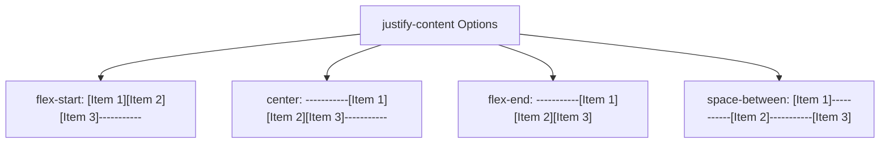

# Justify Content

Estimated Reading Time: 12 minutes

Prerequisites: [CSS Flexbox](29-css-flexbox.md), [Flex Direction](30-flex-direction.md)

Learning Objectives:
- Master the `justify-content` property.
- Understand values: `flex-start`, `flex-end`, `center`, `space-between`, `space-around`, and `space-evenly`.
- Align flex items dynamically along the Main Axis.
- Build header navbars with logo left and navigation links right.

---

## Introduction

The `justify-content` property defines how browser layout engines align and distribute unused free space between and around flex items along the **Main Axis** of a flex container.

Whether you need to pack items at the start (`flex-start`), push items to opposite ends (`space-between`), center cards horizontally (`center`), or distribute equal padding around items (`space-evenly`), `justify-content` provides precise spacing controls without requiring manual margins.

---

## Real-World Analogy

Imagine arranging books on a bookshelf row.

- **`flex-start`**: Pushing all books tightly against the left wall of the shelf.
- **`flex-end`**: Pushing all books tightly against the right wall of the shelf.
- **`center`**: Grouping all books together in the exact middle of the shelf.
- **`space-between`**: Placing book 1 flush against the left wall, book 3 flush against the right wall, and book 2 centered in the middle gap.
- **`space-around`**: Placing equal padding cushions on both sides of every single book.
- **`space-evenly`**: Setting completely equal gaps between all books and shelf end walls.

`justify-content` manages unused free space along the main axis.

---

## Core Concepts

### 1. Main Axis Alignment
- In default `flex-direction: row`, `justify-content` controls **horizontal** alignment.
- In `flex-direction: column`, `justify-content` controls **vertical** alignment!

### 2. Standard Values
- `flex-start` (Default): Items packed at container start edge.
- `flex-end`: Items packed at container end edge.
- `center`: Items grouped together in the center.
- `space-between`: First item at start edge, last item at end edge; remaining space distributed equally between items.
- `space-around`: Equal space allocated around each item (end gaps are half the width of middle gaps).
- `space-evenly`: Entire free space divided equally between every item and container boundaries.

---

## Syntax

```css
/* Header Navbar Alignment */
.navbar {
    display: flex;
    justify-content: space-between;
}

/* Centered Button Row */
.button-row {
    display: flex;
    justify-content: center;
    gap: 15px;
}

/* Distributed Card Row */
.card-row {
    display: flex;
    justify-content: space-evenly;
}
```

---

## Property Reference

| Value | Distribution Behavior | Outer End Gaps |
| :--- | :--- | :--- |
| `flex-start` | Items packed at start edge | No end gaps |
| `flex-end` | Items packed at end edge | No end gaps |
| `center` | Items centered together in middle | Equal outer space |
| `space-between` | Items pushed flush to outer boundaries | 0px outer end gaps |
| `space-around` | Equal space on both sides of each item | Outer gaps = 1/2 middle gaps |
| `space-evenly` | Completely equal gaps between all items | Outer gaps = middle gaps |

---

## Visual Explanation



---

## Example 1

### HTML
```html
<!DOCTYPE html>
<html lang="en">
<head>
    <meta charset="UTF-8">
    <title>Space-Between Header Navbar</title>
    <style>
        body { font-family: Arial, sans-serif; margin: 0; background-color: #f8fafc; }
        
        .nav-header {
            display: flex;
            justify-content: space-between;
            align-items: center;
            background-color: #0f172a;
            color: white;
            padding: 0 30px;
            height: 60px;
        }
        .nav-links {
            display: flex;
            gap: 20px;
            list-style: none;
            margin: 0;
            padding: 0;
        }
        .nav-links a { color: #94a3b8; text-decoration: none; }
        .nav-links a:hover { color: white; }
    </style>
</head>
<body>
    <header class="nav-header">
        <div style="font-weight:bold; font-size:18px;">BrandLogo</div>
        <ul class="nav-links">
            <li><a href="#">Home</a></li>
            <li><a href="#">Services</a></li>
            <li><a href="#">Contact</a></li>
        </ul>
    </header>
</body>
</html>
```

### CSS
```css
.nav-header {
    display: flex;
    justify-content: space-between;
    align-items: center;
}
```

### Explanation
`justify-content: space-between` pushes "BrandLogo" flush to the left edge and the link menu flush to the right edge.

---

## Output Image Prompt

A browser window showing a dark header bar where the white logo sits on the far left edge and navigation links sit on the far right edge.

---

## Code Explanation

- `justify-content: space-between`: Automatically distributes remaining horizontal space between logo and link list.

---

## Example 2

### HTML
```html
<!DOCTYPE html>
<html lang="en">
<head>
    <meta charset="UTF-8">
    <title>Centered Hero Buttons</title>
    <style>
        body { font-family: Arial, sans-serif; padding: 40px; text-align: center; }
        
        .hero-actions {
            display: flex;
            justify-content: center;
            gap: 15px;
        }
        .btn {
            padding: 12px 24px;
            border-radius: 6px;
            font-weight: bold;
            cursor: pointer;
        }
        .btn-primary { background-color: #2563eb; color: white; border: none; }
        .btn-secondary { background-color: #e2e8f0; color: #0f172a; border: none; }
    </style>
</head>
<body>
    <div class="hero-actions">
        <button class="btn btn-primary">Get Started</button>
        <button class="btn btn-secondary">Learn More</button>
    </div>
</body>
</html>
```

### CSS
```css
.hero-actions {
    display: flex;
    justify-content: center;
    gap: 15px;
}
```

### Explanation
`justify-content: center` centers the two hero buttons together in the middle of the section canvas.

---

## Output Image Prompt

A browser window showing two call-to-action buttons ("Get Started", "Learn More") centered side-by-side in the middle of the screen.

---

## Code Explanation

- `justify-content: center`: Centers buttons along main axis.
- `gap: 15px`: Adds 15px space between buttons.

---

## Best Practices

- **Use `space-between` for Header Navbars**: Use `justify-content: space-between` to separate logos, navigation items, and action buttons cleanly.
- **Differentiate `space-around` vs `space-evenly`**: Use `space-evenly` when you want completely identical spacing margins around every box, including container edges.

---

## Common Mistakes

### Mistake 1: Confusing `justify-content` with `align-items`

```css
/* INCORRECT */
.flex-container {
    display: flex;
    align-items: space-between; /* Invalid! align-items does NOT accept space-between */
}
```

#### Explanation
`space-between`, `space-around`, and `space-evenly` belong exclusively to `justify-content` (and `align-content`), **not** `align-items`.

```css
/* CORRECT */
.flex-container {
    display: flex;
    justify-content: space-between;
}
```

---

## Browser Compatibility

All `justify-content` values (`flex-start`, `flex-end`, `center`, `space-between`, `space-around`, `space-evenly`) have 100% universal support across all desktop and mobile browsers.

---

## Real-World Applications

- **Header Navbars**: Pushing logo left and links right (`space-between`).
- **Centered Hero Action Buttons**: Centering primary and secondary CTA buttons (`center`).
- **Dashboard Metric Cards**: Distributing stats cards evenly across desktop containers (`space-evenly`).

---

## Mini Project

### Project Objective: Navbar & Hero CTA Button Row
Build a header navbar using `justify-content: space-between` and a hero button section using `justify-content: center`.

---

## Practice Exercises

### Beginner Level
1. Pack flex items at the start using `justify-content: flex-start;`.
2. Push flex items to the right using `justify-content: flex-end;`.
3. Center flex items along the main axis using `justify-content: center;`.
4. Push items to far ends of a header using `justify-content: space-between;`.
5. Distribute equal space around each item using `justify-content: space-around;`.

### Intermediate Level
6. Use `justify-content: space-evenly` for equal gaps across all cards.
7. Explain the difference between `space-around` and `space-evenly`.
8. Center elements vertically in `flex-direction: column` mode using `justify-content: center`.
9. Combine `justify-content: space-between` with `gap: 20px`.
10. Center a mobile hamburger menu button inside a header.

### Advanced Level
11. Audit browser space distribution calculations when flex items have `flex-grow: 1`.
12. Combine `justify-content: center` with `flex-wrap: wrap` for centered multi-line tag clouds.
13. Troubleshoot alignment bugs caused by auto-margins overriding `justify-content`.
14. Optimize reflow engine calculations during dynamic spacing updates.
15. Solve overflow clipping issues when centered flex items exceed viewport width.

---

## Quick Quiz

**1. What axis does `justify-content` align items along?**
A) Main Axis  
B) Cross Axis  

**2. Which value pushes the first item flush left and the last item flush right?**
A) `space-between`  
B) `center`  

**3. Which value centers flex items together in the middle of the main axis?**
A) `center`  
B) `flex-start`  

**4. Does `align-items` accept `space-between`?**
A) Yes  
B) No (only `justify-content` and `align-content`)  

**5. What is the default value of `justify-content`?**
A) `flex-start`  
B) `center`  

**6. Which value provides completely equal outer and inner spacing gaps?**
A) `space-evenly`  
B) `space-around`  

**7. In `flex-direction: column`, what alignment direction does `justify-content` control?**
A) Vertical alignment  
B) Horizontal alignment  

**8. What value places items at the container end boundary?**
A) `flex-end`  
B) `flex-start`  

**9. What happens to `justify-content` spacing if flex items are set to `flex: 1`?**
A) Items grow to fill all free space, rendering spacing distribution imperceptible  
B) Container breaks  

**10. How do you push logo left and links right in a navbar header?**
A) `justify-content: space-between`  
B) `justify-content: flex-start`  

---

### Answers
1: A | 2: A | 3: A | 4: B | 5: A | 6: A | 7: A | 8: A | 9: A | 10: A

---

## Interview Questions

**1. What is the `justify-content` property in CSS Flexbox?**  
*Answer:* `justify-content` aligns flex items and distributes unused extra space along the Main Axis of a flex container.

**2. Differentiate `space-between`, `space-around`, and `space-evenly`.**  
*Answer:* 
- `space-between`: Pushes first and last items flush against container outer edges, placing 0px gap at the ends.
- `space-around`: Allocates equal space around each item, making outer end gaps half the width of inner gaps between items.
- `space-evenly`: Divides available free space completely equally, resulting in identical gaps between every item and at outer container boundaries.

**3. What happens to `justify-content` when `flex-direction` is set to `column`?**  
*Answer:* Changing `flex-direction` to `column` rotates the Main Axis to vertical. As a result, `justify-content` controls vertical alignment and spacing distribution instead of horizontal.

---

## Summary

- Use **`justify-content`** for Main Axis alignment.
- **`space-between`**: Logo left, links right.
- **`center`**: Centered action buttons.
- **`space-evenly`**: Completely equal card gaps.

---

## Cheat Sheet

```css
/* NAVBAR PATTERN */
.navbar {
    display: flex;
    justify-content: space-between;
}

/* CENTERED BUTTONS */
.hero-btns {
    display: flex;
    justify-content: center;
    gap: 15px;
}
```

---

## Related Topics

- **Previous Topic**: [Flex Direction](30-flex-direction.md)
- **Next Topic**: [Align Items](32-align-items.md)
- **Recommended Learning Order**: Introduction to CSS -> Ways to Add CSS -> CSS Selectors -> CSS Colors -> CSS Fonts -> CSS Borders -> Border Radius -> CSS Shadows -> CSS Margins -> CSS Padding -> CSS Width -> CSS Height -> CSS Box Model -> CSS Float -> CSS Overflow -> CSS Display -> CSS Position -> CSS Background Images -> CSS Background Properties -> CSS Combinators -> CSS Pseudo Classes -> CSS Pseudo Elements -> CSS Pagination -> CSS Dropdown Menu -> CSS Navigation Bar -> Responsive Web Design -> Media Queries -> CSS Flexbox -> Flex Direction -> Justify Content -> Align Items
