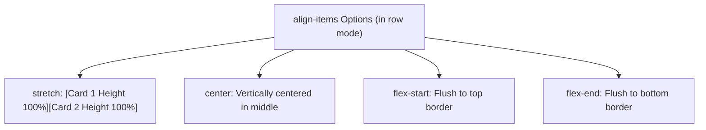

# Align Items

Estimated Reading Time: 12 minutes

Prerequisites: [CSS Flexbox](29-css-flexbox.md), [Flex Direction](30-flex-direction.md), [Justify Content](31-justify-content.md)

Learning Objectives:
- Master the `align-items` property.
- Understand values: `stretch`, `flex-start`, `flex-end`, `center`, and `baseline`.
- Align flex items dynamically along the Cross Axis.
- Create equal height cards and vertically centered header items.

---

## Introduction

The `align-items` property sets default alignment for all child flex items along the **Cross Axis** (perpendicular to the Main Axis) inside a flex container.

In default horizontal flex rows (`flex-direction: row`), `align-items` controls **vertical alignment**. It allows developers to stretch cards to matching equal heights (`stretch`), align items flush against the top edge (`flex-start`), align items against the bottom edge (`flex-end`), or center icons and text vertically (`center`).

---

## Real-World Analogy

Imagine runners standing at the starting line of a track race.

- **`stretch`** (Default): Elastic suits stretching runners so every runner's head touches a 2-meter tall overhead bar equally, regardless of natural height.
- **`flex-start`**: Aligning runners so their heads touch the top bar (Top Alignment).
- **`center`**: Aligning runners so their waistlines align along a central horizontal rope.
- **`flex-end`**: Aligning runners so their shoes touch the bottom ground track (Bottom Alignment).
- **`baseline`**: Aligning runners so the baseline of their printed shirt numbers sit on an invisible horizontal guideline.

`align-items` manages cross-axis alignment.

---

## Core Concepts

### 1. Cross Axis Alignment
- In default `flex-direction: row`, `align-items` controls **vertical** alignment.
- In `flex-direction: column`, `align-items` controls **horizontal** alignment!

### 2. Standard Values
- `stretch` (Default): Items stretch to fill 100% of container cross-axis height (unless explicit height is set).
- `flex-start`: Items align flush against the cross-axis start edge (top in row mode).
- `flex-end`: Items align flush against the cross-axis end edge (bottom in row mode).
- `center`: Items center along cross-axis.
- `baseline`: Items align based on the baseline of their inner text content.

---

## Syntax

```css
/* Vertically Centered Header Navbar */
.navbar {
    display: flex;
    justify-content: space-between;
    align-items: center; /* Vertically centers logo and links */
    height: 64px;
}

/* Equal Height Cards (Default) */
.card-row {
    display: flex;
    align-items: stretch;
}

/* Text Baseline Alignment */
.typography-row {
    display: flex;
    align-items: baseline;
}
```

---

## Property Reference

| Value | Alignment Behavior | Common Use Case |
| :--- | :--- | :--- |
| `stretch` (Default) | Stretches items to fill container cross-axis height | Equal height product cards |
| `center` | Centers items vertically along cross-axis | Navbars, icon/text alignment |
| `flex-start` | Aligns items to top edge of container | Top-aligned content columns |
| `flex-end` | Aligns items to bottom edge of container | Bottom-aligned price tags |
| `baseline` | Aligns items along inner text font baseline | Aligning different heading font sizes |

---

## Visual Explanation



---

## Example 1

### HTML
```html
<!DOCTYPE html>
<html lang="en">
<head>
    <meta charset="UTF-8">
    <title>Vertically Centered Navbar Items</title>
    <style>
        body { font-family: Arial, sans-serif; margin: 0; background-color: #f8fafc; }
        
        .header {
            display: flex;
            justify-content: space-between;
            align-items: center; /* Vertical Center */
            height: 70px;
            background-color: #0f172a;
            padding: 0 30px;
            color: white;
        }
        
        .logo { font-size: 24px; font-weight: bold; }
        .avatar {
            width: 40px;
            height: 40px;
            background-color: #2563eb;
            border-radius: 50%;
            display: flex;
            align-items: center;
            justify-content: center;
            font-weight: bold;
        }
    </style>
</head>
<body>
    <header class="header">
        <div class="logo">DevCorp</div>
        <div class="avatar">JD</div>
    </header>
</body>
</html>
```

### CSS
```css
.header {
    display: flex;
    justify-content: space-between;
    align-items: center;
    height: 70px;
}
```

### Explanation
`align-items: center` centers the 24px logo text and the 40px circular avatar vertically inside the 70px tall header bar.

---

## Output Image Prompt

A browser window displaying a 70px tall dark navbar header. The white logo on the left and the blue circular user avatar on the right are aligned in the middle.

---

## Code Explanation

- `align-items: center`: Aligns items along the vertical center axis inside the 70px fixed header.

---

## Example 2

### HTML
```html
<!DOCTYPE html>
<html lang="en">
<head>
    <meta charset="UTF-8">
    <title>Equal Height Cards Demo</title>
    <style>
        body { font-family: Arial, sans-serif; padding: 30px; background-color: #f8fafc; }
        
        .card-grid {
            display: flex;
            align-items: stretch; /* Default equal height */
            gap: 20px;
        }
        
        .card {
            flex: 1;
            background-color: #ffffff;
            border: 1px solid #cbd5e1;
            padding: 20px;
            border-radius: 8px;
        }
    </style>
</head>
<body>
    <div class="card-grid">
        <div class="card">
            <h3>Short Card</h3>
            <p>Brief summary text.</p>
        </div>
        <div class="card">
            <h3>Tall Card</h3>
            <p>Paragraph line 1...</p>
            <p>Paragraph line 2...</p>
            <p>Paragraph line 3 text forces card container to expand.</p>
        </div>
    </div>
</body>
</html>
```

### CSS
```css
.card-grid {
    display: flex;
    align-items: stretch;
}
```

### Explanation
Default `align-items: stretch` causes the shorter left card to stretch automatically to match the height of the taller right card.

---

## Output Image Prompt

A browser window showing two side-by-side white cards. The left short card stretches vertically to match the height of the taller right card.

---

## Code Explanation

- `align-items: stretch`: Forces all flex items to stretch to equal height matching the tallest item.

---

## Best Practices

- **Use `align-items: center` for Navbars**: Always add `align-items: center` to headers so icons, logos, and links center vertically.
- **Rely on Default `stretch` for Cards**: Keep default `align-items: stretch` on card grids to guarantee equal height rows.

---

## Common Mistakes

### Mistake 1: Setting Explicit `height` on Flex Items When Using `stretch`

```css
/* INCORRECT */
.card-grid {
    display: flex;
    align-items: stretch;
}
.card {
    height: 150px; /* Explicit height breaks stretch! Item will NOT stretch to equal height */
}
```

#### Explanation
An explicit CSS `height` property overrides default `stretch` behavior.

```css
/* CORRECT */
.card {
    /* Omit explicit height to allow stretch to work */
}
```

---

## Browser Compatibility

All `align-items` values (`stretch`, `center`, `flex-start`, `flex-end`, `baseline`) have 100% universal support across all desktop and mobile browsers.

---

## Real-World Applications

- **Header Navbar Centering**: `align-items: center`.
- **Equal Height Feature Cards**: `align-items: stretch`.
- **Price Tag Alignment**: `align-items: baseline` (aligning large price numbers with small currency symbols).

---

## Mini Project

### Project Objective: Navbar & Equal Height Card Grid
Build a header using `align-items: center` and a feature card grid using `align-items: stretch`.

---

## Practice Exercises

### Beginner Level
1. Stretch flex items to full container height using `align-items: stretch;`.
2. Center items vertically along cross-axis using `align-items: center;`.
3. Align items to top container edge using `align-items: flex-start;`.
4. Align items to bottom container edge using `align-items: flex-end;`.
5. Align items along text font baseline using `align-items: baseline;`.

### Intermediate Level
6. Horizontally center items in `flex-direction: column` mode using `align-items: center`.
7. Build an icon and text label row using `align-items: center`.
8. Align large price text `$99` with small `/mo` text using `align-items: baseline`.
9. Create equal height product grid cards using default stretch.
10. Remove explicit item heights to restore stretch behavior.

### Advanced Level
11. Combine `align-items: center` with `justify-content: center` for perfect centering wrappers.
12. Override `align-items` for a single item using `align-self`.
13. Audit cross-axis baseline alignment behavior with custom web fonts.
14. Optimize browser layout recalculation costs when toggling `align-items`.
15. Solve mobile flex alignment bugs inside fixed-height headers.

---

## Quick Quiz

**1. What axis does `align-items` align items along?**
A) Main Axis  
B) Cross Axis  

**2. What is the default value of `align-items`?**
A) `stretch`  
B) `center`  

**3. In default horizontal `flex-direction: row` mode, what direction does `align-items` control?**
A) Vertical alignment  
B) Horizontal alignment  

**4. Which value stretches items to fill 100% of container cross-axis height?**
A) `stretch`  
B) `flex-start`  

**5. Which value aligns items along the text font baseline?**
A) `baseline`  
B) `center`  

**6. What property vertically centers items inside a fixed 64px header bar?**
A) `align-items: center`  
B) `justify-content: space-between`  

**7. In `flex-direction: column` mode, what direction does `align-items` control?**
A) Horizontal alignment  
B) Vertical alignment  

**8. What breaks `align-items: stretch` on a flex item?**
A) Explicit `height` declared on the item  
B) Setting `flex: 1`  

**9. What value aligns items flush against the container bottom border in row mode?**
A) `flex-end`  
B) `flex-start`  

**10. What property allows a single flex item to override the container's `align-items` rule?**
A) `align-self`  
B) `justify-self`  

---

### Answers
1: B | 2: A | 3: A | 4: A | 5: A | 6: A | 7: A | 8: A | 9: A | 10: A

---

## Interview Questions

**1. What is the `align-items` property in CSS Flexbox?**  
*Answer:* `align-items` sets default alignment for all child flex items along the Cross Axis (perpendicular to the Main Axis) of a flex container.

**2. What is the difference between `align-items` and `justify-content`?**  
*Answer:* `justify-content` aligns items and distributes unused extra space along the **Main Axis**. `align-items` manages alignment of items along the **Cross Axis**.

**3. How does `align-items: baseline` work?**  
*Answer:* `align-items: baseline` aligns flex items so that the typography baselines of their first lines of text sit on a single horizontal line, regardless of differing font sizes or container padding.

---

## Summary

- Use **`align-items`** for Cross Axis alignment.
- **`center`**: Vertical centering in headers and buttons.
- **`stretch`**: Default equal height cards.
- **`baseline`**: Text baseline alignment.

---

## Cheat Sheet

```css
/* VERTICAL CENTERING IN ROW MODE */
.header {
    display: flex;
    justify-content: space-between;
    align-items: center;
}

/* EQUAL HEIGHT CARDS */
.cards {
    display: flex;
    align-items: stretch;
}
```

---

## Related Topics

- **Previous Topic**: [Justify Content](31-justify-content.md)
- **Next Topic**: [Align Self](33-align-self.md)
- **Recommended Learning Order**: Introduction to CSS -> Ways to Add CSS -> CSS Selectors -> CSS Colors -> CSS Fonts -> CSS Borders -> Border Radius -> CSS Shadows -> CSS Margins -> CSS Padding -> CSS Width -> CSS Height -> CSS Box Model -> CSS Float -> CSS Overflow -> CSS Display -> CSS Position -> CSS Background Images -> CSS Background Properties -> CSS Combinators -> CSS Pseudo Classes -> CSS Pseudo Elements -> CSS Pagination -> CSS Dropdown Menu -> CSS Navigation Bar -> Responsive Web Design -> Media Queries -> CSS Flexbox -> Flex Direction -> Justify Content -> Align Items -> Align Self
