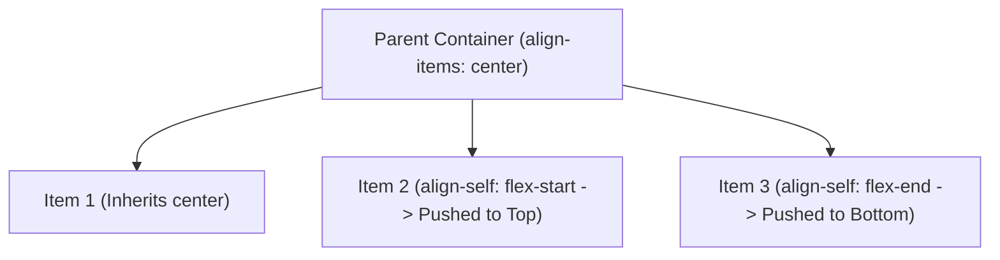

# Align Self

Estimated Reading Time: 12 minutes

Prerequisites: [CSS Flexbox](29-css-flexbox.md), [Align Items](32-align-items.md)

Learning Objectives:
- Master the `align-self` property.
- Override parent `align-items` rules for individual flex items.
- Understand values: `auto`, `flex-start`, `flex-end`, `center`, `baseline`, and `stretch`.
- Pin single action buttons or badges to specific card positions.

---

## Introduction

While `align-items` sets cross-axis alignment globally on the parent flex container, the `align-self` property allows a **single individual flex item** to break away and override that container-level rule.

Applying `align-self` to a single flex item allows developers to push a single badge to the top corner, align a button to the bottom of a card, or center one icon while adjacent items stretch to full container height.

---

## Real-World Analogy

Imagine a group photo lineup.

- **Container Rule (`align-items: center`)**: The photographer instructs all 4 group members to line up with their shoulders aligned along a central tape line on the floor.
- **Individual Override (`align-self: flex-end`)**: Person 4 steps down onto a lower step, resting their feet flush on the ground while everyone else remains centered along the tape line.

`align-self` grants individual flex items individual alignment freedom.

---

## Core Concepts

### 1. Overriding Parent Rules
`align-self` is applied directly to **flex items** (children), overriding the parent container's `align-items` rule.

### 2. Standard Values
- `auto` (Default): Inherits parent container's `align-items` value.
- `flex-start`: Aligns item to container cross-axis start edge.
- `flex-end`: Aligns item to container cross-axis end edge.
- `center`: Centers item along cross-axis.
- `stretch`: Stretches item to fill container cross-axis height.
- `baseline`: Aligns item to baseline text line.

---

## Syntax

```css
/* Parent Flex Container */
.card-row {
    display: flex;
    align-items: center; /* Parent rule: center all items */
    height: 200px;
}

/* Individual Flex Item Overrides */
.card-badge {
    align-self: flex-start; /* Override: push badge to top */
}

.card-cta {
    align-self: flex-end;   /* Override: push button to bottom */
}
```

---

## Property Reference

| Value | Individual Alignment Behavior | Common Usage |
| :--- | :--- | :--- |
| `auto` (Default) | Inherits parent container's `align-items` | Default behavior |
| `flex-start` | Pushes single item to top / start edge | Badge icons, close buttons |
| `flex-end` | Pushes single item to bottom / end edge | Bottom price CTA buttons |
| `center` | Centers single item vertically | Centering single profile avatar |
| `stretch` | Stretches single item to full height | Full-height side action bar |

---

## Visual Explanation



---

## Example 1

### HTML
```html
<!DOCTYPE html>
<html lang="en">
<head>
    <meta charset="UTF-8">
    <title>Align Self Overrides</title>
    <style>
        body { font-family: Arial, sans-serif; padding: 30px; background-color: #f8fafc; }
        
        .flex-container {
            display: flex;
            align-items: center; /* Default: center all children */
            height: 180px;
            background-color: #ffffff;
            border: 1px solid #cbd5e1;
            padding: 15px;
            border-radius: 8px;
            gap: 15px;
        }
        
        .box {
            background-color: #2563eb;
            color: white;
            padding: 15px;
            border-radius: 6px;
        }
        
        /* Overrides */
        .box-top { align-self: flex-start; background-color: #dc2626; }
        .box-bottom { align-self: flex-end; background-color: #16a34a; }
    </style>
</head>
<body>
    <div class="flex-container">
        <div class="box box-top">Top (flex-start)</div>
        <div class="box">Centered (Default)</div>
        <div class="box box-bottom">Bottom (flex-end)</div>
    </div>
</body>
</html>
```

### CSS
```css
.flex-container { display: flex; align-items: center; height: 180px; }
.box-top { align-self: flex-start; }
.box-bottom { align-self: flex-end; }
```

### Explanation
The parent container sets `align-items: center`. The middle box inherits `center`. `.box-top` uses `align-self: flex-start` to push to the top border. `.box-bottom` uses `align-self: flex-end` to push to the bottom border.

---

## Output Image Prompt

A browser window showing a 180px tall white flex container. A red box rests at the top edge, a blue box rests in the middle, and a green box rests at the bottom edge.

---

## Code Explanation

- `align-self: flex-start;`: Overrides parent centering to align red box flush against container top edge.
- `align-self: flex-end;`: Overrides parent centering to align green box flush against container bottom edge.

---

## Best Practices

- **Use Container `align-items` First**: Set global alignment rules on the container using `align-items`, using `align-self` sparingly for true exception cases.
- **Pin Card CTA Buttons**: Use `align-self: flex-end` to align action buttons at the bottom of dynamic card containers.

---

## Common Mistakes

### Mistake 1: Setting `align-self` on the Parent Container

```css
/* INCORRECT */
.flex-container {
    display: flex;
    align-self: center; /* Has NO effect on child items! Belongs on child flex items */
}
```

#### Explanation
`align-self` is a **flex item property**, not a container property.

```css
/* CORRECT */
.flex-container { display: flex; align-items: center; }
.flex-item { align-self: flex-end; }
```

---

## Browser Compatibility

CSS `align-self` values (`auto`, `flex-start`, `flex-end`, `center`, `baseline`, `stretch`) have 100% universal support across all desktop and mobile browsers.

---

## Real-World Applications

- **Card CTA Buttons**: Pinning "Buy Now" buttons to the bottom of pricing cards.
- **Notification Badges**: Aligning red status dots to the top of profile headers.
- **Sidebar Collapse Toggles**: Aligning collapse buttons to the bottom of sidebar containers.

---

## Mini Project

### Project Objective: Pricing Card with Bottom CTA Button
Build a pricing card container where body text is centered, but the CTA button uses `align-self: flex-end` to pin to the bottom edge.

---

## Practice Exercises

### Beginner Level
1. Override container alignment for a single item using `align-self: flex-start;`.
2. Push a single flex item to the bottom of a container using `align-self: flex-end;`.
3. Center a single flex item vertically using `align-self: center;`.
4. Stretch a single flex item to full height using `align-self: stretch;`.
5. Restore inherited alignment using `align-self: auto;`.

### Intermediate Level
6. Pin a pricing card CTA button to the bottom using `align-self: flex-end`.
7. Align a red badge icon to the top of an avatar row using `align-self: flex-start`.
8. Explain the difference between `align-items` and `align-self`.
9. Use `align-self: baseline` on a single text span inside a flex row.
10. Combine `align-self` with `flex-direction: column`.

### Advanced Level
11. Audit layout reflow performance when dynamically toggling `align-self`.
12. Build a multi-layered card layout combining `align-self` and `margin-top: auto`.
13. Troubleshoot alignment bugs caused by explicit item heights overriding `align-self: stretch`.
14. Optimize flex alignment in modern CSS Container Queries.
15. Solve mobile cross-browser flex item alignment bugs.

---

## Quick Quiz

**1. Where is `align-self` applied?**
A) Direct child flex items  
B) Parent flex container  

**2. What does `align-self` do?**
A) Overrides the parent container's `align-items` rule for a single item  
B) Sets flex direction  

**3. What is the default value of `align-self`?**
A) `auto` (inherits parent `align-items`)  
B) `center`  

**4. Which value pushes a single flex item flush against the container top edge in row mode?**
A) `flex-start`  
B) `flex-end`  

**5. Which value pushes a single flex item flush against the container bottom edge in row mode?**
A) `flex-end`  
B) `flex-start`  

**6. Does `align-self` affect adjacent sibling items?**
A) No (only affects the specific target item)  
B) Yes  

**7. Can `align-self` be used inside CSS Grid layouts?**
A) Yes  
B) No  

**8. What value stretches a single item to fill container cross-axis height?**
A) `stretch`  
B) `full`  

**9. What happens if a flex item has explicit `height: 100px` and `align-self: stretch`?**
A) Explicit height overrides `stretch`  
B) Container crashes  

**10. What property aligns all items globally on the parent container?**
A) `align-items`  
B) `align-self`  

---

### Answers
1: A | 2: A | 3: A | 4: A | 5: A | 6: A | 7: A | 8: A | 9: A | 10: A

---

## Interview Questions

**1. What is the `align-self` property in CSS Flexbox?**  
*Answer:* `align-self` allows a single child flex item to break away and override the parent container's global `align-items` cross-axis alignment rule.

**2. What is the difference between `align-items` and `align-self`?**  
*Answer:* `align-items` is declared on the parent flex container to set global cross-axis alignment for all child items. `align-self` is declared on an individual child flex item to override that global container rule for itself alone.

**3. How does `align-self` behave when `flex-direction` is `column`?**  
*Answer:* In `flex-direction: column` mode, the Cross Axis is horizontal. Consequently, `align-self` controls individual horizontal alignment (`flex-start` = left, `center` = center, `flex-end` = right).

---

## Summary

- Apply **`align-self`** to child flex items.
- Overrides parent **`align-items`**.
- **`flex-start`**: Push item to top.
- **`flex-end`**: Push item to bottom.

---

## Cheat Sheet

```css
/* PARENT CONTAINER */
.flex-container {
    display: flex;
    align-items: center; /* Centered default */
}

/* INDIVIDUAL ITEM OVERRIDES */
.item-badge { align-self: flex-start; } /* Top edge */
.item-button { align-self: flex-end; }  /* Bottom edge */
```

---

## Related Topics

- **Previous Topic**: [Align Items](32-align-items.md)
- **Next Topic**: [Flex Wrap](34-flex-wrap.md)
- **Recommended Learning Order**: Introduction to CSS -> Ways to Add CSS -> CSS Selectors -> CSS Colors -> CSS Fonts -> CSS Borders -> Border Radius -> CSS Shadows -> CSS Margins -> CSS Padding -> CSS Width -> CSS Height -> CSS Box Model -> CSS Float -> CSS Overflow -> CSS Display -> CSS Position -> CSS Background Images -> CSS Background Properties -> CSS Combinators -> CSS Pseudo Classes -> CSS Pseudo Elements -> CSS Pagination -> CSS Dropdown Menu -> CSS Navigation Bar -> Responsive Web Design -> Media Queries -> CSS Flexbox -> Flex Direction -> Justify Content -> Align Items -> Align Self -> Flex Wrap
