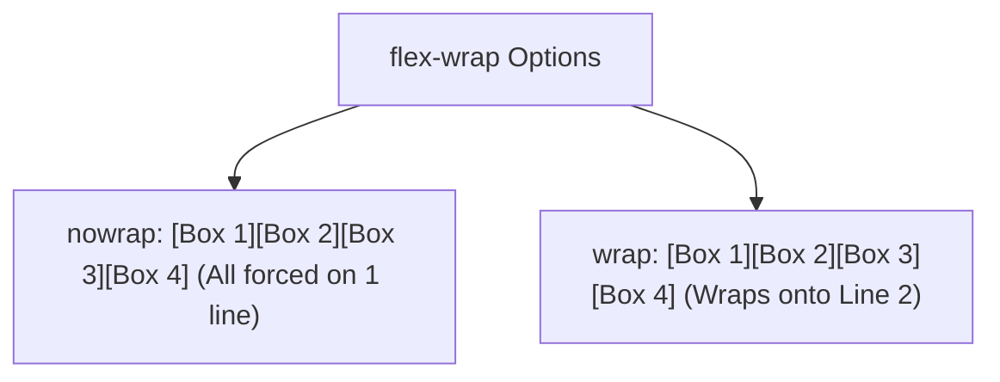

# Flex Wrap

Estimated Reading Time: 12 minutes

Prerequisites: [CSS Flexbox](29-css-flexbox.md), [Flex Direction](30-flex-direction.md)

Learning Objectives:
- Master the `flex-wrap` property (`nowrap`, `wrap`, `wrap-reverse`).
- Understand multi-line Flexbox layouts.
- Combine `flex-wrap: wrap` with `flex: 1 1 calc()` for responsive card grids.
- Prevent flex items from shrinking into unreadable squeezed boxes.

---

## Introduction

By default, a Flexbox container forces all child flex items onto a **single horizontal line** (`flex-wrap: nowrap`), squeezing item widths down to fit the container screen width even if content overflows.

The `flex-wrap` property allows flex items to wrap naturally onto multiple lines when available horizontal container width runs out. Combining `flex-wrap: wrap` with dynamic item sizing enables fluid, multi-row responsive card grids.

---

## Real-World Analogy

Imagine typing words on a word processor document page.

- **`nowrap`** (Default): A broken typewriter that refuses to hit Enter at the right margin. Words keep printing on one endless horizontal line past the right edge of the page.
- **`wrap`**: Hitting Enter at the end of the line. When words reach the right margin, the cursor drops down to start a new line cleanly below.
- **`wrap-reverse`**: Hitting Enter, but dropping lines upwards towards the top of the page.

`flex-wrap` manages multi-line wrapping behavior.

---

## Core Concepts

### 1. `flex-wrap` Values
- `nowrap` (Default): All flex items remain on a single line (items shrink or overflow).
- `wrap`: Flex items wrap onto multiple lines from top to bottom when space runs out.
- `wrap-reverse`: Flex items wrap onto multiple lines in reverse direction from bottom to top.

### 2. The `flex-flow` Shorthand
Combines `flex-direction` and `flex-wrap`:
```css
/* flex-flow: <flex-direction> <flex-wrap>; */
.container {
    flex-flow: row wrap;
}
```

### 3. Cross-Axis Multi-Line Alignment (`align-content`)
When `flex-wrap: wrap` creates multiple flex lines, the `align-content` property manages spacing distribution between flex lines along the cross axis (`space-between`, `center`, `stretch`).

---

## Syntax

```css
/* Enable Multi-Line Wrapping */
.card-grid {
    display: flex;
    flex-wrap: wrap;
    gap: 20px;
}

/* Flexible Cards */
.card {
    flex: 1 1 280px; /* Grow, shrink, base width 280px */
}

/* Flex Flow Shorthand */
.flow-container {
    flex-flow: row wrap;
}
```

---

## Property Reference

| Value | Multi-Line Wrapping Behavior | Common Use Case |
| :--- | :--- | :--- |
| `nowrap` (Default) | Single line only (items shrink or overflow) | Single-row navbars, tab bars |
| `wrap` | Items wrap onto new lines below as width fills | Responsive card grids, tag clouds |
| `wrap-reverse` | Items wrap onto new lines upwards above | Inverted multi-line layouts |

---

## Visual Explanation



---

## Example 1

### HTML
```html
<!DOCTYPE html>
<html lang="en">
<head>
    <meta charset="UTF-8">
    <title>Responsive Multi-Line Card Grid</title>
    <style>
        body { font-family: Arial, sans-serif; padding: 20px; background-color: #f8fafc; }
        
        .card-grid {
            display: flex;
            flex-wrap: wrap;
            gap: 20px;
        }
        
        .card {
            flex: 1 1 250px; /* Min width 250px before wrapping */
            background-color: #ffffff;
            border: 1px solid #cbd5e1;
            padding: 20px;
            border-radius: 8px;
        }
    </style>
</head>
<body>
    <div class="card-grid">
        <div class="card">Card 1</div>
        <div class="card">Card 2</div>
        <div class="card">Card 3</div>
        <div class="card">Card 4</div>
    </div>
</body>
</html>
```

### CSS
```css
.card-grid {
    display: flex;
    flex-wrap: wrap;
    gap: 20px;
}
.card {
    flex: 1 1 250px;
}
```

### Explanation
`flex-wrap: wrap` combined with `flex: 1 1 250px` creates an auto-responsive grid. Cards display 4-across on wide desktop screens, 2-across on tablets, and wrap to 1-across on mobile screens without requiring media queries!

---

## Output Image Prompt

A browser window showing 4 white cards. On wide screens, 4 cards fit on one row. On narrow screens, cards wrap cleanly onto a second row.

---

## Code Explanation

- `flex-wrap: wrap;`: Allows flex items to wrap onto new lines when screen width shrinks.
- `flex: 1 1 250px;`: Sets 250px ideal basis width, allowing cards to grow or wrap naturally.

---

## Example 2

### HTML
```html
<!DOCTYPE html>
<html lang="en">
<head>
    <meta charset="UTF-8">
    <title>Wrapped Tag Pill List</title>
    <style>
        body { font-family: Arial, sans-serif; padding: 30px; }
        
        .tag-list {
            display: flex;
            flex-wrap: wrap;
            gap: 10px;
        }
        
        .tag-pill {
            background-color: #e0f2fe;
            color: #0369a1;
            padding: 6px 14px;
            border-radius: 9999px;
            font-size: 14px;
            font-weight: 500;
        }
    </style>
</head>
<body>
    <div class="tag-list">
        <div class="tag-pill">HTML5</div>
        <div class="tag-pill">CSS3</div>
        <div class="tag-pill">JavaScript</div>
        <div class="tag-pill">Flexbox</div>
        <div class="tag-pill">Responsive Design</div>
        <div class="tag-pill">UI/UX</div>
    </div>
</body>
</html>
```

### CSS
```css
.tag-list {
    display: flex;
    flex-wrap: wrap;
    gap: 10px;
}
```

### Explanation
`flex-wrap: wrap` allows pill tags to wrap onto multiple lines cleanly as screen width narrows.

---

## Output Image Prompt

A browser window showing a collection of light blue rounded pill tags wrapping gracefully across 2 lines.

---

## Code Explanation

- `flex-wrap: wrap;`: Enables multi-line wrapping for badge pills.

---

## Best Practices

- **Pair `flex-wrap: wrap` with `flex-basis`**: Always combine `flex-wrap: wrap` with `flex: 1 1 250px` or `min-width` to build responsive auto-wrapping grids.
- **Use `gap` Property for Line Spacing**: Use `gap: 20px` to manage both horizontal item gaps and vertical multi-line row gaps cleanly.

---

## Common Mistakes

### Mistake 1: Setting `flex-shrink: 0` Without `flex-wrap: wrap`

```css
/* INCORRECT */
.card-grid {
    display: flex;
    /* Missing flex-wrap: wrap! Cards overflow off right edge of mobile screens */
}
.card { flex: 0 0 300px; }
```

#### Explanation
Fixed basis items will blow past the right screen boundary unless `flex-wrap: wrap` is enabled.

```css
/* CORRECT */
.card-grid {
    display: flex;
    flex-wrap: wrap;
}
.card { flex: 1 1 300px; }
```

---

## Browser Compatibility

`flex-wrap` properties (`nowrap`, `wrap`, `wrap-reverse`) have 100% universal support across all desktop and mobile browsers.

---

## Real-World Applications

- **Auto-Responsive Card Grids**: Multi-line product card layouts.
- **Tag Cloud Badges**: Skill tag lists wrapping dynamically across lines.
- **Photo Thumbnail Galleries**: Multi-row image galleries.

---

## Mini Project

### Project Objective: Responsive Auto-Wrapping Card Grid
Build a 4-card grid using `flex-wrap: wrap` and `flex: 1 1 250px` that auto-adapts across screen sizes without media queries.

---

## Practice Exercises

### Beginner Level
1. Enable multi-line wrapping using `flex-wrap: wrap;`.
2. Disable multi-line wrapping using `flex-wrap: nowrap;`.
3. Enable reverse multi-line wrapping using `flex-wrap: wrap-reverse;`.
4. Use `flex-flow: row wrap` shorthand.
5. Create a wrapped tag cloud list.

### Intermediate Level
6. Combine `flex-wrap: wrap` with `flex: 1 1 200px` for responsive cards.
7. Distribute space between multi-line rows using `align-content: space-between`.
8. Center multi-line rows using `align-content: center`.
9. Set vertical row gaps using `gap: 20px`.
10. Prevent mobile horizontal overflow using `flex-wrap: wrap`.

### Advanced Level
11. Compare Flexbox auto-wrapping grids vs CSS Grid `repeat(auto-fit, minmax())`.
12. Audit browser line-break calculations when flex items contain long unwrapped strings.
13. Troubleshoot alignment bugs caused by uneven item counts on the final wrapped line.
14. Optimize reflow rendering engine costs during dynamic browser window resizing.
15. Solve Safari multi-line flex height calculation bugs.

---

## Quick Quiz

**1. What is the default value of `flex-wrap`?**
A) `nowrap`  
B) `wrap`  

**2. Which value enables flex items to wrap onto multiple lines when space runs out?**
A) `wrap`  
B) `nowrap`  

**3. What shorthand combines `flex-direction` and `flex-wrap`?**
A) `flex-flow`  
B) `flex-line`  

**4. What happens when `flex-wrap: nowrap` container width shrinks on mobile screens?**
A) Items shrink or overflow past the right screen border  
B) Items wrap automatically  

**5. What property aligns multiple flex lines along the cross axis when `flex-wrap: wrap` is active?**
A) `align-content`  
B) `align-items`  

**6. How do you specify both row and column gap spacing between wrapped items?**
A) `gap: 20px`  
B) `margin-wrap: 20px`  

**7. Which value wraps flex lines in reverse order from bottom to top?**
A) `wrap-reverse`  
B) `upwrap`  

**8. What flex basis value combined with `flex-wrap: wrap` creates media-query-free responsive card grids?**
A) `flex: 1 1 250px`  
B) `width: 100%`  

**9. Does `flex-wrap: wrap` work in `flex-direction: column` mode?**
A) Yes (wraps onto multiple vertical columns if explicit height is set)  
B) No  

**10. Why is `flex-wrap: wrap` useful for tag cloud UI components?**
A) It allows tags to flow naturally across multiple lines as tags are added  
B) It turns tags blue  

---

### Answers
1: A | 2: A | 3: A | 4: A | 5: A | 6: A | 7: A | 8: A | 9: A | 10: A

---

## Interview Questions

**1. What is the `flex-wrap` property in CSS Flexbox?**  
*Answer:* `flex-wrap` controls whether flex items are forced onto a single line (`nowrap`) or allowed to wrap onto multiple lines (`wrap`, `wrap-reverse`) when available container width is exhausted.

**2. What is the difference between `align-items` and `align-content`?**  
*Answer:* `align-items` manages cross-axis alignment for individual items inside a single flex line. `align-content` manages cross-axis alignment and space distribution **between entire flex lines** when `flex-wrap: wrap` generates multi-line layouts.

**3. How can you create a responsive card grid without writing media queries?**  
*Answer:* Combine `flex-wrap: wrap` on the container with `flex: 1 1 <min-width>` (e.g. `flex: 1 1 280px`) on child cards. The browser automatically fits as many 280px cards per row as screen width allows, wrapping remaining cards to subsequent rows automatically.

---

## Summary

- Use **`flex-wrap: wrap`** for multi-line card grids and tag lists.
- Combine with **`flex: 1 1 250px`** for responsive layouts.
- Use **`align-content`** to align multi-line rows.

---

## Cheat Sheet

```css
/* RESPONSIVE MULTI-LINE GRID PATTERN */
.card-grid {
    display: flex;
    flex-wrap: wrap;
    gap: 20px;
}

.card {
    flex: 1 1 250px;
}

/* FLEX FLOW SHORTHAND */
.container {
    flex-flow: row wrap;
}
```

---

## Related Topics

- **Previous Topic**: [Align Self](33-align-self.md)
- **Next Topic**: [Gap](35-gap.md)
- **Recommended Learning Order**: Introduction to CSS -> Ways to Add CSS -> CSS Selectors -> CSS Colors -> CSS Fonts -> CSS Borders -> Border Radius -> CSS Shadows -> CSS Margins -> CSS Padding -> CSS Width -> CSS Height -> CSS Box Model -> CSS Float -> CSS Overflow -> CSS Display -> CSS Position -> CSS Background Images -> CSS Background Properties -> CSS Combinators -> CSS Pseudo Classes -> CSS Pseudo Elements -> CSS Pagination -> CSS Dropdown Menu -> CSS Navigation Bar -> Responsive Web Design -> Media Queries -> CSS Flexbox -> Flex Direction -> Justify Content -> Align Items -> Align Self -> Flex Wrap -> Gap
