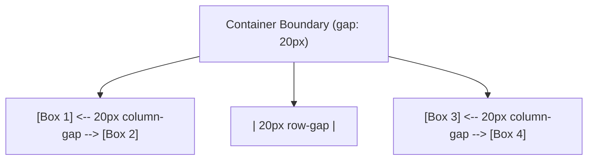

# Gap

Estimated Reading Time: 12 minutes

Prerequisites: [CSS Flexbox](29-css-flexbox.md), [Flex Wrap](34-flex-wrap.md)

Learning Objectives:
- Master the `gap` property and sub-properties (`row-gap`, `column-gap`).
- Replace legacy margin hacks (`:last-child` margin removals).
- Apply uniform spacing between Flexbox and CSS Grid items.

---

## Introduction

The `gap` property (formerly `grid-gap`) specifies the exact empty spacing gutter between items in Flexbox and CSS Grid layout containers.

Before `gap` was introduced for Flexbox, creating gaps required setting `margin-right` on child items and using `:last-child { margin-right: 0; }` or negative parent margins to suppress unwanted outer edge spacing. The `gap` property eliminates margin hacks by applying clean gutters strictly **between** layout items without adding unwanted spacing at container outer boundaries.

---

## Real-World Analogy

Imagine planting trees along a fence line.

- **Legacy Margin Approach**: Planting every tree with a 2-meter soil spacer block attached to its right side. The last tree near the end fence post ends up pushing 2 meters past the property line, requiring a groundskeeper to cut off the extra soil block (`:last-child { margin: 0 }`).
- **`gap` Approach**: Planting trees cleanly, then measuring an exact 2-meter open gap between adjacent tree trunks. No spacer blocks press against outer boundary fence posts.

`gap` manages gutters exclusively between container items.

---

## Core Concepts

### 1. The `gap` Shorthand
- **Single Value**: Sets equal row and column gaps (`gap: 20px;`).
- **Two Values**: Sets row gap and column gap independently (`gap: 30px 15px;` -> `row-gap column-gap`).

### 2. Sub-Properties
- `row-gap`: Sets vertical spacing between lines/rows.
- `column-gap`: Sets horizontal spacing between columns.

### 3. Outer Edge Cleanliness
`gap` applies spacing **only between adjacent items**. Outer edges flush against the parent container remain completely un-padded.

---

## Syntax

```css
/* Equal Row & Column Gap */
.card-grid {
    display: flex;
    flex-wrap: wrap;
    gap: 20px;
}

/* Independent Row and Column Gaps */
.custom-grid {
    display: flex;
    flex-wrap: wrap;
    row-gap: 30px;    /* Vertical line spacing */
    column-gap: 15px; /* Horizontal column spacing */
}

/* Shorthand Equivalent */
.custom-grid-shorthand {
    display: flex;
    flex-wrap: wrap;
    gap: 30px 15px;   /* row-gap column-gap */
}
```

---

## Property Reference

| Property | Purpose | Example |
| :--- | :--- | :--- |
| `gap` | Sets both row and column spacing gutters | `gap: 20px;` or `gap: 30px 15px;` |
| `row-gap` | Sets vertical line spacing between rows | `row-gap: 24px;` |
| `column-gap` | Sets horizontal item spacing between columns | `column-gap: 16px;` |

---

## Visual Explanation



---

## Example 1

### HTML
```html
<!DOCTYPE html>
<html lang="en">
<head>
    <meta charset="UTF-8">
    <title>Clean Flexbox Gap Grid</title>
    <style>
        body { font-family: Arial, sans-serif; padding: 30px; background-color: #f8fafc; }
        
        .grid-container {
            display: flex;
            flex-wrap: wrap;
            gap: 20px; /* Clean 20px gutters everywhere */
            background-color: #ffffff;
            border: 1px solid #cbd5e1;
            padding: 20px;
            border-radius: 8px;
        }
        
        .grid-item {
            flex: 1 1 200px;
            background-color: #2563eb;
            color: white;
            padding: 20px;
            border-radius: 6px;
            text-align: center;
        }
    </style>
</head>
<body>
    <div class="grid-container">
        <div class="grid-item">Item 1</div>
        <div class="grid-item">Item 2</div>
        <div class="grid-item">Item 3</div>
    </div>
</body>
</html>
```

### CSS
```css
.grid-container {
    display: flex;
    flex-wrap: wrap;
    gap: 20px;
}
```

### Explanation
`gap: 20px` adds clean 20px gutters between items without adding unwanted margins to outer container borders.

---

## Output Image Prompt

A browser window showing 3 blue boxes arranged inside a white container card with 20px horizontal and vertical gaps.

---

## Code Explanation

- `gap: 20px`: Applies 20px gutters between items across rows and columns automatically.

---

## Example 2

### HTML
```html
<!DOCTYPE html>
<html lang="en">
<head>
    <meta charset="UTF-8">
    <title>Independent Row and Column Gap</title>
    <style>
        body { font-family: Arial, sans-serif; padding: 30px; }
        
        .tag-container {
            display: flex;
            flex-wrap: wrap;
            row-gap: 20px;    /* Large vertical gap between rows */
            column-gap: 10px; /* Small horizontal gap between tags */
        }
        
        .tag {
            background-color: #f1f5f9;
            color: #0f172a;
            padding: 8px 16px;
            border-radius: 6px;
            border: 1px solid #cbd5e1;
        }
    </style>
</head>
<body>
    <div class="tag-container">
        <div class="tag">HTML5</div>
        <div class="tag">CSS3</div>
        <div class="tag">JavaScript</div>
        <div class="tag">Flexbox</div>
        <div class="tag">Grid</div>
    </div>
</body>
</html>
```

### CSS
```css
.tag-container {
    display: flex;
    flex-wrap: wrap;
    row-gap: 20px;
    column-gap: 10px;
}
```

### Explanation
`row-gap: 20px` and `column-gap: 10px` apply tight 10px horizontal gaps between tags and wider 20px vertical gaps between wrapped lines.

---

## Output Image Prompt

A browser window displaying pill tags with 10px horizontal gaps and wider 20px vertical line gaps.

---

## Code Explanation

- `row-gap: 20px;`: Sets 20px vertical line gap.
- `column-gap: 10px;`: Sets 10px horizontal column gap.

---

## Best Practices

- **Use `gap` Instead of Margin Hacks**: Always use `gap` for Flexbox and CSS Grid spacing instead of setting `margin-right` on child items.
- **Use Shorthand `gap: row col`**: Use shorthand `gap: 24px 16px;` when row and column gaps differ.

---

## Common Mistakes

### Mistake 1: Setting `gap` on Child Items Instead of Container

```css
/* INCORRECT */
.card-item {
    gap: 20px; /* Ignored! Gap MUST be declared on parent layout container */
}
```

#### Explanation
`gap` belongs exclusively to layout **containers** (`display: flex` or `display: grid`).

```css
/* CORRECT */
.card-container {
    display: flex;
    gap: 20px;
}
```

---

## Browser Compatibility

CSS `gap` in Flexbox has universal support across all modern browsers (Safari 14.1+, Chrome 84+, Firefox 63+, Edge 84+).

---

## Real-World Applications

- **Card Grids**: Clean 20px gutters between product cards.
- **Header Navigation Links**: Evenly spaced nav link rows.
- **Tag Cloud Badges**: Tight horizontal and wide vertical pill tag gaps.

---

## Mini Project

### Project Objective: Card Grid with Custom Row and Column Gap
Build a responsive card grid using `row-gap: 30px` and `column-gap: 15px`.

---

## Practice Exercises

### Beginner Level
1. Add a 20px gap to a flex container using `gap: 20px;`.
2. Set horizontal column gap using `column-gap: 15px;`.
3. Set vertical row gap using `row-gap: 30px;`.
4. Write a single shorthand gap rule (`gap: 30px 15px;`).
5. Replace child item `margin-right` rules with container `gap`.

### Intermediate Level
6. Explain why `gap` is superior to `:last-child { margin-right: 0; }`.
7. Combine `gap: 20px` with `flex-wrap: wrap`.
8. Create a tag cloud with tight column gap and wide row gap.
9. Fix outer edge alignment issues caused by legacy margin hacks.
10. Test Flexbox gap support across mobile browsers.

### Advanced Level
11. Audit layout calculation engine overhead of dynamic gap updates.
12. Combine CSS custom properties (`--grid-gap: 20px`) with `gap: var(--grid-gap)`.
13. Troubleshoot percentage-based gap calculations in responsive containers.
14. Optimize container query component layouts using `gap`.
15. Solve legacy Safari Flexbox gap polyfill fallback bugs.

---

## Quick Quiz

**1. Where should the `gap` property be declared?**
A) Parent layout container (`display: flex` or `display: grid`)  
B) Individual child items  

**2. What does `gap: 20px` do?**
A) Adds 20px empty gutters between adjacent items  
B) Adds padding inside child items  

**3. Does `gap` add extra margin to outer container borders?**
A) No (spacing applies ONLY between adjacent items)  
B) Yes  

**4. What is the first value in shorthand `gap: 30px 15px`?**
A) Vertical `row-gap` (30px)  
B) Horizontal `column-gap` (15px)  

**5. What property sets vertical line spacing between wrapped flex rows?**
A) `row-gap`  
B) `column-gap`  

**6. What legacy CSS hack does `gap` eliminate?**
A) `:last-child { margin-right: 0; }`  
B) `display: block`  

**7. Does `gap` work in CSS Grid layouts?**
A) Yes  
B) No  

**8. What property sets horizontal spacing between flex columns?**
A) `column-gap`  
B) `row-gap`  

**9. What happens if `gap` is set on an element with `display: block`?**
A) Ignored (gap requires flex or grid containers)  
B) Canvas turns red  

**10. What browser version introduced Flexbox `gap` support in Safari?**
A) Safari 14.1+  
B) Safari 5  

---

### Answers
1: A | 2: A | 3: A | 4: A | 5: A | 6: A | 7: A | 8: A | 9: A | 10: A

---

## Interview Questions

**1. What is the `gap` property in CSS?**  
*Answer:* `gap` specifies empty spacing gutters between adjacent items inside Flexbox or CSS Grid layout containers, without applying unwanted margins to outer container boundaries.

**2. Why is `gap` preferred over `margin` for Flexbox layouts?**  
*Answer:* Margins apply to child item outer boundaries, requiring negative parent margins or `:last-child { margin-right: 0; }` resets to avoid breaking outer container alignment. `gap` is declared on the container and automatically applies spacing strictly **between** items.

**3. How does shorthand syntax `gap: 24px 12px` work?**  
*Answer:* The first value sets `row-gap` (24px vertical spacing between rows). The second value sets `column-gap` (12px horizontal spacing between columns).

---

## Summary

- Declare **`gap`** on parent flex/grid containers.
- Replaces legacy **`:last-child` margin hacks**.
- **`gap: 20px`**: Equal row/column gutters.
- **`gap: row col`**: Independent row/column spacing.

---

## Cheat Sheet

```css
/* FLEX CONTAINER GAP PATTERN */
.container {
    display: flex;
    flex-wrap: wrap;
    gap: 20px; /* Clean 20px gutters between items */
}

/* INDEPENDENT ROW & COL GAP */
.container-custom {
    display: flex;
    flex-wrap: wrap;
    gap: 30px 15px; /* 30px row-gap, 15px column-gap */
}
```

---

## Related Topics

- **Previous Topic**: [Flex Wrap](34-flex-wrap.md)
- **Next Topic**: [Order](36-order.md)
- **Recommended Learning Order**: Introduction to CSS -> Ways to Add CSS -> CSS Selectors -> CSS Colors -> CSS Fonts -> CSS Borders -> Border Radius -> CSS Shadows -> CSS Margins -> CSS Padding -> CSS Width -> CSS Height -> CSS Box Model -> CSS Float -> CSS Overflow -> CSS Display -> CSS Position -> CSS Background Images -> CSS Background Properties -> CSS Combinators -> CSS Pseudo Classes -> CSS Pseudo Elements -> CSS Pagination -> CSS Dropdown Menu -> CSS Navigation Bar -> Responsive Web Design -> Media Queries -> CSS Flexbox -> Flex Direction -> Justify Content -> Align Items -> Align Self -> Flex Wrap -> Gap -> Order
